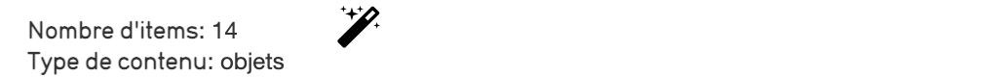
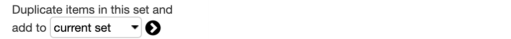
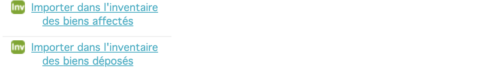
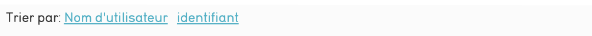
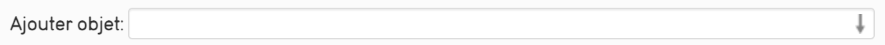
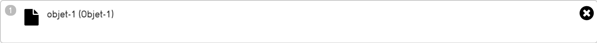
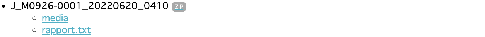

# 6. L'Export Joconde dans CollectiveAccess

Un Export Joconde permet de créer un fichier contenant les informations des objets que vont avez sélectionnés. Ces rapports (contrairement au [registre des biens affectés]()) sont modifiables et les objets sélectionnés peuvent variés entre chaque export.

### Comment réaliser un Export Joconde

Pour réaliser un Export Joconde rendez-vous dans Procédures Réglementaires \> Export Joconde 

Cette page affiche les diffèrents exports joconde réalisés.

#### Ajouter/Retirer des objets

Pour sélectionner les objets de l'export cliquez sur *Ajouter/Retirer des objets* en haut de la page

Cette page affiche les objets contenus dans l'ensemble.

Avec le menu de gauche vous pouvez :

- Modifier l'ensemble entier en cliquant sur la baguette puis en choissiant la modification que vous souhaitez apporter

- Dupliquer [l'ensemble](../chapterIII_traitements_lots) joconde actuel pour créer un nouvel ensemble

- Importer l'ensemble joconde actuel dans le [registre des bien affectés](../Registre_biens)/déposés

Le menu central vous permet de :

- Trier les objets présents par leurs noms ou leurs identifiants

- Réaliser un Export PDF de l'ensemble actuel
- Consulter les objets présents et d'en ajouter :
    - Pour ajouter un objet rentrez son nom ou son identifiant dans le champ *Ajouter objet*
    
    - Pour chaque objet vous pouvez accéder à sa [fiche objet](../Saisie_Joconde) en cliquant sur la feuille à gauche de l'objet
    - Pour chaque objet il est marqué une image (s'il y en a une pour l'objet), son nom et son identifiant
    - pour retirer un objet de l'ensemble, cliquez sur la croix à droite de l'objet
    
- Enregistrer ou Annuler les changements fait à l'ensemble

#### Générer un export Joconde 

Une fois les objets sélectionnés retounez dans Procédures Réglementaires \> Export Joconde et rendez vous en bas de la page puis cliquez sur **Générer un export Joconde**

L'export va se générer. Cliquez sur retour et retouver votre export sous le nom **J_*Numéro Muséo*_*Année* *Mois* *Jour*_*4chiffres***

*Pour trouver votre code muséo [utilisez ce lien](https://bit.ly/votrecodemuseo)*

Cliquez ensuite sur le bouton *ZIP* de votre export et retouvez, dans le dossier media, les images de vos objets et un fichier texte contenant les informations de l'ensemble

