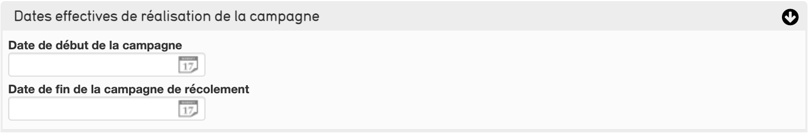
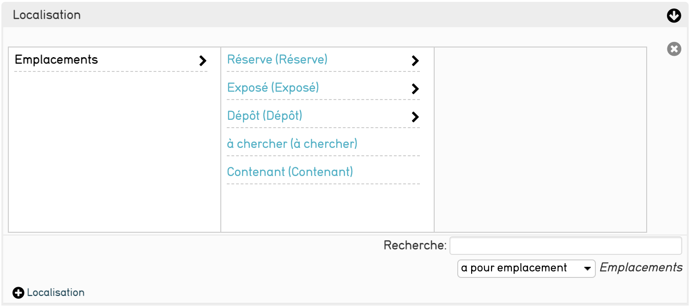

# 5. Le Récolement dans CollectiveAccess
Le récolement permet de vérifier les objets, CollectiveAccess vous accompagne dans cette démarche en proposant une procédure complète grâce à des campagnes de récolement

## Comment créer une campagne de récolement ?

Rendez vous dans le menu Nouveau \> Campagne de récolement, vous arriverez sur un nouvel écran de saisie afin de créer votre campagne.

### Présentation de l'écran de saisie

#### Nom de la campagne
Nommez votre campagne de récolement de manière explicite afin de d'expliquer à quoi elle correspond

#### Numéro de la campagne
Un identifiant unique à la campagne

#### Récolement décennal
Définnisez une décennie pour votre récolement (les récolements sont triés par décennie)

#### Dates prévisionnelles de réalisation de la campagne
Notez ici les estimations de début et de fin de la campagne

#### Dates effectives de réalisation de la campagne
Notez ici les dates réelles de début et de fin de la campagne

#### Intervenants
Ce champ permet de préciser le nom des différents intervenants de la campagne. Ce champ est relié au fichier des [entités](../Saisie_Entite), si vous ne trouvez pas le nom de l'intervenant la documentation pour le rajouter est disponible [ici](../Saisie_Entite./#informations-de-base-informations-basiques)

#### Contenu scientifique de la campagne
Le contenu scientifique relatif à la campagne

#### Champs couverts
indiquez les differents champs couverts par la campgne et des notes realatifs à ceux-ci. 

#### Méthode utilisée pour la campagne
Indiquez les caractéristiques techniques de la campagne et les differents moyens mis en œuvre pour cette derniere. (Ce champ est au format texte enrichi, vous pouvez appliquez des modifications sur la forme du texte (police,taille,couleur,etc..) comme pour un fichier word)

#### Localisation
Localisez où sont les objets à récoler

#### Caractérisation de l'espace
Selectionnez dans la liste déroulante le résultat le plus proche de l'espace du récolement

#### Conditionnement des biens à récoler 
Indiquez le conditionnement des biens à récoler

#### Accessibilité
Les conditions d'accès physique de la campagne 

#### Fiches de récolement liées
Champ affichant la liste des fiches de récolement de la campagne, ce champ est en lecture seule vous ne pouvez pas ajouter de fiches ici.
Lorsque des fiches sont disponibles cliquez sur celle de votre choix pour accèder à son écran de complétion 

#### Date du PV
Date de génération du procès verbal de la campagne 

#### Fichier numérique attaché à la campagne
Permet d'ajouter n'importe quel fichier à la campagne 

Après avoir saisi votre campagne de récolement, enregistrez la via les boutons du même nom en haut et en bas de la page

## Gérer la campagne

Pour accéder à la liste de vos campagnes rendez vous dans le menu Procédures Réglementaires \> Suivi du récolement

### Menu des campagnes
Le menu des campagnes vous permet de consulter l'intégralité de vos campagnes en cours.

##### Partie Gauche 
Le menu de gauche offre un résume des informations concernant vos campagnes :

- la [décennie](#recolement-decennal) des campagnes
- le nombre de campagne dans cette décennie
- le nombre d'objets récolés dans cette décennie
- le nombre d'objets pas encore récolés dans cette décennie
- le nombre total d'objets dans cette décennie
- le pourcentage total de finition des campagnes

Ces éléments se répetent pour chaque décennie dans laquelle est définie au moins une campagne.
Sous ces informations ce trouvent différents liens de documentation ou d'assistance

##### Rafraîchir 
Le bouton rafraîchir sert à mettre à jour les informations des campagnes, il est conseillé d'utiliser ce bouton à chaque retour sur cette page car la base ne se mets pas à jour seule

En dessous vous pouvez retrouver vos campagnes triées par [décennie](#recolement-decennal). Pour rétrécir/agrandir les informations d'une décennie, cliquez sur le bouton grisé de la décennie. 

Pour chaque décennie vous pourrez retouver un **suivi graphique** ainsi qu'un **tableau de progression**.

##### Tableau de progression 

Le tableau de progression résume tout les tableaux dans la décennie à laquelle il appartient en 8 colonnes :

- Le journal permet d'accéder à la page [résumé](../Introduction/#resume) de la campagne
- Campagne : Le [numéro](#numero-de-la-campagne) et le [nom](#nom-de-la-campagne) de la campagne, cliquez sur ce champ pour accéder à un résumé plus complet ainsi qu'à la liste des [objets à récoler]()
- Localisation : fait réference au champ [localisation](#localisation) saisi pour la campagne 
- Type de collection : fait réference au champ [champ couvert](#champs-couverts) saisi pour la campagne 
- Dates prévisionnelles : fait réference au champ [Dates prévisionnelles de réalisation de la campagne](#dates-prévisionnelles-de-réalisation-de-la-campagne)
- Dates effectives : fait réference au champ [Dates effectives de réalisation de la campagne](#dates-effectives-de-réalisation-de-la-campagne)
- Procès verbal : fait réference au champ [Date du PV](#date-du-pv) saisi pour la campagne 
- Nombre d'objets récolés :

    - **Générer les fiches** : si aucun objet n'as été précisé pour la campagne vous pouvez générer les fiches en cliquant sur cette colonne puis en sélectionnant un [ensemble](../chapterIII_traitements_lots) 
    - Si des objets sont déjà en lien avec la campagne alors cette colonne affiche une barre de progression, le nombre d'objets récolé, le nombre d'objets total ainsi qu'une flèche verte pour ajouter d'autres [ensembles d'objets](../chapterIII_traitements_lots). Cliquez sur la barre de progression pour accéder à la liste des [objets à récoler]()

## Récoler un objet
Pour récoler un objet il faut se rendre sur l'écran _Informations du PV de récolement_ depuis [campagne](#tableau-de-progression)

Cette page donne un résumé plus complet de la campagne 

En dessous se trouve le tableau des objets à récoler :

- Le journal permet d'accéder à la page de récolement de l'objet 
- L'identifiant correspondant au nom de la fiche récolement de l'objet 
- Le titre correspondant au nom de l'objet
- Le carré indique si l'objet est récolé (*carré bleu*) ou non (*carré gris*)
- Vu/non vu indique si l'objet à été vu lors du récolement
- L'emplacement indique ou été situé l'objet lors du récolement  

### Écran de récolement de l'objet
Le récolement d'un objet peut se faire seul ou faire partie d'une campagne de récolement, les champs sont les mêmes dans les 2 cas mais l'objet issu d'une campagne posséde certains champs pré-complété

#### Objets liés
Definissez ici l'objet à récolé

#### Photographie spécifique au récolement
Intégrez une image grâce à ce champ :

- Écrivez dans label préféré le nom que voous voulez donner à votre image
- Définissez l'accessibilité de l'image dans la liste déroulante "Accès"
- Vous pouvez définir un statut pour la représentation si vous attendez modifications ou si vous les avez réalisées

#### Photographie documentaire
Permet de donner des informations sur les photographies existantes de l'objet (cocher oui/non pour chaque photographie):

- Photographie existante
- Photographie des marques
- Photographie du/des numéros d'inventaire
- Photographie réalisée lors du récolement

#### Numéro de fiche du récolement précédent
Indiquez le [numéro de fiche](#n-de-fiche-de-recolement) du précédent récolement de l'objet si l'objet a déjà été récolé

#### N° de fiche de récolement
Indiquez le numéro de la fiche du récolement de l'objet

#### Nom de l'objet récolé
Indiquez le [nom](../Saisie_Joconde/#titre-de-loeuvre) de l'objet récolé

#### Présence du numéro d'inventaire
Notez le numéro d'inventaire de l'objet

#### Expertise du numéro d'inventaire
Permet de donner des informations sur le numéro d'inventaire de l'objet (cocher oui/non pour chaque photographie):

- Numéro d'inventaire marqué sur l'étiquette
- Numéro d'inventaire marqué sur l'objet
- numéro d'inventaire marqué sur un autre support
- Numero d'inventaire non identifiable

Un champ commentaire est disponible afin d'ajouter des informations sur le numéro d'inventaire

#### Présence d'un autre numéro
Indiquez si un autre numéro est présent sur l'objet

#### Problème d'identification 
Indiquez s'il existe des problemes d'identification sur le numéro d'inventaire

#### Présence du bien dans le récolement précédent
Indiquez si le bien était présent lors de son précédent récolement

#### Présence du bien dans le récolement en cours
Indiquez si le bien est présent

#### Date du précédent récolement
Indiquez la date du précédent récolement de l'objet

#### Date du récolement en cours
Indiquez la date du précédent récolement actuel

#### Localisation dans le précédent récolement
Indiquez ou se trouvait l'objet lors de son précédent récolement et quand il y a été vu

#### Localisation dans le récolement en cours
Indiquez ou se trouve l'objet et quand il a été vu

#### Emplacements liés
Indiquez un emplacement lié à l'objet. Ce champ peut faire référence au champ [localisation dans le récolement en cours](#localisation-dans-le-recolement-en-cours) car il permet d'être plus précis

#### Campagne liée
Vous pouvez lié la fiche de récolement à une campgne. Si l'objet provient d'une campagne elle sera indiquée ici

#### Constat d'état
Décrivez l’état de l’objet : date du constat, constat d'état, état global et commentaire ; vous pouvez associer à ce constat tout document numérique souhaité.

#### Objet inventorié plusieurs fois
Cochez si l'objet a été inventorié plusieurs fois

#### Conformité avec la source
Définissez si l'objet est conforme avec sa source 

#### Type et références de la source
Décrivez le type et les références de la source de l'objet

#### Inscriptions
Notez les inscriptions sur l'objet ici : le texte, son type et s'il est inscrit à la fiche de l'objet

#### Récoleur
Indiquez ici le nom du récoleur de l'objet. Ce champ est relié au fichier des [entités](../Saisie_Entite) et CollectiveAccess vous permettra de créer la fiche du récoleur au fil de l'au

#### Date de visualisation
Notez la date à laquelle l'objet a été vu

#### Date de validation du récolement
Indiquez la date de validation du récolement sur place et la date de validation définitive

#### Valideur
Indiquez ici le nom du valideur du récolement. Ce champ est relié au fichier des [entités](../Saisie_Entite) et CollectiveAccess vous permettra de créer la fiche du valideur au fil de l'au

#### Récolement fait
Cochez si le récolement est fini où non

#### Occurences liées
Vous pouvez relié l'objet à des fiches de récolement (par exemple les anciens récolement de l'objet).

### Suite à donner au récolement
Après le récolement d'un objet, sélectionnez cet écran afin de noter une ou plusieurs suites à donner au récolement.

Types de suites disponibles :

- Objet à identifier
- Objet à inventorier
- Objet à marquer
- Objet à photographier
- Objet à localiser
- Objet à traiter
- Objet à récoler ultérieurment
- Notice documentaire à créer
- Recherches complémentaires à poursuivre sur l'objet
- Plainte à déposer

Pour chaque suite possible cochez si elle est à réaliser et ajoutez des précisions. Une fois réalisée indiquez la date de réalisation et le détail des opérations effectuées (Pour une plainte déposé un fichier en lien avec la plainte)

### Générer le procès-verbal
Après avoir fini le récolement, retournez dans *Information du PV de récolement* et cliquez sur **Générer le procès verbal** puis sur **télécharger** cela vous donnera un fichier word avec les informations de votre campagne

