# 3. La saisie d’une entité dans CollectiveAccess
Dans CollectiveAccess, les entités (personnes physiques ou morales) sont gérées comme des autorités, c'est à dire des enregistrements autonomes qui sont ensuite liés à un ou plusieurs autres enregistrements : objets, entités, lieux, etc.. 

## Comment créer une entité ?
Pour créer une entité  :

- Depuis l’objet, lors de la saisie d’une personne liée, si celle-ci n’est pas déjà présente dans la base, CollectiveAccess vous propose de la créer au fil de l’eau. L’entité nouvellement créée alimente directement le fichier des entités.

Sinon :

- Cliquez sur le menu « Nouveau » dans la barre de navigation principale.
- Sélectionnez « Entité » dans le menu déroulant, puis choisissez un type (Famille, Personne physique, organisation etc...) pour créer un nouvel enregistrement.
*NB : la liste des types d'entités dépend de votre paramétrage. (cf. support de cours administration de CollectiveAccess)*

## Ecrans de saisie
Les écrans contiennent les champs d'informations nécessaires à la création d'une nouvelle entité.[^1] 
[^1]:les champs et écrans de saisie sont entièrement paramétrable (cf. support de cours administration de CollectiveAccess).

- [les informations de base](#information-basique)
- [les médias](#media)
- [les informations de contact](#contact)
- [les informations complémentaires](#information-complementaire)
- [les liens avec d'autres sites](#liens)

### Informations de base (Informations basiques)
Cet écran contient les informations élémentaires pour démarrer un nouvel enregistrement.

#### Nom 
Saisissez un nom de famille (champ obligatoire), un prénom, éventuellement un préfixe et/ou un suffixe ; par défaut le sous-champ « nom pour l’affichage » sera constitué du prénom suivi du nom, si vous souhaitez le modifier, saisissez la valeur souhaitée dans la case.
[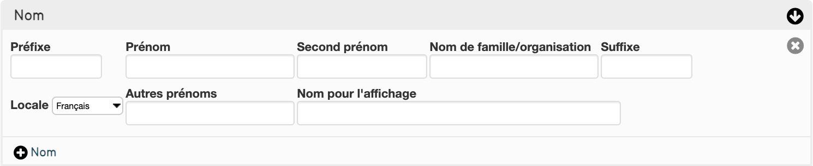](../Introduction/#texte-text)

#### Précisions sur l'entité
Indiquez ici les précisions que vous souhaitez apporter.
[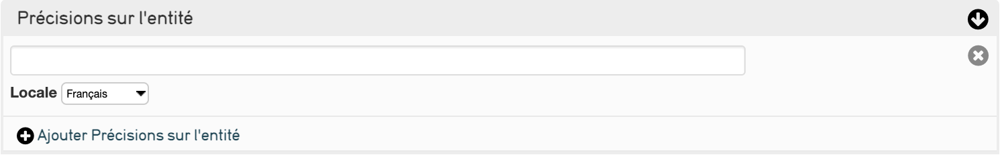](../Introduction/#texte-text)

#### Identifiant de personne 
Il s’agit de l’identifiant de l’entité, celui-ci peut être généré automatiquement ; il sera rempli du numéro d’autorité en cas d’import.
[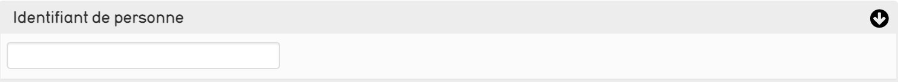](../Introduction/#texte-text)

#### Accès 
Sélectionnez si vous souhaitez que l’entité soit accessible au public ou non.
[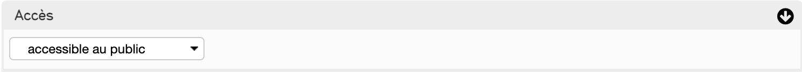](../Introduction/#1-liste-deroulante)

#### Statut 
Sélectionnez le statut de création de l'entité.
[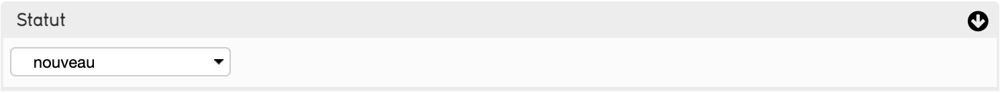](../Introduction/#1-liste-deroulante)

### Média
Ajoutez ici toute représentation média que vous jugerez utile à afficher/conserver en lien avec l’entité.

Cliquez sur "choisir un fichier" puis sélectionnez un document pour l'ajouter
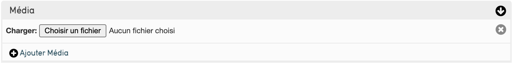

### Contact
Cet écran vous permet de saisir les coordonnées de l’entité personne physique ou organisation.

#### Adresse
Saisissez les deux lignes d'adresse, la ville, le pays et le code postal de l'entité
[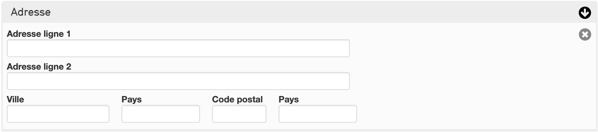](../Introduction/#texte-text)

#### Tél / Fax 
Saisissez le numéro de Téléphone de l'entité
[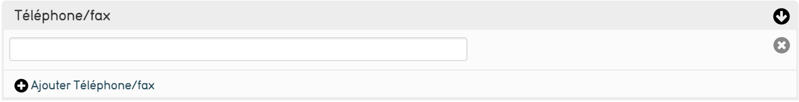](../Introduction/#texte-text)

#### Adresse Email 
Indiquez ici l'adresse e-mail de l'entité
[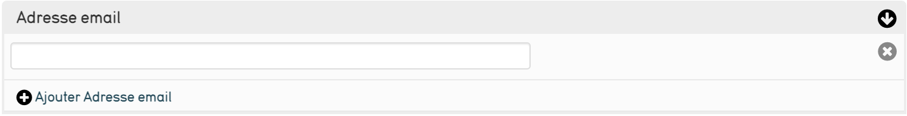](../Introduction/#texte-text)

#### Type d’adresse 
Choisissez le type d'adresse de l'entité 
[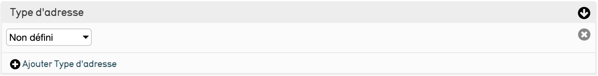](../Introduction/#1-liste-deroulante)

### Information complémentaire
Vous pouvez donnez ici des compléments d’information sur l’entité :

#### Culture populaire  
Saisissez ici la civilisation à laquelle l'entité est associé
[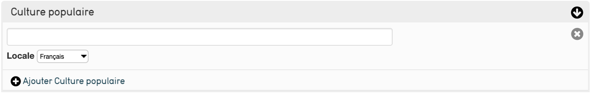](../Introduction/#texte-text)

#### Groupe de gens 
Saisissez ici la communauté à laquelle l'entité est associé
[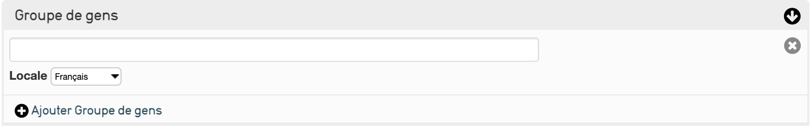](../Introduction/#texte-text)

#### Groupe linguistique
La langue parlée par l'entité 
[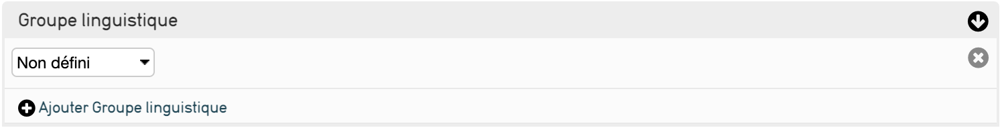](../Introduction/#1-liste-deroulante)

#### Note biographique sur les personnes 
Information concernant l'histoire de l'entité
[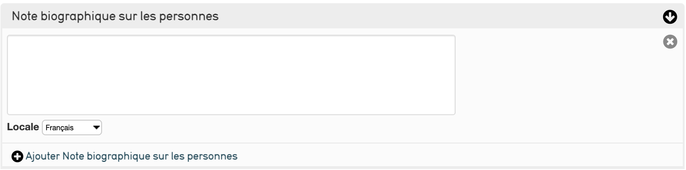](../Introduction/#texte-text)

#### Dates essentielles 
Indiquez ici la date de naissance et de mort de l'entité

#### Genre 
Précisez ici le genre de l'entité
[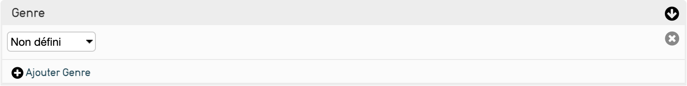](../Introduction/#1-liste-deroulante)

#### Nationalité d'une personne 
Notez ici la nationalité de l'entité

#### Emploi d'une personne 
Saisissez l'emploi de l'entité
[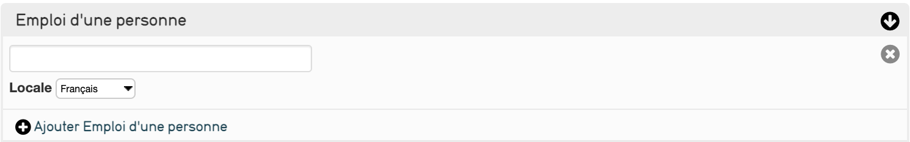](../Introduction/#texte-text)

#### Salutation 
Terme utilisé pour désigner l'entité (Monsieur, Madame, Docteur, etc..)

#### Son style / école 
Ce champ est lié au thesaurus « style / école » fourni par le Service des Musées de France
[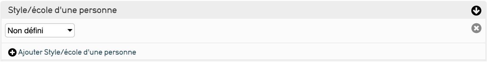](../Introduction/#1-liste-deroulante)

### Liens
Vous pouvez relier l'entité à un (ou plusieurs) site(s) web(s)

#### Nom du site web 
Donner le nom du site de l'entité

#### URL
Donner le lien pour accéder au site de l'entité

[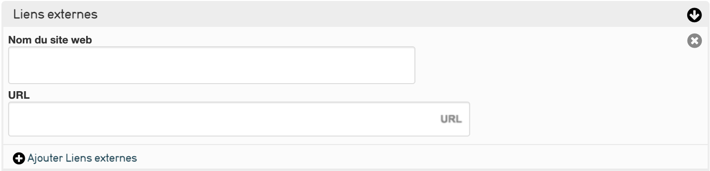](../Introduction/#texte-text)

