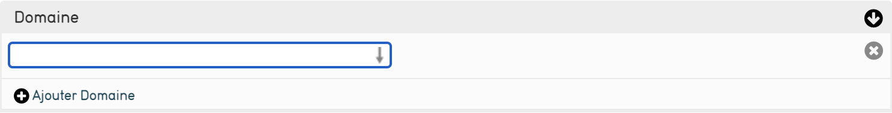
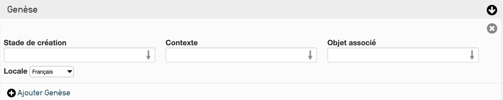
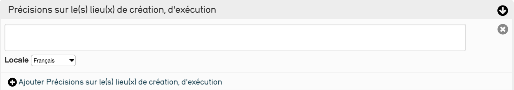
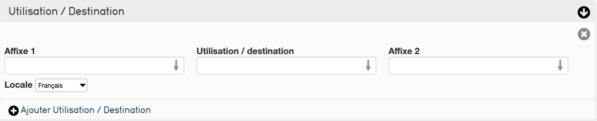

# 2. La saisie d’un objet dans CollectiveAccess

## Qu’entend par objet ?

Les objets correspondent aux éléments que vous gérez. 
Vous pouvez diversifier votre collection en définissant des types d'objets.

Par exemple, le profil de Saisie Joconde (créé à partir des recommandations du Service des Musées de France) définit différents types d'objets dans deux grandes catégories d’objets :

- les biens affectés : collections propres de l’établissement 
- les biens déposés : objets prêtés ou déposés par d’autres établissements

La liste des types d’objets est définie et paramètre selon vos collections, vous pouvez l’enrichir ou la modifier depuis le menu Gérer de CollectiveAccess.[^1] 
[^1]:Cette fonctionnalité est détaillée dans le support administration de CollectiveAccess.

Cliquez [ici](https://www.culture.gouv.fr/Thematiques/Musees/Pour-les-professionnels/Conserver-et-gerer-les-collections/Informatiser-les-collections-d-un-musee-de-France/Organisation-operationnelle-de-l-informatisation-des-collections-d-un-musee-de-France/Methode-de-redaction-informatisee-des-notices-d-objets-de-musees) pour récupérer le PDF officiel concernant la saisie Joconde.

## Comment créer un objet ?
Pour créer un objet  :

- lors de la saisie d’un objet lié, si celui-ci n’est pas déjà présent dans la base, CollectiveAccess vous propose de le créer au fil de l’eau. L'objet nouvellement crée alimente directement le fichier des objets.

Sinon :

- cliquez sur le menu « Nouveau » dans la barre de navigation principale.
- sélectionnez « Objet » dans le menu déroulant, puis choisissez un type (Bien affecté, bien déposé) pour créer un nouvel enregistrement.[^2]
[^2]:La liste des types d'objets dépend de votre paramétrage. (cf. support de cours administration de CollectiveAccess)

## Tour des différents écrans de saisie

- [Saisie Joconde]()
	- [les informations de base (Identification)](#identifier-lobjet)
	- [la description du bien](#description-du-bien)
	- [le contexte historique](#contexte-historique)
	- [le statut juridique](#statut-juridique)
	- [les informations complémentaires](#informations-complémentaires)
- [les informations concernant les médias](#media)
- [les droits d'accès](#droits-dacces)

## Détail de la saisie écran par écran

*NB : les écrans et les métadonnées décrits correspondent à ceux mis en place au sein du profil Joconde et répondent aux spécifications du Service des Musées de France*
*Les interfaces de saisie et les métadonnées sont modifiées en fonction de vos besoins et de votre fonctionnement ; nous décrivons ces fonctionnalités dans les supports de cours administration.*

L'écran "Saisie Joconde" reprend les écrans "Identification", "Description du bien", "Contexte historique", "Statut juridique" et "Informations complémentaires". Pour y accéder directement donnez un [N° d'inventaire](#n-dinventaire) à l'objet, [enregistrez](../Introduction/#enregistrer-annuler-supprimer) puis cliquez sur **Saisie Joconde** à gauche.

### Identifier l'objet
Contient les informations les plus élémentaires pour enregistrer un nouvel objet.

#### N° d’inventaire
Saisissez un identifiant alphanumérique en respectant les règles de saisies définies au sein de votre établissement.

#### Autre numéro 
Saisissez les autres numéros de référence de l’objet ; vous pouvez saisir plusieurs autres numéros.

#### Ancien numéro 
Saisissez ici les anciens numéros qu'à pu avoir l'objet

#### Domaine
Trouver le domaine de l'objet grâce à un [champ auto-completif](../Introduction/#3-recherche-par-auto-completion)
ou recherchez dans le thesaurus le domaine souhaité.

[Lien vers le thesaurus sur OpenTheso](https://opentheso.huma-num.fr/opentheso/?idt=th294)

#### Dénomination
Saisissez ici la désignation (le nom commun de l'objet) utilisée pour votre objet. Un affixe est disponible pour plus de précision

[Lien vers le thesaurus sur OpenTheso](https://opentheso.huma-num.fr/opentheso/?idt=th290)

#### Appellation
Saisissez ici toute autre désignation utilisée pour votre objet.
L'appellation correspond souvent à la désignation de l'objet à son époque

#### Titre de l'oeuvre  
Correspond au nom de l'objet. 
_Attention ce champ est obligatoire : si l'objet ne possède pas de titre ou de position, vous pouvez saisir son identifiant._

#### Auteur, exécutant, collecteur
Saisissez ici le nom du producteur de l’objet. Ce champ est directement lié aux enregistrements « [entités](./Saisie_Entite) » :

- saisissez quelques lettres (au moins 3) et CollectiveAccess vous propose toutes les entités dont le nom commence par ces lettres, vous pouvez ensuite le sélectionner;
- si l’auteur saisi n’existe, une fenêtre pop-up vous permet de le créer directement depuis la saisie de l’objet et l’ajoute directement au fichier des entités.

- choissisez si l'entité lié à l'objet en est **l'auteur** , **le collecteur**, **l'exécutant**, **le fabricant** ou **le créateur** grâce à la liste à coté après avoir chosi l'auteur

#### Ecole
Indiquez dans ce champ l'école en lien avec le style de l'entité. 2 affixes sont disponibles pour plus de précision

[Lien vers le thesaurus sur OpenTheso](https://opentheso.huma-num.fr/opentheso/?idt=th295)

#### Anciennes attributions
Correspond aux informations sur le(s) ancien(s) possesseur(s) de l'objet

#### Période de création/exécution
Recherchez la période de production de l'objet (si connu) 

#### Millésime de création/exécution 
Date de production précise de l'objet (si connu). 

#### Époque, styles
Rentrez ici l'époque, le style et le mouvement de l'objet. 
Deux affixe sont disponibles afin de préciser où ce place l'objet durant l'époque, le style ou le mouvement 

[Lien vers le thesaurus sur OpenTheso](https://opentheso.huma-num.fr/opentheso/?idt=th289)

### Description du bien
Contient les informations du physique de l'objet

#### Matériaux et techniques
Vous permet d’associer un ou plusieurs couple de matériaux et techniques à l’objet en les recherchant dans le thesaurus matériaux et techniques.

[Lien vers le thesaurus sur OpenTheso](https://opentheso.huma-num.fr/opentheso/?idt=th291)

#### Dimensions
Saisissez ici les dimensions connues de l’objet : diamètre, profondeur, hauteur, poids ainsi que sa largeur. Indiquez l’unité de mesure à la suite de la valeur.

CollectiveAccess intègre la gestion de toutes les unités de mesures et  les convertit lors des recherches effectuées.
Le champ "Type de dimensions" vous permet de préciser le type de mesure ou la partie mesurée si l'objet est complexe

#### Marques et inscriptions (inventaire) 
Détaillez dans ce champ les marques et inscriptions que vous pouvez relever sur l’objet en précisant les informations suivantes :

- Alphabet : Notifiez ici l'alphabet dans lequel l'inscription est écrite
- Emplacement de l’inscription : Où est placée l'inscription sur l'objet
- Langue : La langue dans laquelle est écrite l'inscription
- Transcription de l’inscription : Grâce à un éditeur de texte enrichi, vous pouvez retranscrire au plus précis le sens de l'inscription
- Type d’inscription : Recherchez dans ce menu le type d'inscription ou de marque correspondant à celui de l'objet

[Lien vers le thesaurus sur OpenTheso](https://opentheso.huma-num.fr/opentheso/?idt=th288)

#### Précisions sur les inscriptions
Champ textuel permettant d'ajouter librement des informations sur l'inscription

#### Onomastique
Ce champ sert à préciser les noms propres (de personnages, d'auteurs, de lieux,...) liés à l'objet

#### Description
Au sein de ce champ, saisissez une description détaillée de votre objet

#### État du bien au moment de l'acquisition ou du dépot
Rentrez ici la constatation d'état de l'objet au moment de l'acquisition ou du dépot

#### Constat d’état
Décrivez l’état initial de l’objet : date du constat, constat d'état, état global et commentaire ; vous pouvez associer à ce constat tout document numérique souhaité.

#### Représentation (décor)
Si l'objet répresente quelque chose indiquez ici le genre de la répresentation de l'objet ainsi que jusq'à 6 termes pour mieux définir la répresentation. un champ précision et aussi disponible en bas afin de localiser la représentation sur l'objet (ce champ correspond au dossier *thèmes* sur le thesaurus des représentations)

[Lien vers le thesaurus sur OpenTheso](https://opentheso.huma-num.fr/opentheso/?idt=th285)

#### Précision sur la représentation
Ce champ sert à apporter des précisions sur la représentation

#### Date de la représentation
Date de naissance et/ou de mort des personnages de la représentation ou date de l'évenement représenté (année/mois/jour)

#### Source de la représentation
Indiquez ici les œuvres de réferences de la répresentation :
- Genre : le type d'œuvre de réference
- Nature : Précisions sur le genre 
- Nom de l'auteur : l'auteur de l'œuvre de réference 
- Titre de l'oeuvre : le titre de l'œuvre de réference
- Précisions : précisions concernant l'œuvre

[Lien vers le thesaurus sur OpenTheso](https://opentheso.huma-num.fr/opentheso/?idt=th286)

### Contexte historique

#### Genèse
La genèse de l'objet est composée de 3 champs :

- Stade de création : ce champ indique l'étape de production de l'objet ainsi que s'il est/à une reproduction 
- Contexte : le contexte de la création de l'objet (commande, pièce d'essai,...)
- Objet associé : indiquez ici s'il existe un objet ou un œuvre en lien avec l'objet décrit (vous préciserais l'objet en question dans le champ d'en dessous)

[Lien vers le thesaurus sur OpenTheso](https://opentheso.huma-num.fr/opentheso/?idt=th298)

#### Objet(s) associé(s)
Lié au fichier des objets.
Vous pouvez lier des objets à l’objet que vous décrivez.
Si l'objet n'existe pas vous pouvez le créer

#### Historique
Champ texte vous permettant de décrire le contexte historique de l’objet

#### Lieu de création/d'exécution
Sélectionnez le lieu et indiqué s'il est celui de la création/de l'éxécution de l'objet, celui de la production de l'objet ou celui de la publication de l'objet en bas a droite après avoir choisi le lieu
Si le lieu n'existe pas vous pouvez [le créer](../Saisie_Lieux)

#### Précisions sur les lieux de création/d'exécution
Précisions sur le(s) lieu(x) de création, d'éxécution, de production, ou de publication de l'objet

#### Géographie historique
Champ vous permettant de préciser le nom des lieux au moment de la création de l'objet

#### Utilisation/destination
Réferez-vous au thesaurus afin de trouver le(s) terme(s) qui correspond(ent) le mieux à l'utilisation/la destination de l'objet. 
Utilisez l'affixe 1 pour définir si le treme correspond à l'utilisation, la destination ou la fonction de l'objet et l'affixe 2 pour préciser l'utilisation (originale, secondaire ou suposée)

[Lien vers le thesaurus sur OpenTheso](https://opentheso.huma-num.fr/opentheso/?idt=th304)

#### Précisions sur l'utilisation/destination
Précisions sur le(s) utilisation(s)/destination(s) de l'objet

#### Lieu(x) d'utilisation, destination
Recherchez le lieu d'utilisation ou de destination de l'objet. 
Si le lieu n'existe pas vous pouvez [le créer](../Saisie_Lieux)

#### Précisions sur les lieux d'utlisation/destination
Précisions sur le(s) lieu(x) d'utilisation/destination de l'objet

#### Période d'utilisation/destination
Période à laquelle l'objet à été utilisé (précison maximum de 25 ans)

#### Millésime d'utilisation/destination
Période à laquelle l'objet est utilisé (Année précise)

### Pour les objets issue de fouille/trouvaille archéologique

#### Lieu de découverte, de collecte ou de récolte
Lien vers le fichier des [lieux](../Saisie_Lieux), sélectionnez un lieu et précisez s’il s’agit d’un lieu d’utilisation / destination , de création, de découverte ou de récolte en bas à droite

[Lien vers le thesaurus sur OpenTheso](https://opentheso.huma-num.fr/opentheso/?idt=th284)

#### Type de site de découverte
Type de site dans lequel l'objet à été découvert

[Lien vers le thesaurus sur OpenTheso](https://opentheso.huma-num.fr/opentheso/?idt=th292)

#### Méthode de découverte, collecte, ou de récolte d’un objet
Précisez la méthode utilisée lors de la découverte, de la collecte ou de la récolte d’un objet.

[Lien vers le thesaurus sur OpenTheso](https://opentheso.huma-num.fr/opentheso/?idt=th292)

#### Date de découverte, collecte, récolte
Indiquez la date de la découverte, de la collecte ou de la récolte de l’objet (précision maximum au jour près).
le champ "[Type de date](../Introduction/#3-recherche-par-auto-completion)" sert à préciser si la date est une date de découverte ou de collecte

#### Découvreur
Saisissez ici le nom du découvreur.

#### Précisions sur la découverte 
Précisions sur la découverte, la collecte ou la récolte de l'objet

#### Numéro du site SDA
Précisez ici le numéro du site SDA duquel est issu l'objet

### Statut juridique
Cet écran sert à inscrire les informations juridiques concernant l'objet.
Même si la plupart des champs sont des textes libres il existe un thesaurus sur lequel vous pouvez vous baser. 

[Lien vers le thesaurus sur OpenTheso](https://opentheso.huma-num.fr/opentheso/?idt=th306)

#### Date d'inscription au registre de l'inventaire
Indiquez ici la date d'inscription de l'objet au registre d'inventaire

#### Type de propriété
Indiquez le type de propriété de l’objet parmi les choix disponibles

#### Mode d’acquisition
Le champ indique comment le musée a acquis l'objet. Il est nécessaire dans un but juridique et historique de savoir comment l'objet a été acquis.

#### Prix d'achat en euros
Cette case indique le prix d'achat (soit tous les frais liés à l'achat) ou la valeur donnée par des experts du bien.le prix doit être en euros(€)
*ne mettez pas d'espaces entre les chiffres (ex : 140 000 n'est pas valide, entrez 140000). Pour préciser les centimes utiliser une virgule et non un point (ex : 140,000 au lieu de 140.000)*

#### Mention des concours publics
Indiquez ici s’il s’agit d’une acquisition subventionnée par l'État ou une collectivité publique ou non

#### Etablissement affectataire
Ce champ est lié au fichier des [entités](../Saisie_Entite), saisissez l’établissement affectataire de l'objet.

#### Date et références de l’acte d’acquisition
Saisissez la [date](../Introduction/#date-daterange) et la référence de l’acte d’acquisition.
Vous pouvez donner des précisions sur la date si dans la [liste déroulante](../Introduction/#1-liste-déroulante) à droite de la date

#### Date d’affectation au musée
Saisissez la date à laquelle l'objet à été affecté au musée. Utlisez la [liste déroulante](../Introduction/#1-liste-déroulante) à gauche pour apporter des précisions sur la liste

#### Avis des instances scientifiques compétentes
Pour chaque avis, précisez quelle instance scientifique l’a donné, son sens (favorable / défavorable), sa date ; une zone « commentaires » vous permet de le détailler.

#### Anciennes appartenances
Champ texte qui vous permet de détailler les anciennes appartenances de l’objet.

#### Anciens Dépots
Champ texte qui permet de noter dans quel(s) dépot(s) à déja été entreposé l'objet

### Informations complémentaires

#### Exposition
Champ texte permettant de préciser les expositions dans lesquelles l’objet a été exposé ; les expositions actuelles sont décrites dans une fiche Exposition reliée à l’objet.

#### Bibliographie
Champ de texte enrichi dans lequel vous pouvez saisir une note du publication

#### Commentaires
Saisissez ici toutes les informations que vous n’avez pu saisir ailleurs qu’il s’agisse des informations liées à la conservation de l’objet ou à son contexte d’acquisition.

#### Crédits photographiques
Champ texte enrichi dans lequel vous pouvez saisir les crédits de photographies utilisée(s)

#### Rédacteur
Rédacteur de la notice : **plus** relié au fichier des entités

### Média 
Permet d'ajouter une ou plusieurs images(s) en lien avec votre objet

#### Représentations média
Intégrez une image grâce à ce champ :

- Écrivez dans label préféré le nom que voous voulez donner à votre image
- Définissez l'accessibilité de l'image dans la liste déroulante "Accès"
- Vous pouvez définir un statut pour la représentation si vous attendez modifications ou si vous les avez réalisées

#### Crédits photographiques
Champ textuel dans lequel vous pouvez saisir les crédits de(s) photographie(s) utilisée(s)

### Droits d'accès

#### Accès
Définissez l'accessibilité informatique de l'objet pour le public

#### Conditions d'accès
Les conditions d'accès physique du public à l'objet

