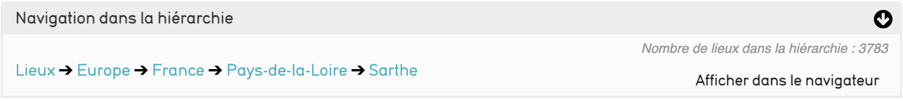
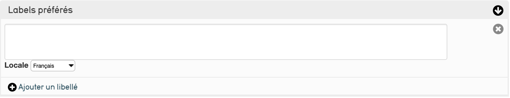
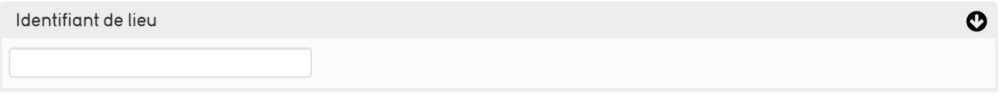
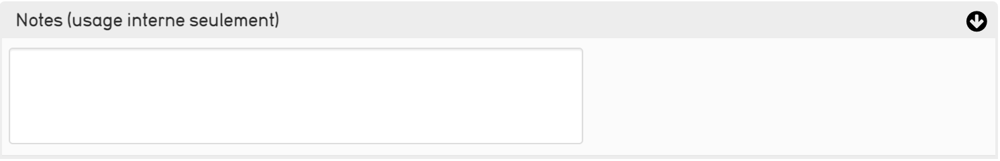

# 4. La saisie des lieux dans CollectiveAccess
CollectiveAccess vous propose une gestion des lieux sous la forme d’une [arborescence (hiérarchie)](../Introduction/#4-navigation-hiérarchique-horizontale), deux possibilités s’offrent à vous :

- nous pouvons importer une arborescence de lieux si vous nous sollicitez ou dans le cadre de votre marché
- vous pouvez créer une arborescence de lieux directement depuis Providence, ou modifier l’arborescence importée le cas échéant.
## Qu’entend-on par lieux ?
La position de votre enregistrement dans la hiérarchie est indiquée en haut de chaque écran.
*(Exemple de chemin : commune \> quartier \> rue).*
Vous pouvez également afficher à tout instant ces informations en sélectionnant « montrer les informations hiérarchiques » dans l'explorateur.
Deux menus déroulants dans ce menu vous permettent de créer des enregistrements enfants, frères et sœurs.
## Comment créer un nouveau lieu
* Dans la barre de navigation principale sélectionnez Nouveau \> Lieu.
* Accéder au niveau de [l'arborescence]() où vous souhaitez enregistrer la nouvelle autorité. 
* Sélectionnez le dossier (terme) parent[^1]. Le chemin du nouvel enregistrement s'affiche directement au dessus.

[^1]:Pour sélectionnez un terme cliquez sur **>** correspondant, cliquer sur le nom vous amènera sur les pages de modification du lieu. 

* Ensuite sélectionnez le type de lieu que vous souhaitez ajouter dans le [menu déroulant](). Ces types de lieu sont configurables dans l'éditeur de listes. 
* Cliquez sur le + pour créer un nouveau lieu qui sera pris en compte dans l'éditeur.

## Sélecteur hiérarchique
Le sélecteur hiérarchique s'ouvre automatiquement sur les écrans d'informations(basique ou supplémentaire).
Ce sélecteur vous permet de consulter la place du lieu dans l'arborescence, Cliquez sur un lieu ou sur *Afficher dans le navigateur* pour ouvrir l'arborescence complète.

## Description des écrans de saisie
Les lieux contiennent les informations suivantes sur votre collection :

- [les informations de base](#information-basique)
- [les liens avec d'autres sites](#liens)

### Information basique
Cet écran contient les informations nécessaires à un nouvel enregistrement.

#### Labels préférés
Nommez le nouveau lieu.

#### Identifiant du lieu 
Attribuez un identifiant (code) au lieu.

#### Notes (usage interne seulement)
Si besoin, décrivez plus précisément le lieu créé.

### Liens
Vous pouvez relier le lieu à un (ou plusieurs) site(s) web(s)

#### Nom du site web 
Donner le nom du site du lieu

#### URL
Donner le lien pour accéder au site du lieu

