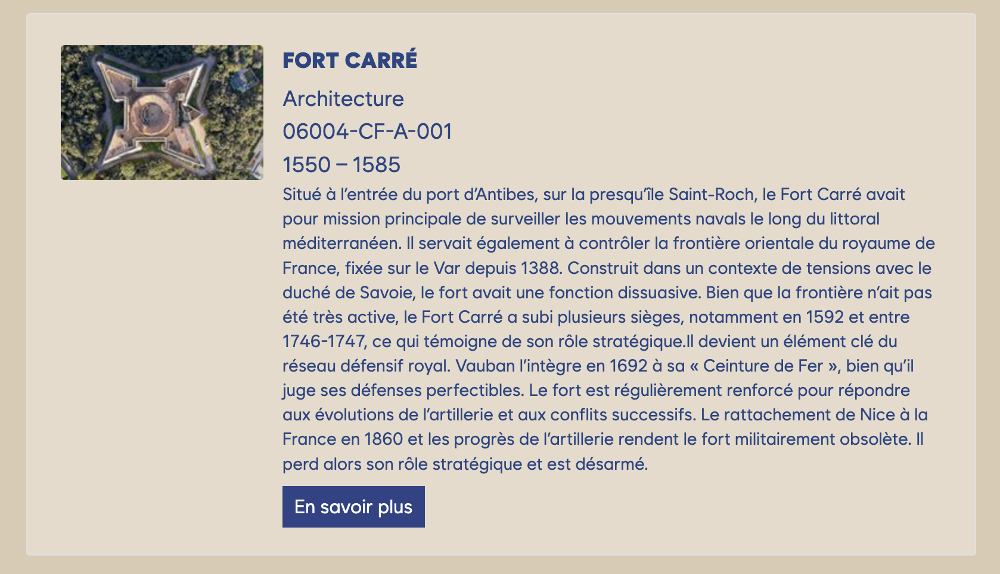
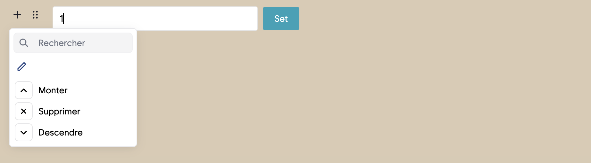

# Les blocs CollectiveAccess

L'un des grands intérêts du plugin Articles est de pouvoir **citer des fiches de
la base CollectiveAccess** directement dans un article. Trois blocs sont prévus
pour cela :

- **Objet CA** — pour insérer un **objet** de collection ;
- **Occurrence CA** — pour insérer une **occurrence** (événement, personne, lieu…
  selon votre profil) ;
- **Ensemble CA** — pour insérer un **ensemble** (set) d'objets.

Ces trois blocs fonctionnent exactement de la même manière.

## Insérer une fiche

1. Ajoutez le bloc voulu (par ex. **Objet CA**) via le menu **+**.
2. Un champ de saisie apparaît avec un bouton **Set**.
   Saisissez l'**identifiant** de la fiche : soit son **numéro interne** (clé
   primaire), soit son **identifiant** (numéro d'inventaire / *idno*, ou code
   d'ensemble pour un set).
3. Cliquez sur **Set**.

Une **carte** s'affiche alors, reprenant automatiquement les informations de la
fiche : sa vignette, son titre, quelques métadonnées, et un bouton
**« En savoir plus »** qui renvoie le visiteur vers la fiche complète sur le
site public.

> **D'où viennent les informations de la carte ?**
> La carte est reconstruite **automatiquement** à partir de la base à chaque
> affichage. Si la fiche est mise à jour dans CollectiveAccess (titre, image,
> description…), la carte de l'article reflète aussitôt ces changements — vous
> n'avez rien à refaire. Seul l'**identifiant** est mémorisé dans l'article.

## Modifier ou retirer une carte

Ouvrez les réglages du bloc (poignée **⠿**). En plus des actions habituelles
**Monter / Supprimer / Descendre**, un bouton **crayon (Éditer)** permet de
revenir à la saisie de l'identifiant pour pointer vers une autre fiche.

## Bon à savoir

- Si vous saisissez un identifiant **inexistant**, aucune carte ne pourra
  s'afficher : vérifiez le numéro dans Providence.
- Le bouton **« En savoir plus »** pointe toujours vers la bonne fiche, même si
  vous avez saisi la carte par son numéro d'inventaire plutôt que par son
  numéro interne.
- Les **ensembles** (Ensemble CA) s'affichent sous forme de carte titrée, sans
  bouton « En savoir plus ».
