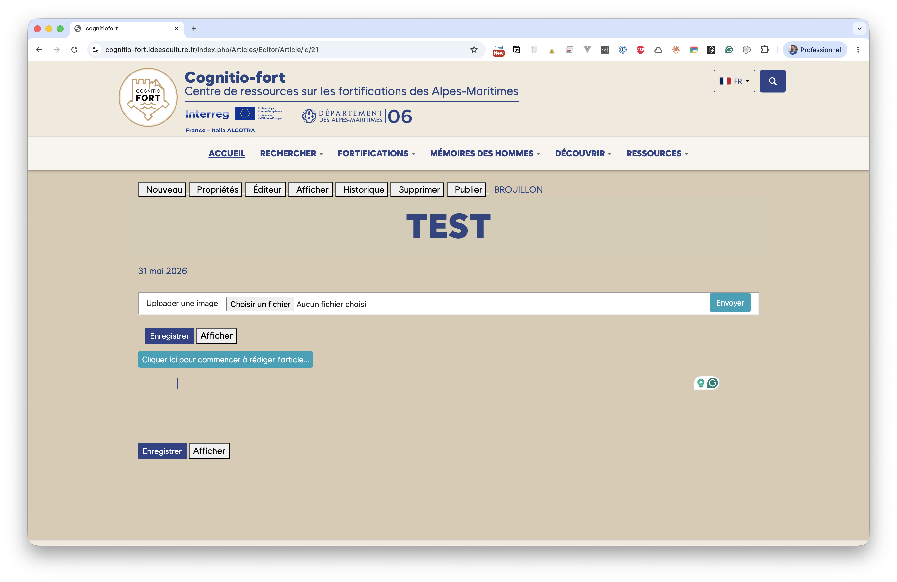
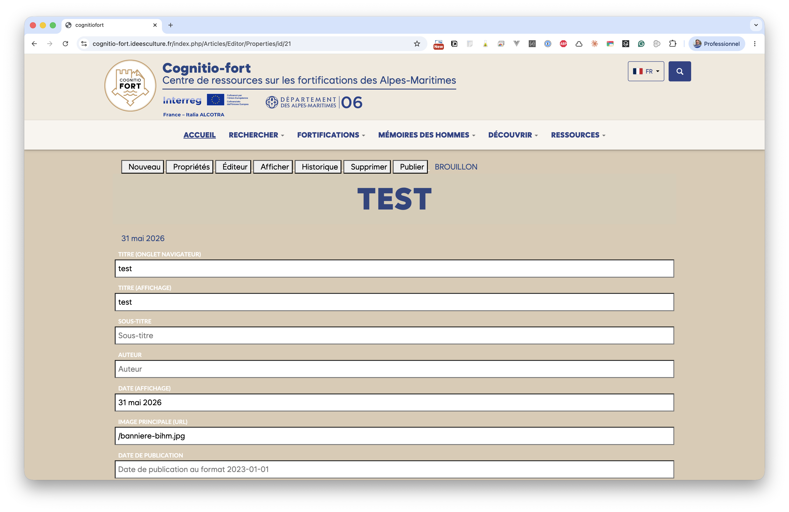
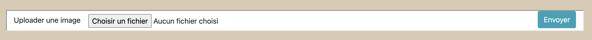
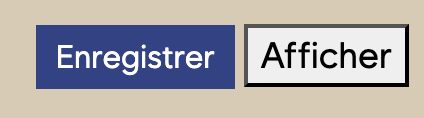

# Créer un article et renseigner ses propriétés

## Créer un nouvel article

Cliquez sur **Nouveau** dans la barre d'outils. Un brouillon vierge est
immédiatement créé et vous êtes redirigé vers son formulaire de propriétés.

Le nouvel article porte la mention **BROUILLON** : il n'est pas encore visible
des visiteurs. Tant que le corps de l'article est vide, l'éditeur affiche
l'invite *« Cliquer ici pour commencer à rédiger l'article… »*.

## Renseigner les propriétés

Le bouton **Propriétés** ouvre le formulaire des **métadonnées** de l'article.
Ce sont les informations qui décrivent l'article (et non son contenu rédigé,
qui se saisit dans l'[Éditeur](articles_editeur.md)).

| Champ | À quoi il sert |
|---|---|
| **Titre (onglet navigateur)** | Titre technique affiché dans l'onglet du navigateur et utilisé par les moteurs de recherche. |
| **Titre (affichage)** | Le grand titre affiché en tête de l'article. |
| **Sous-titre** | Une accroche ou un chapeau affiché sous le titre (facultatif). |
| **Auteur** | Le nom de l'auteur de l'article (facultatif). |
| **Date (affichage)** | La date affichée au lecteur (ex. *31 mai 2026*). |
| **Image principale (URL)** | L'image de couverture / vignette de l'article (voir ci-dessous). |
| **Date de publication** | Date technique, au format `2023-01-01`. Elle sert au tri des articles et permet une **publication programmée** : un article daté dans le futur n'apparaît qu'à compter de cette date. |

N'oubliez pas d'**Enregistrer** après modification.

> **Astuce — l'image principale**
> Le champ *Image principale* attend une **adresse (URL)** d'image. Le plus
> simple est d'utiliser l'outil **Uploader une image** (voir ci-dessous) pour
> envoyer votre fichier, puis de recopier l'adresse obtenue dans ce champ.

## Uploader une image

En haut de l'éditeur comme du formulaire de propriétés, un encart **Uploader une
image** permet d'envoyer un fichier (photo, illustration…) sur le serveur.

1. Cliquez sur **Choisir un fichier** et sélectionnez l'image sur votre
   ordinateur.
2. Cliquez sur **Envoyer**.
3. L'adresse (URL) de l'image envoyée s'affiche : copiez-la pour la réutiliser,
   soit dans le champ *Image principale*, soit dans un **bloc Image** de
   l'éditeur.

## Enregistrer et prévisualiser

Deux boutons reviennent en bas de chaque écran d'édition :

- **Enregistrer** — sauvegarde vos modifications.
- **Afficher** — ouvre l'article tel qu'il apparaîtra au public, pour vérifier
  le rendu.

> Pensez à **enregistrer régulièrement** pendant la rédaction. À chaque
> enregistrement, une **version** est conservée automatiquement : vous pouvez
> revenir en arrière depuis l'[Historique](articles_publication.md#historique-des-versions).
