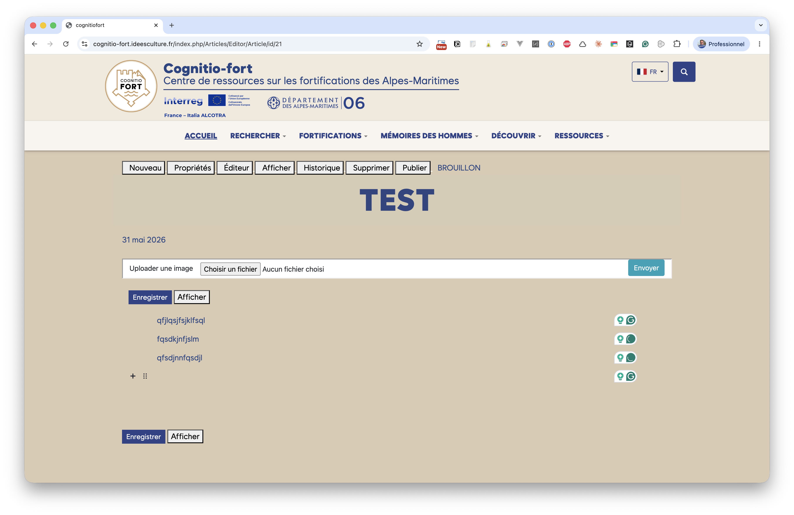
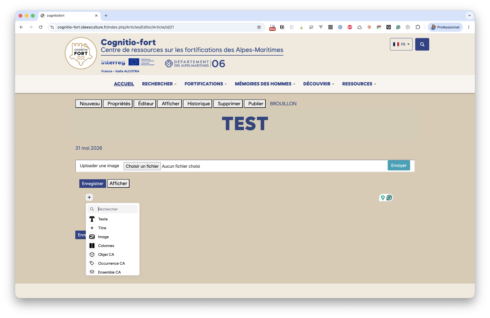
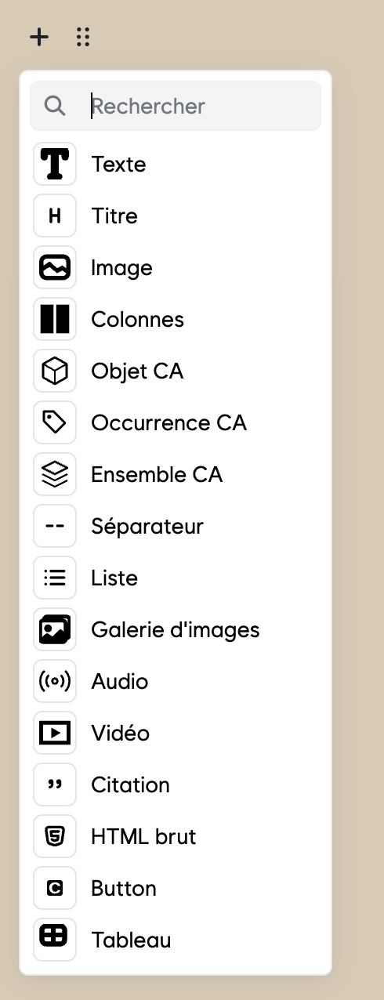
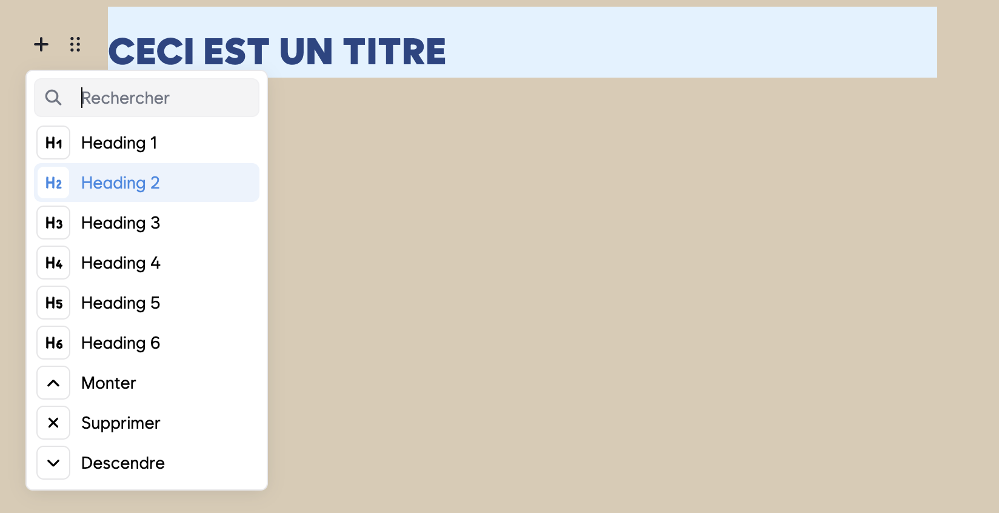
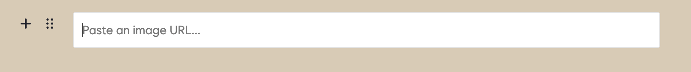
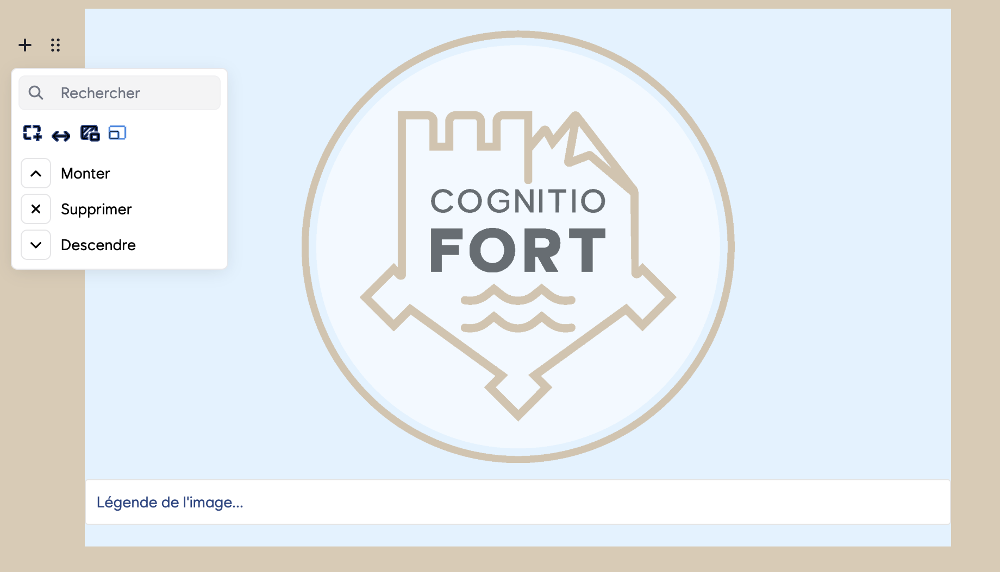
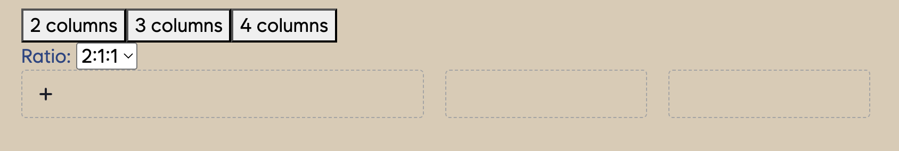

# Rédiger avec l'éditeur de blocs

Le bouton **Éditeur** ouvre la zone de rédaction. Le contenu d'un article n'est
pas un long texte continu : il est composé de **blocs** que l'on empile les uns
sous les autres. Chaque paragraphe, chaque titre, chaque image est un bloc
indépendant que l'on peut déplacer, modifier ou supprimer.

## Ajouter un bloc

Au survol d'un bloc, deux poignées apparaissent à sa gauche :

- le **+** : ajoute un nouveau bloc ;
- les **six points** (⠿) : permettent de **déplacer** le bloc par glisser-déposer
  et d'ouvrir ses **réglages**.

Cliquez sur le **+** pour ouvrir le menu des blocs disponibles.

La liste complète des blocs proposés :

| Bloc | Usage |
|---|---|
| **Texte** | Un paragraphe de texte courant. |
| **Titre** | Un titre de section (niveaux H1 à H6). |
| **Image** | Une image, avec légende et réglages d'affichage. |
| **Colonnes** | Une mise en page sur 2 à 4 colonnes. |
| **Objet CA** | Une carte renvoyant vers un **objet** de la base CollectiveAccess. |
| **Occurrence CA** | Une carte renvoyant vers une **occurrence** CollectiveAccess. |
| **Ensemble CA** | Une carte renvoyant vers un **ensemble** CollectiveAccess. |
| **Séparateur** | Un trait de séparation entre deux parties. |
| **Liste** | Une liste à puces ou numérotée. |
| **Galerie d'images** | Plusieurs images regroupées en galerie. |
| **Audio** | Un lecteur audio. |
| **Vidéo** | Un lecteur vidéo. |
| **Citation** | Une citation mise en valeur. |
| **HTML brut** | Du code HTML inséré tel quel (usage avancé). |
| **Button** | Un bouton-lien (libellé + adresse). |
| **Tableau** | Un tableau de données. |

> Les blocs **Objet CA**, **Occurrence CA** et **Ensemble CA** sont détaillés
> dans le chapitre [Les blocs CollectiveAccess](articles_blocs_ca.md).

## Modifier, déplacer et supprimer un bloc

Sélectionnez un bloc, puis ouvrez ses réglages via la poignée **⠿**. Le menu
propose toujours au minimum :

- **Monter** — déplace le bloc vers le haut ;
- **Descendre** — déplace le bloc vers le bas ;
- **Supprimer** — efface le bloc.

Pour le bloc **Titre**, ce menu permet aussi de choisir le **niveau** du titre
(Heading 1 à 6). Utilisez **Heading 2** pour les grandes sections : ces titres
sont automatiquement numérotés et repris dans le sommaire de l'article.

## Le bloc Image

Ajoutez un bloc **Image** puis collez l'**adresse (URL)** de l'image (obtenue
via l'outil *Uploader une image*).

Une fois l'image affichée, un champ **« Légende de l'image… »** apparaît
dessous : saisissez-y une légende facultative.

### Les réglages d'affichage de l'image

Ouvrez les réglages de l'image (poignée **⠿**). Une rangée d'icônes permet de
choisir comment l'image s'affiche :

- **Étirer** — l'image occupe toute la largeur disponible ;
- **Demi-largeur** — l'image est réduite à la moitié de la largeur, centrée ;
- **Fond** — l'image est posée sur un fond coloré ;
- **Bordure** — un encadrement est ajouté autour de l'image.

Quelques exemples de rendu :

## Le bloc Colonnes

Le bloc **Colonnes** permet de disposer du contenu côte à côte. Choisissez le
nombre de colonnes (**2 columns**, **3 columns** ou **4 columns**) et, le cas
échéant, leur **ratio** de largeur (ex. `2:1:1`). Chaque colonne est une zone
dans laquelle vous ajoutez vos propres blocs (texte, titre, image, liste,
tableau) via son bouton **+**.

## Les autres blocs en bref

- **Liste** : choisissez le style *à puces* ou *numérotée* dans la barre d'outils
  du bloc.
- **Citation** : met en valeur un extrait ou une parole.
- **Audio / Vidéo / Galerie d'images** : insèrent respectivement un lecteur
  audio, un lecteur vidéo ou un ensemble d'images.
- **Button** : un bouton cliquable ; renseignez le **libellé** et l'**adresse**
  cible.
- **Tableau** : saisissez vos données case par case ; vous pouvez activer une
  ligne d'en-têtes.
- **HTML brut** : réservé à un usage avancé ; le code saisi est inséré tel quel
  dans la page.

> **Toutes vos modifications doivent être enregistrées** : cliquez sur
> **Enregistrer** en bas de l'éditeur. À chaque enregistrement, une version est
> automatiquement conservée (voir [Historique des versions](articles_publication.md#historique-des-versions)).
