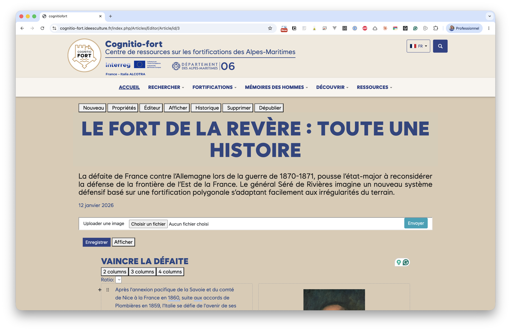
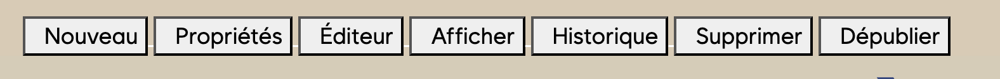

# Le plugin Articles pour Pawtucket

## À quoi sert le plugin Articles ?

Le plugin **Articles** est un mini-CMS (système de gestion de contenu) intégré
au site public **Pawtucket** de CollectiveAccess. Il permet de rédiger et de
publier des **articles éditoriaux** (récits, dossiers thématiques, expositions
virtuelles…) directement depuis le site public, sans passer par l'interface
professionnelle Providence.

Les articles sont composés à l'aide d'un **éditeur par blocs** (à la manière de
Notion ou des éditeurs de blogs modernes) : on empile des blocs de texte, de
titre, d'image, de tableau, de colonnes… et l'on peut même insérer des
**cartes renvoyant vers les fiches de la base CollectiveAccess** (objets,
occurrences, ensembles).

> **Où sont stockés les articles ?**
> Le contenu est enregistré dans la table native des pages de site de
> CollectiveAccess. Vous n'avez rien à installer ni à configurer côté Providence
> pour rédiger : tout se passe dans le navigateur, sur le site public.

## Qui peut rédiger des articles ?

La rédaction est réservée aux utilisateurs disposant du **rôle « rédacteur »**
(*redactor*). Un visiteur ordinaire ne voit que les articles **publiés** ; seul
un rédacteur connecté voit la **barre d'outils** d'édition en haut de l'article,
ainsi que les articles encore à l'état de **brouillon**.

Si la barre d'outils n'apparaît pas, vérifiez que :

- vous êtes **connecté** au site avec votre compte ;
- votre compte appartient bien au **groupe rédacteur**.

## La barre d'outils du rédacteur

Lorsque vous êtes connecté en tant que rédacteur, une barre de boutons s'affiche
en haut de chaque article. C'est votre poste de pilotage.

| Bouton | Rôle |
|---|---|
| **Nouveau** | Crée un nouvel article (brouillon vierge). |
| **Propriétés** | Ouvre le formulaire des métadonnées (titre, sous-titre, auteur, date, image principale…). |
| **Éditeur** | Ouvre l'éditeur de blocs pour rédiger le corps de l'article. |
| **Afficher** | Affiche l'article tel que le verra le public. |
| **Historique** | Liste les versions sauvegardées et permet d'en restaurer une. |
| **Supprimer** | Supprime définitivement l'article (après confirmation). |
| **Publier / Dépublier** | Bascule l'article entre l'état *brouillon* et *publié*. |

À droite des boutons, une mention rappelle l'état courant de l'article :
**BROUILLON** tant qu'il n'est pas publié.

## Le déroulé type

La création d'un article suit toujours les mêmes étapes :

1. **Nouveau** → un brouillon est créé.
2. **[Propriétés](articles_creation.md)** → on renseigne le titre, l'auteur, la date, l'image principale…
3. **[Éditeur](articles_editeur.md)** → on rédige le contenu bloc par bloc.
4. **[Publier](articles_publication.md)** → l'article devient visible du public.

Les chapitres suivants détaillent chacune de ces étapes.
