# **II. Catalogage, recherche et récolement des objets mobiliers dans CollectiveAccess**

Chaque mobilier/objet nécessite d'être catalogué (dans l'inventaire) suivant des normes bien spécifique en lien avec l'appellation Musée de France. Ces normes suivent un catalogage ordonné et réfléchi en 18 colonnes \[la « circulaire » de George-Henri Rivière\]. La première colonne débute par le numéro d'inventaire et continu jusqu'à finir par les observations. Dans ce chapitre je vais vous décrire chaque colonne et sous-champ des 18 colonnes, leurs correspondances dans CollectiveAccess et quelque exemple de leurs applications.

## **1/ Le numéro d'inventaire**

Il s'agit de l'une des colonnes les plus importantes pour un objet, car elle identifie clairement par un numéro l'objet. Ce numéro est obligatoire pour chaque objet, car il permet de le différencier, mais aussi de le faire entrer dans le domaine du bien public, c'est-à-dire qu'il devient propriété du musée. Il est indiqué dans l'objet par un marquage qui correspond au numéro de l'inventaire.

Ce numéro d'inventaire se retrouve bien entendu dans CollectiveAccess, notamment sur la page d'identification de l'objet.

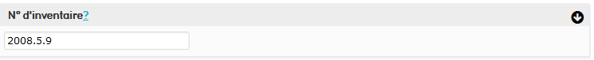

## **2/ Mode d'acquisition**

Le champ indique comment le musée a acquis l'objet. Il est nécessaire dans un but juridique et historique de savoir comment l'objet a été acquis (notamment le problème de l'occupation allemande). Je vais vous faire une liste des principaux modes d'acquisitions :

Dans CollectiveAccess, on peut retrouver ce champ dans les statuts juridiques de l'œuvre.

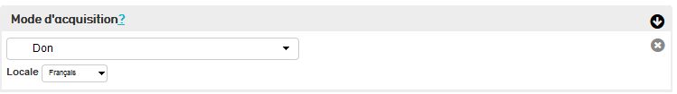

## **3/ Nom du donateur, testateur, vendeur**

Ce champ permet d'indiquer la personne qui a donné/vendu l'objet, cela répond comme pour le mode d'acquisition à une volonté juridique et historique.

Dans CollectiveAccess, on peut retrouver ce champ dans la page statut juridique. On a la possibilité d'indiquer plusieurs donateurs/testateur/vendeurs.

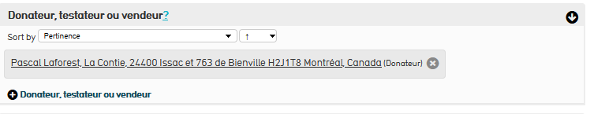

## **4/ Date de l'acte d'acquisition et d'affectation**

Cette partie concerne encore l'aspect juridique et historique de l'objet. On y indique la date d'acquisition de l'objet sous le format
AAAA/MM/JJ, si elle n'est pas connue, on la déduite par la date d'entrée de l'objet dans la collection.

En ce qui concerner la date d'affectation, il s'agit du moment ou le musée place sous garde l'objet, contrairement à l'acte d'acquisition, le musée n'en est pas propriétaire.

On retrouve dans CollectiveAccess ces champs sur la page statut juridique, ce champ avec la date inversée.

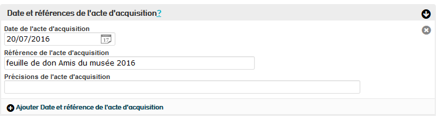

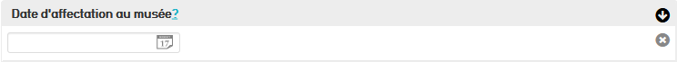

## **5/ Avis des instances scientifiques**

Il s'agit de l'avis donné par une instance scientifique de l'acquisition/affectation d'un bien. Cela peu aller de favorable à
défavorable. Elle est indiquée par le sigle de l'instance.

Dans CollectiveAccess on retrouve ce champ dans Statut juridique, on peut y indiquer le sigle, la date, l'avis et même des commentaires.

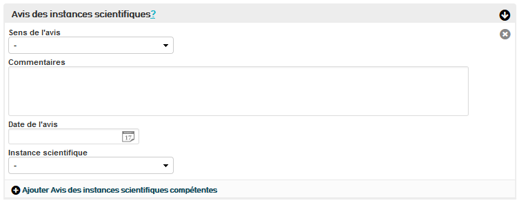

## **6/ Prix d'achat et subvention de l'État**

Cette case indique le prix d'achat (soit tous les frais liés à l'achat) ou la valeur donnée par des experts du bien. Le prix ne peut être indiqué qu'en euros.

Concernant les mentions des concours publics, il s'agit d'indication « acquisition subventionnée/non subventionnée » à la fin du prix. Ils ne sont qu'utilisés pour les collections liées à des collectivités territoriales et des collections privées.

Dans le cas de CollectiveAccess, sur la page statut juridique, il y a un champ permettant d'indiquer le prix de l'objet. Il est possible d'entrer des devis étrangers qui seront directement transformés en euros en prenant en compte les variations des devis. On retrouve aussi en dessous un champ pour indiquer les mentions.

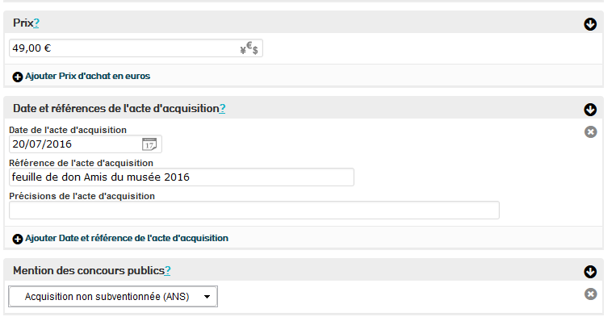

## **7/ Date d'inscription au registre**

Il s'agit de la date d'inscription à l'inventaire du bien. Cette inscription doit être effectuée l'année d'acquisition. Elle est
représentée en AAAA/MM/JJ.

Dans CollectiveAccess elle est ajoutée dès que l'objet est compilé dans un inventaire, il n'est donc pas nécessaire de la renseigner.

## **8/ Désignation du bien**

Il s'agit d'un champ qui permet de donner les principaux éléments du bien via son domaine, sa dénomination, son appellation et son titre.

### A) Domaine (catégorie du bien)

Le Domain désigne la nature du bien. Elle se compose en 4 grands types qui peuvent être mélangés pour un même objet :

Le support de conservation (sculpture, peinture, dessin)

L'utilisation (vie domestique, croyance-coutumes, funéraire)

Temporel/Civilisationnel/Géographie (Afrique, Romain, Antiquité)

Discipline (Archéologie, Ethnologie, Astronomie)

Sur CollectiveAccess, ce champ prend la forme d'arborescence pour renseigner le domaine, il y a la possibilité d'ajouter d'autre domaine.

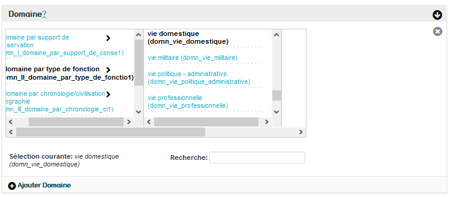

### B) Dénomination

Pour la dénomination, cela indique la nature première de l'objet qui ne peut pas figurer dans les domaines sauf pour les biens archéologiques dont la désignation est un matériau (exemple : silex).

Dans CollectiveAccess, ce champ se trouve dans « autres désignations » et autorise une entrée libre.

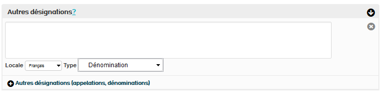

### C) Appellation

Il s'agit de la dénomination dans une langue particulière ou un registre plus commun lié à l'objet.

Dans CollectiveAccess, ce champ se trouve dans « autres désignations » et autorise une entrée libre.

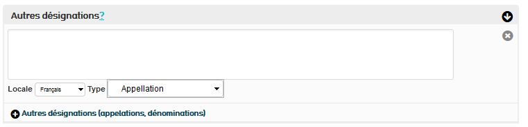

### D) Titre

Il s'agit du titre de l'œuvre.

Dans CollectiveAccess, il porte le nom de Désignation principale, il s'agit d'une case de texte libre.

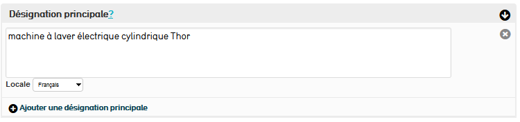

### E) Représentation

Ce champ sert à donner les différentes informations liées aux représentations présentes sur l'iconographie du bien (personnages
représentés, année de mort et naissance, sources).

Sur CollectiveAccess, il n'y a pas réellement de champ pour indiquer cela. Cependant il est possible soit via la page média d'ajouter des informations sur une photo (Label préféré) et donc sur une photo d'une partie du bien.

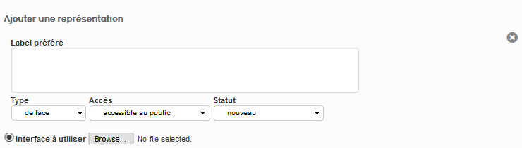

### F) Genèse

Il s'agit d'indiquer le contexte de création (concours), mais aussi son stade de création et reproduction (copie, moulage).

Dans CollectiveAccess on retrouve ce champ dans Contexte historique sous la forme d'un menu arborescent.

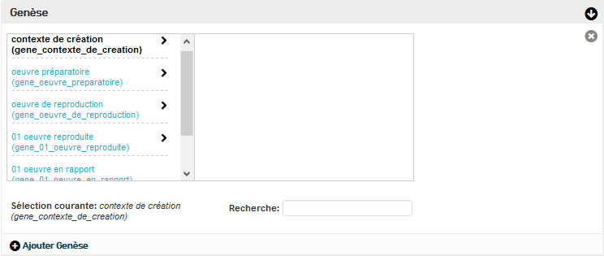

### G) Objet(s) associe(s)

Il s'agit ici d'indiquer les objets ayant un lien avec le bien présenté.

On retrouve ce champ dans CollectiveAccess dans Contexte historique sous la forme d'une case de saisie libre.

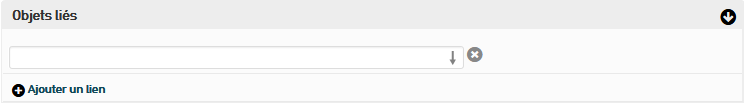

### H) Historique

Il s'agit d'un champ permettant de de préciser des éléments historiques liés au bien notamment le stade de création ou les objets en rapport. Il sert aussi a complètement à d'autres champs notamment Genèse, Période et Millésime de création/exécution, Lieu de création/exécution, et Lieu d'utilisation/destination.

Il se présente sur CollectiveAccess dans la section Contexte historique sous la forme d'une case de saisie libre.

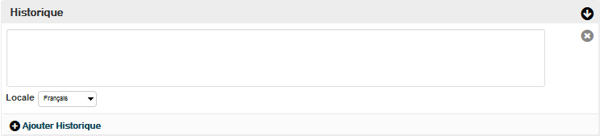

## **9/ Marques et inscriptions**

Il s'agit là d'indiquer tous les types d'inscriptions, leurs natures et langues.

### A) Les inscriptions

Il s'agit là d'indiquer ce qui est marqué, transcrire et indiquer l'emplacement de l'inscription et l'auteur.

En ce qui concerne CollectiveAccess, on retrouve cela dans la description du bien, on peut y entrer l'inscription, son type via une
menue arborescence, son emplacement, transcription et l'alphabet et langue.

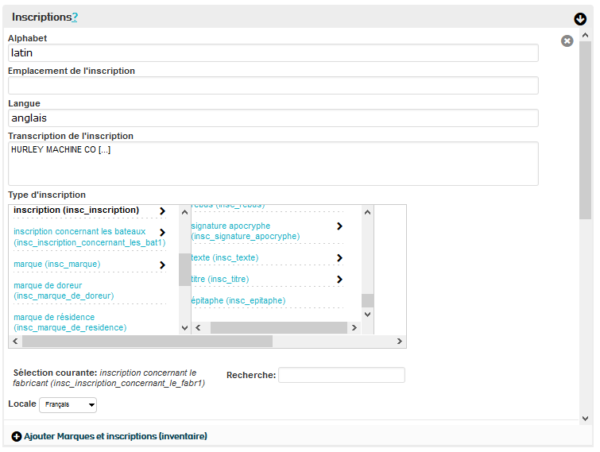

### B) Description

Il s'agit dans ce champ de décrire de manière formelle le bien.

Sur Collective Access ce champ se trouve dans Description du bien et se trouve être une case de saisie libre.

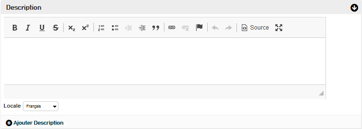

## **10/ Matière et matériaux**

Ce champ indique tous les types de matériaux et matière composant le bien. Un vocabulaire associé est mis à disposition par les musées de France. Les matériaux sont bien sûr rangés par catégorie. Ce champ est directement en lien avec le champ suivant portant sur les techniques.

Sur CollectiveAccess, ce champ se trouve dans Description du bien. On peut y entrer différents matériaux en saisie libre ou avec des catégories en pouvant bien sûr rajouter des lignes pour pouvoir entrer plus de matériaux.

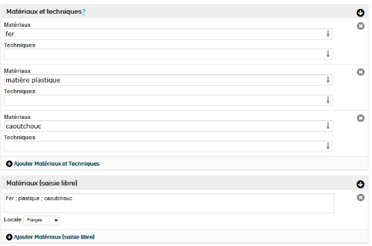

## **11/ Technique de réalisation, de préparation, de fabrication**

Ce champ indique le technique utilisé, il est en lien direct avec la précédente catégorie, car il indique le technique utilisé sur un
matériau donné. Il est indiqué entre parenthèses à côté du matériau où la technique a été appliquée.

Dans CollectiveAccess, cette catégorie se trouve dans Description du Bien et peut être remplie soit en saisie libre soit via un menu arboré.

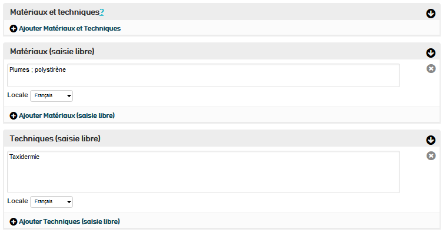

## **12/ Mesures**

Ce champ précise la mesure de l'objet, via plusieurs catégories de mesure allant du diamètre à l'épaisseur. Bien sûr, les mesures à prendre dépendent du type d'objet.

Dans CollectiveAccess, on retrouve cette catégorie dans Description du Bien. On peut y renseigner différentes tailles en saisie libre où via des champs prédéfinis.

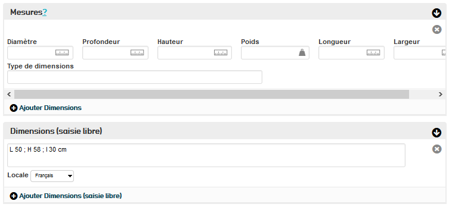

## **13/ Signes particuliers**

Dans cette catégorie on indique les éléments particuliers de l'objet lors de son acquisition, donc les défauts, les manques et les
casses/fêlure.

On retrouve cette catégorie dans CollectiveAccess dans Description du Bien. On peut dans ce champ notamment la date, l'ajout de fichier ou encore des commentaires.

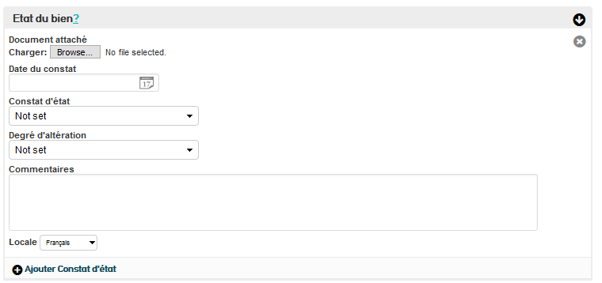

## **14/ Auteur ; collecteur, fabriquant, commanditaire...**

### A) Auteur, collecteur, fabricant, commanditaire

Dans ce champ on indique qui est la personne/entité qui a réalisé le bien ou trouvé.

On retrouve ce champ dans CollectiveAccess dans Identification. On peut y entrer en saisie libre le nom de l'auteur et crée une fiche de l'auteur qui sera enregistré dans CollectiveAccess.

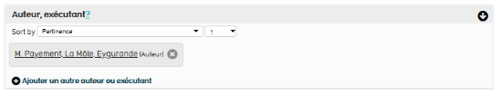

### B) Précisions sur l'auteur/exécutant/collecteur

Dans ce champ on précise des éléments pertinents liés à l'auteur/exécutant/collecteur.

Dans CollectiveAccess, lors de l'ajout d'un auteur, une fenêtre s'ouvrira si celui n'a pas était renseigner dans la base de données de CollectiveAccess. On pourra donc indiquer sur cette fenêtre tous les éléments importants liés à l'auteur.

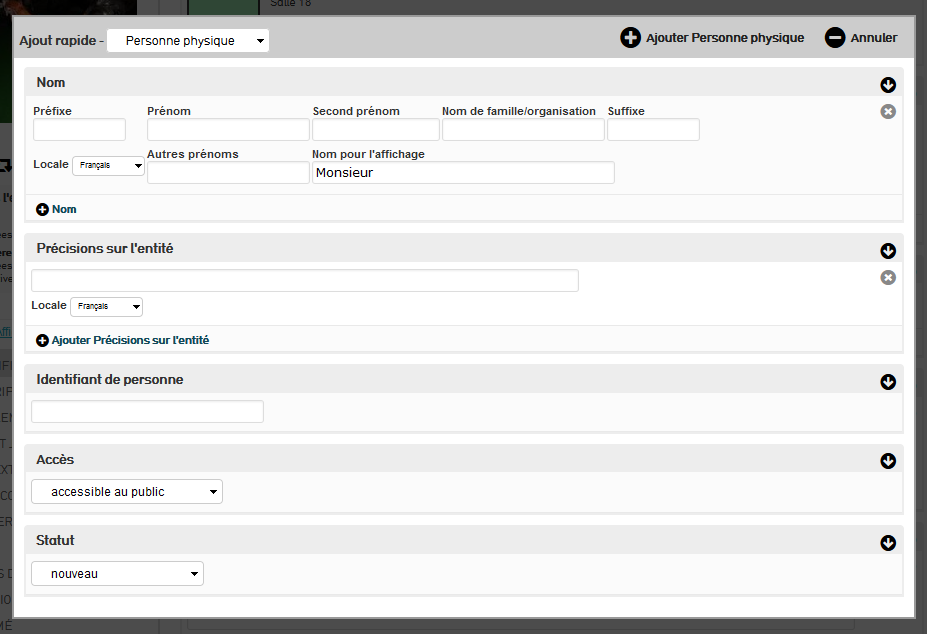

### C) École

Ce champ sert à indiquer l'école et donc l'ensemble artistique dont l'œuvre fait partie.

Dans CollectiveAccess on retrouve ce champ dans Identification. Il s'agit un menu arboré qui permet de renseigner l'école dont fait partie le bien.

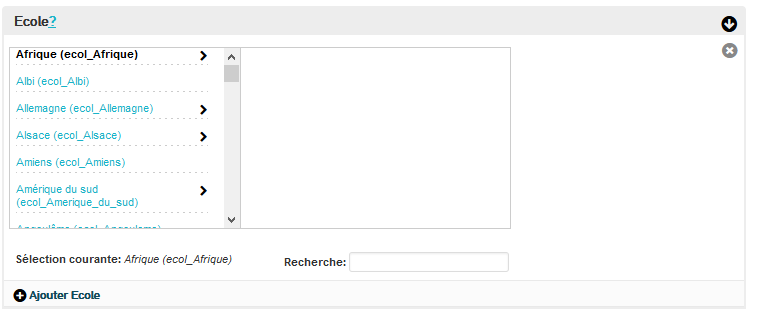

## **15/ Époque, datation, date de récolte**

### A) Anciennes attributions 

Il s'agit ici d'indiquer toutes les anciennes attributions qu'a eues l'œuvre (personnes ayant possédé l'œuvre)

On le retrouve sur CollectiveAccess dans Identification. Il s'agit là d'une case de saisie libre.

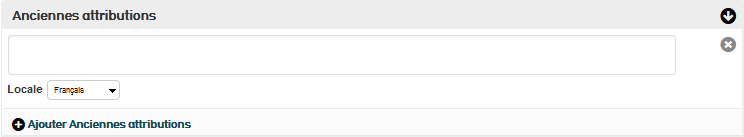

### B) Période de création/exécution

Ce champ sert à indiquer la date de création ou exécution du bien en siècle ou millénaire.

On retrouve ce champ dans Identification sur CollectiveAccess, il permet via un menu arboré d'indiquer la date de création/exécution de l'objet.

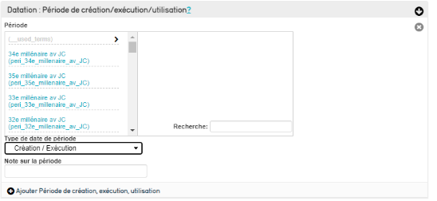

### C) Millésime de création/exécution

Ce champ permet d'indiquer l'année précise de création/exécution de l'œuvre.

On retrouve cela sur CollectiveAccess dans Identification. On peut y entrer en saisie libre l'année de création ou exécution.

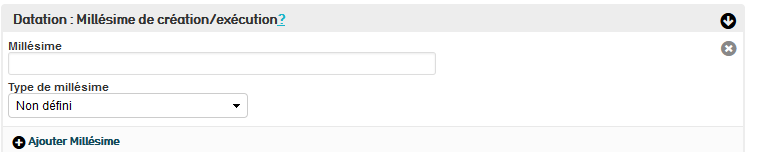

### D) Époque/Style/Mouvement

Ce champ permet d'indiquer à quels style, époque ou mouvement artistique appartient le bien. Il ne doit pas se substituer au champ de la période d'exécution/création.

On retrouve ce champ dans ColectiveAccess dans Identification. On peut y indiquer par un menu arboré l'époque/style ou encore le mouvement

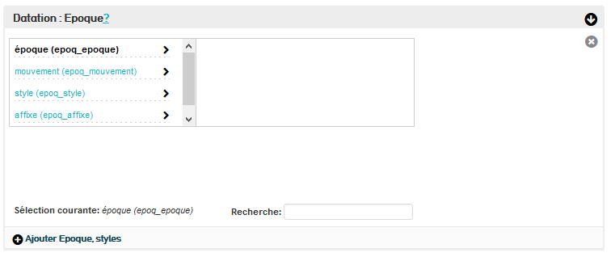

### E) Période d'utilisation/destination

Ce champ est identique à celui de Date de création/exécution sauf que l'on y indique la période d'utilisation ou de destination

Ils sont dans le même champ dans CollectiveAcess.

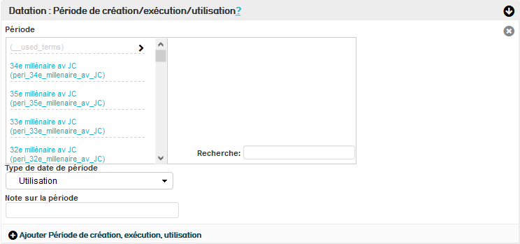

### F) Millésime d'utilisation/destination

Même chose que pour le Millésime de création/exécution cependant concernant utilisation et la destination.

Ils sont dans le même champ dans CollectiveAcess.

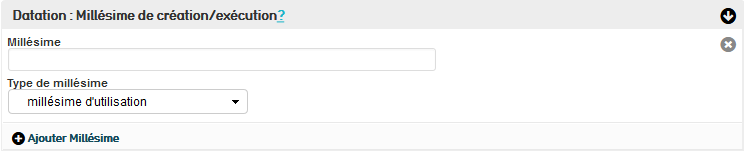

### G) Date de découverte/collecte/récolte

Il s'agit d'un champ qui indique la date de découverte, collecte ou récolte d'un bien. Elle doit être renseignée le plus précisément
possible. On n'y indique pas que la date, mais aussi d'autres informations comme le découvreur, des précisions sur la découverte et le numéro du site S.D.A (archéologie).

On retrouve ce champ dans Contexte historique. On peut y renseigner toutes les informations liées à ce champ du découvreur jusqu'à la date.

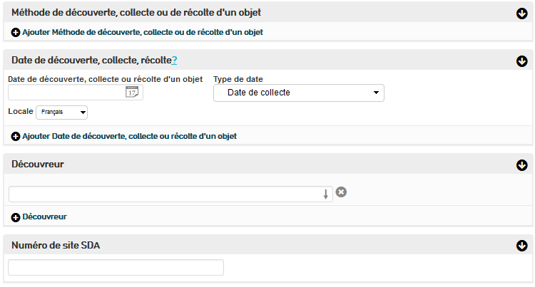

## **16/ Fonction d'usage**

### A) Utilisation/Destination

Ce champ sert à indiquer l'usage de l'objet.

On retrouve ce champ dans CollectiveAccess Contexte historique. On peut en utilisant un menu arboré renseigner l'utilisation de l'objet.

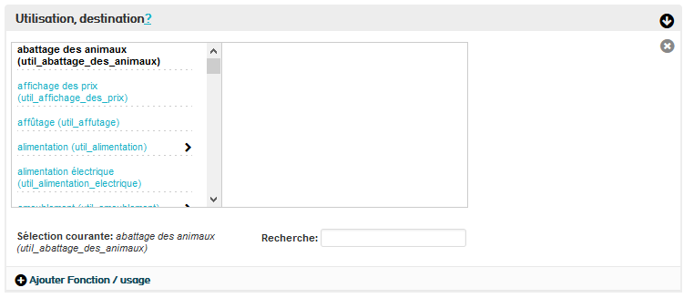

### B) Précision sur l'utilisation/destination

Dans ce champ on précise son utilisation.

On retrouve ce champ dans CollectiveAccess Contexte historique. On peut y indiquer en saisie libre l'utilisation précise de l'objet.

## **17/ Provenance géographique**

Il s'agit d'une colonne qui permet de renseigner tous les éléments géographiques liés à l'œuvre de sa fabrication jusqu'à découverte.

### A) Lieux de création/exécution

Dans ce champ on indique le lieu où le bien a été créé ou où il a été exécuté, avec entre parenthèses, précisé ce qui a était fait sur le lieu (lieu de création, etc.)

Dans CollectiveAccess on retrouve ce champ dans Contexte historique. On peut y renseigner en saisie libre le lieu de création/exécution.

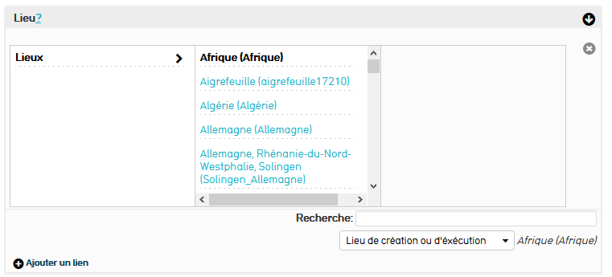

### B) Précision sur le lieu de création/exécution

Dans ce champ on indique tous les précisions jugées importantes à apporter en complément du lieu de création/exécution.

Dans CollectiveAccess on retrouve ce champ dans Contexte historique. On peut y renseigner en saisie libre le complément à apporter à lieu de création/exécution.

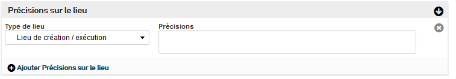

### C) Géographie historique

Dans ce champ on précise les lieux déjà cités dans les catégories de ce chapitre même via des appellations anciennes.

Dans CollectiveAccess on retrouve ce champ dans Contexte historique. On peut y renseigner en saisie libre les noms anciens des lieux.

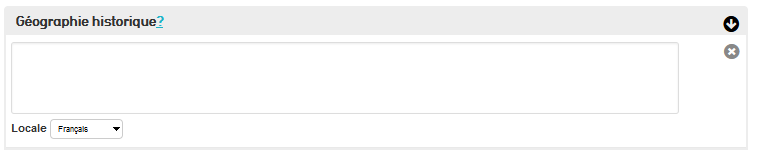

### D) Lieux d'utilisation/destination

Même chose que pour Lieux de création/exécution, mais concernant l'utilisation/destination.

Même chose dans CollectiveAccess, il suffit de changer en utilisation/destination.

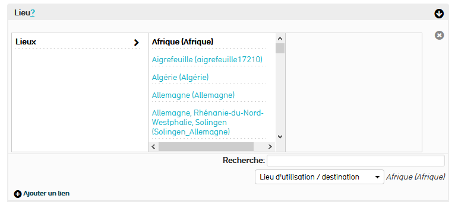

### E) Précisions sur le(s) lieu(x) d'utilisation/destination

Il s'agit ici d'indiquer des informations supplémentaires à champs précédents.

On le retrouve sur CollectiveAccess au même endroit que le champ Précision sur le(s) lieu(x) de création/exécution.

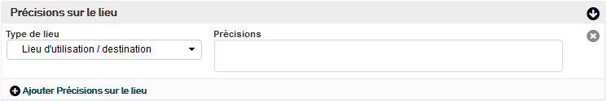

### F) Lieu de découverte/récolte/collecte

Même chose que pour Lieux de création/exécution, mais concernant la découverte/récolte/collecte.

Même chose dans CollectiveAccess, il suffit de changer en découverte/récolte/collecte.

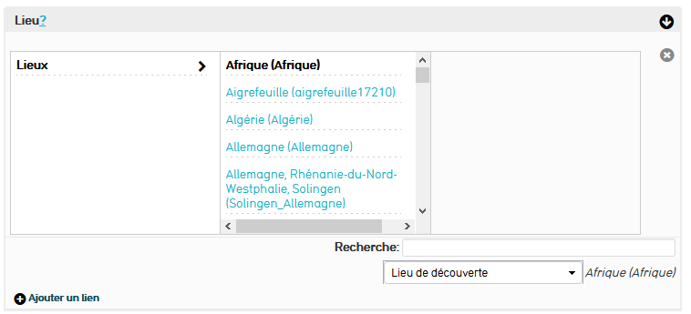

### G) Type de site de découverte/collecte/récolte

Il s'agit d'indique le type du site où à était trouvé l'œuvre.

Dans CollectiveAccess ce champ se trouve dans Contexte historique sous la forme d'un menu déroulant.

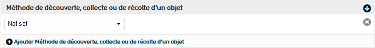

## **18/ Observations**

Il s'agit de la dernière colonne, elle permet de renseigner des éléments que n'entre pas dans les autres colonnes et qui sont important pour le bien.

### A) Anciens numéros et autres numéros

Dans cette partie on renseigne tous les numéros anciens et autres du bien.

On retrouve cela dans CollectiveAccess dans Identification. On peut y entrer en saisie libre les anciens et autres numéros.

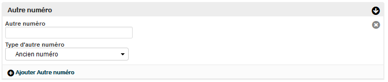

### B) Ancienne appartenance

Dans ce champ on renseigne tous les anciennes appartenances du bien. Cela ne concerne que les bien technique ou scientifique.

Dans CollectiveAccess ce champ se trouve dans Contexte juridique. On peut y écrire en saisie libre les différents noms.

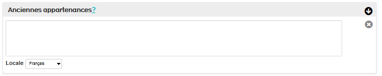

### C) Dépôts/établissement dépositaire

Il s'agit de renseigner le dépôt actuel de l'objet.

Dans CollectiveAccess ce champ se trouve dans Statut juridique sous le nom d'établissement affectataire. C'est une case de saisie libre.

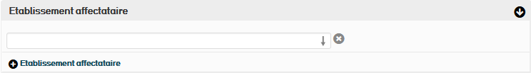

### D) Commentaire

Ce champ sert à donner des informations importantes sur le bien qui n'ont pas pu être mis dans d'autres catégories.

On retrouve ce champ dans ColectiveAccess dans Infos complémentaires. On peut y écrire en saisie libre les commentaires sur le bien.

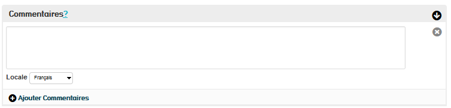

### E) Crédit photographique

Comme le nom l'indique, il sert à renseigner le crédit de la photo de l'œuvre.

Ce champ se trouve sur CollectiveAccess dans Média, on peut y renseigner en saisie libre le crédit photographique.

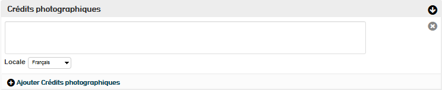

### F) Rédacteur de la notice

Il s'agit de la dernière ligne à remplir, il s'agit du nom et prénom(s) de la personne ayant rédiger la notice.

Sur CollectiveAccess ce champ se trouve dans Infos complémentaires et est sous la forme d'une case de saisie libre.

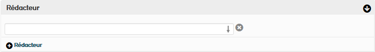

## 19/ Récolement

### A) Présentation et structure 

#### I) Déroulement des opérations 

Il est nécessaire de suivre plusieurs étapes pour réaliser un récolement informatisé des collections dans CollectiveAccess. 

1. Etablir une fiche Campagne de récolement  
2. Générer une fiche de récolement par objet récolé  
3. Suivi du récolement 
4. Générer le PV de récolement 

#### II) Vérifier le paramétrage  

- Interfaces de saisie :  
  - Des écrans de saisie spécifiques ont été configurés par idéesculture lors de l'installation de CollectiveAccess. 
  - il est possible de les modifier et de les organiser différemment depuis le menu Gérer > administration > interfaces de saisie 
  - Cliquer sur le bouton modifier de "Editeur de procédure Campagne/ récolement" puis sur le bouton modifier de chaque écran 

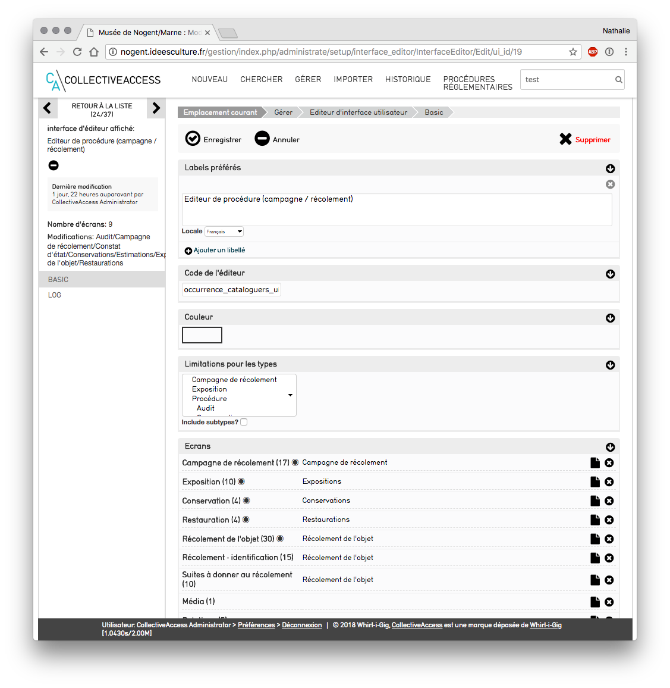

> Interface de saisie "Editeur de procédure 

- vérifier les préférences utilisateurs : il s'agit ici de vérifier que les grilles de saisies sont bien associées au type d'enregistrement  
  - Menu Gérer > Mes préférences > modification 
  - vérifier que les lignes "campagne de récolement", "récolement" soient associées à l'interface de saisie "Editeur de procédure Campagne / récolement" 

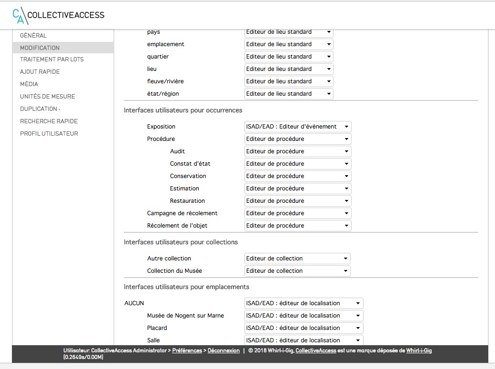

> Préférences utilisateurs 

### B) Saisie du récolement  

#### I) Création d'une campagne de récolement 

 **Menu Nouveau, Campagne de récolement**  

##### a) **Saisie** 

 Remplir les informations de description de la campagne 

- Nom : *ex : Campagne cartons à dessin* 
- Numéro : *ex campagne-1* 
- dates prévisionnelles de la campagne : *ex 2018-2024* 
- dates effectives  
- intervenant de la campagne : lien vers les personnes liées 
- contenu scientifique : *champ de description qui apparaitra dans le PV* 
- champs couverts : *champ de description qui apparaitra dans le PV* 
- méthode utilisée : *champ de description qui apparaitra dans le PV* 
- caractérisation de l'espace : *champ de description qui apparaitra dans le PV* 
- conditionnement des biens à récoler : *champ de description* 
- localisation : *emplacement lié* 
- Fiches de récolement liées : *le lien vers les fiches de récolement apparaîtra automatiquement lors de la génération des fiches.* 

##### b) **Rechercher une fiche campagne** 

- à tout moment, il est possible de revenir sur la fiche campagne pour la modifier et la compléter 
- en utilisant l'une des différentes possibilités de recherche  
  - recherche rapide 
  - recherche simple, avancée ou parcourir du menu "Chercher - Campagne" 
- saisir un mot du nom de la campagne ou l'identifiant  
  - saisie de l'identifiant en recherche rapide :on parvient directement sur la fiche campagne 
  - saisie d'un mot du nom en recherche rapide *ex dessin* : on obtient plusieurs résultats triés par type d'enregistrement (objet, entités....) 

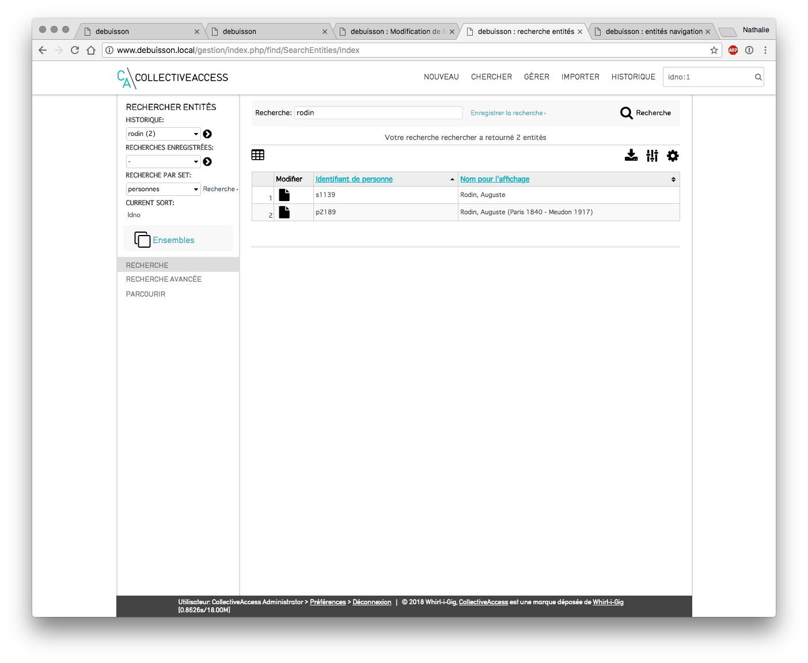

> Recherche rapide campagne 

- cliquer sur le bouton + de la ligne "occurrences" pour visualiser les résultats proposés ou sur "full result" (tous les résultats) 

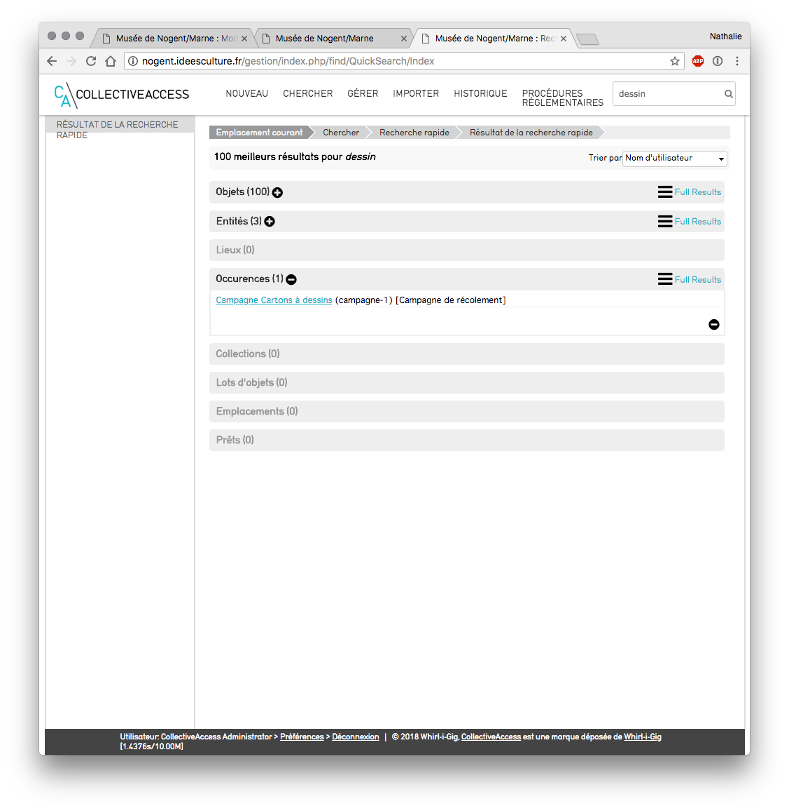

> Recherche rapide - bouton + déplié 

- cliquer sur le lien pour arriver en modification sur la fiche campagne *ex :"Campagne - Cartons à dessin"* 

#### II) Organisation des campagnes et génération du récolement 

##### a)  **Créer un ensemble d'objets à récoler** 

 Il s'agit ici de procéder petit à petit dans le récolement et de créer au fil de l'eau des ensembles d'objets à récoler *ex : tous les objets de la collection permanente ou de tel espace*  

- rechercher les objets souhaités  
- les placer dans un ensemble  
- possible de placer plusieurs recherches successives dans le même ensemble  

*NB : se reporter au support de cours "gestion des recherches" pour plus de précisions sur la gestion des recherches et des ensembles* 

##### b) **Récolement objet par objet**  

 **Suivi du récolement** 

- Menu Procédures réglementaires > Suivi du récolement  
- visualisation de toutes les campagnes de récolement reliées au récolement 

décennal en cours (ici 2014-2024) 

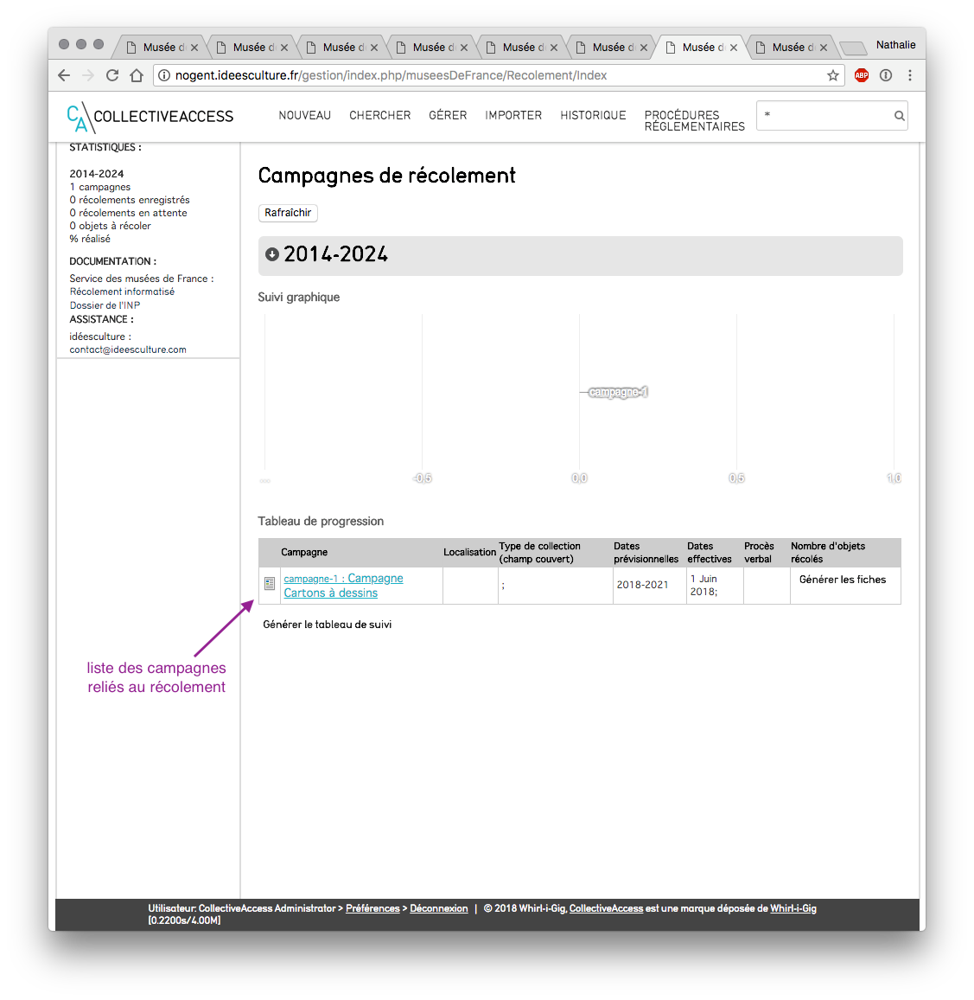

> Suivi du récolement  

- 2 parties 
- suivi graphique 
- tableau de progression des campagne 
- actions possibles 
- un clic sur bouton "page" : permet de modifier la fiche campagne  

 **Générer les fiches** 

- cliquer sur le bouton "générer les fiches" de la campagne 
- choisir un ensemble d'objet pour préparer le récolement dans la liste déroulante  

***Attention :\****tous les ensembles d'objets créés précédemment dans CollectiveAccess apparaissent.* 

- tous les ensembles d'objets effectués dans CollectiveAccess sont présents dans la liste 
- cliquer sur "soumettre" 

 **Attention : cette action ne peut être annulée** 

- une fiche de récolement est générée par objet présent dans l'ensemble 

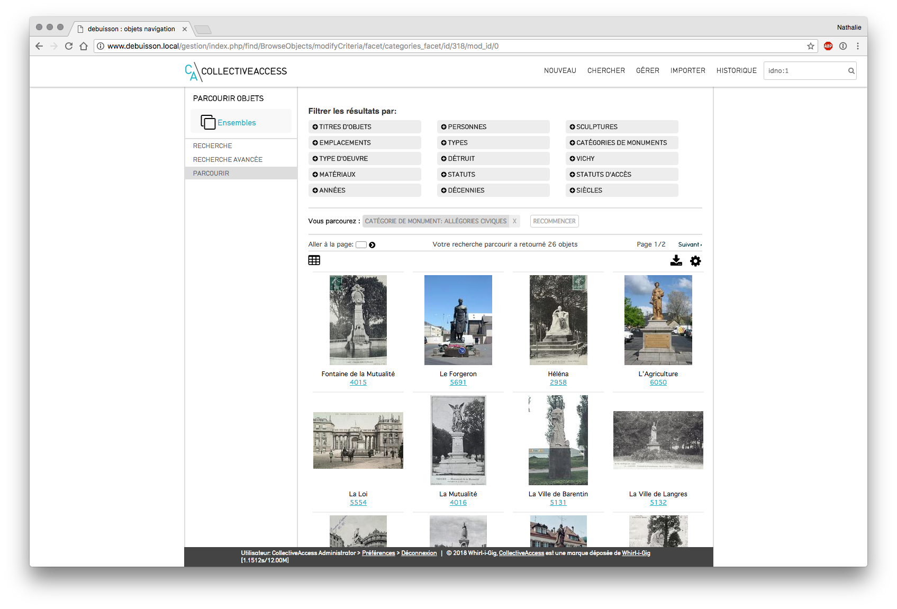

> Fiches de récolement générées 

#### III) Récolement d'un objet 

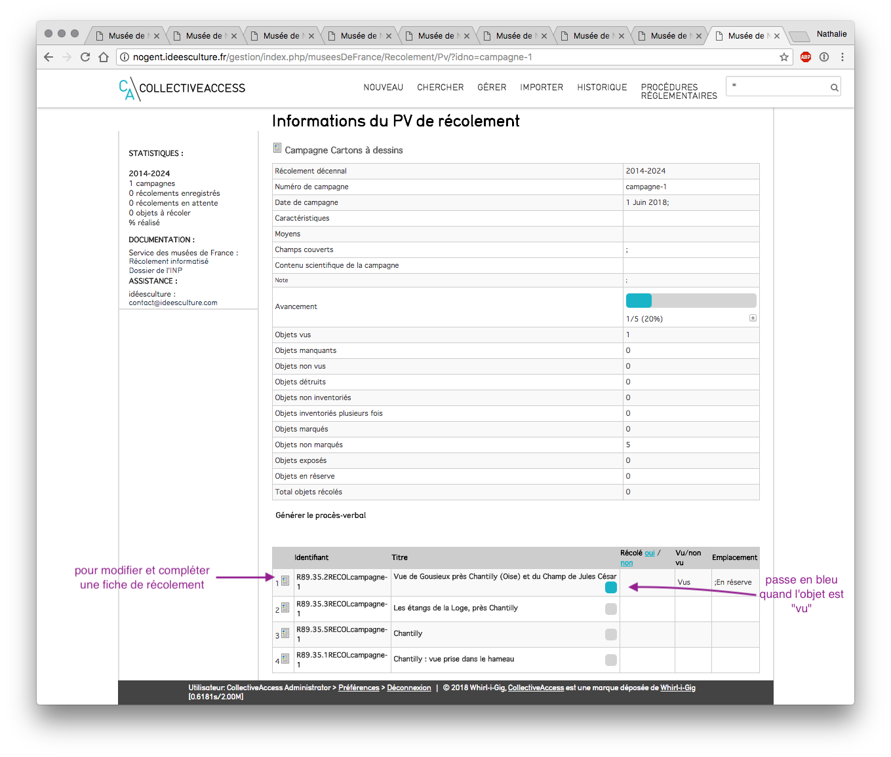

> Liste des fiches de récolement 

- cliquer sur le bouton "page" pour modifier 
- on arrive sur la fiche de récolement générée 

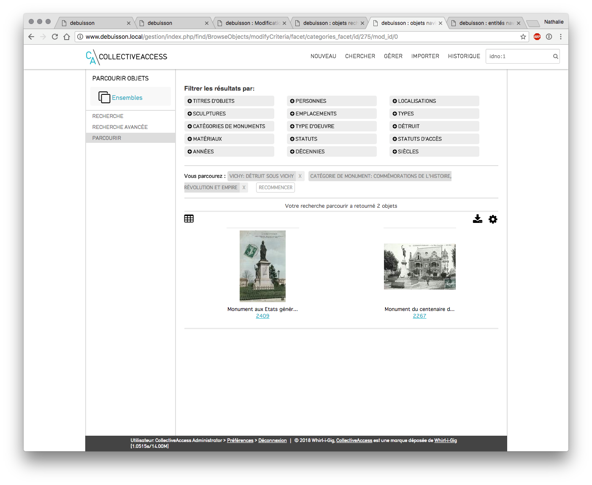

> Fiche de récolement 

- réitérer l'opération pour toutes les fiches récolement générées pour l'ensemble 
- pour ajouter un nouvel ensemble, cliquer sur le bouton plus de la barre de progression, zone "avancement" 

**Ecran "saisie du récolement"** 

- objet lié : lien créé *automatiquement* lors de la génération de la fiche 

- nom de l'objet récolé : reprise *automatiquement* du nom de l'objet 
- n° de fiche de récolement : généré *automatiquement* (construit de la manière suivante : n°inventaire de l'objetRECOLidendifiant de la campagne) 

Tous les champs qui suivent sont à remplir en fonction de l'objet que l'on récole, et selon les préconisations du Service des Musées de France 

- Photographie spécifique au récolement : associer ici une photographie de l'objet récolé, utile pour préciser / annoter le récolement 

**Attention :** au cas où l'on souhaiterait associer une image ou un média à la notice documentaire de l'objet : penser à le réaliser directement depuis la fiche de l'objet - écran Média 

*astuce : "clic droit ouvrir dans un nouvel onglet" sur le lien vers l'objet lié permet d'ouvrir la fiche de l'objet sans perdre la saisie de la fiche de récolement* 

- Photographie documentaire : cocher les cases 
- numéro de fiche du récolement précédent : remplir si info existante 
- présence du numéro d'inventaire : cocher la case 
- expertise du numéro d'inventaire : cocher les cases et préciser si besoin 
- présence d'un autre numéro : cocher la case et préciser si besoin 
- problème d'identification : cocher si oui 
- présence du bien dans le récolement précédent : cocher  
- présence du bien dans le récolement en cours : cocher la case (*alimentera le PV le suivi du récolement*) 
- date du précédent récolement : à remplir le cas échéant 
- date du récolement en cours : date du jour 
- localisation dans le précédent récolement : indiquer une date et sélectionner la localisation parmi la liste de choix proposés (liste définie par le Service des Musées de France) 
- localisation dans le récolement en cours : : indiquer une date et sélectionner la localisation parmi la liste de choix proposés (liste définie par le Service des Musées de France) 
- emplacement : emplacement de stockage de l'objet récolé 
- campagne liée : rempli automatiquement lors de la génération de la fiche 
- constat d'état : à compléter 
- objet inventorié plusieurs fois : cocher la case correspondante 
- conformité avec la source : : cocher la case correspondante 
- type et référence de la source : préciser la source 
- inscription : si des marques et inscriptions sont indiquées sur l'objet, les préciser ici 
- récoleur : lien vers les personnes liées 
- date de visualisation : date de visualisation de l'objet pour le récolement 
- date de validation  
- valideur : lien vers les personnes liées (peut être la même personne que le récoleur, selon la taille de l'équipe) 
- récolement fait : cocher oui quand le récolement de l'objet en question est terminé *alimente le PV*  

##### a) **Ecran Suites à donner au récolement**  

- Il s'agit ici de préciser toutes les opérations à effectuer ou non sur l'objet suite au récolement : 
  - la liste des objets concernés par des traitements pourra ensuite être retrouvée en recherche 
  - chaque indication se retrouve dans le PV de récolement et est comptabilisée 
- Liste des champs à compléter 
  - objet à identifier 
  - objet à inventorier 
  - objet à marquer 
  - objet à photographier 
  - objet à localiser 
  - objet à traiter 
  - objet à récoler ultérieurement 
  - notice documentaire à créer 
  - recherches complémentaires à poursuivre 
  - plainte à déposer 

**Ecran récolement - identification** 

- rappel de toutes les informations d'identifications de l'objet 

### C) Génération du PV de récolement  

Une fois que tous les objets ont été récolés, il s'agit de générer le PV de récolement afin de le transmettre. 

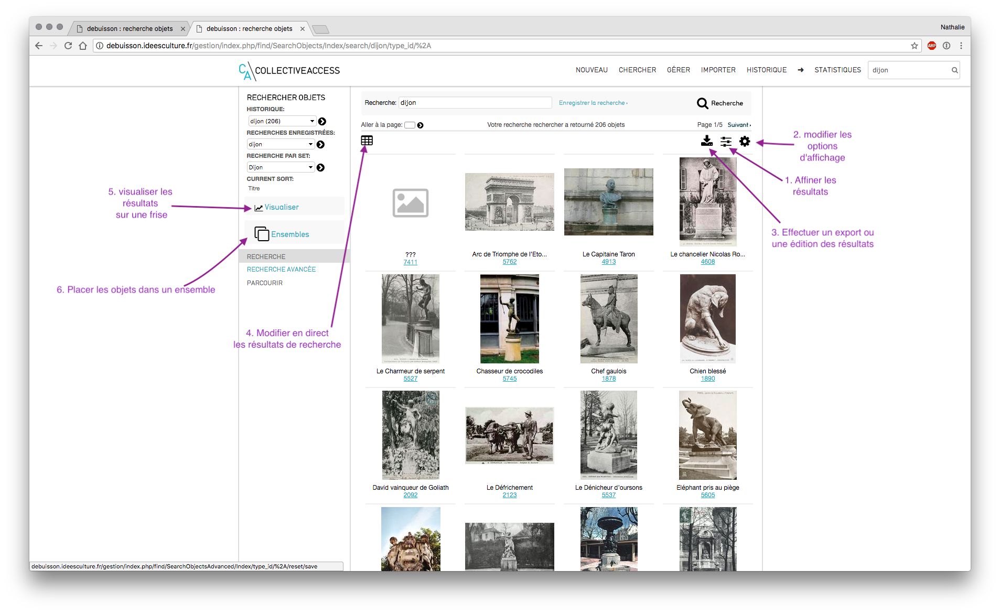

> Générer le PV 

- cliquer sur le bouton "Générer le procès-verbal de récolement" 
- cliquer sur "Télécharger" 
- les informations du PV sont : 
  - normalisées et stipulées par le Service des Musées de France 
  - reprises en partie de la fiche campagne 
  - calculées et générées automatiquement grâce aux informations indiquées dans les fiches récolement d'où l'importance de bien cocher les cases 
- possible de générer le PV à tout moment pour visualiser les informations 

*le PV est généré au format .docx et lisible sous Word ou Openoffice, le transformer ensuite en pdf pour le transmettre aux services compétents.*