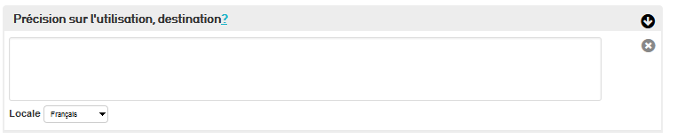
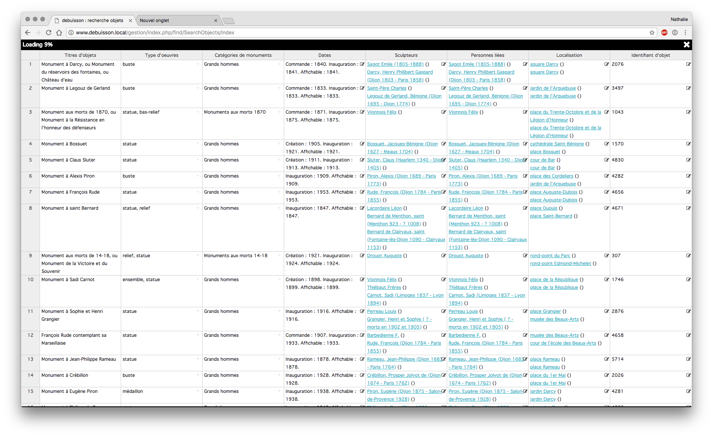
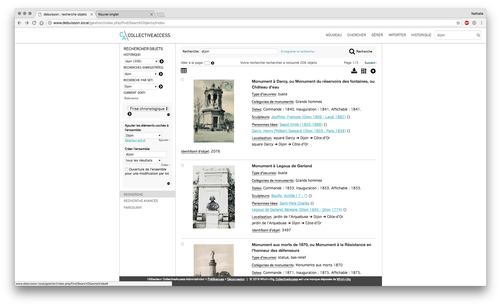

# **II. Catalogage et recherche des objets mobiliers dans CollectiveAccess**

Chaque mobilier/objet nécessite d'être catalogué (dans l'inventaire) suivant des normes bien spécifique en lien avec l'appellation Musée de France. Ces normes suivent un catalogage ordonné et réfléchi en 18 colonnes \[la « circulaire » de George-Henri Rivière\]. La première colonne débute par le numéro d'inventaire et continu jusqu'à finir par les observations. Dans ce chapitre je vais vous décrire chaque colonne et sous-champ des 18 colonnes, leurs correspondances dans CollectiveAccess et quelque exemple de leurs applications.

## **1/ Le numéro d'inventaire**

Il s'agit de l'une des colonnes les plus importantes pour un objet, car elle identifie clairement par un numéro l'objet. Ce numéro est obligatoire pour chaque objet, car il permet de le différencier, mais aussi de le faire entrer dans le domaine du bien public, c'est-à-dire qu'il devient propriété du musée. Il est indiqué dans l'objet par un marquage qui correspond au numéro de l'inventaire.

Ce numéro d'inventaire se retrouve bien entendu dans CollectiveAccess, notamment sur la page d'identification de l'objet.

## **2/ Mode d'acquisition**

Le champ indique comment le musée a acquis l'objet. Il est nécessaire dans un but juridique et historique de savoir comment l'objet a été acquis (notamment le problème de l'occupation allemande). Je vais vous faire une liste des principaux modes d'acquisitions :

Dans CollectiveAccess, on peut retrouver ce champ dans les statuts juridiques de l'œuvre.

## **3/ Nom du donateur, testateur, vendeur**

Ce champ permet d'indiquer la personne qui a donné/vendu l'objet, cela répond comme pour le mode d'acquisition à une volonté juridique et historique.

Dans CollectiveAccess, on peut retrouver ce champ dans la page statut juridique. On a la possibilité d'indiquer plusieurs donateurs/testateur/vendeurs.

## **4/ Date de l'acte d'acquisition et d'affectation**

Cette partie concerne encore l'aspect juridique et historique de l'objet. On y indique la date d'acquisition de l'objet sous le format
AAAA/MM/JJ, si elle n'est pas connue, on la déduite par la date d'entrée de l'objet dans la collection.

En ce qui concerner la date d'affectation, il s'agit du moment ou le musée place sous garde l'objet, contrairement à l'acte d'acquisition, le musée n'en est pas propriétaire.

On retrouve dans CollectiveAccess ces champs sur la page statut juridique, ce champ avec la date inversée.

## **5/ Avis des instances scientifiques**

Il s'agit de l'avis donné par une instance scientifique de l'acquisition/affectation d'un bien. Cela peu aller de favorable à
défavorable. Elle est indiquée par le sigle de l'instance.

Dans CollectiveAccess on retrouve ce champ dans Statut juridique, on peut y indiquer le sigle, la date, l'avis et même des commentaires.

## **6/ Prix d'achat et subvention de l'État**

Cette case indique le prix d'achat (soit tous les frais liés à l'achat) ou la valeur donnée par des experts du bien. Le prix ne peut être indiqué qu'en euros.

Concernant les mentions des concours publics, il s'agit d'indication « acquisition subventionnée/non subventionnée » à la fin du prix. Ils ne sont qu'utilisés pour les collections liées à des collectivités territoriales et des collections privées.

Dans le cas de CollectiveAccess, sur la page statut juridique, il y a un champ permettant d'indiquer le prix de l'objet. Il est possible d'entrer des devis étrangers qui seront directement transformés en euros en prenant en compte les variations des devis. On retrouve aussi en dessous un champ pour indiquer les mentions.

## **7/ Date d'inscription au registre**

Il s'agit de la date d'inscription à l'inventaire du bien. Cette inscription doit être effectuée l'année d'acquisition. Elle est
représentée en AAAA/MM/JJ.

Dans CollectiveAccess elle est ajoutée dès que l'objet est compilé dans un inventaire, il n'est donc pas nécessaire de la renseigner.

## **8/ Désignation du bien**

Il s'agit d'un champ qui permet de donner les principaux éléments du bien via son domaine, sa dénomination, son appellation et son titre.

### A/Domaine (catégorie du bien)

Le Domain désigne la nature du bien. Elle se compose en 4 grands types qui peuvent être mélangés pour un même objet :

Le support de conservation (sculpture, peinture, dessin)

L'utilisation (vie domestique, croyance-coutumes, funéraire)

Temporel/Civilisationnel/Géographie (Afrique, Romain, Antiquité)

Discipline (Archéologie, Ethnologie, Astronomie)

Sur CollectiveAccess, ce champ prend la forme d'arborescence pour renseigner le domaine, il y a la possibilité d'ajouter d'autre domaine.

### B/ Dénomination

Pour la dénomination, cela indique la nature première de l'objet qui ne peut pas figurer dans les domaines sauf pour les biens archéologiques dont la désignation est un matériau (exemple : silex).

Dans CollectiveAccess, ce champ se trouve dans « autres désignations » et autorise une entrée libre.

### C/ Appellation

Il s'agit de la dénomination dans une langue particulière ou un registre plus commun lié à l'objet.

Dans CollectiveAccess, ce champ se trouve dans « autres désignations » et autorise une entrée libre.

### D/ Titre

Il s'agit du titre de l'œuvre.

Dans CollectiveAccess, il porte le nom de Désignation principale, il s'agit d'une case de texte libre.

### E/ Représentation

Ce champ sert à donner les différentes informations liées aux représentations présentes sur l'iconographie du bien (personnages
représentés, année de mort et naissance, sources).

Sur CollectiveAccess, il n'y a pas réellement de champ pour indiquer cela. Cependant il est possible soit via la page média d'ajouter des informations sur une photo (Label préféré) et donc sur une photo d'une partie du bien.

### F/ Genèse

Il s'agit d'indiquer le contexte de création (concours), mais aussi son stade de création et reproduction (copie, moulage).

Dans CollectiveAccess on retrouve ce champ dans Contexte historique sous la forme d'un menu arborescent.

### G/ Objet(s) associe(s)

Il s'agit ici d'indiquer les objets ayant un lien avec le bien présenté.

On retrouve ce champ dans CollectiveAccess dans Contexte historique sous la forme d'une case de saisie libre.

### H/ Historique

Il s'agit d'un champ permettant de de préciser des éléments historiques liés au bien notamment le stade de création ou les objets en rapport. Il sert aussi a complètement à d'autres champs notamment Genèse, Période et Millésime de création/exécution, Lieu de création/exécution, et Lieu d'utilisation/destination.

Il se présente sur CollectiveAccess dans la section Contexte historique sous la forme d'une case de saisie libre.

## **9/ Marques et inscriptions**

Il s'agit là d'indiquer tous les types d'inscriptions, leurs natures et langues.

### A/ Les inscriptions

Il s'agit là d'indiquer ce qui est marqué, transcrire et indiquer l'emplacement de l'inscription et l'auteur.

En ce qui concerne CollectiveAccess, on retrouve cela dans la description du bien, on peut y entrer l'inscription, son type via une
menue arborescence, son emplacement, transcription et l'alphabet et langue.

### B/ Description

Il s'agit dans ce champ de décrire de manière formelle le bien.

Sur Collective Access ce champ se trouve dans Description du bien et se trouve être une case de saisie libre.

## **10/ Matière et matériaux**

Ce champ indique tous les types de matériaux et matière composant le bien. Un vocabulaire associé est mis à disposition par les musées de France. Les matériaux sont bien sûr rangés par catégorie. Ce champ est directement en lien avec le champ suivant portant sur les techniques.

Sur CollectiveAccess, ce champ se trouve dans Description du bien. On peut y entrer différents matériaux en saisie libre ou avec des catégories en pouvant bien sûr rajouter des lignes pour pouvoir entrer plus de matériaux.

## **11/ Technique de réalisation, de préparation, de fabrication**

Ce champ indique le technique utilisé, il est en lien direct avec la précédente catégorie, car il indique le technique utilisé sur un
matériau donné. Il est indiqué entre parenthèses à côté du matériau où la technique a été appliquée.

Dans CollectiveAccess, cette catégorie se trouve dans Description du Bien et peut être remplie soit en saisie libre soit via un menu arboré.

## **12/ Mesures**

Ce champ précise la mesure de l'objet, via plusieurs catégories de mesure allant du diamètre à l'épaisseur. Bien sûr, les mesures à prendre dépendent du type d'objet.

Dans CollectiveAccess, on retrouve cette catégorie dans Description du Bien. On peut y renseigner différentes tailles en saisie libre où via des champs prédéfinis.

## **13/ Signes particuliers**

Dans cette catégorie on indique les éléments particuliers de l'objet lors de son acquisition, donc les défauts, les manques et les
casses/fêlure.

On retrouve cette catégorie dans CollectiveAccess dans Description du Bien. On peut dans ce champ notamment la date, l'ajout de fichier ou encore des commentaires.

## **14/ Auteur ; collecteur, fabriquant, commanditaire...**

### A/Auteur, collecteur, fabricant, commanditaire

Dans ce champ on indique qui est la personne/entité qui a réalisé le bien ou trouvé.

On retrouve ce champ dans CollectiveAccess dans Identification. On peut y entrer en saisie libre le nom de l'auteur et crée une fiche de l'auteur qui sera enregistré dans CollectiveAccess.

### B/ Précisions sur l'auteur/exécutant/collecteur

Dans ce champ on précise des éléments pertinents liés à l'auteur/exécutant/collecteur.

Dans CollectiveAccess, lors de l'ajout d'un auteur, une fenêtre s'ouvrira si celui n'a pas était renseigner dans la base de données de CollectiveAccess. On pourra donc indiquer sur cette fenêtre tous les éléments importants liés à l'auteur.

### C/ École

Ce champ sert à indiquer l'école et donc l'ensemble artistique dont l'œuvre fait partie.

Dans CollectiveAccess on retrouve ce champ dans Identification. Il s'agit un menu arboré qui permet de renseigner l'école dont fait partie le bien.

## **15/ Époque, datation, date de récolte**

### A/ Anciennes attributions 

Il s'agit ici d'indiquer toutes les anciennes attributions qu'a eues l'œuvre (personnes ayant possédé l'œuvre)

On le retrouve sur CollectiveAccess dans Identification. Il s'agit là d'une case de saisie libre.

### B/ Période de création/exécution

Ce champ sert à indiquer la date de création ou exécution du bien en siècle ou millénaire.

On retrouve ce champ dans Identification sur CollectiveAccess, il permet via un menu arboré d'indiquer la date de création/exécution de l'objet.

### C/ Millésime de création/exécution

Ce champ permet d'indiquer l'année précise de création/exécution de l'œuvre.

On retrouve cela sur CollectiveAccess dans Identification. On peut y entrer en saisie libre l'année de création ou exécution.

### D/ Époque/Style/Mouvement

Ce champ permet d'indiquer à quels style, époque ou mouvement artistique appartient le bien. Il ne doit pas se substituer au champ de la période d'exécution/création.

On retrouve ce champ dans ColectiveAccess dans Identification. On peut y indiquer par un menu arboré l'époque/style ou encore le mouvement

### E/ Période d'utilisation/destination

Ce champ est identique à celui de Date de création/exécution sauf que l'on y indique la période d'utilisation ou de destination

Ils sont dans le même champ dans CollectiveAcess.

### F/ Millésime d'utilisation/destination

Même chose que pour le Millésime de création/exécution cependant concernant utilisation et la destination.

Ils sont dans le même champ dans CollectiveAcess.

### G/ Date de découverte/collecte/récolte

Il s'agit d'un champ qui indique la date de découverte, collecte ou récolte d'un bien. Elle doit être renseignée le plus précisément
possible. On n'y indique pas que la date, mais aussi d'autres informations comme le découvreur, des précisions sur la découverte et le numéro du site S.D.A (archéologie).

On retrouve ce champ dans Contexte historique. On peut y renseigner toutes les informations liées à ce champ du découvreur jusqu'à la date.

## **16/ Fonction d'usage**

### A/Utilisation/Destination

Ce champ sert à indiquer l'usage de l'objet.

On retrouve ce champ dans CollectiveAccess Contexte historique. On peut en utilisant un menu arboré renseigner l'utilisation de l'objet.

### B/ Précision sur l'utilisation/destination

Dans ce champ on précise son utilisation.

On retrouve ce champ dans CollectiveAccess Contexte historique. On peut y indiquer en saisie libre l'utilisation précise de l'objet.

## **17/ Provenance géographique**

Il s'agit d'une colonne qui permet de renseigner tous les éléments géographiques liés à l'œuvre de sa fabrication jusqu'à découverte.

### A/ Lieux de création/exécution

Dans ce champ on indique le lieu où le bien a été créé ou où il a été exécuté, avec entre parenthèses, précisé ce qui a était fait sur le lieu (lieu de création, etc.)

Dans CollectiveAccess on retrouve ce champ dans Contexte historique. On peut y renseigner en saisie libre le lieu de création/exécution.

### B/ Précision sur le lieu de création/exécution

Dans ce champ on indique tous les précisions jugées importantes à apporter en complément du lieu de création/exécution.

Dans CollectiveAccess on retrouve ce champ dans Contexte historique. On peut y renseigner en saisie libre le complément à apporter à lieu de création/exécution.

### C/ Géographie historique

Dans ce champ on précise les lieux déjà cités dans les catégories de ce chapitre même via des appellations anciennes.

Dans CollectiveAccess on retrouve ce champ dans Contexte historique. On peut y renseigner en saisie libre les noms anciens des lieux.

### D/ Lieux d'utilisation/destination

Même chose que pour Lieux de création/exécution, mais concernant l'utilisation/destination.

Même chose dans CollectiveAccess, il suffit de changer en utilisation/destination.

### E/ Précisions sur le(s) lieu(x) d'utilisation/destination

Il s'agit ici d'indiquer des informations supplémentaires à champs précédents.

On le retrouve sur CollectiveAccess au même endroit que le champ Précision sur le(s) lieu(x) de création/exécution.

### F/ Lieu de découverte/récolte/collecte

Même chose que pour Lieux de création/exécution, mais concernant la découverte/récolte/collecte.

Même chose dans CollectiveAccess, il suffit de changer en découverte/récolte/collecte.

### G/ Type de site de découverte/collecte/récolte

Il s'agit d'indique le type du site où à était trouvé l'œuvre.

Dans CollectiveAccess ce champ se trouve dans Contexte historique sous la forme d'un menu déroulant.

## **18/ Observations**

Il s'agit de la dernière colonne, elle permet de renseigner des éléments que n'entre pas dans les autres colonnes et qui sont important pour le bien.

### A/anciens numéros et autres numéros

Dans cette partie on renseigne tous les numéros anciens et autres du bien.

On retrouve cela dans CollectiveAccess dans Identification. On peut y entrer en saisie libre les anciens et autres numéros.

### B/ Ancienne appartenance

Dans ce champ on renseigne tous les anciennes appartenances du bien. Cela ne concerne que les bien technique ou scientifique.

Dans CollectiveAccess ce champ se trouve dans Contexte juridique. On peut y écrire en saisie libre les différents noms.

### C/ Dépôts/établissement dépositaire

Il s'agit de renseigner le dépôt actuel de l'objet.

Dans CollectiveAccess ce champ se trouve dans Statut juridique sous le nom d'établissement affectataire. C'est une case de saisie libre.

### D/ Commentaire

Ce champ sert à donner des informations importantes sur le bien qui n'ont pas pu être mis dans d'autres catégories.

On retrouve ce champ dans ColectiveAccess dans Infos complémentaires. On peut y écrire en saisie libre les commentaires sur le bien.

### E/ Crédit photographique

Comme le nom l'indique, il sert à renseigner le crédit de la photo de l'œuvre.

Ce champ se trouve sur CollectiveAccess dans Média, on peut y renseigner en saisie libre le crédit photographique.

### F/ Rédacteur de la notice

Il s'agit de la dernière ligne à remplir, il s'agit du nom et prénom(s) de la personne ayant rédiger la notice.

Sur CollectiveAccess ce champ se trouve dans Infos complémentaires et est sous la forme d'une case de saisie libre.

## **19/ Recherche**

Il y a 4 façons de rechercher des enregistrements dans CollectiveAccess : 

- la **recherche rapide (quicksearch)** : présente sur tous les écrans à l'aide d'une petite case de recherche (en haut à droite) 
- la **recherche simple** : au sein d'un même type d'enregistrement 
- la **recherche avancée** : croiser des critères et effectuer des recherches complexes 
- **parcourir** : navigation par lien au sein du catalogue 

### A/ La recherche rapide

> Recherche rapide 
>

- située sur le côté droit de la barre de navigation principale,  
- moyen le plus rapide pour rechercher parmi tous les enregistrements des collections. 
- recherche plein texte dans la base de données, et affiche les résultats en les regroupant par type d'enregistrements (objets, personnes, endroits, événements, collections, localisations et lots d'objets). 

La recherche plein texte "gambetta bordeaux" renvoie les objets, les personnes, les localisations ... contenant les mots "gambetta bordeaux" dans l'un des champs. 

Le résultat affiche tous les enregistrements contenant le mot ou la phrase saisie et sont classés par type d’enregistrement (objets, personnes, localisations…). 

> résultats recherche rapide 
>

- liste de tous les enregistrements avec leur nom et leur identifiant. 
- Pour afficher un objet en particulier, cliquer sur le lien. 

Une fois un enregistrement affiché, vous pouvez toujours revenir à votre résultat de recherche précédent, en cliquant sur le lien « Résultats » dans le coin supérieur gauche de l'écran de saisie.  

#### I) Effectuer une recherche précise via une recherche rapide

Possible d'effectuer une recherche très précise en indiquant le nom du champ dans lequel suivi de la valeur recherchée  

- ex : on souhaite rechercher l’objet dont l'identifiant est 2752 : idno:2752 
- on arrive alors directement sur la fiche concernée 

> Fiche Monument à Gambetta (2752) 
>

### B/ La recherche simple 

Pour effectuer une recherche simple : 

– menu Chercher : recherche ciblée dans un type d'enregistrement connu (objets, personnes, rangements, ... ) qui fournit une recherche plus encadrée que la recherche rapide. 

recherche simple au sein des objets 

- Menu Chercher > objets > recherche simple 

> Recherche simple parmi les "objets" 
>

- saisir les termes de sa recherche dans la case prévue à cet effet : 
- un ou plusieurs mots :  

  *ex : "gambetta bordeaux"* 

- utilisation de la troncature :  

stat* : le résultat obtenu donne tous les objets dont un des termes commence par stat (statue, statuaire,…) 

> Recherche simple avec troncature 
>

- effectuer une recherche précise avec le nom du champ suivi de la valeur recherchée. 

#### I) recherche simple au sein des Personnes 

- Menu Chercher > Personnes > recherche simple 
- saisir le nom recherché (ex : "Rodin") 

> Recherche simple personne 
>

### C/ La recherche avancée 

- Menu Chercher > Objets > Recherche avancée 
- sélectionner le formulaire souhaité dans le menu déroulant  
- recherche multi-critère à l'aide de champs présélectionnés,  

### D/ Astuces pour optimiser ses recherches 

#### I) Les opérateurs booléens et jokers 

Les recherches de bases (simples) ou avancées dans CollectiveAccess supportent les opérateurs booléens et les jokers (substitution de caractères, troncature). 

Pour utiliser les opérateurs booléens, il suffit d'ajouter les termes suivants (en majuscule) dans votre expression de recherche : 

- AND : permet de cibler la recherche d'enregistrements comprenant seulement les deux termes séparés par ET 
- OR : élargit la recherche en récupérant les enregistrements contenant les mots séparés par le OU. 
- NOT ou - : cible la recherche en éliminant un terme de la recherche (= SAUF) – () : les parenthèses permettent de combiner des mots. 
- ‘’ '' : les guillemets associent des termes pour créer une phrase, il s'agit -d'une recherche sur une chaîne de caractères. 
- \* : la troncature est symbolisée par l'astérisque : pour rechercher des termes tronqués. 
- compléter ensuite les valeurs souhaitées – cliquer sur le bouton « Rechercher » afin d’exécuter la requête. 
- le résultat s'affiche sous le formulaire de recherche.  

> Ex de recherche multi-critères 
>

*Pour une meilleure visibilité du résultat, vous pouvez masquer le formulaire de recherche en cliquant sur « masquer le formulaire de recherche » et sur « montrer le formulaire de recherche » pour l'afficher de nouveau.* 

### E) Historique des recherches 

Historique 

- colonne de gauche, menu déroulant sous "historique" 
- sélectionner la recherche à exécuter de nouveau 
- les résultats de la recherche sélectionnée s'affichent également automatiquement sous le menu « Historique » (ce menu s'affiche dès qu'une recherche a été exécutée) 

### F) Enregistrer les recherches effectuées 

Depuis les interfaces de recherche simple ou de recherche avancée, possible de sauvegarder la requête afin de la réitérer quand on le souhaite. 

- en recherche simple : bouton « Enregistrer la recherche » 
- en recherche avancée : bouton « Sauver la recherche sous » 

Vous la retrouvez ensuite dans la colonne de gauche au sein d’une liste déroulante sous « recherches enregistrées ». 

> Liste des recherches enregistrées 
>

### G) La navigation par facettes ou le Menu Parcourir 

- Chercher > Objets > Parcourir : naviguer et affiner ses recherches parmi les enregistrements de la base. 

*NB : Les facettes disponibles sont entièrement paramétrables et dépendent des métadonnées saisies dans les objets de la base* 

- titres 
- collections 
- images liées 
- types d'objets : archives, monographies, périodiques, objets... 
- personnes liées 
- années, décennies 
- statuts d'accès (accessibles au public, restreint…)  
- catégories de monuments
- matériaux... 

*Toute facette souhaitée peut être ajoutée : nous contacter*  help@ideesculture.com

> Navigation par facettes 
>

- Choisir un terme à partir de la fenêtre de navigation : tous les enregistrements associés apparaîtront. Ex : clic sur une catégorie de monument) 

> Résultats navigation par facettes 
>

- Du plus général au plus précis : affiner la recherche en cliquant sur une autre facette et ainsi de suite  

> Navigation multi-facettes 
>

- Pour modifier ou supprimer le filtre, cliquer sur le pictogramme X et sélectionner une nouvelle facette. 

### H) Actions possibles depuis un résultat de recherche 

> Description des actions possibles 
>

1. Affiner les résultats grâce aux facettes disponibles  
2. Modifier les Options d'affichage 
3. Effectuer un export ou une édition des résultats 
4. Modifier en direct les résultats de recherche sans rentrer en édition 
5. Visualiser les résultats sur une frise 
6. Placer les objets dans un ensemble 

#### I) Affiner les résultats

- pictogramme "affiner les résultats" : pour filtrer les résultats obtenus 

 *NB : on retrouve la même liste de facettes que celle proposée dans Chercher > Objets > Parcourir* 

> Affiner les résultats 
>

- utilisation des facettes de manière successive et sans limite de cumul, à l'aide de facettes. 
- ex : facette "média" avec clic sur "média lié" puis facette "décennie" avec clic sur 

"1980s" 

Facette Média 

> Résultat obtenu avec facette média lié puis décennie 1850s 
>

#### II) Affichage et tri des résultats 

> Fenêtre Options d'affichage 
>

- Pictogramme Options d’affichage : ajuster les paramètres de tri, de mise en page et les formats d’affichages des résultats. 
- modification possible du nb de résultats affichés par page 

##### a) **Formats d’affichages** 

- menu déroulant propose au choix plusieurs formats d’affichages 
- *Ces affichages sont créés et modifiés dans Gérer > Mes affichages (cf. Support de cours* *"Gestion des affichages"* )

- en fonction de l'affichage et de la mise en page sélectionnée : les données affichées pour les résultats seront différentes 

##### b) **Tri** 

- Par défaut, résultats de la recherche triés par pertinence.  
- La plupart des métadonnées présentes lors la saisie d’un objet sont proposées au tri : identifiant, date… 
- tri croissant (de A à Z) ou décroissant (de Zà A) 

*NB : un clic sur l’en-tête des colonnes du résultat de recherches modifie le tri des résultats, avec une mise en page liste ou modifiable.* 

##### c) **Mise en page** 

- **vignettes** : les résultats sont affichés sous forme de planches de vignettes 

> Affichage vignettes 
>

- **rempli** : mise en page type « cartel » contenant la vignette du média rattaché ainsi que tous les champs remplis de l'affichage sélectionné 

> Affichage rempli 
>

- **liste** : mise en page des résultat sous forme de liste, en colonne, triés selon le tri sélectionné, avec les champs présents dans le format d’affichage choisi 

> Affichage liste 

#### III) Effectuer un export ou une édition des résultats 

- pictogramme outils d'export / édition 
- imprimer les étiquettes des résultats : format cartel, paramétrable 
- télécharger les résultats en tant que  
- format txt (délimité par des tabulation) 
- format csv 
- format xls 
- format docx 
- format pdf avec des vignettes ou sans vignettes 

 *NB : les données exportées pour l'ensemble des résultats ou les résultats sélectionnés sont fonction du format d'affichage choisi au préalable.* 

- télécharger le média : télécharger un zip de tous les médias liés aux éléments du résultat de recherche en taille originale, moyenne, petite. 

#### IV) Modifier en direct les résultats de recherche sans rentrer en édition 

- pictogramme tableur 
- affichage des résultats (en fonction du format d'affichage précédemment choisi) sous forme tableur  
- possibilité de modifier les valeurs directement depuis ce tableau 

- fermer le tableau en cliquant sur le bouton **X** en haut à droite 

*Très utile notamment pour corriger des erreurs de saisie rapidement* 

> Modification en direct d'un résultat de recherche 

#### V) Visualiser les résultats sur une frise 

- cliquer sur le bouton "Visualiser" 
- puis sur la flèche face à "frise chronologique" pour valider 
- on visualise les objets en fonction de leur date, sur une frise chronologique 

>  Frise chronologique 

#### VI) Placer les objets dans un ensemble 

- pictogramme Ensembles 
- ajouter les éléments cochés à un ensemble existant en le sélectionnant dans la liste

*NB : chaque utilisateur ne visualise que les ensembles auxquels il a le droit d'accéder : ceux qu'il a lui même créés et ceux auxquels les autres utilisateurs lui ont donné accès.* 

- créer l'ensemble : avec tous les résultats ou les résultats cochés 

 *NB : attention quand on navigue d'une page à l'autre des résultats de recherche, la sélection ne peut perte conservée en mémoire par le navigateur : penser à ajouter les résultats cochés page par page à l'ensemble.* 

> Ajouter les résultats à un ensemble 

**Pour aller plus loin :** support de cours "gestion des ensembles et traitements par lots"

### I/  Entrer en modification / saisie d'un objet 

-  clic sur un média attaché à un objet "quicklook" : visionneuse d'image : zoom, annotation... 

> Visionneuse 

- clic sur un objet (lien ou image si affichage "vignettes") : on arrive dans l'interface de saisie / modification d'objet 

>  Modification d'objet 

*NB: l'écran d'arrivée dépend du paramétrage mis en place* 