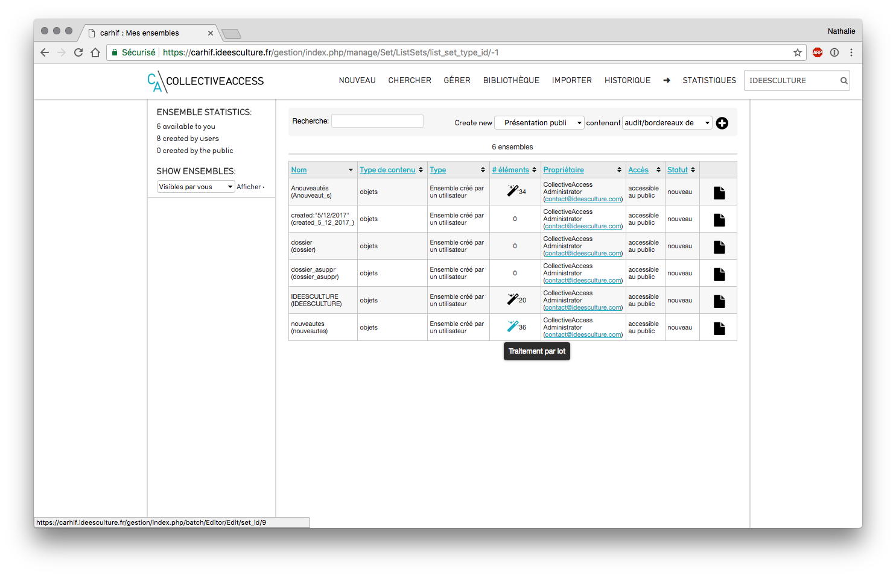
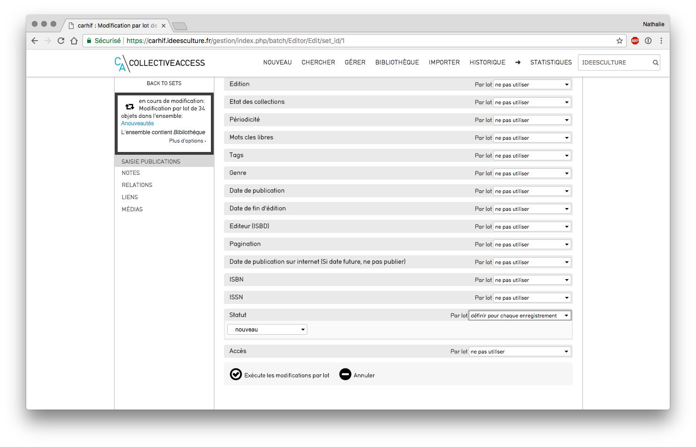

# Effectuer un traitement par lots
*Ce support est un support générique créé avec des copies d'écran réalisées à partir de l'installation du CARHIF.*
**Attention : **un traitement en lot n'est pas anodin, nous vous conseillons de vérifier les éléments présents dans l'ensemble et de conserver celui-ci quelques jours après l'exécution du traitement.
## Pourquoi effectuer un traitement par lot ?
Les traitements par lots s'appliquent pour un ensemble d'éléments.
Nous listons ci-après plusieurs exemples d'applications (liste non exhaustive) :
- modifier le statut d'un ensemble d'objets : ex : nouveautés
- changer la localisation de stockage
- modifier l'accessibilité en ligne des éléments de l'ensemble
- affecter une collection, une entité, un lieu, un emplacement de stockage, à un ensemble d'objets...
## Rechercher tous les objets concernés 
Effectuer une recherche dans CollectiveAccess via l'une des possibilités de recherche explicitées dans le support **CollectiveAccess - gestion des recherches**
- ex chercher > objets > parcourir
- cliquer sur une facette (ici "tags") 

Recherche "Parcourir"
## Placer les objets dans un ensemble 
- cliquer sur le bouton "ensemble" (à gauche)
dans la case "créer l'ensemble", lui donner un nom, et cliquer sur créer

Placer les objets du résultat obtenu dans l'ensemble
- pour ajouter un autre résultat de recherche à l'ensemble : effectuer une nouvelle recherche et placer tous les résultats ou uniquement les résultats cochés dans l'ensemble

Ajout d'éléments à un ensemble existant
## Effectuer le traitement par lot
- retrouver l'ensemble dans Gérer > mes ensembles
*NB : cette liste est différente selon les droits de chacun, par défaut chaque utilisateur ne voit que les ensembles qu'il a créé.*

Liste des ensembles
###  Vérifier les éléments présents dans l'ensemble 
- cliquer sur le bouton "modifier" sur la ligne de l'ensemble
- Ecran Information basique
	- modifier le nom
	- le rendre accessible à un utilisateur ou un groupe d'utilisateur : modifier le champ "accès utilisateur" ou "contrôle d'accès par groupe" (ex : indiquer "administrateur" : tous les utilisateurs appartenant au groupe "administrateurs" auront accès à l'ensemble

Ensemble : écran informations basiques
- Ecran Items : permet de visualiser tous les éléments ajoutés à l'ensemble
	- retirer un élément de l'ensemble : cliquer sur la croix présente sur la ligne
	- ajouter un élément à l'ensemble : rechercher son identifiant ou son nom dans la case de recherche 
	- effectuer un export pdf de l'ensemble : cliquer sur la flèche dans "export pdf" (en haut à droite)

Ensemble : écran items
### Effectuer le traitement en lot
- cliquer sur le bouton "traitement par lot" (pictogramme baguette magique) de la ligne de l'ensemble 
- se placer dans l'écran de saisie contenant les infos à modifier (ici : "saisie publications"

Écran de sélection
- se placer sur le champ à modifier (ex : statut)
- sélectionner "définir pour chaque enregistrement" dans le menu déroulant "par lot" 
- sélectionner la valeur à appliquer dans le menu déroulant proposé

Saisie de la valeur à modifier 
- cliquer sur "exécute les modifications par lot"

Compte-rendu de l'opération
## Pour aller plus loin : détail des possibilités de traitements en lots
### Traitements possibles sur un champ
- sur les champs systèmes (identifiant, emplacement dans la hiérarchie, accès, statut), seules 2 possibilités de sélection :
	- ne pas utiliser : valeur par défaut appliquée à chaque champ
	- définir pour chaque enregistrement : imposer une valeur pour l'ensemble des objets
- sur tous les autres champs :
	- ne pas utiliser : valeur par défaut appliquée à chaque champ
	- ajouter à chaque élément : ajoute la valeur indiquée à chaque élément, si le champ est répétable, cette valeur viendra augmenter celles éventuellement déjà présentes 
	- valeur de remplacement : remplace la valeur déjà présente par celle indiquée ici 
	- retirer toutes les valeurs : supprime toutes les valeurs présente(s) pour ce champ dans tous les éléments de l'ensemble
		***Attention*: ***si le champ est répétable toutes les valeurs seront supprimées*
### Modifier le type d'objets
**Attention : modifier le type pour un objet ou un semble d'objets n'est pas anodin : **
**toutes les valeurs présentes dans les champs autorisés pour le type d'objets d'origine et non autorisés pour le type d'objets d'arrivée seront supprimées **
- cliquer sur les doubles flèches "modifier le type" (en haut à gauche)
- sélectionner le type d'objet souhaité dans le menu déroulant proposé
- cocher "traitement en arrière plan" si le nb d'objets contenus dans l'ensemble est important : le traitement n'empêchera pas ainsi de continuer à travailler dans CollectiveAccess
- cliquer sur "enregistrer"

Traitements en lots : changer le type d'objet
### Suppression en lots
**Attention : ce traitement est dangereux et vous permet de supprimer tous les éléments de l'ensemble.**
 **Bien vérifier le contenu de l'ensemble et le nb d'éléments en amont.**
*NB : si l'ensemble est volumineux, la suppression en lot peut prendre beaucoup de temps*
- dans l'encadré résumant l'ensemble (en haut à gauche - au dessus des écrans listés) : cliquer sur plus d'options
- cliquer sur "supprimer tous les enregistrements de cet ensemble
- cliquer sur "supprimer" en face de l'alerte en rouge "Vraiment, complètement, totalement supprimer TOUS les enregistrements dans ..." 

Traitements en lots : suppression en lot - bombe
