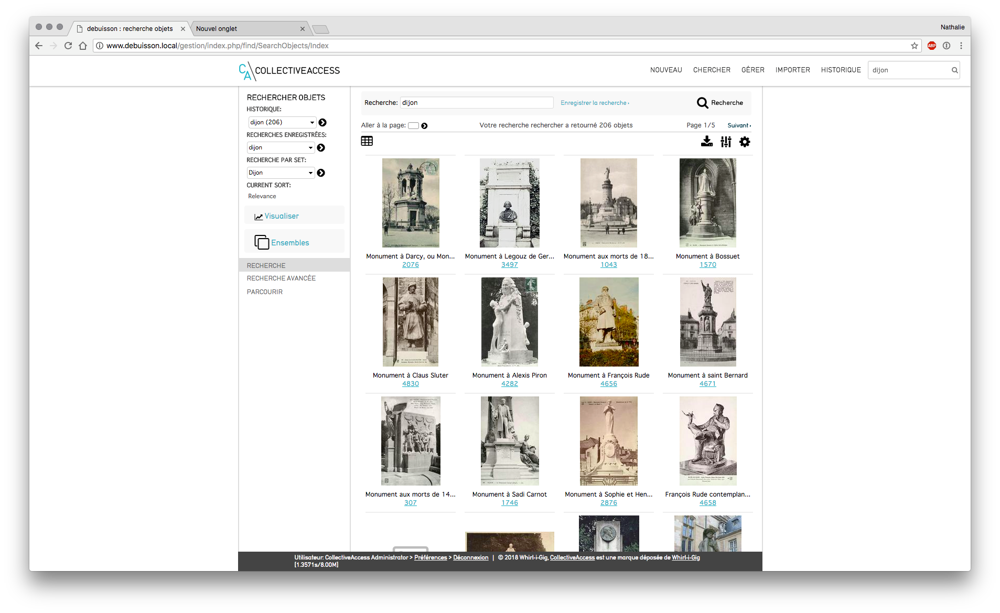

## **1/ Recherche**

Il y a 4 façons de rechercher des enregistrements dans CollectiveAccess : 

- la **recherche rapide (quicksearch)** : présente sur tous les écrans à l'aide d'une petite case de recherche (en haut à droite) 
- la **recherche simple** : au sein d'un même type d'enregistrement 
- la **recherche avancée** : croiser des critères et effectuer des recherches complexes 
- **parcourir** : navigation par lien au sein du catalogue 

### A) La recherche rapide

> Recherche rapide 
>

- située sur le côté droit de la barre de navigation principale,  
- moyen le plus rapide pour rechercher parmi tous les enregistrements des collections. 
- recherche plein texte dans la base de données, et affiche les résultats en les regroupant par type d'enregistrements (objets, personnes, endroits, événements, collections, localisations et lots d'objets). 

La recherche plein texte "gambetta bordeaux" renvoie les objets, les personnes, les localisations ... contenant les mots "gambetta bordeaux" dans l'un des champs. 

Le résultat affiche tous les enregistrements contenant le mot ou la phrase saisie et sont classés par type d’enregistrement (objets, personnes, localisations…). 

> résultats recherche rapide 
>

- liste de tous les enregistrements avec leur nom et leur identifiant. 
- Pour afficher un objet en particulier, cliquer sur le lien. 

Une fois un enregistrement affiché, vous pouvez toujours revenir à votre résultat de recherche précédent, en cliquant sur le lien « Résultats » dans le coin supérieur gauche de l'écran de saisie.  

#### I) Effectuer une recherche précise via une recherche rapide

Possible d'effectuer une recherche très précise en indiquant le nom du champ dans lequel suivi de la valeur recherchée  

- ex : on souhaite rechercher l’objet dont l'identifiant est 2752 : idno:2752 
- on arrive alors directement sur la fiche concernée 

> Fiche Monument à Gambetta (2752) 
>

### B) La recherche simple 

Pour effectuer une recherche simple : 

– menu Chercher : recherche ciblée dans un type d'enregistrement connu (objets, personnes, rangements, ... ) qui fournit une recherche plus encadrée que la recherche rapide. 

recherche simple au sein des objets 

- Menu Chercher > objets > recherche simple 

> Recherche simple parmi les "objets" 
>

- saisir les termes de sa recherche dans la case prévue à cet effet : 
- un ou plusieurs mots :  

  *ex : "gambetta bordeaux"* 

- utilisation de la troncature :  

stat* : le résultat obtenu donne tous les objets dont un des termes commence par stat (statue, statuaire,…) 

> Recherche simple avec troncature 
>

- effectuer une recherche précise avec le nom du champ suivi de la valeur recherchée. 

#### I) recherche simple au sein des Personnes 

- Menu Chercher > Personnes > recherche simple 
- saisir le nom recherché (ex : "Rodin") 

> Recherche simple personne 
>

### C) La recherche avancée 

- Menu Chercher > Objets > Recherche avancée 
- sélectionner le formulaire souhaité dans le menu déroulant  
- recherche multi-critère à l'aide de champs présélectionnés,  

### D) Astuces pour optimiser ses recherches 

#### I) Les opérateurs booléens et jokers 

Les recherches de bases (simples) ou avancées dans CollectiveAccess supportent les opérateurs booléens et les jokers (substitution de caractères, troncature). 

Pour utiliser les opérateurs booléens, il suffit d'ajouter les termes suivants (en majuscule) dans votre expression de recherche : 

- AND : permet de cibler la recherche d'enregistrements comprenant seulement les deux termes séparés par ET 
- OR : élargit la recherche en récupérant les enregistrements contenant les mots séparés par le OU. 
- NOT ou - : cible la recherche en éliminant un terme de la recherche (= SAUF) – () : les parenthèses permettent de combiner des mots. 
- ‘’ '' : les guillemets associent des termes pour créer une phrase, il s'agit -d'une recherche sur une chaîne de caractères. 
- \* : la troncature est symbolisée par l'astérisque : pour rechercher des termes tronqués. 
- compléter ensuite les valeurs souhaitées – cliquer sur le bouton « Rechercher » afin d’exécuter la requête. 
- le résultat s'affiche sous le formulaire de recherche.  

> Ex de recherche multi-critères 
>

*Pour une meilleure visibilité du résultat, vous pouvez masquer le formulaire de recherche en cliquant sur « masquer le formulaire de recherche » et sur « montrer le formulaire de recherche » pour l'afficher de nouveau.* 

### E) Historique des recherches 

Historique 

- colonne de gauche, menu déroulant sous "historique" 
- sélectionner la recherche à exécuter de nouveau 
- les résultats de la recherche sélectionnée s'affichent également automatiquement sous le menu « Historique » (ce menu s'affiche dès qu'une recherche a été exécutée) 

### F) Enregistrer les recherches effectuées 

Depuis les interfaces de recherche simple ou de recherche avancée, possible de sauvegarder la requête afin de la réitérer quand on le souhaite. 

- en recherche simple : bouton « Enregistrer la recherche » 
- en recherche avancée : bouton « Sauver la recherche sous » 

Vous la retrouvez ensuite dans la colonne de gauche au sein d’une liste déroulante sous « recherches enregistrées ». 

> Liste des recherches enregistrées 
>

### G) La navigation par facettes ou le Menu Parcourir 

- Chercher > Objets > Parcourir : naviguer et affiner ses recherches parmi les enregistrements de la base. 

*NB : Les facettes disponibles sont entièrement paramétrables et dépendent des métadonnées saisies dans les objets de la base* 

- titres 
- collections 
- images liées 
- types d'objets : archives, monographies, périodiques, objets... 
- personnes liées 
- années, décennies 
- statuts d'accès (accessibles au public, restreint…)  
- catégories de monuments
- matériaux... 

*Toute facette souhaitée peut être ajoutée : nous contacter*  help@ideesculture.com

> Navigation par facettes 
>

- Choisir un terme à partir de la fenêtre de navigation : tous les enregistrements associés apparaîtront. Ex : clic sur une catégorie de monument) 

> Résultats navigation par facettes 
>

- Du plus général au plus précis : affiner la recherche en cliquant sur une autre facette et ainsi de suite  

> Navigation multi-facettes 
>

- Pour modifier ou supprimer le filtre, cliquer sur le pictogramme X et sélectionner une nouvelle facette. 

### H) Actions possibles depuis un résultat de recherche 

> Description des actions possibles 
>

1. Affiner les résultats grâce aux facettes disponibles  
2. Modifier les Options d'affichage 
3. Effectuer un export ou une édition des résultats 
4. Modifier en direct les résultats de recherche sans rentrer en édition 
5. Visualiser les résultats sur une frise 
6. Placer les objets dans un ensemble 

#### I) Affiner les résultats

- pictogramme "affiner les résultats" : pour filtrer les résultats obtenus 

 *NB : on retrouve la même liste de facettes que celle proposée dans Chercher > Objets > Parcourir* 

> Affiner les résultats 
>

- utilisation des facettes de manière successive et sans limite de cumul, à l'aide de facettes. 
- ex : facette "média" avec clic sur "média lié" puis facette "décennie" avec clic sur 

"1980s" 

Facette Média 

> Résultat obtenu avec facette média lié puis décennie 1850s 
>

#### II) Affichage et tri des résultats 

> Fenêtre Options d'affichage 
>

- Pictogramme Options d’affichage : ajuster les paramètres de tri, de mise en page et les formats d’affichages des résultats. 
- modification possible du nb de résultats affichés par page 

##### a) **Formats d’affichages** 

- menu déroulant propose au choix plusieurs formats d’affichages 
- *Ces affichages sont créés et modifiés dans Gérer > Mes affichages (cf. Support de cours* *"Gestion des affichages"* )

- en fonction de l'affichage et de la mise en page sélectionnée : les données affichées pour les résultats seront différentes 

##### b) **Tri** 

- Par défaut, résultats de la recherche triés par pertinence.  
- La plupart des métadonnées présentes lors la saisie d’un objet sont proposées au tri : identifiant, date… 
- tri croissant (de A à Z) ou décroissant (de Zà A) 

*NB : un clic sur l’en-tête des colonnes du résultat de recherches modifie le tri des résultats, avec une mise en page liste ou modifiable.* 

##### c) **Mise en page** 

- **vignettes** : les résultats sont affichés sous forme de planches de vignettes 

> Affichage vignettes 
>

- **rempli** : mise en page type « cartel » contenant la vignette du média rattaché ainsi que tous les champs remplis de l'affichage sélectionné 

> Affichage rempli 
>

- **liste** : mise en page des résultat sous forme de liste, en colonne, triés selon le tri sélectionné, avec les champs présents dans le format d’affichage choisi 

> Affichage liste 

#### III) Effectuer un export ou une édition des résultats 

- pictogramme outils d'export / édition 
- imprimer les étiquettes des résultats : format cartel, paramétrable 
- télécharger les résultats en tant que  
  - format txt (délimité par des tabulation) 
  - format csv 
  - format xls 
  - format docx 
  - format pdf avec des vignettes ou sans vignettes 

 *NB : les données exportées pour l'ensemble des résultats ou les résultats sélectionnés sont fonction du format d'affichage choisi au préalable.* 

- télécharger le média : télécharger un zip de tous les médias liés aux éléments du résultat de recherche en taille originale, moyenne, petite. 

#### IV) Modifier en direct les résultats de recherche sans rentrer en édition 

- pictogramme tableur 
- affichage des résultats (en fonction du format d'affichage précédemment choisi) sous forme tableur  
- possibilité de modifier les valeurs directement depuis ce tableau 

- fermer le tableau en cliquant sur le bouton **X** en haut à droite 

*Très utile notamment pour corriger des erreurs de saisie rapidement* 

> Modification en direct d'un résultat de recherche 

#### V) Visualiser les résultats sur une frise 

- cliquer sur le bouton "Visualiser" 
- puis sur la flèche face à "frise chronologique" pour valider 
- on visualise les objets en fonction de leur date, sur une frise chronologique 

>  Frise chronologique 

#### VI) Placer les objets dans un ensemble 

- pictogramme Ensembles 
- ajouter les éléments cochés à un ensemble existant en le sélectionnant dans la liste

*NB : chaque utilisateur ne visualise que les ensembles auxquels il a le droit d'accéder : ceux qu'il a lui même créés et ceux auxquels les autres utilisateurs lui ont donné accès.* 

- créer l'ensemble : avec tous les résultats ou les résultats cochés 

 *NB : attention quand on navigue d'une page à l'autre des résultats de recherche, la sélection ne peut perte conservée en mémoire par le navigateur : penser à ajouter les résultats cochés page par page à l'ensemble.* 

> Ajouter les résultats à un ensemble 

**Pour aller plus loin :** support de cours "gestion des ensembles et traitements par lots"

### I/  Entrer en modification / saisie d'un objet 

-  clic sur un média attaché à un objet "quicklook" : visionneuse d'image : zoom, annotation... 

> Visionneuse 

- clic sur un objet (lien ou image si affichage "vignettes") : on arrive dans l'interface de saisie / modification d'objet 

>  Modification d'objet 

*NB: l'écran d'arrivée dépend du paramétrage mis en place* 

