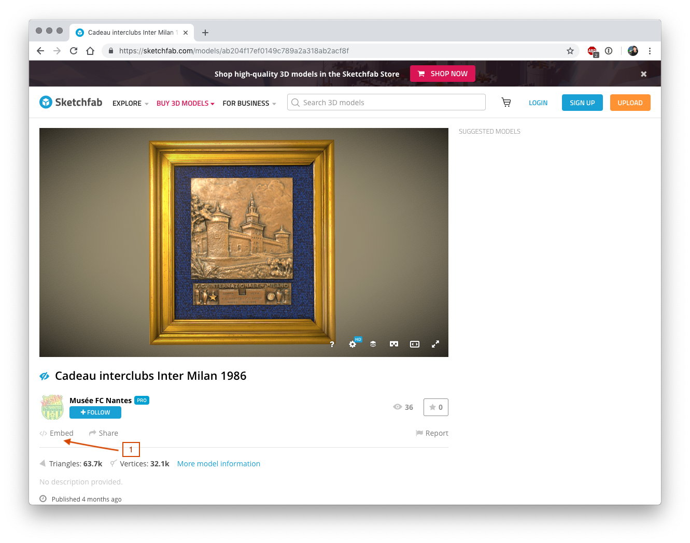
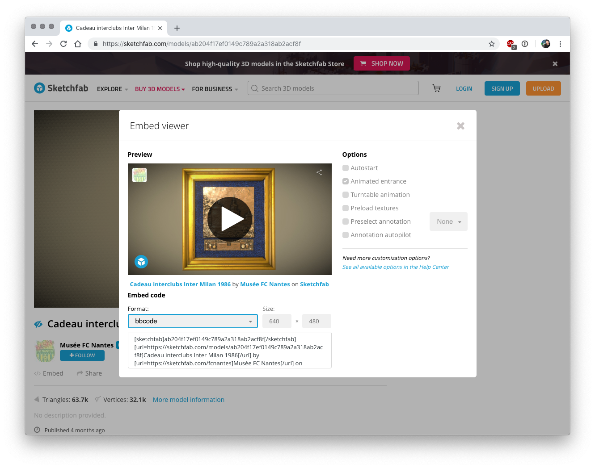
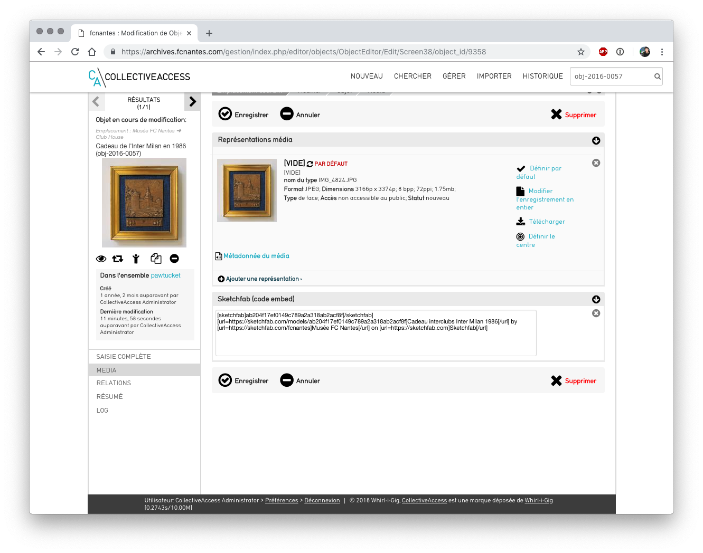

# FC Nantes : ajout d'un objet modélisé à Providence
## Modélisation Sketchfab
Opération à réaliser suite à la modélisation de l'objet sur Sketchfab.
###  cliquer sur le bouton **</> Embed** sous l'objet modélisé

Bouton Embed
###  Menu déroulant **Format** : sélectionner **bbcode**

Code bbcode
### Copier le code 
un clic dans la case et l'action de copier est réalisée

## Ajout du code dans la fiche de l'objet
*  Dans Providence, rechercher l'objet concerné, ex : obj-2016-0057
* Aller dans l'écran **Médias**
* Coller le code copié précédemment dans le champ **Sketchfab (code embed)**

Ecran Médias, champ Sketchfab
