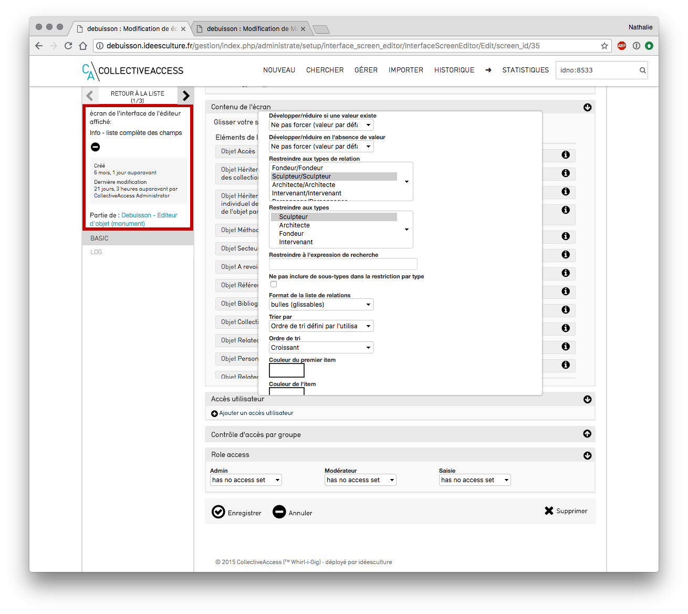

# CollectiveAccess -Paramétrage des  grilles de saisie
*Menu Gérer > Administration > Interfaces utilisateurs*

Liste des grilles de saisie
- cliquer sur le bouton "modifier"  de la grille de saisie à modifier / compléter
## Ajouter un nouvel écran
- cliquer sur le bouton "ajouter un écran"
- saisir un libellé
- enregistrer

Ajouter un écran
## Modifier un écran de saisie

Liste des écrans de saisie
- cliquer sur le bouton "modifier" de l'écran à modifier 
- modifier son nom (le nom de l'écran apparait partie de gauche lors de la saisie)
- indiquer s'il s'agit de l'écran "par défaut" : si oui, la saisie s'ouvrira directement dessus 
- limitation pour les types : sélectionner ici les types d'objets concernés par cet écran de saisie 
NB : pour sélectionner plusieurs types d'objets, effectuer un ctrl+clic sur chacun 

Modification d'un écran de saisie
- Contenu de l'écran - 2 colonnes :
	- éléments disponibles : toutes les métadonnées des objets présentes dans la base sont listées
	- éléments à afficher : on place ici uniquement les champs que l'on souhaite voir en saisie 
	- pour **déplacer** un champ d'une colonne à l'autre, effectuer un **glisser-déposer** (cliquer tout en glissant la métadonnée vers l'autre colonne)
	- de la gauche vers la droite : le champ sera désormais visible en saisie
	- de la droite vers la gauche : le champ ne sera plus visible en saisie
	- pour ordonner les champs dans l'écran : effectuer une opération de **glisser-déposer** à l'intérieur de la colonne
	*Penser à enregistrer après chaque modification réalisée afin qu'elle soit prise en compte.*
### Modifier les informations d'un champ
*Le pictogramme i (infos) permet de modifier quelques informations relatives au champ.
Ces modifications ne seront visibles que pour cet écran de saisie.*
1. pour un champ classique (texte, date...)

Modification du champ labels préférés
	- modifier le libellé
	- placer le champ en lecture seule (case à cocher) : le champ sera visible mais non modifiable
	-  développer / réduire si une valeur existe : le champ sera réduit ou développé selon l'option choisie (par défaut prend la valeur indiquée dans la configuration de la métadonnée)
	-  développer / réduire en l'absence de valeur : le champ sera réduit ou développé selon l'option choisie  (par défaut prend la valeur indiquée dans la configuration de la métadonnée)
	- utiliser un éditeur de texte enrichi : permet de bénéficier de la possibilité d'appliquer du gras, de l'italique... aux  informations saisies dans le champ

Ex d'éditeur enrichi
2. Pour un champ de lien (personnes, lieux...) 
	- restreindre à une ou plusieurs relation : ex : restreindre à sculpteur
*pour sélectionner plusieurs relations : ctrl + clic sur les relations concernées.*
*NB : pour ajouter de nouvelles relations aller à la liste, cf. Le chapitre "ajouter une nouvelle relation".*

Restriction à une ou des relations
	- restreindre à un type
	- modèle d'affichage des relations : configuration de l'affichage en fonction de ce que l'on souhaite 
			ex : ici on affiche Prénom nom (lieu de naissance date de naissance - lieu de décès date de décès)

Affichage de la relation
<l>^ca_entities.preferred_labels.displayname</l> <ifdef code="ca_entities.entite_naissance">(^ca_entities.entite_naissance.naissance_lieu  ^ca_entities.entite_naissance.naissance_date </ifdef><ifdef code="ca_entities.entite_naissance"> - ^ca_entities.entite_deces.deces_lieu  ^ca_entities.entite_deces.deces_date)</ifdef>
### restreindre les droits d'accès à l'écran
*Au cas où l'on ne souhaite pas appliquer de restriction, ne pas tenir compte de ce chapitre. *
Depuis un écran de saisie, si besoin, remplir les champs d'accès : 
- accès utilisateur : autoriser l'accès à cet écran à un utilisateur en particulier
	- cliquer sur le bouton **+ ajouter un accès utilisateur**
	- saisir quelques lettres et sélectionner l'utilisateur souhaité
	- répéter l'opération pour donner l'accès à un autre utilisateur
- contrôle d'accès par groupe : autoriser l'accès à tout un groupe d'utilisateur
	- cliquer sur le bouton **+ ajouter un accès par groupe**
	- saisir quelques lettres et sélectionner le groupe souhaité
- enregistrer
### restreindre les droits d'accès à la grille de saisie
*Au cas où l'on ne souhaite pas appliquer de restriction, ne pas tenir compte de ce chapitre. *
Depuis la grille de saisie, si besoin, remplir les champs d'accès : 
- accès utilisateur : autoriser l'accès à la grille à un utilisateur en particulier
	- cliquer sur le bouton **+ ajouter un accès utilisateur**
	- saisir quelques lettres et sélectionner l'utilisateur souhaité
	- répéter l'opération pour donner l'accès à un autre utilisateur
- contrôle d'accès par groupe : autoriser l'accès à tout un groupe d'utilisateur
	- cliquer sur le bouton **+ ajouter un accès par groupe**
	- saisir quelques lettres et sélectionner le groupe souhaité
- enregistrer

Accès à une grille de saisie