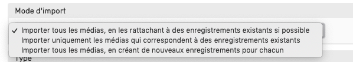

# CollectiveAccess - Importer des médias en lot
## Déposer les fichiers à importer sur le serveur
- se connecter au serveur via winscp à l'aide des identifiants transmis
- accéder au répertoire /import dans Providence
- transférer tous les fichiers à importer
## Noms de fichiers
- vérifier que le nom des fichiers médias que l'on souhaite relier aux notices contient bien l'identifiant des fiches
## Importer les médias dans CollectiveAccess

Ecran d'import de Médias
- dans Importer > Médias
- Cible de l'import : sélectionner le type d'enregistrement auquel vont être reliés les médias importés, ici *objets*
### Répertoire pour l'import de média
- au cas où le répertoire import du serveur contient plusieurs sous répertoires de médias à importer : possibilité de tout importer en une unique fois ou un seul répertoire en le sélectionnant
- inclure tous les sous-répertoires : cocher cette fonctionnalité permet d'inclure tous les sous répertoires du ou des répertoires sélectionnés lors de l'import
- supprimer les médias après l'import : les médias importés seront supprimés du serveurs 
### Mode d'import
Plusieurs possibilités sont proposées, en fonction de ce que l'on souhaite  : 
- importer tous les médias, en les rattachant à des enregistrements existants si possible 
	- tous les médias seront importés
	- si une correspondance a pu être effectuée entre le nom de l'image et l'identifiant de la notice  : le média est relié à la notice
	- si aucune correspondance ne peut être effectuée : une nouvelle fiche est créée 
- importer uniquement les médias qui correspondent à des enregistrements existants
	- seuls les médias correspondant à des notices existantes sont importés et reliés
	- les autres sont ignorés
- importer tous les médias, en créant de nouveaux enregistrements pour chacun
	- tous les médias sont importés
	- une nouvelle fiche est créé et reliée  à chaque média 

Mode d'import
### Type
- en cas de de création de nouveaux objets, selon le choix précédemment choisi, sélectionner le type d'objet souhaité pour les nouveaux objets
- sélectionner le type pour les nouvelles représentations (= médias) créées
### Ensemble
- possibilité d'ajouter les médias importés à un ensemble, afin de les retrouver plus facilement par la suite, 3 choix :
	- ajouter les médias à l'ensemble : les médias sont ajoutés à un ensemble existant
	- créer l'ensemble avec les médias importés : création d'un nouvel ensemble, lui donner un nom
	- ne pas associer les médias à un ensemble
### Identifiant pour un objet
- **en cas de création d'un nouvel objet, on détermine la stratégie de nommage**
	- Utiliser le nom de fichier comme identifiant du/de la objet
	- Utiliser le nom de fichier sans son extension comme identifiant du/de la objet 
	- Utiliser le répertoire et le nom de fichier comme identifiant du/de la objet
### Statut et accès
- on définit ici le statut et l'accès des nouveaux objets et nouveaux médias 
	- accessible au public
	- non accessible au public
	- accès restreint
### Correspondance
#### Prise en compte du nom de fichier et/ou du répertoire pour effectuer le lien
- Correspondance à l'aide du nom de fichier : seul le nom de fichier est pris en compte pour établir la correspondance et relier le média à l'objet
- Correspondance à l'aide du nom du répertoire : seul le nom du répertoire est pris en compte pour établir la correspondance et relier le média à l'objet
- Correspondance à l'aide du répertoire puis du nom de fichier : le répertoire, puis le nom de fichier sont pris en compte 
#### Correspondance média - notice
- on détermine ici la correspondance entre le nom de fichier et l'identifiant de la fiche
	- où l'identifiant correspond exactement : *ex : ARC-SAI-1*
	- commence par : *ex : ARC-SAI-1_texte*
	- finit par : *ex : texte_ARC-SAI-1*
	- contient : si le nom du fichier image contient l'identifiant et d'autres informations * ex : texte_ARC-SAI-1_texte*
#### Restreindre aux types
-  sélectionner tous les types d'objets dans la liste : ctrl + clic pour sélectionner plusieurs valeurs
### Cliquer sur le bouton "Import de médias"
- cocher "envoi d'un mail ... " : l'utilisateur effectuant l'import recevra un mail de rapport dès l'import terminé

