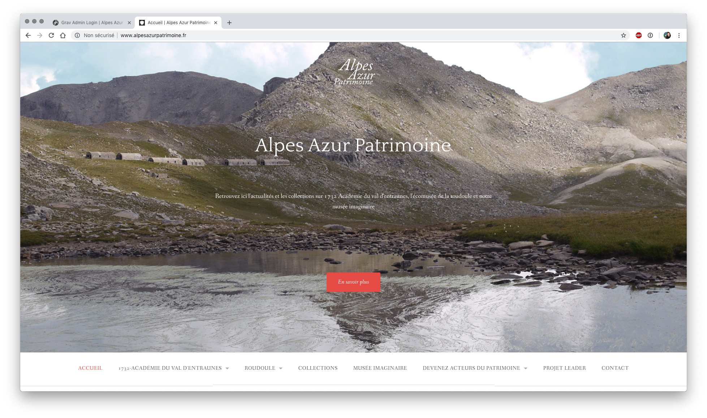
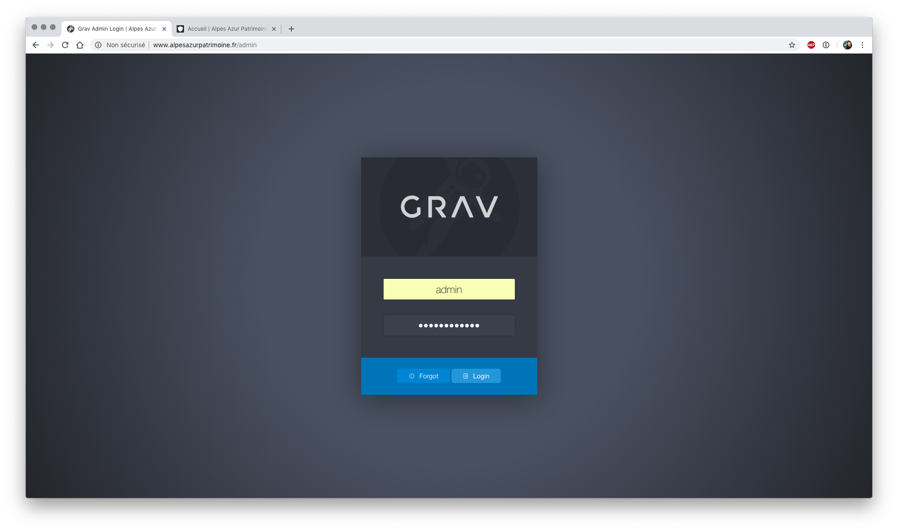
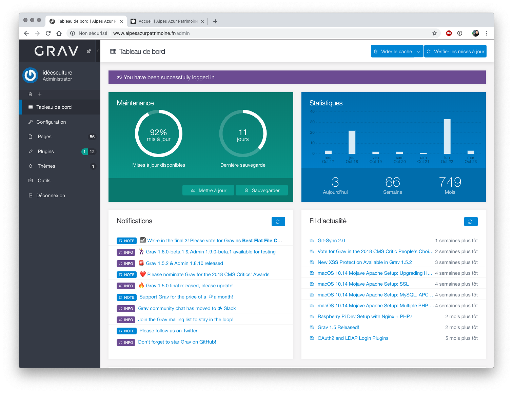
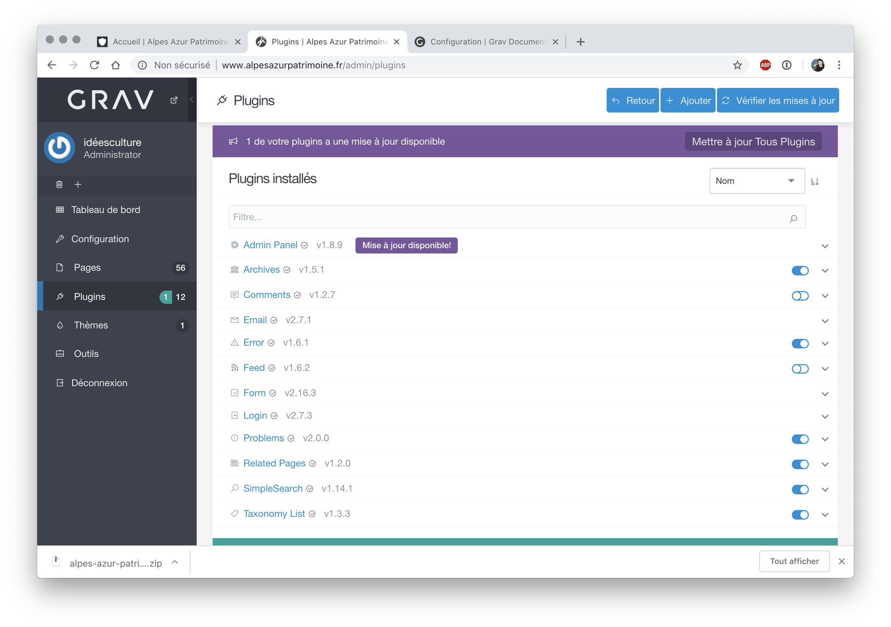
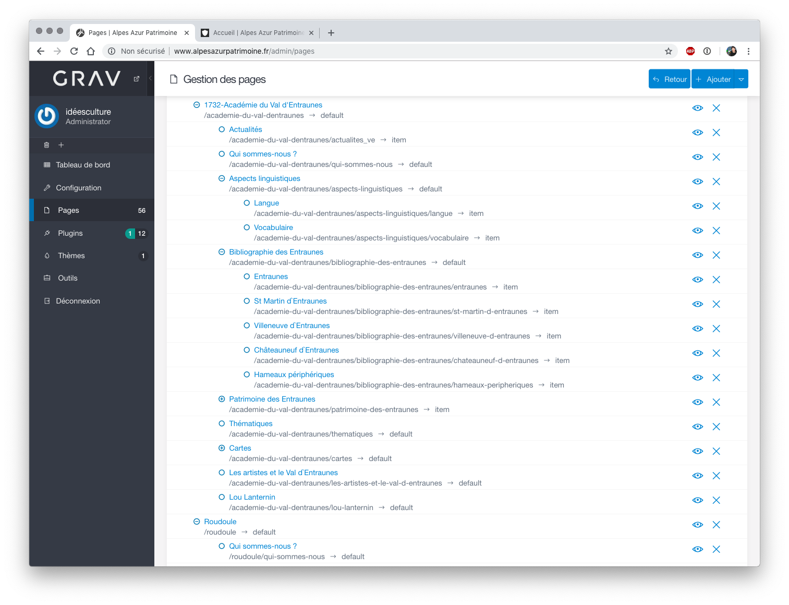
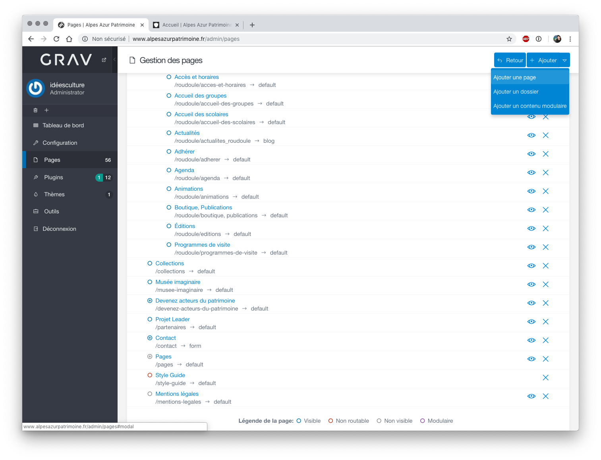
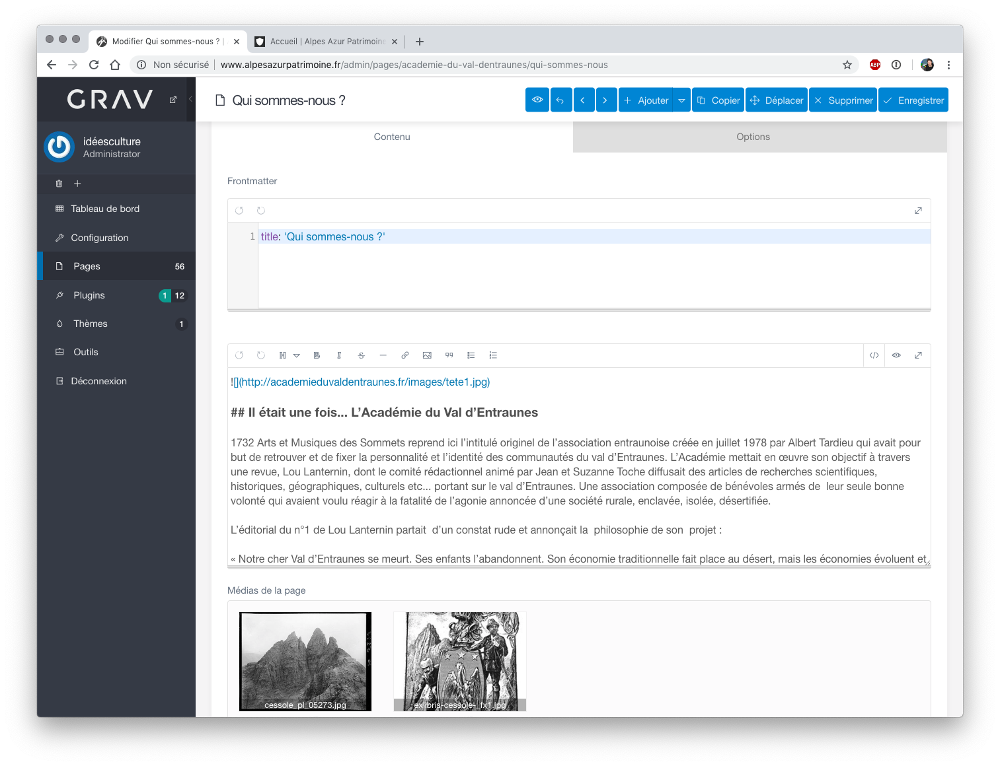
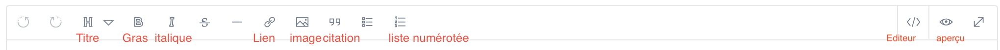
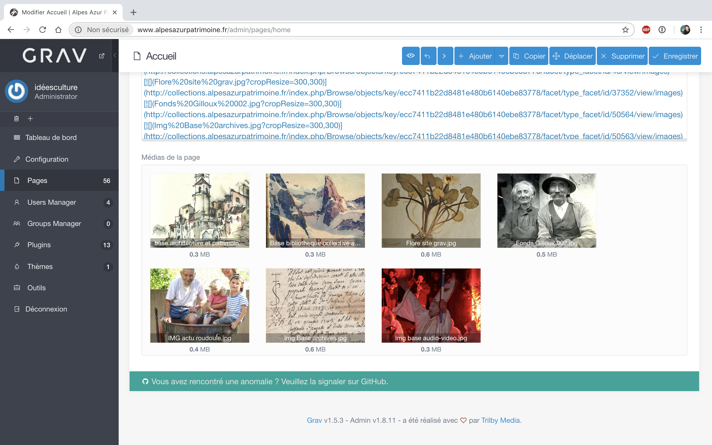

# Alpes Azur Patrimoine : configuration du site internet
## Présentation
### Utilisation de Grav
-  *"Grav est un CMS flat file. On entend par là qu'il n'utilise pas de base de données. Le contenu dynamique est stocké sous forme de fichiers YAML."* (source : [https://doc.ubuntu-fr.org/grav])
- Le langage d'édition par défaut est le Markdown : [https://michelf.ca/projets/php-markdown/syntaxe/]
- Documentation officielle de Grav (en anglais) : [https://learn.getgrav.org/content]
- Template installé pour le site internet alpesazurpatrimoine : Gateway : [https://github.com/getgrav/grav-theme-gateway/blob/master/README.md]
### Organisation 
- plusieurs pages organisées sous différents menus communs ou propres à chaque structure : l'écomusée de la Roudoule et l'Académie du Val d'Entraunes 
- un menu **Collection** renvoie vers l'interface de Pawtucket (interface publique des collections de CollectiveAccess)
- la page d'accueil propose également quelques liens vers des types d'objets en particulier : image, archives, objets muséaux,...
### Accès
- site internet public : [http://www.alpesazurpatrimoine.fr/]

Interface publique
- url de configuration : [http://www.alpesazurpatrimoine.fr/admin] 

Interface de configuration
## Page d'accueil et opération de sauvegardes
### Sauvegarder le contenu
***Avant toute modification d'importance : nous vous conseillons d'effectuer une sauvegarde***
- une fois identifié sur l'interface d'administration de Grav, la page d'accueil propose d'effectuer les opérations de mise à jour et de sauvegarde
- Avant toute mise jour, effectuer une sauvegarde
- pour sauvegarder, clic sur le bouton **Sauvegarder** puis cliquer sur **Récupérer la sauvegarde**

Tableau de bord - interface d'administration
## Tour des menus disponibles
- Configuration : précise la configuration en place pour le Grav installé
- Pages : toutes les pages créées et publiées ou non sur le site 
	-  ajouter, modifier (et supprimer) les pages de contenu 
	- organiser les pages selon les souhaits de l'équipe : page parente...
- Plugins : liste tous les plugin installés et permet d'en ajouter d'autres

Page Plugins
	- pour activer / désactiver un plugin, cliquer sur le bouton à droite sur la ligne de ce plugin
	- pour ajouter un nouveau plugin, clic sur **Ajouter**
## Menu Pages : Modifier / ajouter du contenu

Organisation des pages
### Ajouter une nouvelle page
* bouton **ajouter** en haut à droite

Ajouter une page
* donner un titre
* indiquer la page parente (ex : Académie du Val d'Entraunes)
### Modifier et compléter une page existante
* dans Page, cliquer sur la page à modifier
* astuce : un clic sur le bouton + à gauche d'une page "parente" déplie l'arborescence et permet de visualiser toutes les pages enfants
* une fois sur la page, 2 parties :
	* contenu
	* options 

Ex de page
### Contenu
Quelques boutons sont proposés par Grav pour éviter la saisie en Markdown.
Nous détaillons ci-dessous ces boutons mais précisons également la syntaxe Markdown

Liste des boutons proposés pour modifier le contenu
#### Titres
* faire précéder chaque niveau de titre d'un #
* ex : `# titre 1`, `## titre2`, ...
#### Saisir du texte (en markdown)
* saisir du texte en gras (emphase) `**gras**`(**gras**)
* saisir du texte en italique : `*italique*` (*italique*)
* Ajouter des liens  :
 Pour créer un lien, vous devez placer le texte du lien entre crochets suivis de l'URL entre parenthèses :
Rendez-vous sur le `[Site du Zéro](http://www.siteduzero.com) pour tout apprendre à partir de Zéro !`

* ajouter une liste à puces : faire précéder le texte d'une `*``
*  ajouter une liste à puces numérotées : faire précéder le texte de 1., 2. ...
* ajouter une citation : précéder le texte de > 
`> ceci est une citation`
S'affichera alors ainsi
 > ceci est une citation 
* sauter une ligne : ajouter 2 espaces à la fin d'une ligne
### Ajout de médias
- possibilité d'ajouter types de supports, tels que des images, des vidéos et divers autres fichiers. 
- Ces fichiers sont automatiquement trouvés et traités par Grav et sont mis à la disposition de toutes les pages. Ceci est particulièrement pratique car vous pouvez ensuite utiliser les fonctionnalités intégrées de la page pour exploiter les vignettes, accéder aux métadonnées et modifier le support de manière dynamique (redimensionnement des images, définition de la taille d'affichage des vidéos, etc.) selon vos besoins.
#### médias supportés
Image : jpg, jpeg, png
Audio : mp3, wav, wma, ogg, m4a, aiff, aif
Animated image : gif
Vectorized image : svg
Video : mp4, mov, m4v, swf, flv, webm, ogv
Data / Information : txt, doc, docx, html, htm, pdf, zip, gz, 7z, tar, css, js, json, xml, xls, xlt, xlm, xlsm, xld, xla, xlc, xlw, xll, ppt, pps, rtf, bmp, tiff, mpeg, mpg, mpe, avi, wmv
#### Où placer les médias
- Habituellement, vous utiliserez un fichier multimédia dans une page. Il vous suffit donc de le placer dans le dossier de la page. 

Page d'accueil - médias de la page
#### Ajouter une image
* Les images s'insèrent de la même façon que les liens, avec simplement un ! en plus :
``
C’est à dire :
	* Un point d’exclamation : ! ;
	* suivi d’une paire de crochets contenant le texte de l’attribut alt de l’image ;
	* suivi par une parenthèse, contenant l’URL ou le chemin vers l’image, et optionellement un titre entouré par des guillemets droits simples ou doubles.
* ou par exemple `` : la taille (hauteur, largeur) est ainsi retaillée
* images servant de lien
` `
#### Modes d'affichage des médias
Grav fournit quelques modes d'affichage différents pour chaque type d'objet multimédia :
* affichage sepia, nb, ...
* forcer la taille
* affichage vignettes...
* plus d'infos : [https://learn.getgrav.org/content/media]