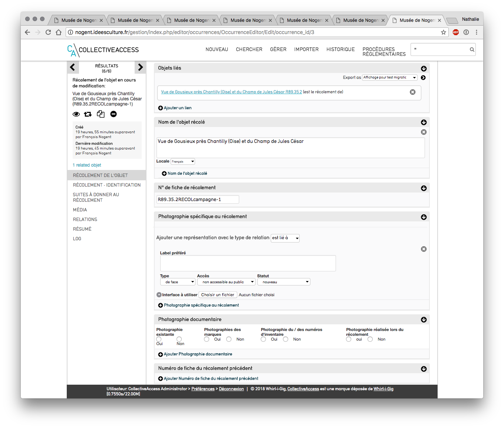

# Module Musées de France - Récolement décennal
## Présentation et structure
### Préambule : Cadre réglementaire
*Notamment dans son article 13 : "Chaque campagne de récolement fait l'objet d'un procès-verbal rédigé par le professionnel responsable des collections au sens de l'article L. 442-8 du code du patrimoine. Le procès-verbal est conservé par le musée.
Le procès-verbal décrit la méthode adoptée, le champ couvert par le récolement, ainsi que les résultats de la campagne, notamment la liste des biens non vus ou manquants, la liste des biens détruits, la liste des biens inventoriés ou à inventorier à l'issue du récolement.
Pour les musées dont les collections appartiennent à l'Etat, la copie du procès-verbal est adressée à l'issue de chaque campagne de récolement au ministre chargé de la culture et, le cas échéant, au ministre compétent)".*
*Et dans son annexe 5.a. Collecte et enregistrement des informations : "Pour chaque bien, les opérations de récolement réalisées et les informations rassemblées sont notées sur des fiches de récolement. L'utilisation de l'exemplaire original de l'inventaire pour la réalisation du récolement est proscrite. 
La confirmation de la présence d'un bien inventorié est reportée dans les fichiers de gestion des collections, manuels ou informatiques définis à l'article 5 du présent arrêté, accompagnée de la date du récolement, de la localisation du bien et de l'identité de l'agent chargé du récolement.)".*
*La procédure du récolement décennal implique donc la production de plusieurs documents :
		   • **les fiches de récolement
   • le procès-verbal
   • les listes de biens annexées au procès-verbal***
[http://www2.culture.gouv.fr/documentation/joconde/fr/partenaires/AIDEMUSEES/informatisation-recolement.htm]
### Déroulement des opérations
Il est nécessaire de suivre plusieurs étapes pour réaliser un récolement informatisé des collections dans CollectiveAccess.
1. Etablir une fiche Campagne de récolement 
2. Générer une fiche de récolement par objet récolé 
3.  Suivi du récolement
4.  Générer le PV de récolement
### Vérifier le paramétrage 
- Interfaces de saisie : 
	- Des écrans de saisie spécifiques ont été configurés par idéesculture lors de l'installation de CollectiveAccess.
	- il est possible de les modifier et de les organiser différemment depuis le menu Gérer > administration > interfaces de saisie
	- Cliquer sur le bouton modifier de "Editeur de procédure Campagne/récolement" puis sur le bouton modifier de chaque écran

Interface de saisie "Editeur de procédure

- vérifier les préférences utilisateurs : il s'agit ici de vérifier que les grilles de saisies sont bien associées au type d'enregistrement 
	- Menu Gérer > Mes préférences > modification
	- vérifier que les lignes "campagne de récolement", "récolement" soient associées à l'interface de saisie  "Editeur de procédure Campagne / récolement"

Préférences utilisateurs
## Saisie du récolement 
### Création d'une campagne de récolement
####  Menu Nouveau, Campagne de récolement 
#### Saisie
 Remplir les informations de description de la campagne
- Nom : *ex : Campagne cartons à dessin*
- Numéro : *ex campagne-1*
- dates prévisionnelles de la campagne : *ex 2018-2024*
-  dates effectives 
- intervenant de la campagne : lien vers les personnes liées
- contenu scientifique : *champ de description qui apparaitra dans le PV*
- champs couverts :* champ de description qui apparaitra dans le PV*
- méthode utilisée : *champ de description qui apparaitra dans le PV*
- caractérisation de l'espace : *champ de description qui apparaitra dans le PV*
- conditionnement des biens à récoler : *champ de description*
- localisation : *emplacement lié*
- Fiches de récolement liées : *le lien vers les fiches de récolement apparaîtra automatiquement lors de la génération des fiches.*
#### Rechercher une fiche campagne
- à tout moment, il est possible de revenir sur la fiche campagne pour la modifier et la compléter
- en utilisant l'une des différentes possibilités de recherche 
	- recherche rapide
	- recherche simple, avancée ou parcourir du menu "Chercher - Campagne"
- saisir un mot du nom de la campagne ou l'identifiant 
	- saisie de l'identifiant en recherche rapide :on parvient directement sur la fiche campagne
	- saisie d'un mot du nom en recherche rapide *ex dessin* : on obtient plusieurs résultats triés par type d'enregistrement (objet, entités....)

Recherche rapide campagne
	- cliquer sur le bouton + de la ligne "occurrences" pour visualiser les résultats proposés ou sur "full result" (tous les résultats)

Recherche rapide - bouton + déplié
	- cliquer sur le lien pour arriver en modification sur la fiche campagne *ex :"Campagne - Cartons à dessin"*
### Organisation des campagnes et génération du récolement
####  Créer un ensemble d'objets à récoler
Il s'agit ici de procéder petit à petit dans le récolement et de créer au fil de l'eau des ensembles d'objets à récoler
*ex : tous les objets de la collection permanente ou de tel espace *
- rechercher les objets souhaités 
- les placer dans un ensemble 
- possible de placer plusieurs recherches successives dans le même ensemble 
*NB : se reporter au support de cours "gestion des recherches" pour plus de précisions sur la gestion des recherches et  des ensembles*
#### Récolement objet par objet 
##### Suivi du récolement
- Menu Procédures réglementaires > Suivi du récolement 
- visualisation de toutes les campagnes de récolement reliées au récolement décennal en cours (ici 2014-2024)

Suivi du récolement 
- 2 parties
	- suivi graphique
	- tableau de progression des campagne
- actions possibles
	- un clic sur bouton "page" : permet de modifier la fiche campagne 
##### Générer les fiches
- cliquer sur le bouton "générer les fiches" de la campagne
- choisir un ensemble d'objet pour préparer le récolement dans la liste déroulante 
***Attention :****tous les ensembles d'objets créés précédemment dans CollectiveAccess apparaissent.
- tous les ensembles d'objets effectués dans CollectiveAccess sont présents dans la liste**
- cliquer sur "soumettre"
 **Attention : cette action ne peut être annulée**
- une fiche de récolement est générée par objet présent dans l'ensemble 

Fiches de récolement générées
### Récolement d'un objet

Liste des fiches de récolement
- cliquer sur le bouton "page" pour modifier
- on arrive sur la fiche de récolement générée

Fiche de récolement
- réitérer l'opération pour toutes les fiches récolement générées pour l'ensemble
- pour ajouter un nouvel ensemble, cliquer sur le bouton plus de la barre de progression, zone "avancement"
#### Ecran "saisie du récolement"
- objet lié : lien créé *automatiquement* lors de la génération de la fiche
- nom de l'objet récolé : reprise *automatiquement* du nom de l'objet
- n° de fiche de récolement : généré *automatiquement* (construit de la manière suivante : n°inventaire de l'objetRECOLidendifiant de la campagne)
Tous les champs qui suivent sont à remplir en fonction de l'objet que l'on récole, et selon les préconisations du Service des Musées de France
- Photographie spécifique au récolement : associer ici une photographie de l'objet récolé, utile pour préciser / annoter le récolement
**Attention : **au cas où l'on souhaiterait associer une image ou un média à la notice documentaire de l'objet : penser à le réaliser directement depuis la fiche de l'objet - écran Média
*astuce : "clic droit ouvrir dans un nouvel onglet" sur  le lien vers l'objet lié permet d'ouvrir la fiche de l'objet sans perdre la saisie de la fiche de récolement*
- Photographie documentaire : cocher les cases
- numéro de fiche du récolement précédent : remplir si info existante
- présence du numéro d'inventaire : cocher la case
- expertise du numéro d'inventaire : cocher les cases et préciser si besoin
- présence d'un autre numéro : cocher la case et préciser si besoin
- problème d'identification : cocher si oui
- présence du bien dans le récolement précédent : cocher 
- présence du bien dans le récolement en cours  : cocher  la case (*alimentera le PV le suivi du récolement*)
- date du précédent récolement : à remplir le cas échéant
- date du récolement en cours : date du jour
- localisation dans le précédent récolement : indiquer une date et sélectionner la localisation parmi la liste de choix proposés (liste définie par le Service des Musées de France)
- localisation dans le récolement en cours :  : indiquer une date et sélectionner la localisation parmi la liste de choix proposés (liste définie par le Service des Musées de France)
- emplacement : emplacement de stockage de l'objet récolé
- campagne liée : rempli automatiquement lors de la génération de la fiche
- constat d'état : à compléter
- objet inventorié plusieurs fois : cocher la case correspondante
- conformité avec la source :  : cocher la case correspondante
- type et référence de la source : préciser la source
- inscription : si des marques et inscriptions sont indiquées sur l'objet, les préciser ici
- récoleur : lien vers les personnes liées
- date de visualisation : date de visualisation de l'objet pour le récolement
- date de validation 
- valideur : lien vers les personnes liées (peut être la même personne que le récoleur, selon la taille de l'équipe)
- récolement fait : cocher oui quand le récolement de l'objet en question est terminé *alimente le PV *
#### Ecran Suites à donner au récolement 
* Il s'agit ici de préciser toutes les opérations à effectuer ou non sur l'objet suite au récolement :
	- la liste des objets concernés par des traitements pourra ensuite être retrouvée en recherche
	- chaque indication se retrouve dans le PV de récolement et est comptabilisée
* Liste des champs à compléter
	- objet à identifier
	- objet à inventorier
	- objet à marquer
	- objet à photographier
	- objet à localiser
	- objet à traiter
	- objet à récoler ultérieurement
	- notice documentaire à créer
	- recherches complémentaires à poursuivre
	- plainte à déposer
#### Ecran récolement - identification
- rappel de toutes les informations d'identifications de l'objet
## Génération du PV  de récolement 
Une fois que tous les objets ont été récolés, il s'agit de générer le PV de récolement afin de le transmettre.

Générer le PV

- cliquer sur le bouton "Générer le procès-verbal de récolement"
- cliquer sur "Télécharger"
- les informations du PV sont :
	- normalisées et stipulées par le Service des Musées de France
	- reprises en partie de la fiche campagne
	- calculées et générées automatiquement grâce aux informations indiquées dans les fiches récolement d'où l'importance de bien cocher les cases
- possible de générer le PV à tout moment pour visualiser les informations

*le PV est généré au format .docx et lisible sous Word ou Openoffice, le transformer ensuite en pdf pour le transmettre aux services compétents.