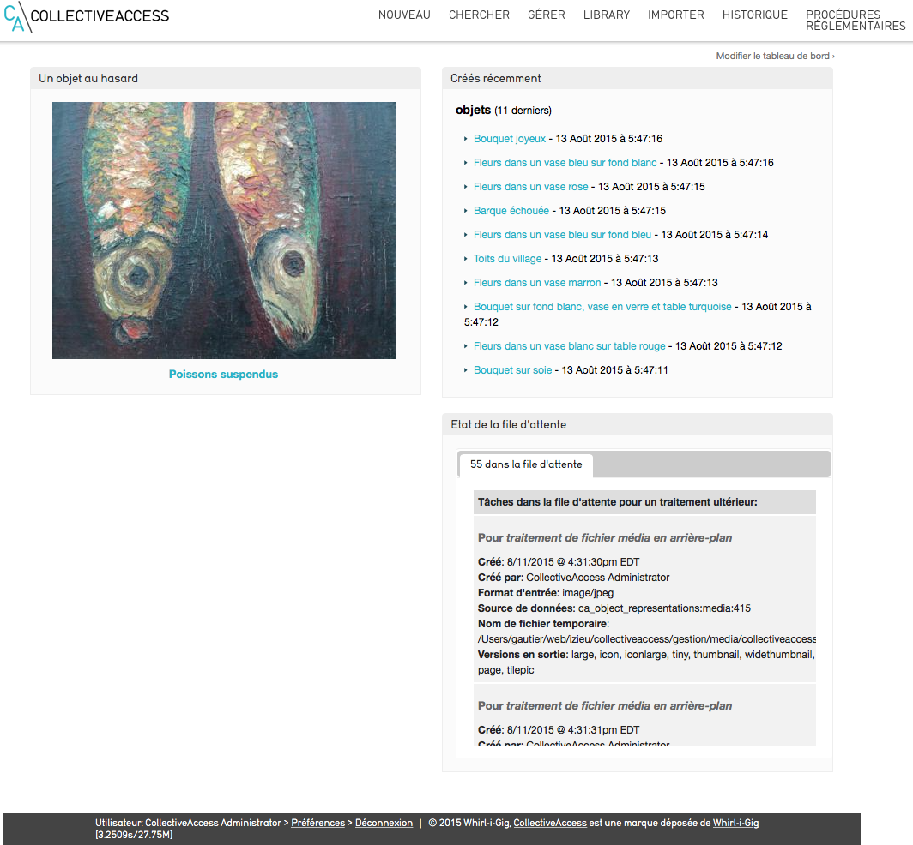

# Connexion et démarrage dans Providence
## Connexion
CollectiveAccess est une application full-web. On accède ainsi à Providence depuis tout navigateur internet ; nous conseillons toutefois l’utilisation d’un navigateur dernière génération.
Vous accédez à Providence en vous identifiant avec un nom d’utilisateur et un mot de passe ; ces identifiants déterminent ensuite vos droits d’accès aux fonctionnalités de Providence.
La page d’accueil comporte un tableau de bord personnalisable.
## Tableau de bord
Providence, interface professionnelle de CollectiveAccess, intègre un tableau de bord défini par chaque utilisateur selon ses préférences et ses besoins.
Afin de personnaliser votre tableau de bord, cliquez sur « Modifier le tableau de bord (en haut à droite de l’écran) et ajouter au choix les éléments que vous souhaitez :
- la liste des objets dernièrement créés
- la liste des dernières entités créées 
- un objet au hasard
- vos objets surveillés
- vos recherches enregistrées
- recherche au sein d’un ensemble
- l’état de la file d’attente (imports d’images)
- le total des enregistrements créés
Cliquez ensuite sur « Terminer »

Tableau de bord
## Tour des menus
La barre de menus de Providence se compose des menus suivants (*de gauche à droite*) :
- le menu **Nouveau** : vous permet de créer de nouveaux enregistrements (objets, entités, lieux, mouvements…)
- le menu **Chercher** : vous permet d’effectuer des recherches au sein de ces enregistrements
- le menu **Gérer** : permet de modifier vos préférences et d’accéder à tous les paramétrages de CollectiveAccess
- le menu **Importer** : permet de réaliser des imports de médias en lots et des imports de données
- le menu **Procédures Règlementaires** - *si le plugin « museesdefrance » est installé* - : vous accédez aux opérations de récolement décennal et d’inventaire réglementaire des Musées de France 
- le menu **Statistiques** - *si le plugin « Statistiques » est installé et configuré* - : vous consultez et exportez toutes les statistiques des données de CollectiveAccess. La configuration des statistiques est paramétrables.