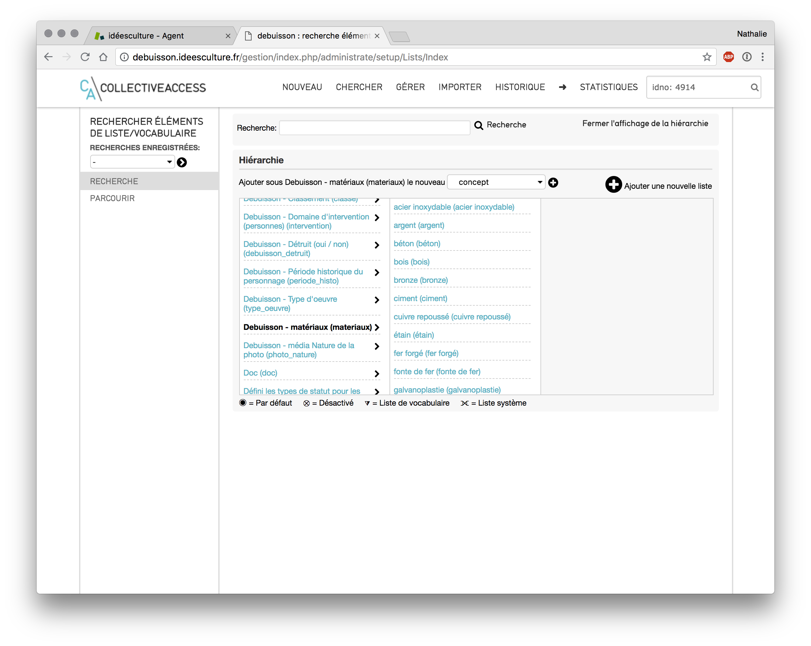
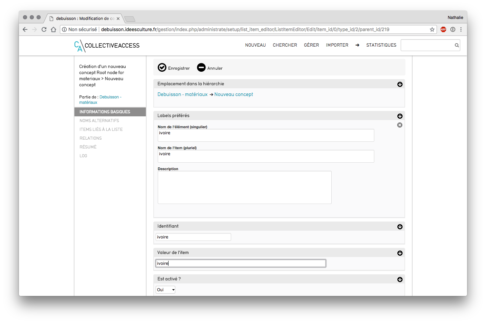
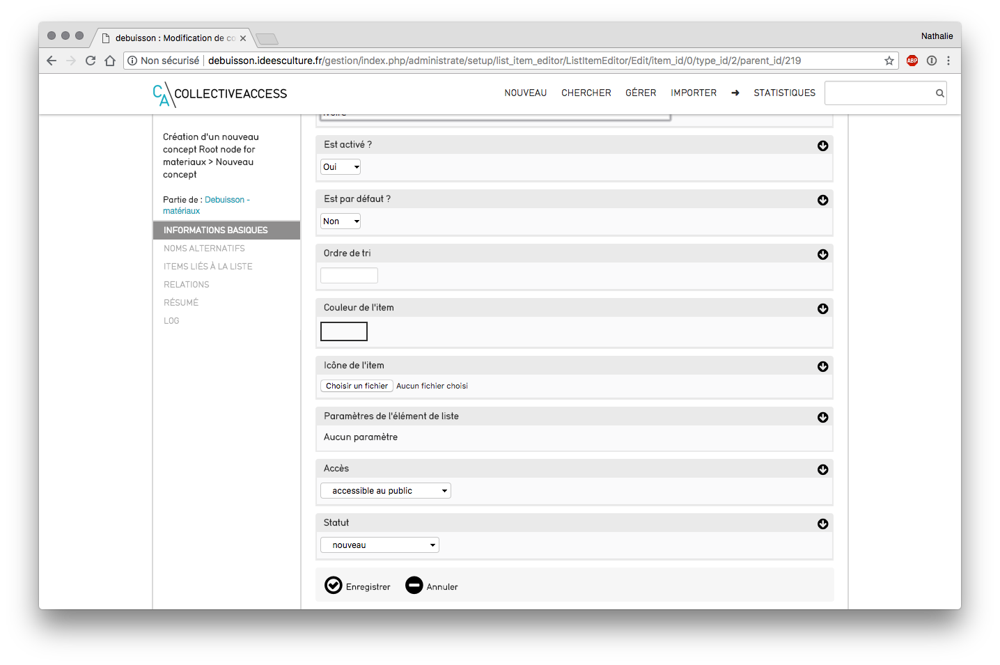
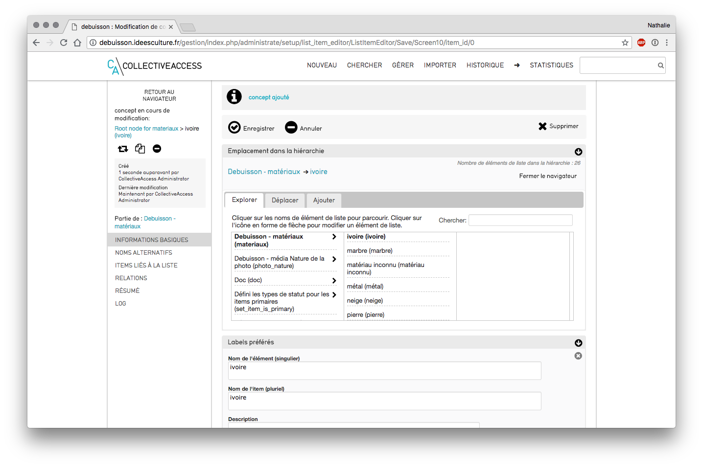

# CollectiveAccess -Paramétrage des listes de vocabulaire 
*Menu Gérer > Listes et vocabulaires*
- visualisation de toutes les listes 

Visualisation des listes
## Créer une nouvelle liste :
- cliquer sur le +, intitulé « ajouter une nouvelle liste »
-  saisir un code unique
- saisir  un nom  de liste (titre, libellés préférés)
- liste hiérarchique : cocher oui si c'est le cas
- liste système ? *possibilité notamment d'attribuer des droits d'accès spécifiques sur ces listes*
- utiliser cette liste en tant que vocabulaire : les termes de listes sont alors considérés comme un type d'enregistrement particulier et apparaissent sous forme de lien sur Pawtucket (interface publique) 
- cliquer sur "enregistrer"
## ajouter un nouveau terme à une liste existante :

liste concernée
- retrouver la liste (ex : "matériaux")
	- la rechercher dans le menu déroulant
	- ctrl+F "nom de la liste" pour la retrouver plus vite
-  cliquer sur la flèche à droite de la liste 
- cliquer sur le + à côté "ajouter un concept"

Ajouter un terme
-  saisir le nom du concept à ajouter (ex ivoire) au singulier et au pluriel
-  saisir un code (ex ivoire)
- déterminez s'il s'agit d'un terme par défaut au sein de la liste.

Paramètres du concept
## Modifier un terme existant
- cliquer sur le concept à modifier (ex ivoire)
-  apporter les modifications, et cliquer sur « Enregistrer » .

Modification d'un terme existant
## Supprimer ou fusionner un terme
- cliquer sur le concept à supprimer ()
- cliquer sur le bouton supprimer
	- si le concept a des objets rattachés : CollectiveAccess propose de transférer ces références vers le concept à conserver
	- si le concept n'a pas d'objets rattachés : possible de supprimer directement par un clic sur "supprimer"

