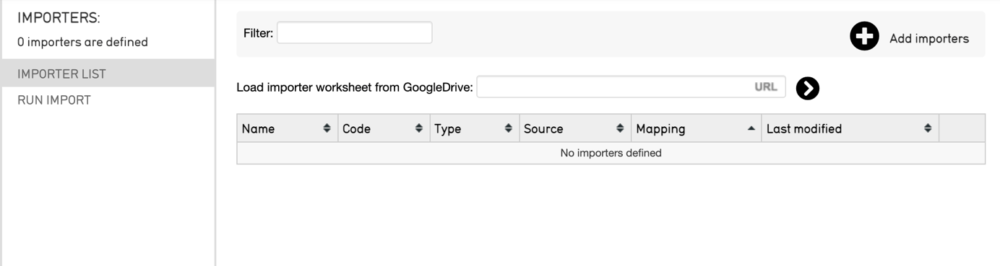

# Lancer une migration

## Exécution d'un import de données

Une fois le mappage d'import créé, les données peuvent être importées dans CollectiveAccess. Il existe deux façons d'importer des données dans CollectiveAccess :

1.  **Directement à partir de la ligne de commande (terminal)**. Cette méthode est recommandée pour les imports importantes, afin que l'import ne soit pas bloquée par un navigateur web.

2.  **Par le biais d'un navigateur web** dans l'interface utilisateur Providence de CollectiveAccess.

Les deux options nécessitent une feuille de calcul d'import et des données sources dans un format de données pris en charge.

**Avertissement**

Les correspondances d'import contiennent un code. Si le code n'est pas valide, l'importateur de données dans l'interface utilisateur refusera de télécharger le mappage. Les espaces, les guillemets et l'orthographe sont les endroits les plus courants où des erreurs peuvent se produire dans les phrases de code. Vérifiez que les phrases de code ne présentent pas d'incohérences ; un [validateur de code et un formateur](https://jsonlint.com/) en ligne sont généralement très utiles pour détecter les erreurs.

**Note**

N'oubliez pas de toujours sauvegarder votre base de données avant d'effectuer un import, car vous devrez probablement modifier les imports à plusieurs reprises.

## Étapes de base pour l'exécution d'un import de données

Pour exécuter un import de données dans le terminal ou via l'interface utilisateur CollectiveAccess, huit étapes de base sont nécessaires :

1.  **Créez une feuille de calcul de correspondance d'import.** Cette feuille peut être créée dans Excel ou dans Google Sheets et servira de passerelle entre les données sources et les données de destination dans CollectiveAccess. Cette étape est nécessaire quelle que soit la manière dont l'import est exécutée. Voir le [Tutoriel : Importer une feuille de calcul](file:///Users/charlotteposever/Documents/ca_manual/providence/user/import/c_import_tutorial.html) pour obtenir des instructions complètes.

2.  **Créez une sauvegarde de la base de données** en exécutant un vidage de données avant de lancer l'import.

3.  **Exécutez l'import** à partir de la ligne de commande (terminal) ou de l'interface utilisateur graphique de CollectiveAccess.

4.  **Vérifiez les données qui ont** été importées dans CollectiveAccess. Recherchez les erreurs ou les incohérences. Les erreurs sont généralement signalées par des messages d'erreur lors de l'import, mais il est nécessaire de procéder à des contrôles de qualité généraux dans le système.

5.  **Réviser le mapping** en conséquence.

6.  **Chargez le vidage de données de** manière à ce que le système revienne à l'état où il se trouvait avant l'import, ou qu'il revienne à l'état vide. Pour importer les modifications avec succès, il est recommandé de nettoyer le système afin que les anciennes imports ne soient pas confondues avec les nouvelles.

7.  **Exécutez à nouveau l'import** (voir étape 3). Les révisions apparaîtront dans le nouveau système.

8.  **Répétez les étapes 3 à 7** jusqu'à ce que vous soyez satisfait de l'import des données.

Les étapes de l'import de données à partir du terminal et de l'import de données à partir de l'interface utilisateur dans Collective Access sont expliquées ci-dessous. Ces étapes supposent que les données sources sont disponibles dans un format de fichier pris en charge et qu'une feuille de calcul de correspondance d'import a été créée.

## Exécution d'un import à partir du terminal

Suivez les étapes décrites ci-dessous pour générer un import réussi à partir du terminal ou de la ligne de commande.

1.  **Créez un endroit où les** données et les correspondances d'import de données sont facilement accessibles, sans que le chemin d'accès au fichier soit trop long. Par exemple, le matériel d'import pourrait se trouver dans un répertoire Providence à l'adresse suivante

```
/support/projet/mappings et /support/projet/data
```

1.  **Sauvegardez vos données**. Avant d'importer, sauvegardez votre base de données :

```
mysqldump -u\#nom -p\#motdepasse projet \> \~/projet_date.dump
```

1.  **Définir un import**. Cette opération est réalisée à l'aide de l'option load-import-mapping de caUtils :

```
cd /path_to_Providence/support
bin/caUtils load-import-mapping --file=project/mappings/mapping1.xlsx
```

1.  **Exécuter l'**import. Une fois l'import créée, elle peut être utilisée. À l'aide de l'utilitaire import-data, donnez le nom correct au paramètre -mapping. Par exemple :

**Note**

Lorsque l'extension PHP ncurses est installée, un écran affiche des indicateurs d'état en mouvement, notamment la progression de l'import et les erreurs récentes.

1.  **Vérifiez les données qui ont** été importées dans CollectiveAccess.

2.  **Modifier l'import et** réexécuter l'utilitaire si quelque chose a mal tourné. Pour modifier votre import et réexécuter l'utilitaire, il suffit de restaurer votre base de données :

```
mysql -u\#nom -p\#motdepasse projet \< \~/projet_date.dump
```

1.  **Répétez les étapes 1 à 4** jusqu'à ce que vous soyez satisfait de l'import des données.

**Lancer un import à partir de l'interface utilisateur**

L'import de données via l'interface utilisateur de CollectiveAccess est une excellente option pour ceux qui ne sont pas familiarisés avec la ligne de commande, car elle n'implique pas l'exécution de commandes. L'import à partir de l'interface utilisateur consiste simplement à télécharger les fichiers pris en charge, mais il y a quelques étapes à suivre.

**Note**

L'interface utilisateur permet également d'ajouter, de supprimer ou de télécharger facilement des correspondances d'import. Pour cette méthode, il est nécessaire de disposer d'une correspondance d'import et de données sources dans un format de fichier pris en charge.

Suivez les étapes ci-dessous pour exécuter un import à partir de l'interface utilisateur de CollectiveAccess :

1.  **Naviguez vers import/Données** dans CollectiveAccess. La fonction d'import de CollectiveAccess s'affiche :



1.  **Sélectionnez l'icône du signe plus** dans le coin supérieur droit. Une zone intitulée "Drag importer worksheets here to add or update" apparaît, dans laquelle la feuille de calcul d'import peut être glissée ou téléchargée dans l'interface utilisateur. En outre, la feuille de calcul peut être chargée à l'aide d'une URL depuis GoogleDrive.

2.  **Glissez ou déposez** la feuille de calcul de le mapping des imports directement dans l'interface utilisateur, ou ajoutez le lien Google Drive à votre mapping d'import.

3.  **Sélectionnez** le chevron (icône validation)  .

4.  **Disposez de vos données sources**. En plus de la feuille de calcul de le mapping d'import, il sera également nécessaire de télécharger le jeu de données source spécifique dans l'interface utilisateur au cours de ce processus, en le faisant glisser ou en le téléchargeant à partir d'un emplacement sur l'ordinateur. Ce fichier (ou ces fichiers) doit être disponible dans un format supporté.

5.  **Télécharger** les données sources.

6.  **Configurez les paramètres nécessaires**. Sélectionnez le niveau de journalisation et les options de test. Pour plus d'informations, voir [Data Importer (UI) : Options d'import](https://manual.collectiveaccess.org/providence/user/import/ui_import_options.html#import-ui-import-options).

7.  **Exécutez l'import** en sélectionnant Exécuter l'import de données.

8.  **Réviser** le mapping en conséquence.

9.  **Réimporter** en répétant les étapes 1 à 6.

**Ordre d'import**

Pour les données comportant plus d'une feuille de calcul de mappage d'import (comme les objets, les entités, les lots, etc.), l'ordre dans lequel les mappages sont importés est important. Notez toutefois que cet ordre diffère pour chaque ensemble de données.

Pour certains ensembles de données, l'ordre d'import est moins important, car les enregistrements apparentés sont créés à partir d'un seul mappage. Lorsque ce n'est pas le cas, l'ordre d'import peut déterminer si les enregistrements sont correctement appariés et permet d'éviter les erreurs lors de l'import.

En fonction de l'ensemble de données, l'ordre d'import aura également une incidence sur la valeur de la [règle relative aux enregistrements existants](https://manual.collectiveaccess.org/providence/user/import/exist_rec_policy.html#import-exist-rec-policy) dans les paramètres d'une feuille de calcul de mappage des imports.
