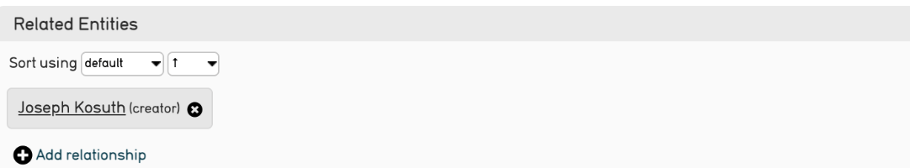

# Refinery

## Qu'est-ce qu'un Refinery ?

Un refinery permet de créer un enregistrement lié depuis l'enregistrement créé lors d'un import (une colonne indiquant le nom d'un artiste dans l'import d'une liste d'oeuvres par exemple). Un refinery peut également établir une correspondance à un enregistrement déjà existant dans la  base de données et le lié à l'enregistrement importé.

Un Refinery prend un format de données particulier dans des données sources données, et le transforme par un comportement spécifique lorsqu'il est importé dans CollectiveAccess. En d'autres termes, les Refinery indiquent à CollectiveAccess *comment* importer certaines données, telles que les noms, les dates et les relations, par le biais d'une commande texte spécifique. Cette commande détermine ensuite la manière dont les données seront affichées une fois importées.

Un Refinery, à un niveau simpliste, correspond à la traduction de son nom, la précision méticuleuse d'un import de données spécifiques liées.

**Note**

Si un import de données nécessite des enregistrements liés, des Refinery doivent être utilisés. 

## Types de Refinery

Quelques types de Refinery sont couramment utilisés dans CollectiveAccess :

-   **Splitters :** Un splitteur crée des enregistrements, fait correspondre des enregistrements avec des données existantes ou analyse des éléments de données spécifiques, en "découpant" littéralement des valeurs, telles que le prénom et le nom de famille. Les séparateurs peuvent être appliqués à une variété de tables primaires dans CollectiveAccess. 

-   **Joiners :** Une jointure est utilisée principalement pour les données qui comprennent des noms et des dates. Les jointures sont utilisées lorsque deux ou plusieurs parties d'un nom situées dans des zones différentes de la source de données doivent être réunies en un seul enregistrement. Un dateJoiner crée une plage unique à partir de deux dates ou plus dans la source de données.

-   **Builders :** Un constructeur crée une hiérarchie supérieure au-dessus des données à importer. 

Pour une liste complète des Refinery, voir le tableau ci-dessous.

| **Refinery**                          | **Paramètres utilisés**                                                                                                                                                                                                                                                               | **Fonction**                                                                                                                                                                                                                                                                                                             | **Notes spéciales**                                                                                                                                                                                                                                                                                                                                                                                                                                                                  |
|---------------------------------------|---------------------------------------------------------------------------------------------------------------------------------------------------------------------------------------------------------------------------------------------------------------------------------------|--------------------------------------------------------------------------------------------------------------------------------------------------------------------------------------------------------------------------------------------------------------------------------------------------------------------------|--------------------------------------------------------------------------------------------------------------------------------------------------------------------------------------------------------------------------------------------------------------------------------------------------------------------------------------------------------------------------------------------------------------------------------------------------------------------------------------|
| entitySplitter                  | délimiteur ; relationshipType ; entityType ; attributs ; relationshipTypeDefault ; entityTypeDefault ; interstitiel ; relatedEntities ; nonPreferredLabels ; parents ; skipIfValue ; relationships ; matchOn ; displaynameFormat ; doNotParse ; dontCreate ; ignoreParent             | Crée un enregistrement d'entité ou trouve une correspondance exacte avec le nom de l'entité et crée une relation telle que définie dans le mapping d'importation. Décompose les parties de noms, définit le type d'entité et d'autres paramètres.                                                                   | Aucun                                                                                                                                                                                                                                                                                                                                                                                                                                                                                |
| entityHierarchyBuilder                | parents                                                                                                                                                                                                                                                                               | Crée une hiérarchie supérieure d'occurrences uniquement lorsque la table de l'importation est définie sur ca_entities.                                                                                                                                                                                                   | Mapper l'élément CA table.element (colonne 3 dans un mapping d'importation) à ca_entities.parent_id au lieu de ca_entities                                                                                                                                                                                                                                                                                                                                                           |
| entityJoiner                          | entityType ; entityTypeDefault ; forename ; surname ; other_forenames ; middlename ; displayname ; prefix ; suffix ; attributes ; nonPreferred_labels ; relationshipType ; relationshipTypeDefault ; skipifValue ; relatedEntities ; interstitial                                     | Fusionne les données de deux ou plusieurs colonnes de données sources pour créer un seul enregistrement d'entité (lorsque le premier et le dernier nom de l'entité se trouvent dans deux colonnes différentes, par exemple).                                                                                             | Aucun                                                                                                                                                                                                                                                                                                                                                                                                                                                                                |
| collectionSplitter                    | délimiteur ; relationshipType ; collectionType ; attributs ; relationshipTypeDefault ; collectionTypeDefault ; parents ; nonPreferredLabels ; interstitiel ; skipIfValue ; relations ; matchOn ; ignoreParent ; dontCreate                                                            | Crée un enregistrement de collection ou trouve une correspondance exacte sur le nom, et crée une relation plate avec l'enregistrement importé, avec le paramètre parent construisant une hiérarchie supérieure au-dessus de la collection liée.                                                                          | Construit une hiérarchie lorsque la table d'importation est définie sur ca_collections                                                                                                                                                                                                                                                                                                                                                                                               |
| collectionHierarchyBuilder            | parents ; relations                                                                                                                                                                                                                                                                   | Crée une hiérarchie supérieure de collections uniquement lorsque la table d'importation est définie sur ca_collections.                                                                                                                                                                                                  | Mapper l'élément CA table.element (colonne 3 dans un mapping d'importation) à ca_collectionss.parent_id au lieu de ca_collections                                                                                                                                                                                                                                                                                                                                                    |
| placeSplitter                         | délimiteur ; relationshipType ; placeType ; attributs ; relationshipTypeDefault ; placeTypeDefault ; placeHierarchy ; nonPreferredLabels ; interstitiel ; parents ; relations ; matchOn ; ignoreParent ; dontCreate                                                                   | Crée un enregistrement de lieu ou trouve une correspondance exacte sur le nom, et crée une relation telle que définie dans le mapping d'importation.                                                                                                                                                                | Aucun                                                                                                                                                                                                                                                                                                                                                                                                                                                                                |
| placeHierarchyBuilder                 | parents ; relations                                                                                                                                                                                                                                                                   | Crée une hiérarchie supérieure de lieux uniquement lorsque la table d'importation est définie sur ca_places.                                                                                                                                                                                                             | Mapper l'élément CA table.element (colonne 3 dans un mappage d'importation) à ca_places.parent_id au lieu de ca_places                                                                                                                                                                                                                                                                                                                                                               |
| movementSplitter                 | délimiteur ; relationshipType ; movementType ; attributs ; parents ; relationshipTypeDefault ; movementTypeDefault ; nonPreferredLabels ; insterstitial ; relations ; matchOn ; ignoreParent ; dontCreate                                                                             | Création d'un enregistrement de mouvement ou recherche d'une correspondance exacte avec le nom et création d'un lien de parenté                                                                                                                                                                                          | Aucun                                                                                                                                                                                                                                                                                                                                                                                                                                                                                |
| objectLotSplitter          | délimiteur ; relationshipType ; objectLotStatus ; objectLotStatusDefault ; objectLotType ; attributs ; relationshipTypeDefault ; objectLotTypeDefault ; nonPreferredLabels ; interstitiel ; relations ; matchOn ; ignoreParent ; dontCreate                                           | Création d'un enregistrement de lot d'objets ou recherche d'une correspondance exacte sur le nom, et création d'une relation.                                                                                                                                                                                            | Aucun                                                                                                                                                                                                                                                                                                                                                                                                                                                                                |
| objectSplitter                   | délimiteur ; relationshipType ; objectType ; attributs ; parents ; relationshipTypeDefault ; objectTypeDefault ; nonPreferredLabels ; interstitiel ; relations ; matchOn ; ignoreParent ; dontCreate                                                                                  | Création d'un enregistrement d'objet ou recherche d'une correspondance exacte sur le nom, et création d'une relation.                                                                                                                                                                                                    | Aucun                                                                                                                                                                                                                                                                                                                                                                                                                                                                                |
| objectRepresentationSplitter | objectRepresentationType ; attributes ; mediaPrefix ; matchOn ; dontCreate                                                                                                                                                                                                            | Localise les médias en recherchant une correspondance exacte avec le nom du fichier et génère une représentation de l'objet importé.                                                                                                                                                                                     | Le séparateur doit être associé au nom du média à importer.                                                                                                                                                                                                                                                                                                                                                                                                                          |
| objectHierarchyBuilder                | parents ; matchOn ; dontMatchOnLabel ; relations                                                                                                                                                                                                                                      | Importe une hiérarchie d'éléments de liste lorsque la table d'importation est définie sur ca_objects.                                                                                                                                                                                                                    | Mapper l'élément CA table.element (colonne 3 dans un mappage d'importation) à ca_objects.parent_id au lieu de ca_objects                                                                                                                                                                                                                                                                                                                                                             |
| occurrenceSplitter               | délimiteur ; relationshipType ; occurrenceType ; attributs ; parents ; relationshipTypeDefault ; occurrenceTypeDefault ; nonPreferredLabels ; interstitiel ; relations ; matchOn ; ignoreParent ; dontCreate                                                                          | Crée un enregistrement d'occurrence ou trouve une correspondance exacte sur le nom et crée une relation.                                                                                                                                                                                                                 | Aucun                                                                                                                                                                                                                                                                                                                                                                                                                                                                                |
| occurrenceHierarchyBuilder            | parents ; relations                                                                                                                                                                                                                                                                   | Crée une hiérarchie supérieure d'occurrences uniquement lorsque la table d'importation est définie sur ca_occurrences.                                                                                                                                                                                                   | Mapper l'élément CA table.element (colonne 3 dans un mapping d'importation) à ca_occurrences.parent_id au lieu de ca_occurrences pour occurrence_Splitter                                                                                                                                                                                                                                                                                                                            |
| listItemSplitter                      | délimiteur ; relationshipType ; listItemType ; attributs ; parents ; liste ; relationshipTypeDefault ; listItemTypeDefault ; interstitiel ; relations ; matchOn ; ignoreParent ; dontCreate                                                                                           | Crée un élément de liste ou recherche une correspondance exacte sur le nom, et crée une relation.                                                                                                                                                                                                                        | Aucun                                                                                                                                                                                                                                                                                                                                                                                                                                                                                |
| listItemHierarchyBuilder              | parents ; liste ; relations                                                                                                                                                                                                                                                           | Importe une hiérarchie d'éléments de liste lorsque la table d'importation est définie sur ca_list_items                                                                                                                                                                                                                  | Mapper l'élément CA table.element (colonne 3 dans un mapping d'importation) à ca_list_items.parent_id au lieu de ca_list_items pour listItemSplitter                                                                                                                                                                                                                                                                                                                                 |
| listItemIndentedHierarchyBuilder      | niveaux ; types de niveaux ; liste ; mode                                                                                                                                                                                                                                             | Construit une liste hiérarchique à partir de sources de données où les retraits sont utilisés (dans Excel) pour indiquer une structure hiérarchique.                                                                                                                                                                     | La liste peut être importée sans relation avec des documents existants ou nouvellement créés ; la liste peut être importée dans le contexte et en tant que métadonnées pour un import qui met en correspondance des documents d'autorité d'un autre type (objets qui contiennent les éléments de la liste en tant que métadonnées).                                                                                                                                                  |
| storageLocationSplitter | hierarchicalStorageLocationTypes ; delimiter ; hierarchicalDelimiter ; parents ; nonPreferredLabels ; interstitiel ; relationshipType ; storageLocationType ; attributes ; relationshipTypeDefault ; storageLocationTypeDefault ; relationships ; matchOn ; ignoreParent ; dontCreate | Création d'un enregistrement de lieu de stockage ou recherche d'une correspondance exacte sur le nom, et création d'une relation                                                                                                                                                                                         | Aucun                                                                                                                                                                                                                                                                                                                                                                                                                                                                                |
| storageLocationHierarchyBuilder       | parents ; relations                                                                                                                                                                                                                                                                   | Crée une hiérarchie supérieure d'occurrences uniquement lorsque la table d'importation est définie sur ca_occurrences.                                                                                                                                                                                                   | Mapper l'élément CA table.element (colonne 3 dans un mappage d'importation) à ca_storage_locations.parent_id au lieu de ca_storage_locations pour storageLocationSplitter                                                                                                                                                                                                                                                                                                            |
| loanSplitter                   | type de prêt ; type de relation ; délimiteur ; attributs ; type de relation par défaut ; type de prêt par défaut ; interstitiel ; parents ; relations ; matchOn ; ignoreParent ; dontCreate                                                                                           | Création d'une fiche de prêt ou recherche d'une correspondance exacte sur le nom, et création d'une relation.                                                                                                                                                                                                            | Le séparateur de prêts crée de nouveaux enregistrements et, par conséquent, les chemins d'accès complets aux conteneurs doivent être spécifiés dans le paramètre des attributs (par exemple, ca_table.container_code.subElement_code).                                                                                                                                                                                                                                               |
| mesuresSplitter                       | délimiteur ; unités ; éléments ; attributs                                                                                                                                                                                                                                            | Formate les valeurs de données qui sont mises en correspondance avec un élément du type Longueur ou Poids. Analyse les expressions de dimension sous la forme dimension1/délimiteur/dimension2, etc.                                                                                                                     | L'analyse comprend l'application de dimensions par défaut lorsqu'aucune n'est spécifiée, la suppression du texte de fin étranger et la normalisation des spécifications d'unités. Le measurementsSplitter ne crée pas de nouveaux enregistrements ; il ne fait que mettre en correspondance des données. Par conséquent, les chemins complets du conteneur doivent être spécifiés dans le paramètre attributs/éléments (par exemple, utilisez subElement_code ou measurementsWidth). |
| tourStopSplitter                      | délimiteur ; relationshipType ; tourStopType ; attributs ; tour ; relationshipTypeDefault ; tourStopTypeDefault ; nonPreferredLabels ; interstitiel ; relations ; ignoreParent ; dontCreate                                                                                           | Création d'un enregistrement d'étape ou recherche d'une correspondance exacte sur le nom, et création d'une relation.                                                                                                                                                                                                    | Aucun                                                                                                                                                                                                                                                                                                                                                                                                                                                                                |
| tourMaker                             | tourType ; attributs ; tourTypeDefault                                                                                                                                                                                                                                                | Crée un parent de tournée dans un mappage d'étape de tournée                                                                                                                                                                                                                                                             | Aucun                                                                                                                                                                                                                                                                                                                                                                                                                                                                                |
| dateJoiner                            | mode ; mois ; jour ; année ; startDay ; startMonth ; startYear ; endDay ; endMonth ; endYear ; expression ; start ; end ; skipStartIfExpression ; skipStartIfExpressionReplacementValue ; skipEndIfExpression ; skipEndIfExpressionReplacementValue                                   | Fusionne les données de deux ou plusieurs colonnes de données sources pour en faire un seul champ de données dans CollectiveAccess.                                                                                                                                                                                      | Tout texte traité avec la fonction date() sera analysé comme une valeur numérique qui peut être comparée telle quelle à n'importe quelle autre quantité numérique. Par exemple, "date(\^start) \> date(\^end)" sera évalué comme une valeur numérique : "date(\^début) \> date(\^fin)" évaluera vrai si la date de "début" est postérieure à la date de fin.                                                                                                                         |
| dateAccuracyJoiner                    | accuracyField ; dateFormat ; accuracyValueDay ; accuracyValueMonth ; accuracyValueYear ; dateParseFailureReturnMode ; unknownAccuracyValueReturnMode                                                                                                                                  | Fusionne un champ de saisie de date avec un champ de saisie de précision, où les données sources spécifient la granularité d'une date dans une colonne distincte de la valeur de la date. Par exemple, une date de 2014-04-01 avec une précision de mois signifie que la date 2014-04 est stockée dans CollectiveAccess. | Mettez en correspondance le champ de la valeur de la date avec l'attribut CA, puis utilisez la Refinery et les paramètres de la Refinery pour spécifier d'autres paramètres.                                                                                                                                                                                                                                                                                                         |
| ATRelatedGetter                       |                                                                                                                                                                                                                                                                                       |                                                                                                                                                                                                                                                                                                                          |                                                                                                                                                                                                                                                                                                                                                                                                                                                                                      |

## Paramètres d'un Refinery

Les Refinery ne peuvent pas fonctionner correctement sans paramètres. En voici un exemple :

| entitySplitter | {"relationshipType" : "creator", "entityType" : "ind"} |
|----------------------|--------------------------------------------------------|

À gauche (exemple de la colonne 6) se trouve le Refinery proprement dite, composée d'un texte spécifique à CollectiveAccess qui constitue une chaîne continue. À droite se trouve le paramètre de la Refinery, écrit en JSON. Qu'est-ce que cela signifie pour les données source ?

**Note**

Il n'y a pas d'espace utilisé dans l'écriture Refinery.

Le rafinery, **entitySplitter**, indique à CollectiveAccess que les données source contiennent un nom qui doit être analysé ou, littéralement, " divisé " ou séparé (premier, dernier). Par conséquent, lors de l'importation, CollectiveAccess sera en mesure d'identifier les données sources qui relèvent de cette commande et de l'exécuter.

Les **paramètres** configurent le refinery en indiquant le type de relation que les données sources doivent avoir et le type d'entité qui est importé. Dans cet exemple, les noms s'appliquent à une seule personne (le type d'entité) et la relation avec les objets est le type de relation "créateur".

Une fois importée dans CollectiveAccess, cette Refinery et son paramètre existant dans le mappage d'importation ressembleront à ce qui suit :

Les Refinery sont facultatives. Si les données sources ne nécessitent pas d'éléments plus complexes, ils ne sont pas nécessaires dans un mappage. Cependant, les Refinery sont extrêmement utiles pour prédéfinir ces éléments plus complexes qui déterminent comment les données sont interconnectées, et pour importer automatiquement les données dans le format le plus simple et le plus logique.

Pour une liste complète des paramètres de chaque Refinery, voir les tableaux ci-dessous.

## Splitters

### EntitySplitter

| **Type de Refinery Paramètre** | **Notes sur les paramètres**                                                                                                                                                                                                                                                                                                                                                                                                                                                                                                                                                                                                                                                                                                                                                                                                                   | **Exemple**                                                                                                                                                                                                                                                                                                                                                                                                                                                                                                                                                                                                                |
|--------------------------------|------------------------------------------------------------------------------------------------------------------------------------------------------------------------------------------------------------------------------------------------------------------------------------------------------------------------------------------------------------------------------------------------------------------------------------------------------------------------------------------------------------------------------------------------------------------------------------------------------------------------------------------------------------------------------------------------------------------------------------------------------------------------------------------------------------------------------------------------|----------------------------------------------------------------------------------------------------------------------------------------------------------------------------------------------------------------------------------------------------------------------------------------------------------------------------------------------------------------------------------------------------------------------------------------------------------------------------------------------------------------------------------------------------------------------------------------------------------------------------|
| délimiteur                     | Définit la valeur du délimiteur à utiliser pour séparer les valeurs de la source de données.                                                                                                                                                                                                                                                                                                                                                                                                                                                                                                                                                                                                                                                                                                                                                   | {"delimiter" : " ;"}                                                                                                                                                                                                                                                                                                                                                                                                                                                                                                                                                                                                       |
| type de relation               | Accepte un code de type constant pour le type de relation ou une référence à l'emplacement dans la source de données où le type peut être trouvé.                                                                                                                                                                                                                                                                                                                                                                                                                                                                                                                                                                                                                                                                                              | {"relationshipType" : "\^10"} ou {"relationshipType" : "author"}                                                                                                                                                                                                                                                                                                                                                                                                                                                                                                                                                           |
| type d'entité                  | Accepte un élément de liste constant idno de la liste entity_types ou une référence à l'emplacement dans la source de données où le type peut être trouvé.                                                                                                                                                                                                                                                                                                                                                                                                                                                                                                                                                                                                                                                                                     | {"entityType" : "individual"}                                                                                                                                                                                                                                                                                                                                                                                                                                                                                                                                                                                              |
| attributs                      | Définit ou met en correspondance les métadonnées pour l'enregistrement de l'entité en se référant au code metadataElement et à l'emplacement dans la source de données où les valeurs des données peuvent être trouvées.                                                                                                                                                                                                                                                                                                                                                                                                                                                                                                                                                                                                                       | **{** **"attributs" : {** **"adresse" : {** "address1" : "\^24", "address2" : "\^25", "city" : "\^26", "stateprovince" : "\^27", "postalcode" : "\^28", "country" : "\^29" } } }                                                                                                                                                                                                                                                                                                                                                                                                                                           |
| attributs                      | Pour faire correspondre les données source aux idnos dans un entitySplitter, voir le paramètre "attributes" ci-dessus. Il existe une exception pour les idnos qui sont générés automatiquement. Pour créer des idnos auto-générés dans un entitySplitter, utilisez la syntaxe suivante.                                                                                                                                                                                                                                                                                                                                                                                                                                                                                                                                                        | "attributs" : {"idno" : "%"}                                                                                                                                                                                                                                                                                                                                                                                                                                                                                                                                                                                               |
| relationshipTypeDefault        | Définit le type de relation par défaut qui sera utilisé si aucune n'est définie ou si les valeurs de la source de données ne correspondent à aucune valeur du système CollectiveAccess.                                                                                                                                                                                                                                                                                                                                                                                                                                                                                                                                                                                                                                                        | {"relationshipTypeDefault" : "creator"}                                                                                                                                                                                                                                                                                                                                                                                                                                                                                                                                                                                    |
| entityTypeDefault              | Définit le type d'entité par défaut qui sera utilisé si aucune n'est définie ou si les valeurs de la source de données ne correspondent à aucune valeur de la liste CollectiveAccess entity_types.                                                                                                                                                                                                                                                                                                                                                                                                                                                                                                                                                                                                                                             | {"entityTypeDefault" : "individual"}                                                                                                                                                                                                                                                                                                                                                                                                                                                                                                                                                                                       |
| interstitiel                   | Définit ou met en correspondance les métadonnées pour l'enregistrement Relationship du mouvement interstitiel en faisant référence au code metadataElement et à l'emplacement dans la source de données où les valeurs des données peuvent être trouvées.                                                                                                                                                                                                                                                                                                                                                                                                                                                                                                                                                                                      | **{** **"interstitiel" : {** "relationshipDate" : "\^4" } }                                                                                                                                                                                                                                                                                                                                                                                                                                                                                                                                                                |
| Entités apparentées            | Cela vous permet de créer et/ou de relier des entités supplémentaires à l'entité mappée. Par exemple, si vous exécutez un mappage d'objets et que vous utilisez un entitySplitter pour générer des individus liés, mais que vous souhaitez également créer des enregistrements d'entité pour l'affiliation de chaque individu, utilisez ce paramètre. "Nom" est le nom de l'entité qui sera automatiquement divisée en morceaux et importée. Si vous souhaitez mapper explicitement des parties d'un nom (nom de famille, prénom), vous pouvez omettre "name" et utiliser "forename", "middlename", "surname", etc. Les paramètres "type", "attributs" et "type de relation" fonctionnent de la même manière que dans un séparateur classique. Depuis la version 1.5, ces paramètres sont obsolètes et remplacés par le paramètre "relations". | {"relatedEntities" : [{"type" : "ind", "name" : "\^3", "attributes":{}, "relationshipType" : "related"}]}.                                                                                                                                                                                                                                                                                                                                                                                                                                                                                                                 |
| nonPreferredLabels             | Associe les cellules des données sources aux ca_entities.nonpreferred_labels de l'entité générée ou mise en correspondance par l'entitySplitter.                                                                                                                                                                                                                                                                                                                                                                                                                                                                                                                                                                                                                                                                                               | "nonPreferredLabels" : [{"prénom" : "\^5", "nom" : "\^6"}]                                                                                                                                                                                                                                                                                                                                                                                                                                                                                                                                                                 |
| parents                        | Construit des enregistrements hiérarchiques au-dessus de l'entité générée ou mise en correspondance par l'entitySplitter. Le paramètre parent possède plusieurs sous-paramètres, notamment : idno : indique l'idno spécifique au niveau name : mappe l'étiquette préférée spécifique au niveau type : correspond au type d'enregistrement spécifique au niveau (doit correspondre exactement à l'idno de l'élément) attributs : mappe les métadonnées (facultatives) spécifiques au niveau. Comprend le code de l'élément de métadonnées et la source de données. rules : permet de mapper les règles spécifiques à un niveau (facultatif)                                                                                                                                                                                              | **{** **"parents" : [** **{** "idno" : "\^5", "name" : "\^6", "type" : "organisation", "attributs" : { "ca_entities.description" : "\^7" } } ] }                                                                                                                                                                                                                                                                                                                                                                                                                                                                           |
| skipIfValue                    | Sauter si la valeur importée se trouve dans la liste de valeurs spécifiée.                                                                                                                                                                                                                                                                                                                                                                                                                                                                                                                                                                                                                                                                                                                                                                     | {"skipIfValue" : "unknown"}                                                                                                                                                                                                                                                                                                                                                                                                                                                                                                                                                                                                |
| relations                      | À partir de la version 1.5. Liste des relations utilisant les Refinery de fractionnement correspondantes. Les paramètres de cet élément reflètent les paramètres utilisés pour la Refinery de fractionnement concernée. Le seul paramètre supplémentaire est relatedTable, qui est une valeur obligatoire.                                                                                                                                                                                                                                                                                                                                                                                                                                                                                                                                     | **{** **"relations"[** **{** "relatedTable" : "ca_objects", "type" : "moving_image", "relationshipType" : "creator", "preferredLabel" : "\^7", "attributes" : { "technique" : "\^10" } }, { "relatedTable" : "ca_entities", "type" : "individual", "relationshipType" : "parent", "preferredLabels" : [{"prénom" : "\^5", "nom" : "\^6"}], "attributes" : { "gender" : "\^33" } } ] }                                                                                                                                                                                                                                      |
| matchOn                        | A partir de la version 1.5. Définit exactement comment le séparateur établira des correspondances avec des enregistrements préexistants. Par exemple, vous pouvez importer un ensemble de données dans lequel les entités ne sont répertoriées que par leur nom de famille, mais vous voulez vous assurer que ces entités fusionnent avec des enregistrements préexistants qui incluent le nom complet. Dans ce cas, vous pouvez définir "matchOn" sur "surname". Il se peut également que l'ensemble de données comprenne plusieurs personnes portant des noms identiques. Dans ce cas, vous voudrez peut-être établir la correspondance sur "idno" à la place. Vous pouvez également indiquer plusieurs champs dans le paramètre "matchOn" et la recherche sera effectuée dans l'ordre spécifié.                                             | {"matchOn" : ["labels", "idno"]} -Essaie d'abord d'établir une correspondance sur les étiquettes, puis sur l'idno. {"matchOn" : ["idno", "labels"]} - fera l'inverse, d'abord l'identifiant, puis les libellés. Vous pouvez également limiter la recherche en faisant l'un ou l'autre. Par exemple : {"matchOn" : ["idno"]} ne correspondra qu'à l'idno. {"matchOn" : ["surname"]} ne correspondra qu'au nom de famille. {"matchOn" : ["\^ca_entities.your_custom_code"]} correspondra à un élément de métadonnées personnalisé dans l'enregistrement de l'entité. Utilisez la syntaxe \^ca_entities.metadataElement code. |
| Format du nom d'affichage      | À partir de la version 1.5. Permet de formater la sortie du nom d'affichage. Les options sont les suivantes : "surnameCommaForename" (force le nom affiché à être le nom de famille, le prénom) ; "forenameCommaSurname" (force le nom affiché à être le prénom, le nom de famille) ; "forenameSurname" (force le nom affiché à être le prénom, le nom de famille) ; "original" (c'est la même chose que de laisser l'option vide ; vous obtenez simplement le nom affiché avec le texte importé). Cette option prend également en charge un format arbitraire en utilisant les codes des sous-éléments dans un modèle, c'est-à-dire "\^nom, \^prénom \^nom moyen". Cependant, elle ne prend pas en charge le format complet des modèles avec les balises \<unit\> et \<ifdef\>.                                                               | {"displaynameFormat" : "surnameCommaForename"}                                                                                                                                                                                                                                                                                                                                                                                                                                                                                                                                                                             |
| doNotParse                     | À partir de la version 1.7. Ce paramètre force l'importation à migrer le nom d'une organisation tel quel lorsque l'on utilise le paramètre "entity_class" = ORG. Sinon, des parties du nom sont perdues dans l'analyse syntaxique.                                                                                                                                                                                                                                                                                                                                                                                                                                                                                                                                                                                                             | {"doNotParse" : "1"}                                                                                                                                                                                                                                                                                                                                                                                                                                                                                                                                                                                                       |
| dontCreate                     | Depuis la version 1.5. Si cette valeur est fixée à true (ou à toute autre valeur non nulle), le séparateur n'effectuera que des correspondances et ne créera pas de nouveaux enregistrements lorsque des correspondances ne sont pas trouvées.                                                                                                                                                                                                                                                                                                                                                                                                                                                                                                                                                                                                 | {"dontCreate" : "1"}                                                                                                                                                                                                                                                                                                                                                                                                                                                                                                                                                                                                       |
| ignoreParent                   | À partir de la version 1.5. À utiliser avec les hiérarchies d'entités. Lorsqu'il a la valeur true, ce paramètre permet une correspondance globale sur l'ensemble de la hiérarchie, sans tenir compte de l'id_parent. Utilisez ce paramètre avec les ensembles de données qui contiennent des valeurs à fusionner dans des hiérarchies existantes, mais qui ne contiennent pas d'informations sur les parents. Associé à matchOn, il est possible de fusionner les valeurs en utilisant uniquement le nom ou l'idno, sans avoir besoin d'informations sur la hiérarchie. Cette méthode n'est pas idéale pour les situations où les informations disponibles ne permettent pas de désambiguïser les correspondances multiples.                                                                                                                   | {"ignoreParent" : "1"}                                                                                                                                                                                                                                                                                                                                                                                                                                                                                                                                                                                                     |

### collectionSplitter

| **Type de Refinery Paramètre** | **Notes sur les paramètres**                                                                                                                                                                                                                                                                                                                                                                                                                                                                                                                                                                                                                                                                                                                     | **Exemple**                                                                                                                                                                                                                                                                                                                                                                                                                                                                                                                                                          |
|--------------------------------|--------------------------------------------------------------------------------------------------------------------------------------------------------------------------------------------------------------------------------------------------------------------------------------------------------------------------------------------------------------------------------------------------------------------------------------------------------------------------------------------------------------------------------------------------------------------------------------------------------------------------------------------------------------------------------------------------------------------------------------------------|----------------------------------------------------------------------------------------------------------------------------------------------------------------------------------------------------------------------------------------------------------------------------------------------------------------------------------------------------------------------------------------------------------------------------------------------------------------------------------------------------------------------------------------------------------------------|
| délimiteur                     | Définit la valeur du délimiteur à utiliser pour séparer les valeurs de la source de données.                                                                                                                                                                                                                                                                                                                                                                                                                                                                                                                                                                                                                                                     | {"delimiter" : " ;"}                                                                                                                                                                                                                                                                                                                                                                                                                                                                                                                                                 |
| type de relation               | Accepte un code de type constant pour le type de relation ou une référence à l'emplacement dans la source de données où le type peut être trouvé. Remarque (pour les données relatives aux objets) : si le type de relation correspond à celui défini comme contrôle hiérarchique, l'objet sera intégré en tant qu'élément "enfant" dans la hiérarchie de la collection.                                                                                                                                                                                                                                                                                                                                                                         | {"relationshipType" : "part_of"}                                                                                                                                                                                                                                                                                                                                                                                                                                                                                                                                     |
| collectionType                 | Accepte un élément de liste constant idno de la liste collection_types ou une référence à l'emplacement dans la source de données où le type peut être trouvé.                                                                                                                                                                                                                                                                                                                                                                                                                                                                                                                                                                                   | {"collectionType" : "box"}                                                                                                                                                                                                                                                                                                                                                                                                                                                                                                                                           |
| attributs                      | Définit ou met en correspondance les métadonnées pour l'enregistrement de collection en se référant au code metadataElement et à l'emplacement dans la source de données où les valeurs de données peuvent être trouvées.                                                                                                                                                                                                                                                                                                                                                                                                                                                                                                                        | **{** **"attributs" : {** **"collectionDateSet" : {** "collectionDate" : "\^12" } } }                                                                                                                                                                                                                                                                                                                                                                                                                                                                                |
| relationshipTypeDefault        | Définit le type de relation par défaut qui sera utilisé si aucune n'est définie ou si les valeurs de la source de données ne correspondent à aucune valeur du système CollectiveAccess.                                                                                                                                                                                                                                                                                                                                                                                                                                                                                                                                                          | {"relationshipTypeDefault" : "part_of"}                                                                                                                                                                                                                                                                                                                                                                                                                                                                                                                              |
| collectionTypeDefault          | Définit le type de collection par défaut qui sera utilisé si aucun n'est défini ou si les valeurs de la source de données ne correspondent à aucune valeur de la liste CollectiveAccess collection_types                                                                                                                                                                                                                                                                                                                                                                                                                                                                                                                                         | {"collectionTypeDefault" : "series"}                                                                                                                                                                                                                                                                                                                                                                                                                                                                                                                                 |
| parents                        | Fait correspondre ou construit les niveaux parents au-dessus de l'enregistrement lié latéralement aux données importées. Le paramètre "parent" comporte plusieurs sous-paramètres, notamment idno : indique l'idno spécifique au niveau name : mappe l'étiquette préférée spécifique au niveau type : correspond au type d'enregistrement spécifique au niveau (doit correspondre exactement à l'idno de l'élément) attributs : mappe les métadonnées (facultatives) spécifiques au niveau. Comprend le code de l'élément de métadonnées et la source de données. rules : permet d'appliquer des règles (facultatives) spécifiques à un niveau.                                                                                                       | **{** **"parents" : [** **{** "idno" : "\^/inm:SeriesNo", "name" : "\^/inm:SeriesTitle", "type" : "series", "attributes" : {"ca_collections.description" : "\^7"} }, { "idno" : "\^/inm:CollectionNo", "name" : "\^/inm:CollectionTitle", "type" : "collection", "rules" : [ **{** "trigger" : "\^/inm:Status = 'en cours'", "actions" : [ **{** "action" : "SET", "target" : "ca_collections.status", "value" : "edit" } ] } ] } ] }                                                                                                                                |
| nonPreferredLabels             | Liste des étiquettes non préférées à appliquer aux collections.                                                                                                                                                                                                                                                                                                                                                                                                                                                                                                                                                                                                                                                                                  | "nonPreferredLabels" : "\^4"                                                                                                                                                                                                                                                                                                                                                                                                                                                                                                                                         |
| interstitiel                   | Définit ou met en correspondance les métadonnées pour l'enregistrement Relationship du mouvement interstitiel en faisant référence au code metadataElement et à l'emplacement dans la source de données où les valeurs des données peuvent être trouvées.                                                                                                                                                                                                                                                                                                                                                                                                                                                                                        | **{** **"interstitiel" : {** "relationshipDate" : "\^4" } }                                                                                                                                                                                                                                                                                                                                                                                                                                                                                                          |
| skipIfValue                    | Sauter si la valeur importée se trouve dans la liste de valeurs spécifiée.                                                                                                                                                                                                                                                                                                                                                                                                                                                                                                                                                                                                                                                                       | {"skipIfValue" : "unknown"}                                                                                                                                                                                                                                                                                                                                                                                                                                                                                                                                          |
| relations                      | À partir de la version 1.5. Liste des relations utilisant les Refinery de fractionnement correspondantes. Les paramètres de cet élément reflètent les paramètres utilisés pour la Refinery de fractionnement concernée. Le seul paramètre supplémentaire est relatedTable, qui est une valeur obligatoire.                                                                                                                                                                                                                                                                                                                                                                                                                                       | **{** **"relations"[** **{** "relatedTable" : "ca_entities", "type" : "ind", "relationshipType" : "créateur", "preferredLabel" : "\^7", "attributes" : { "notes" : "\^10" } }, { "relatedTable" : "ca_entities", "type" : "org", "relationshipType" : "source", "preferredLabels" : [{"prénom" : "\^5", "nom" : "\^6"}], "attributes" : { "téléphone" : "\^33" } } ] }                                                                                                                                                                                               |
| matchOn                        | A partir de la version 1.5. Définit exactement comment le séparateur établira des correspondances avec des enregistrements préexistants. Vous pouvez paramétrer le séparateur pour qu'il établisse une correspondance sur l'idno ou sur les étiquettes. Vous pouvez également inclure à la fois des étiquettes et des numéros d'identification dans le paramètre matchOn, et le séparateur essaiera plusieurs correspondances dans l'ordre spécifié.                                                                                                                                                                                                                                                                                             | {"matchOn" : ["labels", "idno"]} -Essaie d'abord d'établir une correspondance sur les étiquettes, puis sur l'idno. {"matchOn" : ["idno", "labels"]} - fera l'inverse, d'abord l'identifiant, puis les libellés. Vous pouvez également limiter la recherche en faisant l'un ou l'autre. Par exemple : {"matchOn" : "idno"]} ne correspondra qu'à l'idno. {"matchOn" : ["\^ca_collections.your_custom_code"]} correspondra à un élément de métadonnées personnalisé dans l'enregistrement de la collection. Utilisez la syntaxe \^ca_collections.metadataElement code. |
| ignoreParent                   | A partir de la version 1.5. À utiliser avec les hiérarchies de collections. Lorsqu'il est défini sur true, ce paramètre permet une correspondance globale sur l'ensemble de la hiérarchie, sans tenir compte de l'identifiant du parent. Utilisez ce paramètre avec les ensembles de données qui contiennent des valeurs à fusionner dans des hiérarchies existantes, mais qui ne contiennent pas d'informations sur les parents. Associé à matchOn, il est possible de fusionner les valeurs en utilisant uniquement le nom ou l'idno, sans avoir besoin d'informations sur la hiérarchie. Cette méthode n'est pas idéale pour les situations où les informations disponibles ne permettent pas de désambiguïser les correspondances multiples. | {"ignoreParent" : "1"}                                                                                                                                                                                                                                                                                                                                                                                                                                                                                                                                               |
| dontCreate                     | Depuis la version 1.5. Si cette valeur est fixée à true (ou à toute autre valeur non nulle), le séparateur n'effectuera que des correspondances et ne créera pas de nouveaux enregistrements lorsque des correspondances ne sont pas trouvées.                                                                                                                                                                                                                                                                                                                                                                                                                                                                                                   | {"dontCreate" : "1"}                                                                                                                                                                                                                                                                                                                                                                                                                                                                                                                                                 |

**placeSplitter**

| **Type de Refinery Paramètre** | **Notes sur les paramètres**                                                                                                                                                                                                                                                                                                                                                                                                                                                                                                                                                                                                                                                                                                          | **Exemple**                                                                                                                                                                                                                                                                                                                                                                                                                                                                                                                                             |
|--------------------------------|---------------------------------------------------------------------------------------------------------------------------------------------------------------------------------------------------------------------------------------------------------------------------------------------------------------------------------------------------------------------------------------------------------------------------------------------------------------------------------------------------------------------------------------------------------------------------------------------------------------------------------------------------------------------------------------------------------------------------------------|---------------------------------------------------------------------------------------------------------------------------------------------------------------------------------------------------------------------------------------------------------------------------------------------------------------------------------------------------------------------------------------------------------------------------------------------------------------------------------------------------------------------------------------------------------|
| délimiteur                     | Définit la valeur du délimiteur à utiliser pour séparer les valeurs de la source de données.                                                                                                                                                                                                                                                                                                                                                                                                                                                                                                                                                                                                                                          | {"delimiter" : " ;"}                                                                                                                                                                                                                                                                                                                                                                                                                                                                                                                                    |
| type de relation               | Accepte un code de type constant pour le type de relation ou une référence à l'emplacement dans la source de données où le type peut être trouvé.                                                                                                                                                                                                                                                                                                                                                                                                                                                                                                                                                                                     | {"relationshipType" : "location"}                                                                                                                                                                                                                                                                                                                                                                                                                                                                                                                       |
| type de lieu                   | Accepte un élément de liste constant idno de la liste place_types ou une référence à l'emplacement dans la source de données où le type peut être trouvé.                                                                                                                                                                                                                                                                                                                                                                                                                                                                                                                                                                             | {"placeType" : "country"}                                                                                                                                                                                                                                                                                                                                                                                                                                                                                                                               |
| attributs                      | Définit ou mappe les métadonnées pour l'enregistrement de lieu en se référant au code metadataElement et à l'emplacement dans la source de données où les valeurs de données peuvent être trouvées.                                                                                                                                                                                                                                                                                                                                                                                                                                                                                                                                   | **{** **"attributs" : {** "placeNote" : "\^12" } }                                                                                                                                                                                                                                                                                                                                                                                                                                                                                                      |
| relationshipTypeDefault        | Définit le type de relation par défaut qui sera utilisé si aucune n'est définie ou si les valeurs de la source de données ne correspondent à aucune valeur du système CollectiveAccess.                                                                                                                                                                                                                                                                                                                                                                                                                                                                                                                                               | {"relationshipTypeDefault" : "location"}                                                                                                                                                                                                                                                                                                                                                                                                                                                                                                                |
| placeTypeDefault               | Définit le type de lieu par défaut qui sera utilisé si aucun n'est défini ou si les valeurs de la source de données ne correspondent à aucune valeur de la liste CollectiveAccess place_types.                                                                                                                                                                                                                                                                                                                                                                                                                                                                                                                                        | {"placeTypeDefault" : "country"}                                                                                                                                                                                                                                                                                                                                                                                                                                                                                                                        |
| placeHierarchy                 | Identifiant de la hiérarchie des lieux sous laquelle ajouter des lieux.                                                                                                                                                                                                                                                                                                                                                                                                                                                                                                                                                                                                                                                               | {"placeHierarchy" : "dc"}                                                                                                                                                                                                                                                                                                                                                                                                                                                                                                                               |
| nonPreferredLabels             | Liste des étiquettes non préférées à appliquer aux lieux.                                                                                                                                                                                                                                                                                                                                                                                                                                                                                                                                                                                                                                                                             | "nonPreferredLabels" : "\^4"                                                                                                                                                                                                                                                                                                                                                                                                                                                                                                                            |
| interstitiel                   | Définit ou met en correspondance les métadonnées pour l'enregistrement Relationship du mouvement interstitiel en faisant référence au code metadataElement et à l'emplacement dans la source de données où les valeurs des données peuvent être trouvées.                                                                                                                                                                                                                                                                                                                                                                                                                                                                             | **{** **"interstitiel" : {** "relationshipDate" : "\^4" } }                                                                                                                                                                                                                                                                                                                                                                                                                                                                                             |
| parents                        | Placez les parents à créer, si nécessaire. Le paramètre "parent" comporte plusieurs sous-paramètres, notamment idno : indique l'idno spécifique au niveau name : mappe l'étiquette préférée spécifique au niveau type : correspond au type d'enregistrement spécifique au niveau (doit correspondre exactement à l'idno de l'élément) attributs : mappe les métadonnées (facultatives) spécifiques au niveau. Comprend le code de l'élément de métadonnées et la source de données. rules : permet de mapper les règles spécifiques à un niveau (facultatif)                                                                                                                                                                   | **{** **"parents" : [** **{** "idno" : "\^5", "name" : "\^6", "type" : "pays", "attributs" : { "ca_places.description" : "\^7" } } ] }                                                                                                                                                                                                                                                                                                                                                                                                                  |
| relations                      | À partir de la version 1.5. Liste des relations utilisant les Refinery de fractionnement correspondantes. Les paramètres de cet élément reflètent les paramètres utilisés pour la Refinery de fractionnement concernée. Le seul paramètre supplémentaire est relatedTable, qui est une valeur obligatoire.                                                                                                                                                                                                                                                                                                                                                                                                                            | **{** **"relations"[** **{** "relatedTable" : "ca_entities", "type" : "ind", "relationshipType" : "créateur", "preferredLabel" : "\^7", "attributes" : { "notes" : "\^10" } }, { "relatedTable" : "ca_entities", "type" : "org", "relationshipType" : "source", "preferredLabels" : [{"prénom" : "\^5", "nom" : "\^6"}], "attributes" : { "téléphone" : "\^33" } } ] }                                                                                                                                                                                  |
| matchOn                        | A partir de la version 1.5. Définit exactement comment le séparateur établira des correspondances avec des enregistrements préexistants. Vous pouvez configurer le séparateur pour qu'il établisse une correspondance sur l'idno ou sur les libellés. Vous pouvez également inclure à la fois les étiquettes et l'idno dans le paramètre matchOn, et le séparateur essaiera plusieurs correspondances dans l'ordre spécifié.                                                                                                                                                                                                                                                                                                          | {"matchOn" : ["labels", "idno"]} -Essaie d'abord d'établir une correspondance sur les étiquettes, puis sur l'idno. {"matchOn" : ["idno", "labels"]} - fera l'inverse, d'abord l'identifiant, puis les libellés. Vous pouvez également limiter la correspondance en faisant l'un ou l'autre. Par exemple : {"matchOn" : ["idno"]} ne correspondra qu'à l'idno. {"matchOn" : ["\^ca_places.your_custom_code"]} correspondra à un élément de métadonnées personnalisé dans l'enregistrement du lieu. Utilisez la syntaxe \^ca_places.metadataElement code. |
| ignoreParent                   | A partir de la version 1.5. À utiliser avec les hiérarchies de lieux. Lorsqu'il est défini sur true, ce paramètre permet une correspondance globale sur l'ensemble de la hiérarchie, sans tenir compte de l'identifiant du parent. Utilisez ce paramètre avec les jeux de données qui contiennent des valeurs à fusionner dans des hiérarchies existantes, mais qui ne contiennent pas d'informations sur les parents. Associé à matchOn, il est possible de fusionner les valeurs en utilisant uniquement le nom ou l'idno, sans avoir besoin d'informations sur la hiérarchie. Cette méthode n'est pas idéale pour les situations où les informations disponibles ne permettent pas de désambiguïser les correspondances multiples. | {"ignoreParent" : "1"}                                                                                                                                                                                                                                                                                                                                                                                                                                                                                                                                  |
| dontCreate                     | Depuis la version 1.5. Si cette valeur est fixée à true (ou à toute autre valeur non nulle), le séparateur n'effectuera que des correspondances et ne créera pas de nouveaux enregistrements lorsque des correspondances ne sont pas trouvées.                                                                                                                                                                                                                                                                                                                                                                                                                                                                                        | {"dontCreate" : "1"}                                                                                                                                                                                                                                                                                                                                                                                                                                                                                                                                    |

### movementSplitter

| **Type de paramètre**   | **Notes sur les paramètres**                                                                                                                                                                                                                                                                                                                                                                                                                                                                                                                                                                                                                                                                                                              | **Exemple**                                                                                                                                                                                                                                                                                                                                                                                                                                                                                                                                                        |
|-------------------------|-------------------------------------------------------------------------------------------------------------------------------------------------------------------------------------------------------------------------------------------------------------------------------------------------------------------------------------------------------------------------------------------------------------------------------------------------------------------------------------------------------------------------------------------------------------------------------------------------------------------------------------------------------------------------------------------------------------------------------------------|--------------------------------------------------------------------------------------------------------------------------------------------------------------------------------------------------------------------------------------------------------------------------------------------------------------------------------------------------------------------------------------------------------------------------------------------------------------------------------------------------------------------------------------------------------------------|
| délimiteur              | Définit la valeur du délimiteur à utiliser pour séparer les valeurs de la source de données.                                                                                                                                                                                                                                                                                                                                                                                                                                                                                                                                                                                                                                              | {"delimiter" : " ;"}                                                                                                                                                                                                                                                                                                                                                                                                                                                                                                                                               |
| type de relation        | Accepte un code de type constant pour le type de relation ou une référence à l'emplacement dans la source de données où le type peut être trouvé.                                                                                                                                                                                                                                                                                                                                                                                                                                                                                                                                                                                         | {"relationshipType" : "related"}                                                                                                                                                                                                                                                                                                                                                                                                                                                                                                                                   |
| type de mouvement       | Accepte un élément de liste constant idno de la liste movement_types ou une référence à l'emplacement dans la source de données où le type peut être trouvé.                                                                                                                                                                                                                                                                                                                                                                                                                                                                                                                                                                              | {"movementType" : "mouvement"}                                                                                                                                                                                                                                                                                                                                                                                                                                                                                                                                     |
| attributs               | Définit ou mappe les métadonnées pour l'enregistrement de lieu en se référant au code metadataElement et à l'emplacement dans la source de données où les valeurs de données peuvent être trouvées.                                                                                                                                                                                                                                                                                                                                                                                                                                                                                                                                       | **{** **"attributs" : {** "movementNote" : "\^12" } }                                                                                                                                                                                                                                                                                                                                                                                                                                                                                                              |
| parents                 | Les parents du mouvement à créer, si nécessaire.                                                                                                                                                                                                                                                                                                                                                                                                                                                                                                                                                                                                                                                                                          |                                                                                                                                                                                                                                                                                                                                                                                                                                                                                                                                                                    |
| relationshipTypeDefault | Définit le type de relation par défaut qui sera utilisé si aucune n'est définie ou si les valeurs de la source de données ne correspondent à aucune valeur du système CollectiveAccess.                                                                                                                                                                                                                                                                                                                                                                                                                                                                                                                                                   | {"relationshipTypeDefault" : "related"}                                                                                                                                                                                                                                                                                                                                                                                                                                                                                                                            |
| movementTypeDefault     | Définit le type de mouvement par défaut qui sera utilisé si aucun n'est défini ou si les valeurs de la source de données ne correspondent à aucune valeur de la liste CollectiveAccess movement_types.                                                                                                                                                                                                                                                                                                                                                                                                                                                                                                                                    | {"movementTypeDefault" : "mouvement"}                                                                                                                                                                                                                                                                                                                                                                                                                                                                                                                              |
| nonPreferredLabels      | Liste des étiquettes non préférées à appliquer aux mouvements.                                                                                                                                                                                                                                                                                                                                                                                                                                                                                                                                                                                                                                                                            | {"nonPreferredLabels" : "\^4"}                                                                                                                                                                                                                                                                                                                                                                                                                                                                                                                                     |
| interstitiel            | Définit ou met en correspondance les métadonnées pour l'enregistrement Relationship du mouvement interstitiel en faisant référence au code metadataElement et à l'emplacement dans la source de données où les valeurs des données peuvent être trouvées.                                                                                                                                                                                                                                                                                                                                                                                                                                                                                 | **{** **"interstitiel" : {** "relationshipDate" : "\^4" } }                                                                                                                                                                                                                                                                                                                                                                                                                                                                                                        |
| relations               | À partir de la version 1.5. Liste des relations utilisant les Refinery de fractionnement correspondantes. Les paramètres de cet élément reflètent les paramètres utilisés pour la Refinery de fractionnement concernée. Le seul paramètre supplémentaire est relatedTable, qui est une valeur obligatoire.                                                                                                                                                                                                                                                                                                                                                                                                                                | **{** **"relations"[** **{** "relatedTable" : "ca_entities", "type" : "ind", "relationshipType" : "créateur", "preferredLabel" : "\^7", "attributes" : { "notes" : "\^10" } }, { "relatedTable" : "ca_entities", "type" : "org", "relationshipType" : "source", "preferredLabels" : [{"prénom" : "\^5", "nom" : "\^6"}], "attributes" : { "téléphone" : "\^33" } } ] }                                                                                                                                                                                             |
| matchOn                 | A partir de la version 1.5. Définit exactement comment le séparateur établira des correspondances avec des enregistrements préexistants. Vous pouvez configurer le séparateur pour qu'il établisse une correspondance sur l'idno ou sur les libellés. Vous pouvez également inclure à la fois les étiquettes et l'idno dans le paramètre matchOn, et le séparateur essaiera plusieurs correspondances dans l'ordre spécifié.                                                                                                                                                                                                                                                                                                              | {"matchOn" : ["labels", "idno"]} -Essaie d'abord d'établir une correspondance sur les étiquettes, puis sur l'idno. {"matchOn" : ["idno", "labels"]} - fera l'inverse, d'abord l'identifiant, puis les libellés. Vous pouvez également limiter la correspondance en faisant l'un ou l'autre. Par exemple : {"matchOn" : ["idno"]} ne correspondra qu'à l'idno. {"matchOn" : ["\^ca_movements.your_custom_code"]} correspondra à un élément de métadonnées personnalisé dans l'enregistrement du mouvement. Utilisez la syntaxe \^ca_movements.metadataElement code. |
| ignoreParent            | A partir de la version 1.5. A utiliser avec les hiérarchies de mouvement. Lorsqu'il est défini sur true, ce paramètre permet une correspondance globale sur l'ensemble de la hiérarchie, sans tenir compte de l'identifiant du parent. Utilisez ce paramètre avec les jeux de données qui contiennent des valeurs à fusionner dans des hiérarchies existantes, mais qui ne contiennent pas d'informations sur les parents. Associé à matchOn, il est possible de fusionner les valeurs en utilisant uniquement le nom ou l'idno, sans avoir besoin d'informations sur la hiérarchie. Cette méthode n'est pas idéale pour les situations où les informations disponibles ne permettent pas de désambiguïser les correspondances multiples. | {"ignoreParent" : "1"}                                                                                                                                                                                                                                                                                                                                                                                                                                                                                                                                             |
| dontCreate              | Depuis la version 1.5. Si cette valeur est fixée à true (ou à toute autre valeur non nulle), le séparateur n'effectuera que des correspondances et ne créera pas de nouveaux enregistrements lorsque des correspondances ne sont pas trouvées.                                                                                                                                                                                                                                                                                                                                                                                                                                                                                            | {"dontCreate" : "1"}                                                                                                                                                                                                                                                                                                                                                                                                                                                                                                                                               |

### objectLotSplitter

| **Type de Refinery Paramètre** | **Notes sur les paramètres**                                                                                                                                                                                                                                                                                                                                                                                                                                                                                                                                                                                                                                                                                                               | **Exemple**                                                                                                                                                                                                                                                                                                                                                                                                                                                                                                                                                          |
|--------------------------------|--------------------------------------------------------------------------------------------------------------------------------------------------------------------------------------------------------------------------------------------------------------------------------------------------------------------------------------------------------------------------------------------------------------------------------------------------------------------------------------------------------------------------------------------------------------------------------------------------------------------------------------------------------------------------------------------------------------------------------------------|----------------------------------------------------------------------------------------------------------------------------------------------------------------------------------------------------------------------------------------------------------------------------------------------------------------------------------------------------------------------------------------------------------------------------------------------------------------------------------------------------------------------------------------------------------------------|
| délimiteur                     | Définit la valeur du délimiteur à utiliser pour séparer les valeurs de la source de données.                                                                                                                                                                                                                                                                                                                                                                                                                                                                                                                                                                                                                                               | {"delimiter" : " ;"}                                                                                                                                                                                                                                                                                                                                                                                                                                                                                                                                                 |
| type de relation               | Accepte un code de type constant pour le type de relation ou une référence à l'emplacement dans la source de données où le type peut être trouvé.                                                                                                                                                                                                                                                                                                                                                                                                                                                                                                                                                                                          | {"relationshipType" : "part_of"}                                                                                                                                                                                                                                                                                                                                                                                                                                                                                                                                     |
| objectLotStatus                | Accepte un numéro d'élément constant de la liste object_lot_statuses ou une référence à l'emplacement dans la source de données où le statut peut être trouvé.                                                                                                                                                                                                                                                                                                                                                                                                                                                                                                                                                                             | {"objectLotStatus" : "pending_accession"}                                                                                                                                                                                                                                                                                                                                                                                                                                                                                                                            |
| objectLotStatusDefault         | Définit le statut du lot par défaut qui sera utilisé si aucun statut n'est défini ou si les valeurs de la source de données ne correspondent à aucune valeur de la liste CollectiveAccess object_lot_statuses.                                                                                                                                                                                                                                                                                                                                                                                                                                                                                                                             | {"objectLotStatusDefault" : "accessioned"}                                                                                                                                                                                                                                                                                                                                                                                                                                                                                                                           |
| objectLotType                  | Accepte un élément de liste constant idno de la liste object_lot_types ou une référence à l'emplacement dans la source de données où le type peut être trouvé.                                                                                                                                                                                                                                                                                                                                                                                                                                                                                                                                                                             | {"objectLotType" : "gift"}                                                                                                                                                                                                                                                                                                                                                                                                                                                                                                                                           |
| attributs                      | Définit ou met en correspondance les métadonnées pour l'enregistrement du lot d'objets en faisant référence au code metadataElement et à l'emplacement dans la source de données où les valeurs des données peuvent être trouvées.                                                                                                                                                                                                                                                                                                                                                                                                                                                                                                         | **{** **"attributs" : {** "lotNote" : "\^12" } }                                                                                                                                                                                                                                                                                                                                                                                                                                                                                                                     |
| relationshipTypeDefault        | Définit le type de relation par défaut qui sera utilisé si aucune n'est définie ou si les valeurs de la source de données ne correspondent à aucune valeur du système CollectiveAccess.                                                                                                                                                                                                                                                                                                                                                                                                                                                                                                                                                    | {"relationshipTypeDefault" : "related"}                                                                                                                                                                                                                                                                                                                                                                                                                                                                                                                              |
| objectLotTypeDefault           | Définit le type de lot d'objets par défaut qui sera utilisé si aucun n'est défini ou si les valeurs de la source de données ne correspondent à aucune valeur de la liste CollectiveAccess object_lot_types.                                                                                                                                                                                                                                                                                                                                                                                                                                                                                                                                | {"objectLotTypeDefault" : "gift"}                                                                                                                                                                                                                                                                                                                                                                                                                                                                                                                                    |
| nonPreferredLabels             | Liste des étiquettes non préférées à appliquer aux lots d'objets.                                                                                                                                                                                                                                                                                                                                                                                                                                                                                                                                                                                                                                                                          | {"nonPreferredLabels" : "\^4"}                                                                                                                                                                                                                                                                                                                                                                                                                                                                                                                                       |
| insterstitiel                  | Définit ou met en correspondance les métadonnées pour l'enregistrement Relationship du mouvement interstitiel en faisant référence au code metadataElement et à l'emplacement dans la source de données où les valeurs des données peuvent être trouvées.                                                                                                                                                                                                                                                                                                                                                                                                                                                                                  | **{** **"interstitiel" : {** "relationshipDate" : "\^4" } }                                                                                                                                                                                                                                                                                                                                                                                                                                                                                                          |
| relations                      | À partir de la version 1.5. Liste des relations utilisant les Refinery de fractionnement correspondantes. Les paramètres de cet élément reflètent les paramètres utilisés pour la Refinery de fractionnement concernée. Le seul paramètre supplémentaire est relatedTable, qui est une valeur obligatoire.                                                                                                                                                                                                                                                                                                                                                                                                                                 | **{** **"relations"[** **{** "relatedTable" : "ca_entities", "type" : "ind", "relationshipType" : "créateur", "preferredLabel" : "\^7", "attributes" : { "notes" : "\^10" } }, { "relatedTable" : "ca_entities", "type" : "org", "relationshipType" : "source", "preferredLabels" : [{"prénom" : "\^5", "nom" : "\^6"}], "attributes" : { "téléphone" : "\^33" } } ] }                                                                                                                                                                                               |
| matchOn                        | A partir de la version 1.5. Définit exactement comment le séparateur établira des correspondances avec des enregistrements préexistants. Vous pouvez paramétrer le séparateur pour qu'il établisse une correspondance sur l'idno ou sur les étiquettes. Vous pouvez également inclure à la fois les étiquettes et l'idno dans le paramètre matchOn, et le séparateur essaiera plusieurs correspondances dans l'ordre spécifié.                                                                                                                                                                                                                                                                                                             | {"matchOn" : ["labels", "idno"]} -Essaie d'abord d'établir une correspondance sur les étiquettes, puis sur l'idno. {"matchOn" : ["idno", "labels"]} - fera l'inverse, d'abord l'identifiant, puis les libellés. Vous pouvez également limiter la recherche en faisant l'un ou l'autre. Par exemple : {"matchOn" : ["idno"]} ne correspondra qu'à l'idno. {"matchOn" : ["\^ca_object_lots.your_custom_code"]} correspondra à un élément de métadonnées personnalisé dans l'enregistrement du lot d'objets. Utilisez la syntaxe \^ca_object_lots.metadataElement code. |
| ignoreParent                   | A partir de la version 1.5. A utiliser avec les hiérarchies de lots d'objets. Lorsqu'il a la valeur true, ce paramètre permet une correspondance globale sur l'ensemble de la hiérarchie, sans tenir compte de l'identifiant du parent. Utilisez ce paramètre avec les jeux de données qui contiennent des valeurs à fusionner dans des hiérarchies existantes, mais qui ne contiennent pas d'informations sur les parents. Associé à matchOn, il est possible de fusionner les valeurs en utilisant uniquement le nom ou l'idno, sans avoir besoin d'informations sur la hiérarchie. Cette méthode n'est pas idéale pour les situations où les informations disponibles ne permettent pas de désambiguïser les correspondances multiples. | {"ignoreParent" : "1"}                                                                                                                                                                                                                                                                                                                                                                                                                                                                                                                                               |
| dontCreate                     | Depuis la version 1.5. Si cette valeur est fixée à true (ou à toute autre valeur non nulle), le séparateur n'effectuera que des correspondances et ne créera pas de nouveaux enregistrements lorsque des correspondances ne sont pas trouvées.                                                                                                                                                                                                                                                                                                                                                                                                                                                                                             | {"dontCreate" : "1"}                                                                                                                                                                                                                                                                                                                                                                                                                                                                                                                                                 |

### objectRepresentationSplitter

| **Type de Refinery Paramètre** | **Notes sur les paramètres**                                                                                                                                                                                                                                                                                                                                                                                                                                                                                                                                       | **Exemple**                                                                                                                                                                                                                                                                                                                                                                                                                                                                                                                                                                                     |
|--------------------------------|--------------------------------------------------------------------------------------------------------------------------------------------------------------------------------------------------------------------------------------------------------------------------------------------------------------------------------------------------------------------------------------------------------------------------------------------------------------------------------------------------------------------------------------------------------------------|-------------------------------------------------------------------------------------------------------------------------------------------------------------------------------------------------------------------------------------------------------------------------------------------------------------------------------------------------------------------------------------------------------------------------------------------------------------------------------------------------------------------------------------------------------------------------------------------------|
| objectRepresentationType       | Définit le type de représentation de l'objet comme étant "avant" ou "arrière".                                                                                                                                                                                                                                                                                                                                                                                                                                                                                     | {"objectRepresentationType" : "front"}                                                                                                                                                                                                                                                                                                                                                                                                                                                                                                                                                          |
| attributs                      | Définit les attributs de la représentation de l'objet. "Media" définit la source du nom du fichier média dans les données, qui correspondra au fichier média réel dans le répertoire d'importation. Remarque : les noms de fichiers dans les données source peuvent inclure ou non l'extension du fichier, mais les données source doivent correspondre exactement au nom de fichier. Définissez le nom de fichier du média à idno, en utilisant "idno". Des attributs supplémentaires, comme dans l'exemple "internal_notes", peuvent également être définis ici. | **{"attributes" :** **{** "media" : "\^1", "internal_notes" : "\^2", "idno" : "\^1" } }                                                                                                                                                                                                                                                                                                                                                                                                                                                                                                         |
| mediaPrefix                    | Définissez ici le répertoire contenant les médias à comparer. Dans l'exemple suivant, le répertoire d'importation contient un dossier nommé tiff/.                                                                                                                                                                                                                                                                                                                                                                                                                 | {"mediaPrefix" : "tiff/"}                                                                                                                                                                                                                                                                                                                                                                                                                                                                                                                                                                       |
| matchOn                        | A partir de la version 1.5. Définit exactement comment le séparateur établira des correspondances avec des enregistrements préexistants. Vous pouvez configurer le séparateur pour qu'il établisse une correspondance sur l'idno ou sur les libellés. Vous pouvez également inclure à la fois les étiquettes et l'idno dans le paramètre matchOn, et le séparateur essaiera plusieurs correspondances dans l'ordre spécifié.                                                                                                                                       | {"matchOn" : ["labels", "idno"]} -Essaie d'abord d'établir une correspondance sur les étiquettes, puis sur l'idno. {"matchOn" : ["idno", "labels"]} - fera l'inverse, d'abord l'identifiant, puis les libellés. Vous pouvez également limiter la recherche en faisant l'un ou l'autre. Par exemple : {"matchOn" : ["idno"]} ne correspondra qu'à l'idno. {"matchOn" : ["\^ca_object_representations.your_custom_code"]} correspondra à un élément de métadonnées personnalisé dans l'enregistrement de la représentation. Utilisez la syntaxe \^ca_object_representations.metadataElement code. |
| dontCreate                     | Depuis la version 1.5. Si cette valeur est fixée à true (ou à toute autre valeur non nulle), le séparateur n'effectuera que des correspondances et ne créera pas de nouveaux enregistrements lorsque des correspondances ne sont pas trouvées.                                                                                                                                                                                                                                                                                                                     | {"dontCreate" : "1"}                                                                                                                                                                                                                                                                                                                                                                                                                                                                                                                                                                            |

### occurrenceSplitter

| **Type de paramètre de Refinery** | **Notes sur les paramètres**                                                                                                                                                                                                                                                                                                                                                                                                                                                                                                                                                                                                                                                                                                                    | **Exemple**                                                                                                                                                                                                                                                                                                                                                                                                                                                                                                                                                               |
|-----------------------------------|-------------------------------------------------------------------------------------------------------------------------------------------------------------------------------------------------------------------------------------------------------------------------------------------------------------------------------------------------------------------------------------------------------------------------------------------------------------------------------------------------------------------------------------------------------------------------------------------------------------------------------------------------------------------------------------------------------------------------------------------------|---------------------------------------------------------------------------------------------------------------------------------------------------------------------------------------------------------------------------------------------------------------------------------------------------------------------------------------------------------------------------------------------------------------------------------------------------------------------------------------------------------------------------------------------------------------------------|
| délimiteur                        | Définit la valeur du délimiteur à utiliser pour séparer les valeurs de la source de données.                                                                                                                                                                                                                                                                                                                                                                                                                                                                                                                                                                                                                                                    | {"delimiter" : " ;"}                                                                                                                                                                                                                                                                                                                                                                                                                                                                                                                                                      |
| type de relation                  | Accepte un code de type constant pour le type de relation ou une référence à l'emplacement dans la source de données où le type peut être trouvé.                                                                                                                                                                                                                                                                                                                                                                                                                                                                                                                                                                                               | {"relationshipType" : "related"}                                                                                                                                                                                                                                                                                                                                                                                                                                                                                                                                          |
| type d'événement                  | Accepte un élément de liste constant idno de la liste occurrence_types ou une référence à l'emplacement dans la source de données où le type peut être trouvé.                                                                                                                                                                                                                                                                                                                                                                                                                                                                                                                                                                                  | {"occurrenceType" : "event"}                                                                                                                                                                                                                                                                                                                                                                                                                                                                                                                                              |
| attributs                         | Définit ou met en correspondance les métadonnées pour l'enregistrement d'occurrence en faisant référence au code metadataElement et à l'emplacement dans la source de données où les valeurs des données peuvent être trouvées.                                                                                                                                                                                                                                                                                                                                                                                                                                                                                                                 | **{** **"attributs" : {** "dates" : "\^10" } }                                                                                                                                                                                                                                                                                                                                                                                                                                                                                                                            |
| parents                           | Parents de l'événement à créer, si nécessaire.                                                                                                                                                                                                                                                                                                                                                                                                                                                                                                                                                                                                                                                                                                  | **{** **"parents" : [** **{** "idno" : "\^2", "name" : "\^3", "type" : "événement", }, { "idno" : "\^5", "name" : "\^6", "type" : "série", } ] }                                                                                                                                                                                                                                                                                                                                                                                                                          |
| relationshipTypeDefault           | Définit le type de relation par défaut qui sera utilisé si aucune n'est définie ou si les valeurs de la source de données ne correspondent à aucune valeur du système CollectiveAccess.                                                                                                                                                                                                                                                                                                                                                                                                                                                                                                                                                         | {"relationshipTypeDefault" : "related"}                                                                                                                                                                                                                                                                                                                                                                                                                                                                                                                                   |
| occurrenceTypeDefault             | Définit le type d'événement par défaut qui sera utilisé si aucun n'est défini ou si les valeurs de la source de données ne correspondent à aucune valeur de la liste occurrence_types de CollectiveAccess.                                                                                                                                                                                                                                                                                                                                                                                                                                                                                                                                      | {"occurrenceTypeDefault" : "event"}                                                                                                                                                                                                                                                                                                                                                                                                                                                                                                                                       |
| nonPreferredLabels                | Liste des étiquettes non préférées à appliquer aux objets.                                                                                                                                                                                                                                                                                                                                                                                                                                                                                                                                                                                                                                                                                      | {"nonPreferredLabels" : "\^4"}                                                                                                                                                                                                                                                                                                                                                                                                                                                                                                                                            |
| interstitiel                      | Définit ou met en correspondance les métadonnées pour l'enregistrement Relationship du mouvement interstitiel en faisant référence au code metadataElement et à l'emplacement dans la source de données où les valeurs des données peuvent être trouvées.                                                                                                                                                                                                                                                                                                                                                                                                                                                                                       | **{** **"interstitiel" : {** "relationshipDate" : "\^4" } }                                                                                                                                                                                                                                                                                                                                                                                                                                                                                                               |
| relations                         | À partir de la version 1.5. Liste des relations utilisant les Refinery de fractionnement correspondantes. Les paramètres de cet élément reflètent les paramètres utilisés pour la Refinery de fractionnement concernée. Le seul paramètre supplémentaire est relatedTable, qui est une valeur obligatoire.                                                                                                                                                                                                                                                                                                                                                                                                                                      | **{** **"relations"[** **{** "relatedTable" : "ca_entities", "type" : "ind", "relationshipType" : "créateur", "preferredLabel" : "\^7", "attributes" : { "notes" : "\^10" } }, { "relatedTable" : "ca_entities", "type" : "org", "relationshipType" : "source", "preferredLabels" : [{"prénom" : "\^5", "nom" : "\^6"}], "attributes" : { "téléphone" : "\^33" } } ] }                                                                                                                                                                                                    |
| matchOn                           | A partir de la version 1.5. Définit exactement comment le séparateur établira des correspondances avec des enregistrements préexistants. Vous pouvez paramétrer le séparateur pour qu'il établisse une correspondance sur l'idno ou sur les étiquettes. Vous pouvez également inclure à la fois des étiquettes et des numéros d'identification dans le paramètre matchOn, et le séparateur essaiera plusieurs correspondances dans l'ordre spécifié.                                                                                                                                                                                                                                                                                            | {"matchOn" : ["labels", "idno"]} -Essaie d'abord d'établir une correspondance sur les étiquettes, puis sur l'idno. {"matchOn" : ["idno", "labels"]} - fera l'inverse, d'abord l'identifiant, puis les libellés. Vous pouvez également limiter la correspondance en faisant l'un ou l'autre. Par exemple : {"matchOn" : ["idno"]} ne correspondra qu'à l'idno. {"matchOn" : ["\^ca_occurrences.your_custom_code"]} correspondra à un élément de métadonnées personnalisé dans l'enregistrement de l'occurrence. Utilisez la syntaxe \^ca_occurrences.metadataElement code. |
| ignoreParent                      | A partir de la version 1.5. A utiliser avec les hiérarchies d'occurrences. Lorsqu'il est défini sur true, ce paramètre permet une correspondance globale sur l'ensemble de la hiérarchie, sans tenir compte de l'identifiant du parent. Utilisez ce paramètre avec les ensembles de données qui contiennent des valeurs à fusionner dans des hiérarchies existantes, mais qui ne contiennent pas d'informations sur les parents. Associé à matchOn, il est possible de fusionner les valeurs en utilisant uniquement le nom ou l'idno, sans avoir besoin d'informations sur la hiérarchie. Cette méthode n'est pas idéale pour les situations où les informations disponibles ne permettent pas de désambiguïser les correspondances multiples. | {"ignoreParent" : "1"}                                                                                                                                                                                                                                                                                                                                                                                                                                                                                                                                                    |
| dontCreate                        | Depuis la version 1.5. Si cette valeur est fixée à true (ou à toute autre valeur non nulle), le séparateur n'effectuera que des correspondances et ne créera pas de nouveaux enregistrements lorsque des correspondances ne sont pas trouvées.                                                                                                                                                                                                                                                                                                                                                                                                                                                                                                  | {"dontCreate" : "1"}                                                                                                                                                                                                                                                                                                                                                                                                                                                                                                                                                      |

### listItemSplitter

| **Type de Refinery Paramètre** | **Paramètre Notes**                                                                                                                                                                                                                                                                                                                                                                                                                                                                                                                                                                                                                                                                                                                                | **Exemple**                                                                                                                                                                                                                                                                                                                                                                                                                                                                                                                                                              |
|--------------------------------|----------------------------------------------------------------------------------------------------------------------------------------------------------------------------------------------------------------------------------------------------------------------------------------------------------------------------------------------------------------------------------------------------------------------------------------------------------------------------------------------------------------------------------------------------------------------------------------------------------------------------------------------------------------------------------------------------------------------------------------------------|--------------------------------------------------------------------------------------------------------------------------------------------------------------------------------------------------------------------------------------------------------------------------------------------------------------------------------------------------------------------------------------------------------------------------------------------------------------------------------------------------------------------------------------------------------------------------|
| délimiteur                     | Définit la valeur du délimiteur à utiliser pour séparer les valeurs de la source de données.                                                                                                                                                                                                                                                                                                                                                                                                                                                                                                                                                                                                                                                       | {"delimiter" : " ;"}                                                                                                                                                                                                                                                                                                                                                                                                                                                                                                                                                     |
| type de relation               | Accepte un code de type constant pour le type de relation ou une référence à l'emplacement dans la source de données où le type peut être trouvé.                                                                                                                                                                                                                                                                                                                                                                                                                                                                                                                                                                                                  | {"relationshipType" : "location"}                                                                                                                                                                                                                                                                                                                                                                                                                                                                                                                                        |
| listItemType                   | Accepte un élément de liste constant idno de la liste ou une référence à l'emplacement dans la source de données où le type peut être trouvé.                                                                                                                                                                                                                                                                                                                                                                                                                                                                                                                                                                                                      | {"listItemType" : "concept"}                                                                                                                                                                                                                                                                                                                                                                                                                                                                                                                                             |
| attributs                      | Définit ou met en correspondance les métadonnées pour la valeur de la liste en faisant référence au code de l'élément metadataElement et à l'emplacement dans la source de données où les valeurs de données peuvent être trouvées. En général, vous ne définissez pas d'attributs pour un élément de liste, mais vous pouvez le faire ici si nécessaire.                                                                                                                                                                                                                                                                                                                                                                                          | **{** **"attributs" : {** "listItemNote" : "\^12" } }                                                                                                                                                                                                                                                                                                                                                                                                                                                                                                                    |
| parents                        | Fait correspondre ou construit les niveaux parents au-dessus de l'enregistrement lié latéralement aux données importées. Le paramètre "parent" comporte plusieurs sous-paramètres, notamment idno : indique l'idno spécifique au niveau name : mappe l'étiquette préférée spécifique au niveau type : correspond au type d'enregistrement spécifique au niveau (doit correspondre exactement à l'idno de l'élément) attributs : mappe les métadonnées (facultatives) spécifiques au niveau. Comprend le code de l'élément de métadonnées et la source de données. rules : permet d'appliquer des règles (facultatives) spécifiques à un niveau.                                                                                                         | **{** **"parents" : [** **{** "idno" : "\^12", "name" : "\^14", "type" : "concept", "attributes" : {"ca_list_items.description" : "\^7"} }, { "idno" : "\^16", "name" : "\^17", "type" : "guide", "règles" : [ **{** "trigger" : "\^3= 'en cours'", "actions" : [ **{** "action" : "SET", "target" : "ca_list_items.status", "value" : "edit" } ] } ] } ] }                                                                                                                                                                                                              |
| liste                          | Saisissez le code de la liste à laquelle l'élément doit être ajouté. Ce code est obligatoire - si vous oubliez de le définir ou si vous le définissez pour un code de liste qui n'existe pas, le mappage échouera).                                                                                                                                                                                                                                                                                                                                                                                                                                                                                                                                | {"list" : "list_code"}                                                                                                                                                                                                                                                                                                                                                                                                                                                                                                                                                   |
| relationshipTypeDefault        | Définit le type de relation par défaut qui sera utilisé si aucune n'est définie ou si les valeurs de la source de données ne correspondent à aucune valeur du système CollectiveAccess.                                                                                                                                                                                                                                                                                                                                                                                                                                                                                                                                                            | {"relationshipTypeDefault" : "concept"}                                                                                                                                                                                                                                                                                                                                                                                                                                                                                                                                  |
| listItemTypeDefault            | Définit le type d'élément de liste par défaut qui sera utilisé si aucun n'est défini ou si les valeurs de la source de données ne correspondent à aucune valeur de la liste list_item_types de CollectiveAccess.                                                                                                                                                                                                                                                                                                                                                                                                                                                                                                                                   | {"listItemTypeDefault" : "concept"}                                                                                                                                                                                                                                                                                                                                                                                                                                                                                                                                      |
| interstitiel                   | Définit ou met en correspondance les métadonnées pour le vocabulaire interstitiel Enregistrement de la fiche de relation en faisant référence au code metadataElement et à l'emplacement dans la source de données où les valeurs des données peuvent être trouvées.                                                                                                                                                                                                                                                                                                                                                                                                                                                                               | **{"interstitiel" : {** "description" : "\^4" } }                                                                                                                                                                                                                                                                                                                                                                                                                                                                                                                        |
| relations                      | À partir de la version 1.5. Liste des relations utilisant les Refinery de fractionnement correspondantes. Les paramètres de cet élément reflètent les paramètres utilisés pour la Refinery de fractionnement concernée. Le seul paramètre supplémentaire est relatedTable, qui est une valeur obligatoire.                                                                                                                                                                                                                                                                                                                                                                                                                                         | {"relations" : [ **{** "relatedTable" : "ca_entities", "type" : "ind", "relationshipType" : "créateur", "preferredLabel" : "\^7", "attributes" : { "notes" : "\^10" } }, { "relatedTable" : "ca_entities", "type" : "org", "relationshipType" : "source", "preferredLabels" : [{"prénom" : "\^5", "nom" : "\^6"}], "attributes" : { "téléphone" : "\^33" } } ] }                                                                                                                                                                                                         |
| matchOn                        | A partir de la version 1.5. Définit exactement comment le séparateur établira des correspondances avec des enregistrements préexistants. Vous pouvez configurer le séparateur pour qu'il établisse une correspondance sur l'idno ou sur les libellés. Vous pouvez également inclure à la fois les étiquettes et l'idno dans le paramètre matchOn, et le séparateur essaiera plusieurs correspondances dans l'ordre spécifié.                                                                                                                                                                                                                                                                                                                       | {"matchOn" : ["labels", "idno"]} -Essaie d'abord d'établir une correspondance sur les étiquettes, puis sur l'idno. {"matchOn" : ["idno", "labels"]} - fera l'inverse, d'abord l'identifiant, puis les libellés. Vous pouvez également limiter la recherche en faisant l'un ou l'autre. Par exemple : {"matchOn" : ["idno"]} ne correspondra qu'à l'idno. {"matchOn" : ["\^ca_list_items.your_custom_code"]} correspondra à un élément de métadonnées personnalisé dans l'enregistrement de l'élément de liste. Utilisez la syntaxe \^ca_list_items.metadataElement code. |
| ignoreParent                   | A partir de la version 1.5. À utiliser avec les hiérarchies d'éléments de liste. Lorsqu'il a la valeur true, ce paramètre permet une correspondance globale sur l'ensemble de la hiérarchie, sans tenir compte de l'identifiant du parent. Utilisez ce paramètre avec les ensembles de données qui contiennent des valeurs à fusionner dans des hiérarchies existantes, mais qui ne contiennent pas d'informations sur les parents. Associé à matchOn, il est possible de fusionner les valeurs en utilisant uniquement le nom ou l'idno, sans avoir besoin d'informations sur la hiérarchie. Cette méthode n'est pas idéale pour les situations où les informations disponibles ne permettent pas de désambiguïser les correspondances multiples. | {"ignoreParent" : "1"}                                                                                                                                                                                                                                                                                                                                                                                                                                                                                                                                                   |
| dontCreate                     | Depuis la version 1.5. Si cette valeur est fixée à true (ou à toute autre valeur non nulle), le séparateur n'effectuera que des correspondances et ne créera pas de nouveaux enregistrements lorsque des correspondances ne sont pas trouvées.                                                                                                                                                                                                                                                                                                                                                                                                                                                                                                     | {"dontCreate" : "1"}                                                                                                                                                                                                                                                                                                                                                                                                                                                                                                                                                     |

### storageLocationSplitter

| **Type de Refinery Paramètre**           | **Paramètre Notes**                                                                                                                                                                                                                                                                                                                                                                                                                                                                                                                                                                                                                                                                              | **Exemple**                                                                                                                                                                                                                                                                                                                                                                                                                                                                                                                                                                      |
|------------------------------------------|--------------------------------------------------------------------------------------------------------------------------------------------------------------------------------------------------------------------------------------------------------------------------------------------------------------------------------------------------------------------------------------------------------------------------------------------------------------------------------------------------------------------------------------------------------------------------------------------------------------------------------------------------------------------------------------------------|----------------------------------------------------------------------------------------------------------------------------------------------------------------------------------------------------------------------------------------------------------------------------------------------------------------------------------------------------------------------------------------------------------------------------------------------------------------------------------------------------------------------------------------------------------------------------------|
| types de lieux de stockage hiérarchiques | Définit les types d'emplacements de stockage utilisés pour étiqueter chaque niveau d'une hiérarchie exprimée numériquement.                                                                                                                                                                                                                                                                                                                                                                                                                                                                                                                                                                      | **{** **"hierarchicalStorageLocationTypes" : [** "pièce", "étagère", "armoire" ] }                                                                                                                                                                                                                                                                                                                                                                                                                                                                                               |
| délimiteur                               | Définit la valeur du délimiteur à utiliser pour séparer les valeurs de la source de données.                                                                                                                                                                                                                                                                                                                                                                                                                                                                                                                                                                                                     | {"delimiter" :";"}                                                                                                                                                                                                                                                                                                                                                                                                                                                                                                                                                               |
| hierarchicalDelimiter                    | Spécifie le délimiteur sur lequel s'arrêter lors de la désignation des types de lieux de stockage hiérarchiques.                                                                                                                                                                                                                                                                                                                                                                                                                                                                                                                                                                                 | {"hierarchicalDelimiter" :"."}                                                                                                                                                                                                                                                                                                                                                                                                                                                                                                                                                   |
| parents                                  | Fait correspondre ou construit les niveaux parents au-dessus de l'enregistrement lié latéralement aux données importées. Le paramètre "parent" comporte plusieurs sous-paramètres, notamment idno : indique l'idno spécifique au niveau name : mappe l'étiquette préférée spécifique au niveau type : correspond au type d'enregistrement spécifique au niveau (doit correspondre exactement à l'idno de l'élément) attributs : mappe les métadonnées (facultatives) spécifiques au niveau. Comprend le code de l'élément de métadonnées et la source de données. rules : permet d'appliquer des règles (facultatives) spécifiques à un niveau.                                                       | **{** **"parents" : [** **{** "idno" : "\^10", "name" : "\^12", "type" : "cabinet", "attributes" : {"ca_storage_location.description" : "\^7"} }, { "idno" : "\^14", "name" : "\^16", "type" : "chambre", "règles" : [ **{** "trigger" : "\^18= 'en cours'", "actions" : [ **{** "action" : "SET", "target" : "ca_storage_locations.status", "value" : "edit" } ] } ] } ] }                                                                                                                                                                                                      |
| nonPreferredLabels                       | Liste des étiquettes non préférées à appliquer aux arrêts de la tournée.                                                                                                                                                                                                                                                                                                                                                                                                                                                                                                                                                                                                                         | {"nonPreferredLabels" : "\^5"}                                                                                                                                                                                                                                                                                                                                                                                                                                                                                                                                                   |
| interstitiel                             | Définit les métadonnées de l'enregistrement de relation (entre la cible de la mise en correspondance et l'entité liée via le séparateur).                                                                                                                                                                                                                                                                                                                                                                                                                                                                                                                                                        | **{** **"interstitiel" : {** "relationshipDate" : "\^4" } }                                                                                                                                                                                                                                                                                                                                                                                                                                                                                                                      |
| type de relation                         | Accepte un code de type constant pour le type de relation ou une référence à l'emplacement dans la source de données où le type peut être trouvé.                                                                                                                                                                                                                                                                                                                                                                                                                                                                                                                                                | {"relationshipType" : "home"}                                                                                                                                                                                                                                                                                                                                                                                                                                                                                                                                                    |
| Type de lieu de stockage                 | Accepte un élément de liste constant idno de la liste storage_location_types ou une référence à l'emplacement dans la source de données où le type peut être trouvé.                                                                                                                                                                                                                                                                                                                                                                                                                                                                                                                             | {"storageLocationType" : "room"}                                                                                                                                                                                                                                                                                                                                                                                                                                                                                                                                                 |
| attributs                                | Définit ou met en correspondance les métadonnées pour l'enregistrement de l'emplacement de stockage en faisant référence au code metadataElement et à l'emplacement dans la source de données où les valeurs de données peuvent être trouvées.                                                                                                                                                                                                                                                                                                                                                                                                                                                   | {"attributes":{"storage_description" : "\^7", "storage_dates" : "8"}}                                                                                                                                                                                                                                                                                                                                                                                                                                                                                                            |
| relationshipTypeDefault                  | Définit le type de relation par défaut qui sera utilisé si aucune n'est définie ou si les valeurs de la source de données ne correspondent à aucune valeur du système CollectiveAccess.                                                                                                                                                                                                                                                                                                                                                                                                                                                                                                          | {"relationshipTypeDefault" : "located"}                                                                                                                                                                                                                                                                                                                                                                                                                                                                                                                                          |
| storageLocationTypeDefault               | Définit le type d'emplacement de stockage par défaut qui sera utilisé si aucun n'est défini ou si les valeurs de la source de données ne correspondent à aucune valeur de la liste CollectiveAccess storage_location_types {"storageLocationTypeDefault" : "permanent"} storageLocationSplitter relations                                                                                                                                                                                                                                                                                                                                                                                        | {"storageLocationTypeDefault" : "permanent"}                                                                                                                                                                                                                                                                                                                                                                                                                                                                                                                                     |
| relations                                | À partir de la version 1.5. Liste des relations utilisant les Refinery de fractionnement correspondantes. Les paramètres de cet élément reflètent les paramètres utilisés pour la Refinery de fractionnement concernée. Le seul paramètre supplémentaire est relatedTable, qui est une valeur obligatoire.                                                                                                                                                                                                                                                                                                                                                                                       | **{** **"relations"[** **{** "relatedTable" : "ca_entities", "type" : "ind", "relationshipType" : "créateur", "preferredLabel" : "\^7", "attributes" : { "notes" : "\^10" } }, { "relatedTable" : "ca_entities", "type" : "org", "relationshipType" : "source", "preferredLabels" : [{"prénom" : "\^5", "nom" : "\^6"}], "attributes" : { "téléphone" : "\^33" } } ] }                                                                                                                                                                                                           |
| matchOn                                  | A partir de la version 1.5. Définit exactement comment le séparateur établira des correspondances avec des enregistrements préexistants. Vous pouvez configurer le séparateur pour qu'il établisse une correspondance sur l'idno ou sur les libellés. Vous pouvez également inclure à la fois les étiquettes et l'idno dans le paramètre matchOn, et le séparateur essaiera plusieurs correspondances dans l'ordre spécifié.                                                                                                                                                                                                                                                                     | {"matchOn" : ["labels", "idno"]} -Essaie d'abord d'établir une correspondance sur les étiquettes, puis sur l'idno. {"matchOn" : ["idno", "labels"]} - fera l'inverse, d'abord l'identifiant, puis les libellés. Vous pouvez également limiter la recherche en faisant l'un ou l'autre. Par exemple : {"matchOn" : ["idno"]} ne correspondra qu'à l'idno. {"matchOn" : ["\^ca_storage_locations.your_custom_code"]} correspondra à un élément de métadonnées personnalisé dans l'enregistrement de localisation. Utilisez la syntaxe \^ca_storage_locations.metadataElement code. |
| ignoreParent                             | A partir de la version 1.5. Lorsqu'il est défini sur true, ce paramètre permet une correspondance globale sur l'ensemble de la hiérarchie, sans tenir compte de l'identifiant du parent. Utilisez ce paramètre avec les ensembles de données qui contiennent des valeurs à fusionner dans des hiérarchies existantes, mais qui ne contiennent pas d'informations sur les parents. Associé à matchOn, il est possible de fusionner les valeurs en utilisant uniquement le nom ou l'idno, sans avoir besoin d'informations sur la hiérarchie. Cette méthode n'est pas idéale pour les situations où les informations disponibles ne permettent pas de désambiguïser les correspondances multiples. | {"ignoreParent" : "1"}                                                                                                                                                                                                                                                                                                                                                                                                                                                                                                                                                           |
| dontCreate                               | Depuis la version 1.5. Si cette valeur est fixée à true (ou à toute autre valeur non nulle), le séparateur n'effectuera que des correspondances et ne créera pas de nouveaux enregistrements lorsque des correspondances ne sont pas trouvées.                                                                                                                                                                                                                                                                                                                                                                                                                                                   | {"dontCreate" : "1"}                                                                                                                                                                                                                                                                                                                                                                                                                                                                                                                                                             |

**Séparateur de prêts**

| **Type de Refinery Paramètre** | **Paramètre Notes**                                                                                                                                                                                                                                                                                                                                                                                                                                                                                                                                                                                                                                                                                                                               | **Exemple**                                                                                                                                                                                                                                                                                                                                                                                                                                                                                                                                           |
|--------------------------------|---------------------------------------------------------------------------------------------------------------------------------------------------------------------------------------------------------------------------------------------------------------------------------------------------------------------------------------------------------------------------------------------------------------------------------------------------------------------------------------------------------------------------------------------------------------------------------------------------------------------------------------------------------------------------------------------------------------------------------------------------|-------------------------------------------------------------------------------------------------------------------------------------------------------------------------------------------------------------------------------------------------------------------------------------------------------------------------------------------------------------------------------------------------------------------------------------------------------------------------------------------------------------------------------------------------------|
| type de prêt                   | Accepte un élément constant de la liste loan_types                                                                                                                                                                                                                                                                                                                                                                                                                                                                                                                                                                                                                                                                                                | {"loanType" : "out"}                                                                                                                                                                                                                                                                                                                                                                                                                                                                                                                                  |
| type de relation               | Accepte un code de type constant pour le type de relation ou une référence à l'emplacement dans la source de données où le type peut être trouvé. Remarque concernant les données relatives aux objets : si le type de relation correspond à celui qui est défini en tant que contrôle de hiérarchie, l'objet sera intégré en tant qu'élément "enfant" dans la hiérarchie du prêt.                                                                                                                                                                                                                                                                                                                                                                | {"relationshipType" : "part_of"}                                                                                                                                                                                                                                                                                                                                                                                                                                                                                                                      |
| délimiteur                     | Définit la valeur du délimiteur à utiliser pour séparer les valeurs de la source de données.                                                                                                                                                                                                                                                                                                                                                                                                                                                                                                                                                                                                                                                      | {"delimiter" :"."}                                                                                                                                                                                                                                                                                                                                                                                                                                                                                                                                    |
| attributs                      | Définit ou met en correspondance les métadonnées de l'enregistrement de prêt en faisant référence au code metadataElement et à l'emplacement dans la source de données où les valeurs de données peuvent être trouvées.                                                                                                                                                                                                                                                                                                                                                                                                                                                                                                                           | **{** **"attributs" : {** "loanDate" : "\^11" } }                                                                                                                                                                                                                                                                                                                                                                                                                                                                                                     |
| relationshipTypeDefault        | Définit le type de relation par défaut qui sera utilisé si aucune n'est définie ou si les valeurs de la source de données ne correspondent à aucune valeur du système CollectiveAccess.                                                                                                                                                                                                                                                                                                                                                                                                                                                                                                                                                           | {"relationshipTypeDefault" : "part_of"}                                                                                                                                                                                                                                                                                                                                                                                                                                                                                                               |
| Type de prêt par défaut        | Définit le type de prêt par défaut qui sera utilisé si aucun n'est défini ou si les valeurs de la source de données ne correspondent à aucune valeur de la liste loan_types de CollectiveAccess.                                                                                                                                                                                                                                                                                                                                                                                                                                                                                                                                                  | {"loanTypeDefault" : "in"}                                                                                                                                                                                                                                                                                                                                                                                                                                                                                                                            |
| interstitiel                   | Définit les métadonnées de l'enregistrement de relation (entre la cible de la mise en correspondance et l'entité liée via le séparateur).                                                                                                                                                                                                                                                                                                                                                                                                                                                                                                                                                                                                         | **{** **"interstitiel" : {** "relationshipDate" : "\^4" } }                                                                                                                                                                                                                                                                                                                                                                                                                                                                                           |
| parents                        | Les parents de prêt à créer, le cas échéant. Le paramètre "parent" comporte plusieurs sous-paramètres : idno : indique l'idno spécifique au niveau name : mappe l'étiquette préférée spécifique au niveau type : correspond au type d'enregistrement spécifique au niveau (doit correspondre exactement à l'idno de l'élément) attributs : mappe les métadonnées (facultatives) spécifiques au niveau. Comprend le code de l'élément de métadonnées et la source de données. rules : permet de mapper les règles spécifiques à un niveau (facultatif)                                                                                                                                                                                      | **{** **"parents" : [** **{** "idno" : "\^5", "name" : "\^6", "type" : "in", "attributes" : { "ca_loans.description" : "\^7" } } ] }                                                                                                                                                                                                                                                                                                                                                                                                                  |
| relations                      | À partir de la version 1.5. Liste des relations utilisant les Refinery de fractionnement correspondantes. Les paramètres de cet élément reflètent les paramètres utilisés pour la Refinery de fractionnement concernée. Le seul paramètre supplémentaire est relatedTable, qui est une valeur obligatoire.                                                                                                                                                                                                                                                                                                                                                                                                                                        | **{** **"relations"[** **{** "relatedTable" : "ca_entities", "type" : "ind", "relationshipType" : "créateur", "preferredLabel" : "\^7", "attributes" : { "notes" : "\^10" } }, { "relatedTable" : "ca_entities", "type" : "org", "relationshipType" : "source", "preferredLabels" : [{"prénom" : "\^5", "nom" : "\^6"}], "attributes" : { "téléphone" : "\^33" } } ] }                                                                                                                                                                                |
| matchOn                        | A partir de la version 1.5. Définit exactement comment le séparateur établira des correspondances avec des enregistrements préexistants. Vous pouvez configurer le séparateur pour qu'il établisse une correspondance sur l'idno ou sur les libellés. Vous pouvez également inclure à la fois les étiquettes et l'idno dans le paramètre matchOn, et le séparateur essaiera plusieurs correspondances dans l'ordre spécifié.                                                                                                                                                                                                                                                                                                                      | {"matchOn" : ["labels", "idno"]} -Essaie d'abord d'établir une correspondance sur les étiquettes, puis sur l'idno. {"matchOn" : ["idno", "labels"]} - fera l'inverse, d'abord l'identifiant, puis les libellés. Vous pouvez également limiter la correspondance en faisant l'un ou l'autre. Par exemple : {"matchOn" : ["idno"]} ne correspondra qu'à l'idno. {"matchOn" : ["\^ca_loans.your_custom_code"]} correspondra à un élément de métadonnées personnalisé dans l'enregistrement du prêt. Utilisez la syntaxe \^ca_loans.metadataElement code. |
| ignoreParent                   | A partir de la version 1.5. À utiliser avec les hiérarchies d'éléments de prêt. Lorsqu'il a la valeur true, ce paramètre permet une correspondance globale sur l'ensemble de la hiérarchie, sans tenir compte de l'identifiant du parent. Utilisez ce paramètre avec les ensembles de données qui comprennent des valeurs à fusionner dans des hiérarchies existantes, mais qui ne contiennent pas d'informations sur les parents. Associé à matchOn, il est possible de fusionner les valeurs en utilisant uniquement le nom ou l'idno, sans avoir besoin d'informations sur la hiérarchie. Cette méthode n'est pas idéale pour les situations où les informations disponibles ne permettent pas de désambiguïser les correspondances multiples. | {"ignoreParent" : "1"}                                                                                                                                                                                                                                                                                                                                                                                                                                                                                                                                |
| dontCreate                     | Depuis la version 1.5. Si cette valeur est fixée à true (ou à toute autre valeur non nulle), le séparateur n'effectuera que des correspondances et ne créera pas de nouveaux enregistrements lorsque des correspondances ne sont pas trouvées.                                                                                                                                                                                                                                                                                                                                                                                                                                                                                                    | {"dontCreate" : "1"}                                                                                                                                                                                                                                                                                                                                                                                                                                                                                                                                  |

### mesureSplitter

| **Type de Refinery Paramètre** | **Paramètre Notes**                                                                                                                                                           | **Exemple**                                                                                                                                                                                                                                                                                                                                                                                                          |
|--------------------------------|-------------------------------------------------------------------------------------------------------------------------------------------------------------------------------|----------------------------------------------------------------------------------------------------------------------------------------------------------------------------------------------------------------------------------------------------------------------------------------------------------------------------------------------------------------------------------------------------------------------|
| délimiteur                     | Définit la valeur du délimiteur à utiliser pour séparer les valeurs de mesure.                                                                                                | {"delimiter" : "x"}                                                                                                                                                                                                                                                                                                                                                                                                  |
| unités                         | Définit la valeur de l'unité de mesure                                                                                                                                        | {"unités" : "in"}                                                                                                                                                                                                                                                                                                                                                                                                    |
| éléments                       | Associe les composantes des dimensions à des éléments de métadonnées spécifiques.                                                                                             | **{** **"éléments" : [** **{** "quantityElement" : "measurementWidth", "typeElement" : "measurementsType", "type" : "width" }, { "quantityElement" : "measurementHeight", "typeElement" : "measurementsType2", "type" : "height" } ] } Remarque : les sous-composants typeElement et type sont facultatifs et ne doivent être utilisés que dans les conteneurs de mesures qui incluent une liste déroulante de type. |
| attributs                      | Indique les autres éléments non liés à la mesure qui peuvent se trouver dans le même conteneur. Les valeurs sont définies pour toutes les mesures en cours de fractionnement. | **{** **"attributs" : {** "notes" : "\^1" } }                                                                                                                                                                                                                                                                                                                                                                        

### tourStopSplitter

## Builders

### entityJoiner

| **Type de Refinery Paramètre** | **Notes sur les paramètres**                                                                                                                                                                                                                                                                                                                                                                                                                                                                                                                                                                                                                                                                                                               | **Exemple**                                                                                                                                    |
|--------------------------------|--------------------------------------------------------------------------------------------------------------------------------------------------------------------------------------------------------------------------------------------------------------------------------------------------------------------------------------------------------------------------------------------------------------------------------------------------------------------------------------------------------------------------------------------------------------------------------------------------------------------------------------------------------------------------------------------------------------------------------------------|------------------------------------------------------------------------------------------------------------------------------------------------|
| type d'entité                  | Accepte un élément de liste constant idno de la liste entity_types ou une référence à l'emplacement dans la source de données où le type peut être trouvé.                                                                                                                                                                                                                                                                                                                                                                                                                                                                                                                                                                                 | {"entityType" : "person"}                                                                                                                      |
| entityTypeDefault              | Définit le type d'entité par défaut qui sera utilisé si aucune n'est définie ou si les valeurs de la source de données ne correspondent à aucune valeur de la liste CollectiveAccess entity_types.                                                                                                                                                                                                                                                                                                                                                                                                                                                                                                                                         | {"entityTypeDefault" : "person"}                                                                                                               |
| prénom                         | Accepte une valeur constante pour le prénom ou une référence à l'emplacement dans la source de données où le prénom peut être trouvé.                                                                                                                                                                                                                                                                                                                                                                                                                                                                                                                                                                                                      | {"prénom" : "\^3"}                                                                                                                             |
| nom de famille                 | Accepte une valeur constante pour le nom de famille ou une référence à l'emplacement dans la source de données où le nom de famille peut être trouvé.                                                                                                                                                                                                                                                                                                                                                                                                                                                                                                                                                                                      | {"nom de famille" : "\^2"}                                                                                                                     |
| autres_noms_de_famille         | Accepte une valeur constante pour les autres prénoms de l'entité ou une référence à l'emplacement dans la source de données où les autres prénoms peuvent être trouvés.                                                                                                                                                                                                                                                                                                                                                                                                                                                                                                                                                                    | {"other_forenames" : "\^10"}                                                                                                                   |
| nom du milieu                  | Accepte une valeur constante pour le nom du milieu ou une référence à l'emplacement dans la source de données où le nom du milieu peut être trouvé.                                                                                                                                                                                                                                                                                                                                                                                                                                                                                                                                                                                        | {"middlename" : "\^12"}                                                                                                                        |
| nom d'affichage                | Accepte une valeur constante pour le nom d'affichage ou une référence à l'emplacement dans la source de données où le nom d'affichage peut être trouvé.                                                                                                                                                                                                                                                                                                                                                                                                                                                                                                                                                                                    | {"displayname" : "\^14"}                                                                                                                       |
| préfixe                        | Accepte une valeur constante pour le préfixe ou une référence à l'emplacement dans la source de données où le préfixe peut être trouvé.                                                                                                                                                                                                                                                                                                                                                                                                                                                                                                                                                                                                    | {"préfixe" : "\^14"}                                                                                                                           |
| suffixe                        | Accepte une valeur constante pour le suffixe ou une référence à l'emplacement dans la source de données où le suffixe peut être trouvé.                                                                                                                                                                                                                                                                                                                                                                                                                                                                                                                                                                                                    | {"suffixe" : "\^14"}                                                                                                                           |
| attributs                      | Définit ou met en correspondance les métadonnées de l'enregistrement de l'entité en faisant référence au code metadataElement et à l'emplacement dans la source de données où les valeurs des données peuvent être trouvées.                                                                                                                                                                                                                                                                                                                                                                                                                                                                                                               | **{** **"attributs" : {** **"agentDateSet" : {** "agentDate" : "\^12" } } }                                                                    |
| étiquettes_non_préférées       | Liste des valeurs d'étiquettes non préférées ou références à des emplacements dans la source de données où les valeurs d'étiquettes non préférées peuvent être trouvées. Utilisez la valeur de fractionnement d'une étiquette pour indiquer une valeur qui doit être fractionnée en composants d'étiquette d'entité avant l'importation.                                                                                                                                                                                                                                                                                                                                                                                                   | **{** **"nonpreferred_labels" : [** **{** "prénom" : "\^5", "nom" : "\^6" } ] } OR { **"nonpreferred_labels" : [** **{** "split" : "\^4" } ] } |
| type de relation               | Accepte un code de type constant pour le type de relation ou une référence à l'emplacement dans la source de données où le type peut être trouvé.                                                                                                                                                                                                                                                                                                                                                                                                                                                                                                                                                                                          | {"relationshipType" : "\^10"}                                                                                                                  |
| relationshipTypeDefault        | Définit le type de relation par défaut qui sera utilisé si aucune n'est définie ou si les valeurs de la source de données ne correspondent à aucune valeur du système CollectiveAccess.                                                                                                                                                                                                                                                                                                                                                                                                                                                                                                                                                    | {"relationshipTypeDefault" : "author"}                                                                                                         |
| skipIfValue                    | Sauter si la valeur importée se trouve dans la liste de valeurs spécifiée.                                                                                                                                                                                                                                                                                                                                                                                                                                                                                                                                                                                                                                                                 | {"skipIfValue" : "unknown"}                                                                                                                    |
| Entités apparentées            | Cela vous permet de créer et/ou de relier des entités supplémentaires à l'entité mappée. Par exemple, si vous effectuez un mappage d'objets et que vous utilisez un entityJoiner pour générer des individus liés, mais que vous souhaitez également créer des enregistrements d'entité pour l'affiliation de chaque individu, utilisez ce paramètre. "Nom" est le nom de l'entité, qui sera automatiquement divisée en morceaux et importée. Si vous souhaitez mapper explicitement des parties d'un nom (nom de famille, prénom), vous pouvez omettre "name" et utiliser "forename", "middlename", "surname", etc. Les champs "type", "attributs" et "type de relation" fonctionnent de la même manière que dans un séparateur classique. | {"relatedEntities" : [{"type" : "ind", "name" : "\^3", "attributes":{}, "relationshipType" : "related"}]}.                                     |
| interstitiel                   | Définit les métadonnées de l'enregistrement de relation (entre la cible de la mise en correspondance et l'entité liée via le séparateur).                                                                                                                                                                                                                                                                                                                                                                                                                                                                                                                                                                                                  | **{** **"interstitiel" : {** "relationshipDate" : "\^4" } }                                                                                    |

### dateJoiner

| **Type de Refinery Paramètre**        | **Paramètre Notes**                                                                                                                                                                                                                                        | **Exemple**                                           |
|---------------------------------------|------------------------------------------------------------------------------------------------------------------------------------------------------------------------------------------------------------------------------------------------------------|-------------------------------------------------------|
| mode                                  | Détermine la manière dont dateJoiner relie les valeurs de date entre elles. L'intervalle de deux colonnes (alias "intervalle") est la valeur par défaut si le mode n'est pas spécifié. Les options sont : multiColumnDate, multiColumnRange, range         | {"mode" : "multiColumnDate"}                          |
| mois                                  | Mapper la valeur du mois pour la date à partir de la source de données. (Pour les dates multi-colonnes)                                                                                                                                                    | {"mois" : "\^4"}                                      |
| jour                                  | Mapper la valeur du jour pour la date à partir de la source de données. (Pour les dates à plusieurs colonnes)                                                                                                                                              | {"jour" : "\^5"}                                      |
| année                                 | Permet d'associer la valeur de l'année à la date provenant de la source de données. (Pour les dates multi-colonnes)                                                                                                                                        | {"year" : "\^6"}                                      |
| jour de démarrage                     | Mappage de la valeur du jour pour la date de début à partir de la source de données. (Pour les plages à plusieurs colonnes)                                                                                                                                | {"startDay" : "\^4"}                                  |
| débutMois                             | Mappage de la valeur du mois pour la date de début à partir de la source de données. (Pour les plages à plusieurs colonnes)                                                                                                                                | {"startMonth" : "\^5"}                                |
| Début de l'année                      | Mappage de la valeur de l'année pour la date de début à partir de la source de données. (Pour les plages à plusieurs colonnes)                                                                                                                             | {"startYear" : "\^6"}                                 |
| jour de fin                           | Mappage de la valeur du jour pour la date de fin à partir de la source de données. (Pour les plages à plusieurs colonnes)                                                                                                                                  | {"endDay" : "\^7"}                                    |
| finMois                               | Mappage de la valeur du mois pour la date de fin à partir de la source de données. (Pour les plages à plusieurs colonnes)                                                                                                                                  | {"endMonth" : "\^8"}                                  |
| fin de l'année                        | Mapper la valeur de l'année pour la date de fin à partir de la source de données. (Pour les plages à plusieurs colonnes)                                                                                                                                   | {"endYear" : "\^9"}                                   |
| expression                            | Expression de la date (pour une plage de deux colonnes)                                                                                                                                                                                                    | {"expression" : "\^dateExpression"}                   |
| commencer                             | Met en correspondance la date de la source de données qui correspond au début de la plage de dates conjointes. (Pour une plage de deux colonnes)                                                                                                           | {"start" : "\^dateBegin"}                             |
| fin                                   | Met en correspondance la date de la source de données qui correspond à la fin de la plage de dates conjointes. (Pour une plage de deux colonnes)                                                                                                           | {"end" : "\^dateEnd"}                                 |
| skipStartIfExpression                 | Expression qui, si elle est évaluée à true, omet la date de "début" dans l'intervalle joint. Notez la fonction "date" - voir ci-dessus.                                                                                                                    | {"skipEndIfExpression" : "date(\^end) \< 1800"}       |
| skipStartIfExpressionReplacementValue | Valeur de remplacement facultative pour la date de début lorsqu'elle est ignorée par l'expression. Permet de forcer la date de début à quelque chose si l'expression skip est vraie.                                                                       | {"skipStartIfExpressionReplacementValue" : "unknown"} |
| skipEndIfExpression                   | Expression qui, si elle est évaluée à true, omet la date de "fin" dans l'intervalle joint. Notez la fonction "date" - voir ci-dessus.                                                                                                                      | {"skipEndIfExpression" : "date(\^end) \> 2020"}       |
| skipEndIfExpressionReplacementValue   | Valeur de remplacement facultative pour la date de fin lorsqu'elle est ignorée par l'expression. Cette valeur existe pour vous permettre de forcer la date de fin à quelque chose de spécifique comme "présent" pour les dates de vie d'un artiste vivant. | {"skipEndIfExpressionReplacementValue" : "present"}   |

### dateAccuracyJoiner

| **Type de Refinery Paramètre** | **Notes sur les paramètres**                                                                                                                                                           | **Exemple**                                                                                                                            |
|--------------------------------|----------------------------------------------------------------------------------------------------------------------------------------------------------------------------------------|----------------------------------------------------------------------------------------------------------------------------------------|
| accuracyField (obligatoire)    | Champ dans lequel la précision de la date est stockée (les valeurs insensibles à la casse sont définies par les paramètres accuracyValueDay, accuracyValueMonth et accuracyValueYear). | {"accuracyField" : "14"} \<= Où 14 est la colonne des données source. Notez que cette colonne n'est pas préfixée par le "\^" habituel. |
| dateFormat                     | Le format dans lequel les dates d'entrée sont attendues. La valeur par défaut est 'Y-m-d' (2014-04-01). Les valeurs proviennent de phpDateTime::createFromFormat()                     | {"dateFormat" : "j-M-Y"} \<= Would parse 15-Feb-2009                                                                                   |
| précisionValueday              | Valeur insensible à la casse dans le champ de précision qui indique que la date est exacte au jour près. La valeur par défaut est "jour".                                              | {"accuracyValueDay" : "d"}                                                                                                             |
| précisionValeurMois            | Valeur insensible à la casse dans le champ de précision qui indique que la date est précise au mois près. La valeur par défaut est "mois".                                             | {"accuracyValueMonth" : "m"}                                                                                                           |
| précisionValeurAnnée           | Valeur insensible à la casse dans le champ de précision qui indique que la date est exacte à l'année près. La valeur par défaut est "année".                                           | {"accuracyValueYear" : "y"}                                                                                                            |
| dateParseFailureReturnMode     | Définit ce qui doit être renvoyé si la date d'entrée ne peut pas être analysée. Les valeurs disponibles sont "null" (par défaut) et "original"                                         | {"dateParseFailureReturnMode" : "original"}                                                                                            |
| unknownAccuracyValueReturnMode | Définit ce qui doit être renvoyé si la valeur de la colonne de précision est inconnue. Les valeurs disponibles sont "null", "original" et "normalisé" (par défaut).                    | {"unknownAccuracyValueReturnMode" : "null"}                                                                                            |
