#**Tutoriel : Importer une feuille de calcul de mapping**

> Ce chapitre est une traduction adaptée de la documentation officielle de CollectiveAccess. Pour consulter la documentation originale, veuillez cliquer [ici](https://manual.collectiveaccess.org/providence/user/import/c_import_tutorial.html).

Ce didacticiel passe en revue chaque étape de l'import d'une feuille de calcul de mapping, en utilisant des exemples de données, un exemple de feuille de calcul et un exemple de profil d'installation.

## Ressources utiles

Pour suivre ce tutoriel, téléchargez les fichiers suivants :

[Exemple de feuille de calcul pour la mise en correspondance des imports](https://manual.collectiveaccess.org/_downloads/ef9d68ea81160b29a4de14bf414034aa/sample_mapping_tutorial.xlsx)

[Exemple de données d'import (données source)](https://manual.collectiveaccess.org/_downloads/16e9a6e81caad6663b081528250ed3eb/sample_import_data_tutorial.xlsx)

[Exemple de profil d'installation](https://manual.collectiveaccess.org/_downloads/c0c7555172ff8845650acfc0846f8fb6/Sample_import_profile.xml)

Pour créer votre propre carte, téléchargez le modèle suivant :

[Exemple vierge de feuille de calcul pour la mise en correspondance des imports](https://manual.collectiveaccess.org/_downloads/41fc322785b4267f6fcb03ef0740cd44/Blank_starter_import_mapping.xlsx)

Autres ressources utiles pour créer un mapping des imports :

[Importer des pages de référence](file:///Users/charlotteposever/Documents/ca_manual/providence/user/import/import_reference.html)

[Validateur et formateur JSON en ligne](https://jsonlint.com/)

## Importer une feuille de calcul de mapping : Aperçu des colonnes

Téléchargez et ouvrez l'exemple de données d'import (données source) et l'exemple de feuille de calcul pour la mise en correspondance des imports. Une fois ouvert, l'échantillon de données d'import (données source) se présente comme suit :

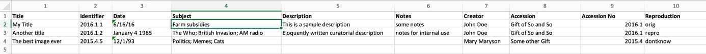

*L'échantillon de données d'import (données source). Notez les colonnes numérotées de 1 à 10.*

Une fois ouverte, la feuille de calcul de l'échantillon de mapping des imports se présente comme suit :

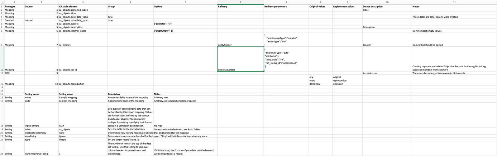

*L'exemple de feuille de calcul pour le mapping de données.*

Notez que dans l'échantillon de données d'import, les colonnes sont numérotées de 1 à 10 dans Excel. Ces numéros apparaissent dans la colonne 2 de la feuille de calcul de l'échantillon de données d'import. Poursuivez votre lecture pour obtenir une vue d'ensemble de chaque aspect de la feuille de calcul de l'échantillon de mapping des imports et de son lien avec les données d'import de l'échantillon (données sources).

## Paramètres

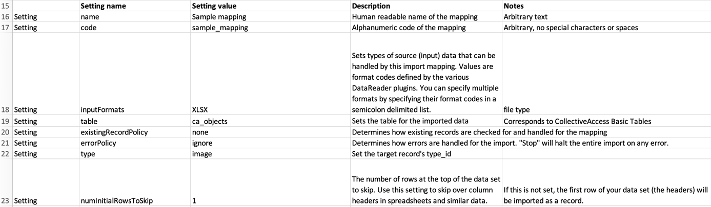

*Paramètres définis dans la partie inférieure de la feuille de calcul Exemple de mapping des imports.*

Les paramètres sont une partie fondamentale de chaque mapping d'import qui définit certains aspects de l'import et détermine également la façon dont les données importées seront traitées dans CollectiveAccess. Dans l'exemple de feuille de calcul de correspondance d'import, les paramètres se trouvent au bas de la feuille de calcul, comme illustré ci-dessus.

Dans les paramètres de le mapping de données, le nom du fichier de feuille de calcul, en texte arbitraire et sans caractères spéciaux ni espaces, est fourni : **Sample mapping**, et **sample_mapping**. En outre, le format d'entrée des données source est spécifié dans les paramètres de toute feuille de calcul d'import, indiquant à CollectiveAccess le format de fichier dans lequel les données d'origine sont fournies. Comme les données d'échantillon fournies sont au **format Excel (XLXS)**, c'est ce type de fichier qui a été sélectionné.

Les données sources se rapportent à des objets, c'est pourquoi la table est définie sur **ca_objects** ; les données sources seront donc importées sous forme d'enregistrements d'objets. D'autres paramètres permettent de déterminer comment les enregistrements existants (le cas échéant) sont comparés à l'import, comment les erreurs d'import sont gérées, le type et les lignes de la feuille de calcul qui doivent être ignorées.

Pour ce tutoriel, on suppose qu'*aucun enregistrement n'a* été importé auparavant dans CollectiveAccess ; cet exemple est la première import. Par conséquent, le paramètre **existingRecordPolicy** est défini sur **none (aucun)**. Le nombre de lignes à ignorer est fixé à *1* ; en regardant l'exemple de données d'import fourni, la toute première ligne de la feuille de calcul ne contient pas de données, mais des titres de rubriques qui ne sont pas nécessaires lors de l'import. La valeur 1 de numInitialRowsToSkip indique à l'importateur d'ignorer cette ligne d'en-tête. Toutefois, ce nombre est arbitraire et dépend du format des données sources. Des descriptions et d'autres notes concernant ces paramètres sont fournies dans la section Paramètres pour plus de clarté.

### Colonne 1 : Types de règles

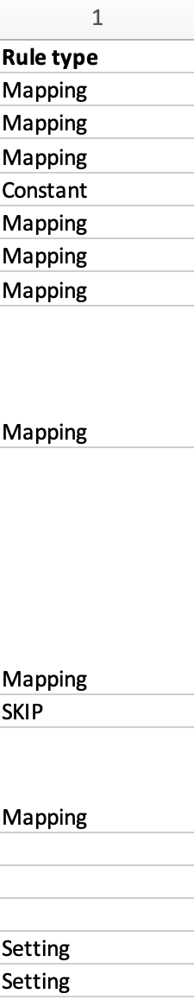

*Colonne "Rule Type" dans l'exemple de feuille de calcul de le mapping de données. Notez que ces règles sont sélectionnées à partir d'un menu déroulant préexistant.*

Les types de règles constituent la première colonne d'un mapping d'import. Les règles définies dans cette colonne déterminent la manière dont chaque ligne de la feuille de calcul sera importée.

-   **Mapping** : La ligne peut être mappée, ce qui signifie qu'elle sera importée.

-   **SKIP** : la ligne ne sera pas importée.

-   **Constant** La ligne sera fixée à une valeur constante.

-   **Cadre** : La rangée est un cadre.

-   **Règle** : Les règles seront appliquées au mapping. Pour plus d'informations, voir [Règles](file:///Users/charlotteposever/Documents/ca_manual/providence/user/import/rules.html).

Dans l'exemple de feuille de calcul de conversion des imports, les types de règles Mapping, SKIP et Constant sont utilisés. Étant donné que chaque colonne des données de l'échantillon correspond à une seule ligne dans la feuille de calcul des correspondances d'import, il faut définir le même nombre de types de règles qu'il y a de colonnes de métadonnées.

L'utilisation de SKIP et de Constant est arbitraire et dépend des données sources, de ce qui sera inclus dans l'import et de la manière dont cela sera fait.

Plus important encore, pour pouvoir importer des données dans CollectiveAccess, les types de règles pour les données qui seront importées doivent être définis sur Mapping (à quelques exceptions près, qui seront expliquées et clarifiées plus loin dans le didacticiel). Si le type de règle n'est pas défini sur Mapping pour les données qui doivent être incluses dans l'import, les données n'apparaîtront tout simplement pas dans CollectiveAccess.

Voir [ici](file:///Users/charlotteposever/Documents/ca_manual/providence/user/import/c_creating_mapping.html#column-1-rule-types) pour plus de détails sur les types de règles.

### Colonne 2 : Source

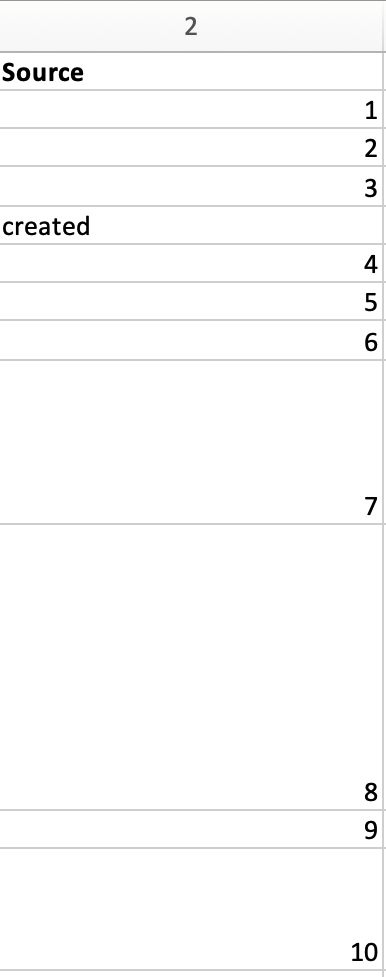

*La colonne source dans l'exemple de feuille de calcul de le mapping de données. Notez que les valeurs sont des nombres de 1 à 10 et correspondent aux colonnes 1 à 10 de l'exemple de données d'import. La valeur "created" de la ligne 5 correspond au type de règle Constant de la colonne 1.*

La deuxième colonne de la feuille de calcul de la correspondance des imports est celle où les colonnes de données sources spécifiques sont citées. Cette colonne indique l'emplacement des données sources dans la feuille de calcul des données échantillons, formant ainsi la première partie du tableau de concordance. En fonction du format des données source, cette colonne sera différente ; étant donné que les données d'import de l'échantillon sont au format Excel, les valeurs de cette colonne correspondent aux numéros de colonne des données d'import de l'échantillon (1, 2, 3, etc.) ; toutefois, si les données source sont dans un autre format de fichier pris en charge, les valeurs de cette colonne seront différentes.

La feuille de calcul de l'exemple contient 10 colonnes de données et, par conséquent, 10 lignes de valeurs dans l'exemple de mapping. Les valeurs de données constantes sont définies dans cette colonne (uniquement si le type de règle est défini sur "Constant", comme à la ligne 5 de la feuille de calcul de le mapping de données). Dans ce cas, la colonne source, au lieu d'un numéro provenant de la feuille de calcul des données source, sera définie comme la valeur ou l'identifiant de l'élément de liste provenant de la configuration de CollectiveAccess telle que définie dans l'exemple de profil. Dans l'exemple de mapping d'import, cette valeur se trouve à la ligne 5 et est définie sur "created".

**Note**

Les colonnes de données source peuvent également être référencées ailleurs dans le mapping d'import (généralement dans les colonnes Options ou Raffinage décrites ci-dessous) en faisant précéder le numéro de la colonne d'un "\^" (par exemple, "\^10"), ce qui indique au mapping que la valeur de la colonne 10 doit être insérée. Cette méthode permet de combiner plusieurs colonnes à l'aide d'options et est fréquemment utilisée dans les raffineries pour créer des entités, des collections et d'autres paramètres plus complexes. Un exemple est donné à la ligne 10 de la feuille de calcul du mapping d'import, dans la colonne 7.

### Colonne 3 : CA_table.element_code

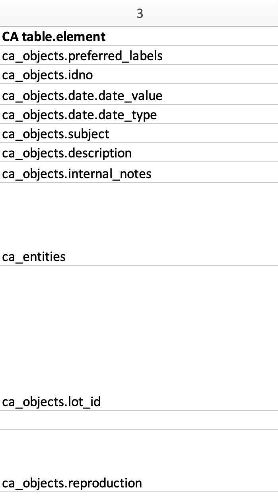

*Colonne 3 dans l'exemple de feuille de calcul pour l'import. Notez que le format des valeurs de cette colonne correspond aux codes des offres groupées de CollectiveAccess.*

La destination, ou cible, dans CollectiveAccess pour chaque colonne de données source est définie dans la troisième colonne de la feuille de calcul de la correspondance d'import. Cette colonne constitue la deuxième partie du tableau de concordance.

Il est nécessaire d'utiliser une valeur **ca_table.element_code** dans cette colonne, car elle déclare l'emplacement spécifique où les données sources seront stockées une fois importées dans CollectiveAccess. Chaque code correspond à un champ de métadonnées spécifique dans CollectiveAccess.

Dans l'exemple de feuille de calcul de conversion des imports, la plupart de ces codes de regroupement commencent par **ca_objects**, qui fait référence à la [table primaire](file:///Users/charlotteposever/Documents/ca_manual/providence/user/dataModelling/primaryTables.html?highlight=primary+table). Celle-ci est également définie dans la **table des** paramètres. Ces codes sont expliqués plus en détail [ici](file:///Users/charlotteposever/Documents/ca_manual/providence/user/import/import_ref_bundlecodes.html#import-import-ref-bundlecodes).

Dans l'exemple de données source, la colonne 1 contient tous les titres des objets, tandis que la colonne 2 contient tous les identifiants appartenant aux objets. Dans l'exemple de feuille de calcul de mapping des imports, la colonne 1 (Titres : source) sera mappée dans CollectiveAccess en tant que **ca_objects.preferred_labels** (Titres : destination). La colonne 2 (Identifiants : source) sera mappée dans CollectiveAccess en tant que **ca_objects.idno** (Identifiants : destination), et ainsi de suite. Il suffit de faire correspondre le contenu des données source avec le champ correspondant dans CollectiveAccess.

Les données contiennent généralement des références à des tables connexes, telles que des entités, des lots d'objets, des collections, des emplacements de stockage, etc. Lorsqu'un mapping d'import contient des références à une table autre que la table primaire définie dans les paramètres (dans cet exemple, **ca_objects**), il suffit de citer le nom de cette table dans cette colonne. Par exemple, la colonne 7 de la colonne Source est citée comme **ca_entities** (ligne 9).

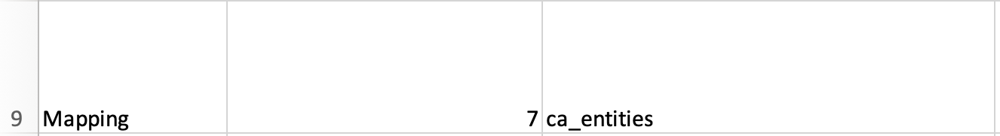

*La colonne 7 correspond à* **ca_entities.**

Pour plus d'informations, voir [Utilisation des codes de regroupement dans un mapping d'import](file:///Users/charlotteposever/Documents/ca_manual/providence/user/import/import_ref_bundlecodes.html#import-import-ref-bundlecodes).

### Colonne 4 : Groupe

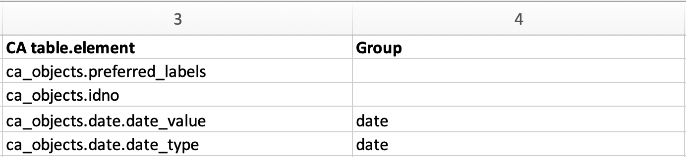

*Colonnes 3 et 4 de l'exemple de mapping d'import, montrant un groupe personnalisé pour le champ Date.*

La colonne 4 de la feuille de calcul du mapping d'import est utilisée pour déclarer les groupes. La présence de groupes est facultative, mais elle est requise pour les éléments de métadonnées mappés dans un **conteneur**. Un conteneur est un élément de métadonnées ou un champ qui contient des sous-éléments ; dans l'exemple de mapping, cet élément de métadonnées est la date. Les sous-éléments définissant la date et le type de date résident dans l'élément de métadonnées Date. L'utilisation de groupes est un moyen simple de s'assurer que tous les mappings vers un conteneur aboutissent effectivement dans la même instance de conteneur. Pour en savoir plus, voir [Conteneurs](file:///Users/charlotteposever/Documents/ca_manual/providence/user/import/containers.html#import-containers).

Dans l'exemple de mapping d'import, deux sous-éléments de **ca_objects.date** sont déclarés en tant que codes de liasse **ca_objects.date.date_value** et **ca_objects.date.date_type**. Pour importer des sous-éléments spécifiques d'un conteneur, les codes de l'élément du conteneur lui-même, **ca_objects.date, ainsi que le** code du sous-élément qui est votre cible finale, **date_value** et **date_type**, doivent être cités.

Le groupe créé pour le champ Date dans l'exemple de mapping d'import s'appelle simplement "date", mais pour tout mapping d'import, le nom du groupe peut être personnalisé et arbitraire. Pour affecter des éléments au même conteneur, le nom du groupe doit toutefois correspondre.

### Colonne 5 : Options

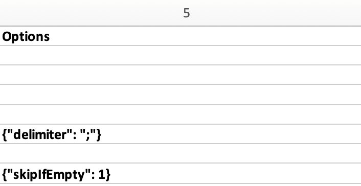

*Colonne 5 avec deux options définies dans la feuille de calcul de le mapping de données.*

Les options permettent de définir diverses conditions pour l'import elle-même. Les options peuvent traiter les données qui ont besoin d'être nettoyées, ignorer les cellules de données vides ou formater les données avec des modèles spécifiques. Les options doivent être écrites en code ([JSON](https://www.json.org/json-en.html)). Dans l'exemple de mapping d'import, deux options communes sont utilisées pour définir des conditions sur des colonnes particulières des données sources importées.

La ligne 6 de l'exemple de mapping de l'import correspond à la colonne Source 4 de l'exemple de données d'import. Deux enregistrements de la colonne Source 4 contiennent plusieurs valeurs de sujet dans la même cellule, séparées par des points-virgules :

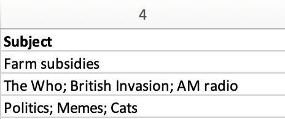

Il est nécessaire de définir l'option de délimitation dans le mapping d'import (voir ligne 6, colonne 5), car elle garantit que ces valeurs avec des points-virgules sont analysées correctement et importées dans des instances distinctes du champ Subject dans CollectiveAccess. En définissant le délimiteur comme un point-virgule, vous vous assurez que les valeurs sont séparées par les points-virgules présents dans les données source. Sans l'option de délimitation, la chaîne entière finirait par former une instance unique du champ Sujet.

La ligne 8 de la feuille de calcul de le mapping de données correspond à la colonne Source 6 de l'échantillon de données d'import, qui contient des notes internes en texte libre. Cependant, seuls deux enregistrements contiennent ces notes ; l'autre enregistrement a une cellule vide dans cette colonne :

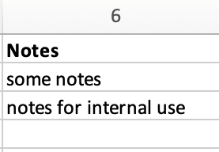

L'utilisation de l'option **skipIfEmpty** garantit que la valeur vide de cette colonne n'est pas importée dans le système d'accès collectif. La déclaration du chiffre un après les deux points de l'option indique que la cellule sera ignorée si elle est vide (1= oui, 0= non).

Le tableau ci-dessous présente une liste des options courantes utilisées dans une feuille de calcul de conversion des imports. Pour une liste complète des options de mapping, voir [Options de mapping](file:///Users/charlotteposever/Documents/ca_manual/providence/user/import/mappings/mappingOptions.html?highlight=options).

| **Option**                | **Description**                                                                                                                                                                                                                                                                                                                                                                                                                                                                                                                              | **Exemple**                                                                                                                           |
|---------------------------|----------------------------------------------------------------------------------------------------------------------------------------------------------------------------------------------------------------------------------------------------------------------------------------------------------------------------------------------------------------------------------------------------------------------------------------------------------------------------------------------------------------------------------------------|---------------------------------------------------------------------------------------------------------------------------------------|
| délimiteur                | Fractionne les valeurs répétitives sur un délimiteur défini.                                                                                                                                                                                                                                                                                                                                                                                                                                                                                 | {"delimiter" : " ;"} ou {"delimiter" : ","}                                                                                           |
| formatWithTemplate        | Afficher un modèle pour formater les valeurs avant l'import, en utilisant des balises "\^" pour incorporer les données dans le modèle. Pour les formats d'import basés sur des colonnes, comme Excel et CSV, le numéro de colonne est utilisé pour référencer les données. Pour les formats XML, une expression XPath est utilisée. Bien que les modèles soient liés à l'élément de données source spécifique mis en correspondance, ils peuvent faire référence à n'importe quel élément de l'ensemble des données d'import. | {"formatWithTemplate" : "Enregistrement modifié" : "\^2"}                                                                             |
| préfixe                   | Texte à ajouter à la valeur avant l'import.                                                                                                                                                                                                                                                                                                                                                                                                                                                                                             | {"préfixe" : "Dr."} ou {"prefix" : "\^5"}                                                                                             |
| suffixe                   | Texte à ajouter à la valeur avant l'import. Les balises "\^" peuvent être utilisées pour incorporer des données dans le suffixe.                                                                                                                                                                                                                                                                                                                                                                                                        | {"suffixe" : "cm"} ou {"suffixe" : "\^5"}                                                                                             |
| skipIfEmpty               | Sauter le mapping Si la valeur de données en cours de mapping est vide. Cette option est utilisée pour les données qui ne contiennent pas de valeurs cohérentes.                                                                                                                                                                                                                                                                                                                                                                             | {"skipIfEmpty" : 1}                                                                                                                   |
| Format du nom d'affichage | Transformer l'étiquette en utilisant les options de formatage des noms d'affichage des entités. Par défaut, la valeur est utilisée telle quelle.                                                                                                                                                                                                                                                                                                                                                                                             | {"surnameCommaForename"}, {"forenameCommaSurname"}, {"forenameSurname"}, {"forenameSurname"}, {"forenameSurname"}. , {"prénomSurnom"} |
| par défaut                | Valeur à utiliser si la valeur de la source de données est vide.                                                                                                                                                                                                                                                                                                                                                                                                                                                                             | {"default" : "none"}                                                                                                                  |
| convertNewlinesToHTML     | Convertit les caractères de nouvelle ligne dans le texte en balises HTML \&lt;BR/&gt ; avant l'import.                                                                                                                                                                                                                                                                                                                                                                                                                                  |                                                                                                                                       |

### Colonne 6 : Raffinerie

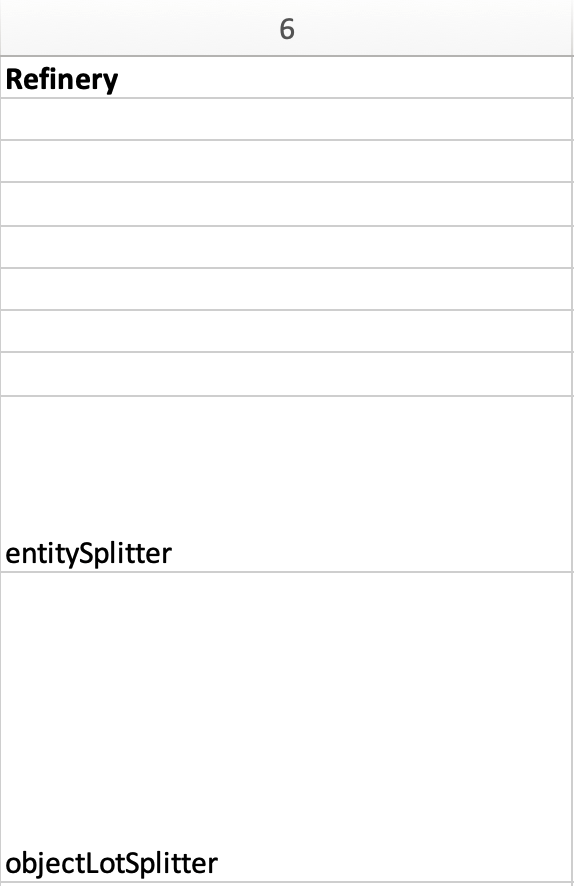

*La colonne 6 de la feuille de calcul de le mapping de données contient deux raffineries.*

Les raffineurs sont utilisés pour prendre un format de données spécifique à partir des données sources et le transformer via un comportement spécifique lorsqu'il est importé dans CollectiveAccess. Les raffineries permettent de créer des enregistrements connexes et de faire correspondre des enregistrements existants dans CollectiveAccess. Les raffineries sont facultatives, mais elles sont généralement utilisées dans les données sources qui font référence à d'autres tables connexes.

Dans la feuille de calcul de l'exemple de mapping d'import, notez que les raffineries ne sont pas utilisées dans chaque ligne de données (rappelez-vous que chaque ligne représente une colonne des données source). Elles ne sont présentes que dans les lignes 9 et 10 de l'exemple de mapping des imports, ou dans les colonnes 7 et 8 de l'exemple de données d'import. Ces lignes font référence à deux autres tables : Entités et Lots d'objets :

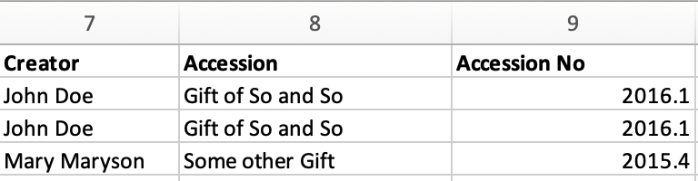

Les raffineries sont nécessaires pour créer de nouveaux enregistrements distincts et apparentés pour les entités et les lots d'objets.

Les colonnes 7 et 8 des données sources contiennent des valeurs pour les créateurs et les accès. Notez que dans l'exemple de mapping d'import, tous les enregistrements sont importés en tant qu'enregistrements **ca_objects.** Mais ces deux colonnes ne référencent pas les métadonnées des objets. En utilisant le Refinery **EntitySplitter** pour la colonne 7, des enregistrements d'entités distincts et liés sont créés à partir de la colonne Creators. En utilisant le Refinery **ObjectLotSplitter** pour la colonne 8, des enregistrements de lots d'objets distincts et apparentés sont créés à partir de la colonne Accession.

Le tableau ci-dessous présente une liste des raffineries les plus courantes. Pour une liste complète des raffineries, voir [Raffineries et paramètres de raffinage](file:///Users/charlotteposever/Documents/ca_manual/providence/user/import/mappings/refineries.html?highlight=refineries).

| **Raffinerie**                        | **Description**                                                                                                                                                                                                                                        |
|---------------------------------------|--------------------------------------------------------------------------------------------------------------------------------------------------------------------------------------------------------------------------------------------------------|
| séparateur d'entités                  | Crée un enregistrement d'entité ou trouve une correspondance exacte avec le nom de l'entité et crée une relation telle que définie dans le mapping d'import. Décompose les parties de noms, définit le type d'entité et d'autres paramètres. |
| entityJoiner                          | Fusionne les données de deux ou plusieurs colonnes de données sources pour créer un seul enregistrement d'entité (lorsque le premier et le dernier nom de l'entité se trouvent dans deux colonnes différentes, par exemple).                           |
| séparateur de mesures                 | Formate les valeurs de données qui sont mises en correspondance avec un élément du type Longueur ou Poids. Analyse les expressions de dimension sous la forme dimension1/délimiteur/dimension2, etc.                                                   |
| dateJoiner                            | Fusionne les données de deux ou plusieurs colonnes de données sources pour en faire un seul champ de données dans CollectiveAccess.                                                                                                                    |
| séparateur de lots d'objets           | Création d'un enregistrement de lot d'objets ou recherche d'une correspondance exacte sur le nom, et création d'une relation.                                                                                                                          |
| séparateur d'emplacements de stockage | Création d'un enregistrement de lieu de stockage ou recherche d'une correspondance exacte sur le nom, et création d'une relation                                                                                                                       |

### Colonne 7 : Paramètres de la raffinerie

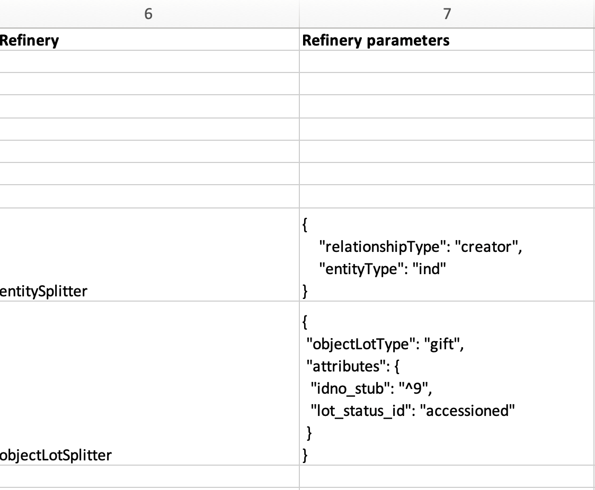

*Colonnes 6 et 7 de la feuille de calcul de le mapping de données indiquant les raffineries et les paramètres de raffinage correspondants, écrits en code.*

Les paramètres de raffinerie définissent les conditions d'utilisation de la raffinerie dans le mapping d'import. Chaque fois qu'une raffinerie est utilisée dans un mapping, un paramètre de raffinerie doit être utilisé pour indiquer à l'importateur comment manipuler les données sources et créer des enregistrements distincts. Comme les options, les paramètres de raffinage sont écrits en code (JSON).

Dans l'exemple de mapping d'import, le paramètre Refinery **EntitySplitter** indique que des enregistrements d'entités distincts et apparentés seront créés à partir de la colonne Creators dans les données source. Le paramètre Refinery spécifie simplement le type de relation que ces enregistrements auront avec d'autres enregistrements d'objets dans l'import (créateur), ainsi que le type d'entité créée (individu). Pour plus d'informations, voir [Utilisation de listes et de vocabulaires dans un mapping d'import.](file:///Users/charlotteposever/Documents/ca_manual/providence/user/import/lists_and_vocab_in_mapping.html#import-lists-and-vocab-in-mapping)

Le paramètre de raffinage **ObjectLotSplitter** indique que des enregistrements de lots d'objets distincts et apparentés seront créés à partir de la colonne Accession des données sources. Le paramètre Refinery spécifie que ces enregistrements de lots d'objets seront affichés en tant que "cadeaux" et contiendront le numéro d'acquisition de la colonne 9 des données sources.

Le tableau ci-dessous présente une liste des paramètres courants des raffineries. Pour une liste complète des raffineries et des paramètres de raffinage, voir [Raffineries et paramètres de raffinage](file:///Users/charlotteposever/Documents/ca_manual/providence/user/import/mappings/refineries.html?highlight=refineries).

### Colonne 8 : Valeurs originales

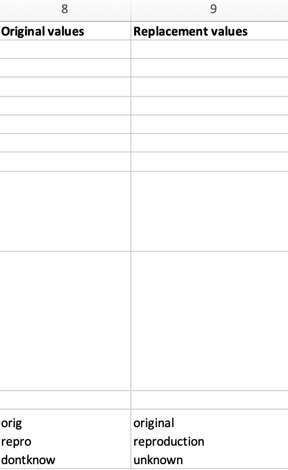

*Les valeurs originales figurent à la ligne 12 de la feuille de calcul de le mapping de données.*

Il se peut que certaines valeurs des données sources doivent être remplacées par de nouvelles valeurs lors de l'import. Il s'agit d'un scénario courant pour les données qui ne correspondent pas exactement au code d'un élément de liste pour les valeurs correspondantes dans CollectiveAccess, mais qui doivent correspondre pour être importées correctement. Il s'agit d'une colonne facultative, qui dépend du format des données sources.

Dans l'exemple de données d'import, la colonne 10 contient les valeurs suivantes :

Dans l'exemple de mapping d'import, trois valeurs sont présentes dans la ligne 12.

Cependant, ces valeurs n'existent pas dans une liste prédéterminée dans CollectiveAccess. En utilisant les valeurs d'origine et de remplacement, lors de l'import, ces valeurs sont transformées de "orig" en "original", de "repro" en "reproduction" et de "dontknow" en "unknown", de sorte que ces valeurs puissent correspondre au code de l'élément de la liste pour toutes les valeurs correspondantes dans CollectiveAccess. Les données importantes sont ainsi conservées, mais leur formatage est modifié pour correspondre à celui de CollectiveAccess.

Pour plus d'informations sur l'utilisation des valeurs d'origine et de remplacement, voir [Utilisation des colonnes Valeur d'origine/Valeur de remplacement](file:///Users/charlotteposever/Documents/ca_manual/providence/user/import/orig_replace_example.html).

### Colonne 9 : Valeurs de remplacement

*Valeurs de remplacement dans la colonne 9 de la feuille de calcul de le mapping de données.*

C'est dans cette colonne que sont saisies les nouvelles valeurs d'un code d'élément de liste correspondant pour CollectiveAccess, qui remplaceront les valeurs d'origine dans les données d'import de l'échantillon. Plusieurs valeurs peuvent être ajoutées à une seule cellule (voir ci-dessus), à condition que les valeurs de remplacement correspondent aux valeurs d'origine ligne par ligne. L'utilisation des colonnes Original et Remplacement est suffisante pour transformer une petite plage de valeurs lors de l'import.

### Colonne 10 : Description de la source

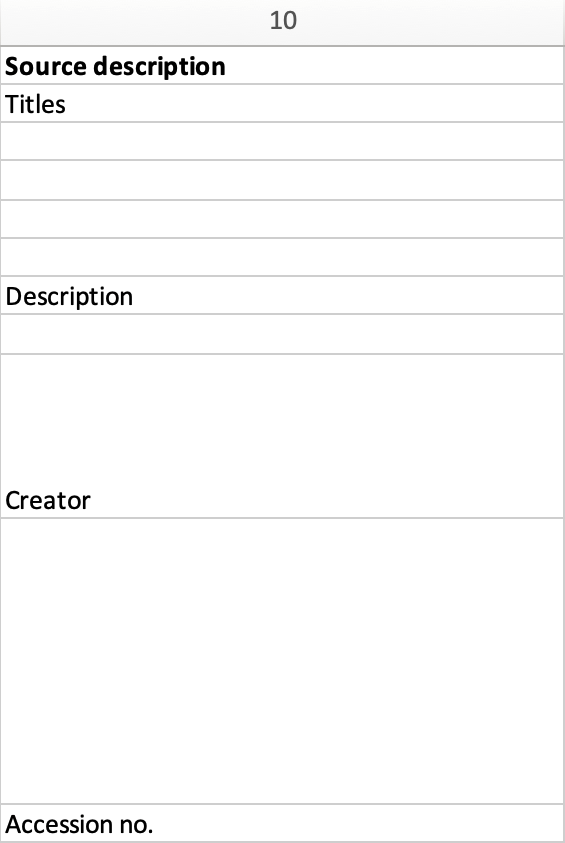

*Description des sources dans la feuille de calcul de le mapping de données.*

Il s'agit d'une colonne facultative dans la feuille de calcul de la correspondance d'import. Description de la source est l'endroit où l'on peut mettre une étiquette ou un nom en texte clair pour la colonne source originale ; cela permet de se référer facilement aux champs qui sont mis en correspondance et peut faciliter le flux de travail lors de la création d'une mise en correspondance d'import.

Dans l'exemple de mapping d'import, quelques-unes de ces valeurs ont été copiées à partir de la feuille de calcul de l'exemple de données d'import, indiquant quelles lignes contiennent quelles valeurs de l'exemple de données source.

### Colonne 11 : Notes

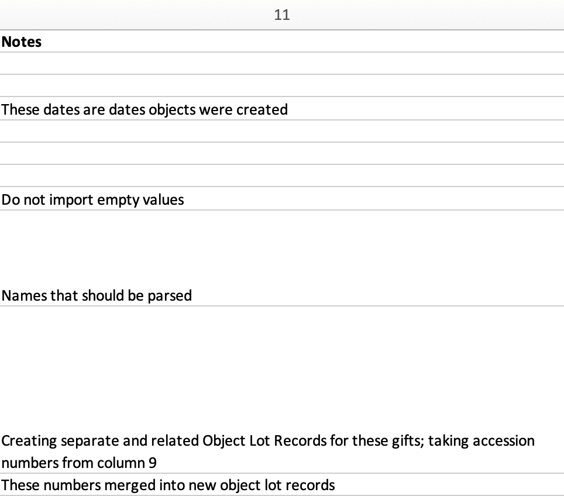

*Notes dans la feuille de calcul de le mapping de données.*

Il s'agit d'une colonne facultative de la feuille de calcul de le mapping de données qui permet d'expliquer comment et pourquoi une certaine ligne est mappée de la manière dont elle l'est. Les colonnes 10 et 11 de la feuille de calcul du mapping d'import peuvent être utiles pour une référence ultérieure si un mapping est destinée à être utilisée à plusieurs reprises, afin de s'assurer que le mapping sélectionnée correspond aux données sources. En outre, les notes sont également utiles si les mappings sont le fruit d'un travail de collaboration, car elles peuvent expliquer en texte clair pourquoi certaines décisions ont été prises.

Dans l'exemple de mapping d'import, ces notes comprennent de brefs commentaires clarifiant divers aspects du mapping.

[Suivant](https://manual.collectiveaccess.org/providence/user/import/running.html)  [Précédent](https://manual.collectiveaccess.org/providence/user/import/c_creating_mapping.html)

-   Paramètres

-   [Colonne 8 : Valeurs originales](https://manual.collectiveaccess.org/providence/user/import/c_import_tutorial.html#column-8-original-values)

-   [Colonne 9 : Valeurs de remplacement](https://manual.collectiveaccess.org/providence/user/import/c_import_tutorial.html#column-9-replacement-values)

-   [Colonne 10 : Description de la source](https://manual.collectiveaccess.org/providence/user/import/c_import_tutorial.html#column-10-source-description)

-   [Colonne 11 : Notes](https://manual.collectiveaccess.org/providence/user/import/c_import_tutorial.html#column-11-notes)

Ce didacticiel passe en revue chaque étape de l'import d'une feuille de calcul de mapping, en utilisant des exemples de données, un exemple de feuille de calcul et un exemple de profil d'installation.

### Ressources utiles

Pour suivre ce tutoriel, téléchargez les fichiers suivants :

[Exemple de feuille de calcul pour la mise en correspondance des imports](https://manual.collectiveaccess.org/_downloads/ef9d68ea81160b29a4de14bf414034aa/sample_mapping_tutorial.xlsx)

[Exemple de données d'import (données source)](https://manual.collectiveaccess.org/_downloads/16e9a6e81caad6663b081528250ed3eb/sample_import_data_tutorial.xlsx)

[Exemple de profil d'installation](https://manual.collectiveaccess.org/_downloads/c0c7555172ff8845650acfc0846f8fb6/Sample_import_profile.xml)

Pour créer votre propre carte, téléchargez le modèle suivant :

[Exemple vierge de feuille de calcul pour la mise en correspondance des imports](https://manual.collectiveaccess.org/_downloads/41fc322785b4267f6fcb03ef0740cd44/Blank_starter_import_mapping.xlsx)

Autres ressources utiles pour créer un mapping des imports :

[Importer des pages de référence](file:///Users/charlotteposever/Documents/ca_manual/providence/user/import/import_reference.html)

[Validateur et formateur JSON en ligne](https://jsonlint.com/)

### Importer une feuille de calcul de mapping : Aperçu des colonnes

Téléchargez et ouvrez l'exemple de données d'import (données source) et l'exemple de feuille de calcul pour la mise en correspondance des imports. Une fois ouvert, l'exemple de données d'import (données source) se présente comme suit :

*L'échantillon de données d'import (données source). Notez les colonnes numérotées de 1 à 10.*

Une fois ouverte, la feuille de calcul de l'échantillon de mapping des imports se présente comme suit :

*L'exemple de feuille de calcul pour le mapping de données.*

Notez que dans l'échantillon de données d'import, les colonnes sont numérotées de 1 à 10 dans Excel. Ces numéros apparaissent dans la colonne 2 de la feuille de calcul de l'échantillon de données d'import. Poursuivez votre lecture pour obtenir une vue d'ensemble de chaque aspect de la feuille de calcul de le mapping de données et de son lien avec les données d'import de l'échantillon (données source).

### Paramètres

*Paramètres définis dans la partie inférieure de la feuille de calcul Exemple de mapping des imports.*

Les paramètres sont une partie fondamentale de chaque mapping d'import qui définit certains aspects de l'import et détermine également la façon dont les données importées seront traitées dans CollectiveAccess. Dans l'exemple de feuille de calcul de correspondance d'import, les paramètres se trouvent au bas de la feuille de calcul, comme illustré ci-dessus.

Dans les paramètres de le mapping de données, le nom du fichier de feuille de calcul, en texte arbitraire et sans caractères spéciaux ni espaces, est fourni : **Sample mapping**, et **sample_mapping**. En outre, le format d'entrée des données source est spécifié dans les paramètres de toute feuille de calcul d'import, indiquant à CollectiveAccess le format de fichier dans lequel les données d'origine sont fournies. Comme les données d'échantillon fournies sont au **format Excel (XLXS)**, c'est ce type de fichier qui a été sélectionné.

Les données sources se rapportent à des objets, c'est pourquoi la table est définie sur **ca_objects** ; les données sources seront donc importées sous forme d'enregistrements d'objets. D'autres paramètres permettent de déterminer comment les enregistrements existants (le cas échéant) sont comparés à l'import, comment les erreurs d'import sont gérées, le type et les lignes de la feuille de calcul qui doivent être ignorées.

Pour ce tutoriel, on suppose qu'*aucun enregistrement n'a* été importé auparavant dans CollectiveAccess ; cet exemple est la première import. Par conséquent, le paramètre **existingRecordPolicy** est défini sur **none (aucun)**. Le nombre de lignes à ignorer est fixé à *1* ; en regardant l'exemple de données d'import fourni, la toute première ligne de la feuille de calcul ne contient pas de données, mais des titres de rubriques qui ne sont pas nécessaires lors de l'import. La valeur 1 de numInitialRowsToSkip indique à l'importateur d'ignorer cette ligne d'en-tête. Toutefois, ce nombre est arbitraire et dépend du format des données sources. Des descriptions et d'autres notes concernant ces paramètres sont fournies dans la section Paramètres pour plus de clarté.

### Colonne 1 : Types de règles

*Colonne "Rule Type" dans l'exemple de feuille de calcul de le mapping de données. Notez que ces règles sont sélectionnées à partir d'un menu déroulant préexistant.*

Les types de règles constituent la première colonne d'un mapping d'import. Les règles définies dans cette colonne déterminent la manière dont chaque ligne de la feuille de calcul sera importée.

-   **Mapping** : La ligne peut être mappée, ce qui signifie qu'elle sera importée.

-   **SKIP** : la ligne ne sera pas importée.

-   **Constant** La ligne sera fixée à une valeur constante.

-   **Cadre** : La rangée est un cadre.

-   **Règle** : Les règles seront appliquées au mapping. Pour plus d'informations, voir [Règles](file:///Users/charlotteposever/Documents/ca_manual/providence/user/import/rules.html).

Dans l'exemple de feuille de calcul de conversion des imports, les types de règles Mapping, SKIP et Constant sont utilisés. Étant donné que chaque colonne des données de l'échantillon correspond à une seule ligne dans la feuille de calcul des correspondances d'import, il faut définir le même nombre de types de règles qu'il y a de colonnes de métadonnées.

L'utilisation de SKIP et de Constant est arbitraire et dépend des données sources, de ce qui sera inclus dans l'import et de la manière dont cela sera fait.

Plus important encore, pour pouvoir importer des données dans CollectiveAccess, les types de règles pour les données qui seront importées doivent être définis sur Mapping (à quelques exceptions près, qui seront expliquées et clarifiées plus loin dans le didacticiel). Si le type de règle n'est pas défini sur Mapping pour les données qui doivent être incluses dans l'import, les données n'apparaîtront tout simplement pas dans CollectiveAccess.

Voir [ici](file:///Users/charlotteposever/Documents/ca_manual/providence/user/import/c_creating_mapping.html#column-1-rule-types) pour plus de détails sur les types de règles.

### Colonne 2 : Source

*La colonne source dans l'exemple de feuille de calcul de le mapping de données. Notez que les valeurs sont des nombres de 1 à 10 et correspondent aux colonnes 1 à 10 de l'exemple de données d'import. La valeur "created" de la ligne 5 correspond au type de règle Constant de la colonne 1.*

La deuxième colonne de la feuille de calcul de la correspondance des imports est celle où les colonnes de données sources spécifiques sont citées. Cette colonne indique l'emplacement des données sources dans la feuille de calcul des données échantillons, formant ainsi la première partie du tableau de concordance. En fonction du format des données source, cette colonne sera différente ; étant donné que les données d'import de l'échantillon sont au format Excel, les valeurs de cette colonne correspondent aux numéros de colonne des données d'import de l'échantillon (1, 2, 3, etc.) ; toutefois, si les données source sont dans un autre format de fichier pris en charge, les valeurs de cette colonne seront différentes.

La feuille de calcul de l'exemple contient 10 colonnes de données et, par conséquent, 10 lignes de valeurs dans l'exemple de mapping. Les valeurs de données constantes sont définies dans cette colonne (uniquement si le type de règle est défini sur "Constant", comme dans la ligne 5 de la feuille de calcul de le mapping de données). Dans ce cas, la colonne source, au lieu d'un numéro provenant de la feuille de calcul des données source, sera définie comme la valeur ou l'identifiant de l'élément de liste provenant de la configuration de CollectiveAccess telle que définie dans l'exemple de profil. Dans l'exemple de mapping d'import, cette valeur se trouve à la ligne 5 et est définie sur "created".

**Note**

Les colonnes de données sources peuvent également être référencées ailleurs dans le mapping d'import (généralement dans les colonnes Options ou Raffinage décrites ci-dessous) en faisant précéder le numéro de la colonne d'un "\^" (par exemple, "\^10"), ce qui indique au mapping que la valeur de la colonne 10 doit être insérée. Cette méthode permet de combiner plusieurs colonnes à l'aide d'options et est fréquemment utilisée dans les raffineries pour créer des entités, des collections et d'autres paramètres plus complexes. Un exemple est donné à la ligne 10 de la feuille de calcul du mapping d'import, dans la colonne 7.

### Colonne 3 : CA_table.element_code

*Colonne 3 dans l'exemple de feuille de calcul pour l'import. Notez que le format des valeurs de cette colonne correspond aux codes des offres groupées de CollectiveAccess.*

La destination, ou cible, dans CollectiveAccess pour chaque colonne de données source est définie dans la troisième colonne de la feuille de calcul de la correspondance d'import. Cette colonne constitue la deuxième partie du tableau de concordance.

Il est nécessaire d'utiliser une valeur **ca_table.element_code** dans cette colonne, car elle indique l'emplacement spécifique où les données sources seront stockées une fois importées dans CollectiveAccess. Chaque code correspond à un champ de métadonnées spécifique dans CollectiveAccess.

Dans l'exemple de feuille de calcul de conversion des imports, la plupart de ces codes de regroupement commencent par **ca_objects**, qui fait référence à la [table primaire](file:///Users/charlotteposever/Documents/ca_manual/providence/user/dataModelling/primaryTables.html?highlight=primary+table). Celle-ci est également définie dans la **table des** paramètres. Ces codes sont expliqués plus en détail [ici](file:///Users/charlotteposever/Documents/ca_manual/providence/user/import/import_ref_bundlecodes.html#import-import-ref-bundlecodes).

Dans l'exemple de données source, la colonne 1 contient tous les titres des objets, tandis que la colonne 2 contient tous les identifiants appartenant aux objets. Dans l'exemple de feuille de calcul de mapping des imports, la colonne 1 (Titres : source) sera mappée dans CollectiveAccess en tant que **ca_objects.preferred_labels** (Titres : destination). La colonne 2 (Identifiants : source) sera mappée dans CollectiveAccess en tant que **ca_objects.idno** (Identifiants : destination), et ainsi de suite. Il suffit de faire correspondre le contenu des données source avec le champ correspondant dans CollectiveAccess.

Les données contiennent généralement des références à des tables connexes, telles que des entités, des lots d'objets, des collections, des emplacements de stockage, etc. Lorsqu'un mapping d'import contient des références à une table autre que la table primaire définie dans les paramètres (dans cet exemple, **ca_objects**), il suffit de citer le nom de cette table dans cette colonne. Par exemple, la colonne 7 de la colonne Source est citée comme **ca_entities** (ligne 9).

*La colonne 7 correspond à* **ca_entities.**

Pour plus d'informations, voir [Utilisation des codes de regroupement dans un mapping d'import](file:///Users/charlotteposever/Documents/ca_manual/providence/user/import/import_ref_bundlecodes.html#import-import-ref-bundlecodes).

### Colonne 4 : Groupe

*Colonnes 3 et 4 de l'exemple de mapping d'import, montrant un groupe personnalisé pour le champ Date.*

La colonne 4 de la feuille de calcul du mapping d'import est utilisée pour déclarer les groupes. La présence de groupes est facultative, mais elle est requise pour les éléments de métadonnées mappés dans un **conteneur**. Un conteneur est un élément de métadonnées ou un champ qui contient des sous-éléments ; dans l'exemple de mapping, cet élément de métadonnées est la date. Les sous-éléments définissant la date et le type de date résident dans l'élément de métadonnées Date. L'utilisation de groupes est un moyen simple de s'assurer que tous les mappings vers un conteneur aboutissent effectivement dans la même instance de conteneur. Pour en savoir plus, voir [Conteneurs](file:///Users/charlotteposever/Documents/ca_manual/providence/user/import/containers.html#import-containers).

Dans l'exemple de mapping d'import, deux sous-éléments de **ca_objects.date** sont déclarés en tant que codes de liasse **ca_objects.date.date_value** et **ca_objects.date.date_type**. Pour importer des sous-éléments spécifiques d'un conteneur, les codes de l'élément du conteneur lui-même, **ca_objects.date, ainsi que le** code du sous-élément qui est votre cible finale, **date_value** et **date_type**, doivent être cités.

Le groupe créé pour le champ Date dans l'exemple de mapping d'import s'appelle simplement "date", mais pour tout mapping d'import, le nom du groupe peut être personnalisé et arbitraire. Pour affecter des éléments au même conteneur, le nom du groupe doit toutefois correspondre.

### Colonne 5 : Options

*Colonne 5 avec deux options définies dans la feuille de calcul de le mapping de données.*

Les options permettent de définir diverses conditions pour l'import elle-même. Les options peuvent traiter les données qui ont besoin d'être nettoyées, ignorer les cellules de données vides ou formater les données avec des modèles spécifiques. Les options doivent être écrites en code ([JSON](https://www.json.org/json-en.html)). Dans l'exemple de mapping d'import, deux options communes sont utilisées pour définir des conditions sur des colonnes particulières des données sources importées.

La ligne 6 de l'exemple de mapping de l'import correspond à la colonne Source 4 de l'exemple de données d'import. Deux enregistrements de la colonne Source 4 contiennent plusieurs valeurs de sujet dans la même cellule, séparées par des points-virgules :

Il est nécessaire de définir l'option de délimitation dans le mapping d'import (voir ligne 6, colonne 5), car elle garantit que ces valeurs avec des points-virgules sont analysées correctement et importées dans des instances distinctes du champ Subject dans CollectiveAccess. En définissant le délimiteur comme un point-virgule, vous vous assurez que les valeurs sont séparées par les points-virgules présents dans les données source. Sans l'option de délimitation, la chaîne entière finirait par former une instance unique du champ Sujet.

La ligne 8 de la feuille de calcul de le mapping de données correspond à la colonne Source 6 de l'échantillon de données d'import, qui contient des notes internes en texte libre. Cependant, seuls deux enregistrements contiennent ces notes ; l'autre enregistrement a une cellule vide dans cette colonne :

L'utilisation de l'option **skipIfEmpty** garantit que la valeur vide de cette colonne n'est pas importée dans le système d'accès collectif. La déclaration du chiffre un après les deux points de l'option indique que la cellule sera ignorée si elle est vide (1= oui, 0= non).

Le tableau ci-dessous présente une liste des options courantes utilisées dans une feuille de calcul de mapping d'import. Pour une liste complète des options de mapping, voir [Options de mapping](file:///Users/charlotteposever/Documents/ca_manual/providence/user/import/mappings/mappingOptions.html?highlight=options).

| **Option**                | **Description**                                                                                                                                                                                                                                                                                                                                                                                                                                                                                                                              | **Exemple**                                                                                                                           |
|---------------------------|----------------------------------------------------------------------------------------------------------------------------------------------------------------------------------------------------------------------------------------------------------------------------------------------------------------------------------------------------------------------------------------------------------------------------------------------------------------------------------------------------------------------------------------------|---------------------------------------------------------------------------------------------------------------------------------------|
| délimiteur                | Fractionne les valeurs répétitives sur un délimiteur défini.                                                                                                                                                                                                                                                                                                                                                                                                                                                                                 | {"delimiter" : " ;"} ou {"delimiter" : ","}                                                                                           |
| formatWithTemplate        | Afficher un modèle pour formater les valeurs avant l'import, en utilisant des balises "\^" pour incorporer les données dans le modèle. Pour les formats d'import basés sur des colonnes, comme Excel et CSV, le numéro de colonne est utilisé pour référencer les données. Pour les formats XML, une expression XPath est utilisée. Bien que les modèles soient liés à l'élément de données source spécifique mis en correspondance, ils peuvent faire référence à n'importe quel élément de l'ensemble des données d'import. | {"formatWithTemplate" : "Enregistrement modifié" : "\^2"}                                                                             |
| préfixe                   | Texte à ajouter à la valeur avant l'import.                                                                                                                                                                                                                                                                                                                                                                                                                                                                                             | {"préfixe" : "Dr."} ou {"prefix" : "\^5"}                                                                                             |
| suffixe                   | Texte à ajouter à la valeur avant l'import. Les balises "\^" peuvent être utilisées pour incorporer des données dans le suffixe.                                                                                                                                                                                                                                                                                                                                                                                                        | {"suffixe" : "cm"} ou {"suffixe" : "\^5"}                                                                                             |
| skipIfEmpty               | Sauter le mapping Si la valeur de données en cours de mapping est vide. Cette option est utilisée pour les données qui ne contiennent pas de valeurs cohérentes.                                                                                                                                                                                                                                                                                                                                                                             | {"skipIfEmpty" : 1}                                                                                                                   |
| Format du nom d'affichage | Transformer l'étiquette en utilisant les options de formatage des noms d'affichage des entités. Par défaut, la valeur est utilisée telle quelle.                                                                                                                                                                                                                                                                                                                                                                                             | {"surnameCommaForename"}, {"forenameCommaSurname"}, {"forenameSurname"}, {"forenameSurname"}, {"forenameSurname"}. , {"prénomSurnom"} |
| par défaut                | Valeur à utiliser si la valeur de la source de données est vide.                                                                                                                                                                                                                                                                                                                                                                                                                                                                             | {"default" : "none"}                                                                                                                  |
| convertNewlinesToHTML     | Convertir les caractères de nouvelle ligne dans le texte en balises HTML \&lt;BR/&gt ; avant l'import.                                                                                                                                                                                                                                                                                                                                                                                                                                  |                                                                                                                                       |

### Colonne 6 : Raffinerie

*La colonne 6 de la feuille de calcul de le mapping de données contient deux raffineries.*

Les raffineurs sont utilisés pour prendre un format de données spécifique à partir des données sources et le transformer via un comportement spécifique lorsqu'il est importé dans CollectiveAccess. Les raffineries permettent de créer des enregistrements connexes et de faire correspondre des enregistrements existants dans CollectiveAccess. Les raffineries sont facultatives, mais elles sont généralement utilisées dans les données sources qui font référence à d'autres tables connexes.

Dans la feuille de calcul de l'exemple de mapping d'import, notez que les raffineries ne sont pas utilisées dans chaque ligne de données (rappelez-vous que chaque ligne représente une colonne des données source). Elles ne sont présentes que dans les lignes 9 et 10 de l'exemple de mapping des imports, ou dans les colonnes 7 et 8 de l'exemple de données d'import. Ces lignes font référence à deux autres tables : Entités et Lots d'objets :

Les raffineries sont nécessaires pour créer de nouveaux enregistrements distincts et apparentés pour les entités et les lots d'objets.

Les colonnes 7 et 8 des données sources contiennent des valeurs pour les créateurs et les accès. Notez que dans l'exemple de mapping d'import, tous les enregistrements sont importés en tant qu'enregistrements **ca_objects.** Mais ces deux colonnes ne référencent pas les métadonnées des objets. En utilisant le Refinery **EntitySplitter** pour la colonne 7, des enregistrements d'entités distincts et liés sont créés à partir de la colonne Creators. En utilisant le Refinery **ObjectLotSplitter** pour la colonne 8, des enregistrements de lots d'objets distincts et apparentés sont créés à partir de la colonne Accession.

Le tableau ci-dessous présente une liste des raffineries les plus courantes. Pour une liste complète des raffineries, voir [Raffineries et paramètres de raffinage](file:///Users/charlotteposever/Documents/ca_manual/providence/user/import/mappings/refineries.html?highlight=refineries).

| **Raffinerie**                        | **Description**                                                                                                                                                                                                                                        |
|---------------------------------------|--------------------------------------------------------------------------------------------------------------------------------------------------------------------------------------------------------------------------------------------------------|
| séparateur d'entités                  | Crée un enregistrement d'entité ou trouve une correspondance exacte avec le nom de l'entité et crée une relation telle que définie dans le mapping d'import. Décompose les parties de noms, définit le type d'entité et d'autres paramètres. |
| entityJoiner                          | Fusionne les données de deux ou plusieurs colonnes de données sources pour créer un seul enregistrement d'entité (lorsque le premier et le dernier nom de l'entité se trouvent dans deux colonnes différentes, par exemple).                           |
| séparateur de mesures                 | Formate les valeurs de données qui sont mises en correspondance avec un élément du type Longueur ou Poids. Analyse les expressions de dimension sous la forme dimension1/délimiteur/dimension2, etc.                                                   |
| dateJoiner                            | Fusionne les données de deux ou plusieurs colonnes de données sources pour en faire un seul champ de données dans CollectiveAccess.                                                                                                                    |
| séparateur de lots d'objets           | Création d'un enregistrement de lot d'objets ou recherche d'une correspondance exacte sur le nom, et création d'une relation.                                                                                                                          |
| séparateur d'emplacements de stockage | Création d'un enregistrement de lieu de stockage ou recherche d'une correspondance exacte sur le nom, et création d'une relation                                                                                                                       |

### Colonne 7 : Paramètres de la raffinerie

*Colonnes 6 et 7 de la feuille de calcul de le mapping de données indiquant les raffineries et les paramètres de raffinage correspondants, écrits en code.*

Les paramètres de raffinerie définissent les conditions d'utilisation de la raffinerie dans le mapping d'import. Chaque fois qu'une raffinerie est utilisée dans un mapping, un paramètre de raffinerie doit être utilisé pour indiquer à l'importateur comment manipuler les données sources et créer des enregistrements distincts. Comme les options, les paramètres de raffinage sont écrits en code (JSON).

Dans l'exemple de mapping d'import, le paramètre Refinery **EntitySplitter** indique que des enregistrements d'entités distincts et apparentés seront créés à partir de la colonne Creators dans les données source. Le paramètre Refinery spécifie simplement le type de relation que ces enregistrements auront avec d'autres enregistrements d'objets dans l'import (créateur), ainsi que le type d'entité créée (individu). Pour plus d'informations, voir [Utilisation de listes et de vocabulaires dans un mapping d'import.](file:///Users/charlotteposever/Documents/ca_manual/providence/user/import/lists_and_vocab_in_mapping.html#import-lists-and-vocab-in-mapping)

Le paramètre de raffinage **ObjectLotSplitter** indique que des enregistrements de lots d'objets distincts et apparentés seront créés à partir de la colonne Accession des données sources. Le paramètre Refinery spécifie que ces enregistrements de lots d'objets seront affichés en tant que "cadeaux" et contiendront le numéro d'acquisition de la colonne 9 des données sources.

Le tableau ci-dessous présente une liste des paramètres courants des raffineries. Pour une liste complète des raffineries et des paramètres de raffinage, voir [Raffineries et paramètres de raffinage](file:///Users/charlotteposever/Documents/ca_manual/providence/user/import/mappings/refineries.html?highlight=refineries).

### Colonne 8 : Valeurs originales

*Les valeurs originales figurent à la ligne 12 de la feuille de calcul de le mapping de données.*

Il se peut que certaines valeurs des données sources doivent être remplacées par de nouvelles valeurs lors de l'import. Il s'agit d'un scénario courant pour les données qui ne correspondent pas exactement au code d'un élément de liste pour les valeurs correspondantes dans CollectiveAccess, mais qui doivent correspondre pour être importées correctement. Il s'agit d'une colonne facultative, qui dépend du format des données sources.

Dans l'exemple de données d'import, la colonne 10 contient les valeurs suivantes :

Dans l'exemple de mapping d'import, trois valeurs sont présentes dans la ligne 12.

Cependant, ces valeurs n'existent pas dans une liste prédéterminée dans CollectiveAccess. En utilisant les valeurs d'origine et de remplacement, lors de l'import, ces valeurs sont transformées de "orig" en "original", de "repro" en "reproduction" et de "dontknow" en "unknown", de sorte que ces valeurs puissent correspondre au code de l'élément de la liste pour toutes les valeurs correspondantes dans CollectiveAccess. Les données importantes sont ainsi conservées, mais leur formatage est modifié pour correspondre à celui de CollectiveAccess.

Pour plus d'informations sur l'utilisation des valeurs d'origine et de remplacement, voir [Utilisation des colonnes Valeur d'origine/Valeur de remplacement](file:///Users/charlotteposever/Documents/ca_manual/providence/user/import/orig_replace_example.html).

### Colonne 9 : Valeurs de remplacement

*Valeurs de remplacement dans la colonne 9 de la feuille de calcul de le mapping de données.*

C'est dans cette colonne que sont saisies les nouvelles valeurs d'un code d'élément de liste correspondant pour CollectiveAccess, qui remplaceront les valeurs d'origine dans les données d'import de l'échantillon. Plusieurs valeurs peuvent être ajoutées à une seule cellule (voir ci-dessus), à condition que les valeurs de remplacement correspondent aux valeurs d'origine ligne par ligne. L'utilisation des colonnes Original et Remplacement est suffisante pour transformer une petite plage de valeurs lors de l'import.

### Colonne 10 : Description de la source

*Description des sources dans la feuille de calcul de le mapping de données.*

Il s'agit d'une colonne facultative dans la feuille de calcul de la correspondance d'import. Description de la source est l'endroit où l'on peut mettre une étiquette ou un nom en texte clair pour la colonne source originale ; cela permet de se référer facilement aux champs qui sont mis en correspondance et peut faciliter le flux de travail lors de la création d'une mise en correspondance d'import.

Dans l'exemple de mapping d'import, quelques-unes de ces valeurs ont été copiées à partir de la feuille de calcul de l'exemple de données d'import, indiquant quelles lignes contiennent quelles valeurs de l'exemple de données source.

### Colonne 11 : Notes

*Notes dans la feuille de calcul de le mapping de données.*

Il s'agit d'une colonne facultative de la feuille de calcul de le mapping de données qui permet d'expliquer comment et pourquoi une certaine ligne est mappée de la manière dont elle l'est. Les colonnes 10 et 11 de la feuille de calcul du mapping d'import peuvent être utiles pour une référence ultérieure si un mapping est destinée à être utilisée à plusieurs reprises, afin de s'assurer que le mapping sélectionnée correspond aux données sources. En outre, les notes sont également utiles si les mappings sont le fruit d'un travail de collaboration, car elles peuvent expliquer en texte clair pourquoi certaines décisions ont été prises.

Dans l'exemple de mapping d'import, ces notes comprennent de brefs commentaires clarifiant divers aspects du mapping.
